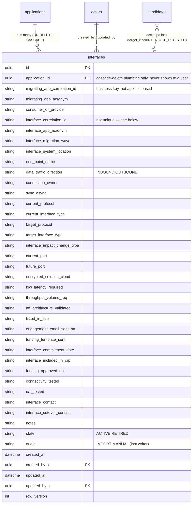

# Interface Register — Design & Implementation Record

**Status:** Implemented (2026-09-17, revised same day — all 33 fields, direct Excel upload, correlation-ID linking key)
**Author context:** Architect review of `_data/App Data Capture_ccpm.xlsx` → `Interface` sheet
**Related:** `docs/UAQ_INTERFACE_TRACKING_IMPORT_IMPLEMENTATION_PLAN.md` (the separate, already-working *Interface Tracking* FACET workbook path — different workbook, different sheet name, see §1.2)

## 1. Problem statement

### 1.1 What the sheet contains

The `Interface` tab of the App Data Capture workbook (`App`, `Interface`, `iTAP`, `WaveUtil`, `Infra`, `Database`, `TSS`, `Provisioning` — 8 sheets) is a flat, repeatable register: **33 columns, one row per counterpart connection** (61 rows for the sample CCPM application). Unlike the `App`/`iTAP` sheets (question/response/response-type shaped), this sheet has no 1:1 mapping to a single questionnaire answer — an application can have dozens of interfaces.

**All 33 columns are captured verbatim as canonical fields** (revised per stakeholder review — an earlier draft of this design canonicalized only 6–15 fields and kept the rest as raw evidence only; that restriction has been removed):

| # | Sheet column (as authored, whitespace/newlines vary) | Canonical field |
|---|---|---|
| 1 | Migrating App Correlation ID | `migrating_app_correlation_id` |
| 2 | Migrating App Acronym | `migrating_app_acronym` |
| 3 | Consumer or Provider of Data (iTAP) | `consumer_or_provider` |
| 4 | Interface Correlation ID | `interface_correlation_id` |
| 5 | Interface Application Acronym | `interface_app_acronym` |
| 6 | Interface Migration Wave | `interface_migration_wave` |
| 7 | Interface System Location (Mainframe/Midrange/Azure/AWS/Conexus/Private Cloud…) | `interface_system_location` |
| 8 | End Point Name / Detail | `end_point_name` |
| 9 | Architecture Data Traffic (Inbound/Outbound) | `data_traffic_direction` |
| 10 | Connection Owner (Migrating App / Interface App) | `connection_owner` |
| 11 | Sync / Async | `sync_async` |
| 12 | Current Protocol | `current_protocol` |
| 13 | Current Interface Type | `current_interface_type` |
| 14 | Target Protocol | `target_protocol` |
| 15 | Target Interface Type | `target_interface_type` |
| 16 | Interface Impact Change Type | `interface_impact_change_type` |
| 17 | Current Port | `current_port` |
| 18 | Future Port | `future_port` |
| 19 | Encrypted Solution for Cloud (Yes/No) | `encrypted_solution_cloud` |
| 20 | Low Latency requirement (Yes/No) | `low_latency_required` |
| 21 | Throughput / Volume Req | `throughput_volume_req` |
| 22 | AT&T Architecture Validated (Yes/No) | `att_architecture_validated` |
| 23 | Listed in iTAP (Yes/Yes-Remove/No/No-Add) | `listed_in_itap` |
| 24 | Engagement Email Sent on | `engagement_email_sent_on` |
| 25 | Funding Template sent to Interface (Date/NA) | `funding_template_sent` |
| 26 | Confirmed Interface Commitment Date | `interface_commitment_date` |
| 27 | Interface included in CRP? | `interface_included_in_crp` |
| 28 | Interface Funding Approved and added to EPIC | `funding_approved_epic` |
| 29 | Connectivity Tested Successfully | `connectivity_tested` |
| 30 | UAT Tested | `uat_tested` |
| 31 | Interface Contact | `interface_contact` |
| 32 | Interface Cutover Support Contact | `interface_cutover_contact` |
| 33 | Notes | `notes` |

Columns 4–33 (everything but the migrating-app identity in 1–3) are keyed per counterpart interface; columns 1–3 repeat the same migrating-app identity on every row of the sheet.

### 1.2 Confirmed gap: the sheet was silently dropped

Before this change, **neither** import pipeline recognized a sheet named `Interface` (singular):

- `APP_DATA_CAPTURE_V1` (`src/migration_intake/imports/contracts.py`, used by the main Sources-page importer, `application/services/workbook.py`) only knew `App, iTAP, WaveUtil, Infra, Database, TSS, Provisioning`.
- `LEGACY_INTAKE_V1_SHEETS` (`imports/legacy_intake_contract.py`) — same 7 sheets.
- `_canonical_sheet_name()` in `workbook.py` only mapped `"Interfaces"` (**plural** — the separate *Interface Tracking* FACET workbook's sheet name) to a known target.

Uploading the real CCPM workbook therefore produced an `UNRECOGNIZED_SHEET` **WARNING** finding for the `Interface` tab and **zero candidates** for all 61 rows — a real defect, not a hypothetical one.

Separately, the *Interface Tracking* FACET workbook (a different source document) already had a working adapter (`imports/interface_tracking_v1.py` → `InterfaceRecord` → `Candidate(target_kind="INTERFACE_REGISTER")`), but those candidates were **never accepted into any canonical table** — they only ever backed three `REGISTER_STATUS` rollup answers (`INT-001`/`INT-002`/`INT-003`). No canonical interface register existed anywhere in the system.

## 2. Decision log

| Decision | Chosen | Rejected alternative | Why |
|---|---|---|---|
| Reuse `ans_instances`/`ans_revisions`? | No | — | Built for one bounded JSON payload per `(intake, question)`; a 60+ row unbounded list doesn't fit without growing one revision blob unboundedly. |
| Reuse `wave_util_rows`? | No (cloned the *pattern*, not the table) | — | Different domain (servers vs. interfaces); WaveUtil is accept-only from imports, no manual-entry path. |
| Reuse `candidates`? | **Yes, unchanged** | — | Already had `target_kind="INTERFACE_REGISTER"` wired for this exact purpose; just needed a canonical table to accept *into*. |
| New canonical table(s)? | **One table, `interfaces`** | Two tables (`interfaces` + a revision table, full append-only history like `wave_util_rows`/`wave_util_revisions`) | Explicitly decided against keeping revision history — see §3. `updated_at`/`updated_by_id`/`row_version` are enough for "when was this last touched" without the complexity of a revision-pointer table. |
| Manual entry allowed? | **Yes** | Accept-only (WaveUtil style) | The user needs a fillable questionnaire, not just an import-review feed. Unlike WaveUtil hostnames, `interface_correlation_id` is already a stable natural key with no fuzzy-matching step required, so manual and import-derived writes can share one upsert path. |
| Sheet required in the contract? | **No** (`required=False`) | Required | Backward compatible with older workbooks that predate this tab. |
| Linking key to the migrating application? | **Both**: `migrating_app_correlation_id` (business-facing, the sheet's raw value e.g. `"18678"`) **and** a hidden `application_id` FK (`ON DELETE CASCADE`) | `applications.id` (UUID) alone, or `migrating_app_correlation_id` alone | Explicit stakeholder decision: the register must read like the business data it is for humans, but an application delete must still reliably remove its interfaces — Oracle can't express a filtered-composite FK (`app_identifiers` where `identifier_type='CORRELATION'`) for the correlation ID, so a plain internal `application_id` FK does the referential-integrity job invisibly (see §3, §5). |
| Canonicalize all 33 columns, or keep most as raw-evidence-only? | **All 33, canonical** | 6–15 canonical + raw evidence | Reversed after stakeholder review — the register needs to be a complete, queryable replacement for the spreadsheet, not a partial extract. |
| Uniqueness / de-dup strategy? | **No DB uniqueness constraint; de-dup by exact whole-row match** — a row identical in *every* field to an existing row (for the same application) is skipped, not re-inserted | `UniqueConstraint(migrating_app_correlation_id, interface_correlation_id)` + upsert-in-place on match | The real CCPM sheet has genuine duplicate `Interface Correlation ID` values where the *other* fields differ (different direction/protocol/port recorded under one shared counterpart ID) — collapsing them by key alone silently discarded 13 of 61 rows' data on every re-upload. Removing the constraint and keying de-dup off the whole row instead keeps every genuinely distinct row while still making an identical re-upload a safe no-op. |

## 3. Schema

**Single table, current-state only — no revision history. No `intake_id`. No uniqueness constraint — de-dup is by exact whole-row comparison, not a natural key.**



- **`application_id`** is a real FK to `applications.id` with **`ON DELETE CASCADE`** — the *only* FK in this entire codebase that cascades (every other table's deletion cleanup, e.g. the CCPM purge, is done manually, child-to-parent, by an ad-hoc script or future service). It exists purely so deleting an application via *any* path (ORM or raw SQL) automatically removes its interfaces; it is never displayed or editable — resolved automatically from context the same way `migrating_app_correlation_id` is.
- **`migrating_app_correlation_id`** remains the sheet's own raw value (e.g. `"18678"`), stored verbatim, per the original stakeholder decision (§2) — this is what's shown to users and matched against uploaded-workbook rows. It is *not* a native Oracle FK (a filtered-composite reference to `app_identifiers` where `identifier_type='CORRELATION'` isn't expressible), so `InterfaceReviewService` resolves and validates it at the service layer, exactly as before.
- **No `UniqueConstraint`.** The natural key `(migrating_app_correlation_id, interface_correlation_id)` is *not* enforced as unique, because the real sheet legitimately contains multiple distinct rows sharing an `interface_correlation_id` (§2). De-dup is instead **exact whole-row equality** for the same `application_id` (`InterfaceRepository.find_exact_duplicate`) — a row is only skipped if literally every field matches an existing row; otherwise it's always inserted as a new row. No row is ever silently overwritten by a same-keyed sibling.
- `row_version` gives optimistic concurrency on edit/retire (`ConcurrencyConflictError` on mismatch), matching every other mutable aggregate in this codebase.
- `origin` records whether the *most recent* write was an accepted import or a manual edit. Because there's no revision table, prior states/origins are not retrievable — this was an explicit, accepted trade-off.

Implemented in:
- [src/migration_intake/persistence/models_interfaces.py](../src/migration_intake/persistence/models_interfaces.py) — ORM model.
- [src/migration_intake/persistence/migrations/versions/0016_interfaces_register.py](../src/migration_intake/persistence/migrations/versions/0016_interfaces_register.py) — Alembic migration (`down_revision = "0015"`). Edited in place across four revisions of this feature (15 fields → remove `intake_id` → all 33 fields + `migrating_app_correlation_id` → re-add `application_id` FK with `ON DELETE CASCADE` + drop the unique constraint) since it had not shipped past one developer's local Oracle schema; **any environment that already ran an earlier version of this migration must `alembic downgrade 0015` then `alembic upgrade head`** to pick up the final shape.
- [src/migration_intake/persistence/migrations/env.py](../src/migration_intake/persistence/migrations/env.py) — registered so Alembic sees the table.

## 4. Import path

Three ways an `Interface`-shaped sheet reaches the register:

1. **Full App Data Capture workbook, via the Sources page** — [src/migration_intake/imports/interface_sheet.py](../src/migration_intake/imports/interface_sheet.py) (`InterfaceSheetAdapter`). Parses the `Interface` sheet's rows into the `InterfaceRecord` dataclass (shared with the Interface Tracking adapter, now carrying all 33 fields). Header matching is prefix-based (`_value()`), because real headers carry parenthetical hint suffixes after the core label (e.g. `"Interface System Location\n(Mainframe, Midrange, Azure, AWS, Conexus, Private Cloud, ect)"`).
   - Blank rows → `BLANK_ROW` finding, skipped.
   - Missing natural key (`Interface Correlation ID`) → `MISSING_CORRELATION_ID` finding, skipped (never invents a value).
   - `raw_values` still keeps the entire row for evidence, but every one of the 33 columns is now also parsed into its own typed field — nothing is evidence-only anymore.
   - Produces `Candidate(target_kind="INTERFACE_REGISTER")` rows exactly as before; a reviewer must accept them from the pending-proposals section of the Interfaces page.
2. **Direct "Upload from Excel"** — `InterfaceReviewService.import_from_workbook`, reachable from a button on the Interfaces list page (no candidate/review step — the correlation ID pair is already a stable natural key). See §5 for the mismatch/de-dup rules.
3. **Manual add/edit form** — one row at a time, all 33 fields editable (`migrating_app_correlation_id`/`migrating_app_acronym` are always resolved server-side from the open application, not user-entered).

Other plumbing:
- **`InterfaceRecord` dataclass extended** ([interface_tracking_v1.py](../src/migration_intake/imports/interface_tracking_v1.py)) with all remaining optional fields; the Interface Tracking FACET adapter leaves them `None` (no equivalent columns there).
- **Contract registration** ([imports/contracts.py](../src/migration_intake/imports/contracts.py)) — `SheetContract("Interface", SheetRole.REGISTER_DATA, required=False)` in `APP_DATA_CAPTURE_V1`.
- **Wired into the orchestrator** ([application/services/workbook.py](../src/migration_intake/application/services/workbook.py)):
  - `"Interface"` added to `_KNOWN_SHEETS` and the alias map (`"interface" → "Interface"`).
  - `_invoke_interface()` dispatch case.
  - `_persist_candidate()` computes a full 33-field `normalized_value_json` for every `InterfaceRecord` candidate (from both adapters), so acceptance never has to re-parse the raw sheet row.
  - No changes were needed to `_extract_target_key`/`_extract_source_locator`/`_extract_raw_value` — their existing `isinstance(candidate, InterfaceRecord)` branches already handled this generically.

## 5. Application service — `InterfaceReviewService`

[src/migration_intake/application/services/interface_review.py](../src/migration_intake/application/services/interface_review.py)

Three entry points converge on the same **insert-if-not-an-exact-duplicate** logic (`_create_if_new`) — a row is only skipped if *every* field already matches an existing row for the same `application_id`; otherwise a new row is always created. No row is ever updated in place through this path (only an explicit edit by `record_id` changes an existing row's fields):

- **`accept_candidates(items, actor)`** — candidate-first, all-or-nothing batch acceptance (mirrors `WaveUtilReviewService`): validates every candidate is `PROPOSED` and version-matched *before* writing anything, then for each one creates a new `interfaces` row (unless an exact duplicate already exists), marks the candidate `ACCEPTED`, `origin="IMPORT"`. `migrating_app_correlation_id` is read from the candidate's `normalized_value_json` if present, else resolved from `candidate.application_id` via `_get_application_correlation_id`.
- **`save_manual(...)`** — direct create (`record_id=None`) or edit (`record_id` + `expected_row_version`) from the interfaces form, no candidate involved, `origin="MANUAL"`. Always resolves `migrating_app_correlation_id`/`migrating_app_acronym`/`application_id` from `application_id` and raises `ApplicationCorrelationIdMissingError` if the application has no `CORRELATION` identifier configured. An edit (`record_id` given) always goes to `update_record` — dedup never applies to an explicit edit of a specific row.
- **`import_from_workbook(...)`** — the "Upload from Excel" button's handler. Resolves the target application's own `CORRELATION` identifier once, then for every parsed row:
  - If the row's own `Migrating App Correlation ID` column is present and disagrees with the target application — rejected, counted in `mismatched_app`, never written (never mix another application's interfaces into this one).
  - Otherwise passed to `_create_if_new`, which returns one of `"created" | "unchanged"`. **`"unchanged"`** means every field already matched an existing row for this application exactly (blank/`None` treated as equivalent, everything else compared as an exact trimmed string) — the row is skipped: no write, no new row, no `row_version` bump. Two rows sharing an `interface_correlation_id` but differing in any other field are **not** duplicates of each other and are both kept as separate rows — this is the fix for the real CCPM data, which has 6 correlation IDs each covering 2–3 genuinely different rows (13 rows total) that a natural-key upsert had been silently collapsing to one.
  - Returns `{"created": N, "unchanged": N, "mismatched_app": N, "skipped": N, "findings": [...]}`; the route renders all of these in the post-upload banner message.
- **`retire_record(...)`** — sets `state="RETIRED"`, version-checked.

Repository: [persistence/repositories/interfaces.py](../src/migration_intake/persistence/repositories/interfaces.py) (`InterfaceRepository`) — plain-dict returns, no independent commits (Unit-of-Work owns the transaction), consistent with every other repository in this codebase. `INTERFACE_FIELD_NAMES` is the single source of truth for the 33 business field names, shared by `create_record`/`update_record`/`_to_dict`/`find_exact_duplicate`, so adding a 34th field later only means editing one tuple plus the model/migration.

## 6. Routes & navigation

[src/migration_intake/web/routes/interfaces.py](../src/migration_intake/web/routes/interfaces.py), registered in [main.py](../src/migration_intake/main.py):

```
GET  /applications/{app}/intakes/{intake}/interfaces            register list (prepopulated) + pending proposals
POST /applications/{app}/intakes/{intake}/interfaces/upload       "Upload from Excel" — direct import, no review step
GET  /applications/{app}/intakes/{intake}/interfaces/new         blank add form
POST /applications/{app}/intakes/{intake}/interfaces             create (manual)
GET  /applications/{app}/intakes/{intake}/interfaces/{id}         edit form (prepopulated)
POST /applications/{app}/intakes/{intake}/interfaces/{id}         save edit (optimistic concurrency)
POST /applications/{app}/intakes/{intake}/interfaces/accept       batch-accept import candidates
POST /applications/{app}/intakes/{intake}/interfaces/{id}/retire  retire
```

CSRF-protected (`validate_csrf_token`), actor resolved the same way as every other route (`ActorContext` from configured settings). `"interfaces"` added to `app_nav_items()` in [_nav.py](../src/migration_intake/web/routes/_nav.py), next to `wave_util`.

## 7. Templates / UI

- [templates/interfaces/list.html](../src/migration_intake/web/templates/interfaces/list.html) — register table (core identity/connectivity columns + last-updated — not all 33, for readability; the remaining governance/contact fields are on the detail page), a **pending proposals** section (only rendered when unreviewed `INTERFACE_REGISTER` candidates exist) with one-click Accept per row, an **"Upload from Excel"** button (posts to `.../interfaces/upload`, hidden file input auto-submits on choice), and a "+ Add interface" command action.
- [templates/interfaces/form.html](../src/migration_intake/web/templates/interfaces/form.html) — single form used for both add and edit, now covering all 33 fields grouped into Core details / Governance & testing / Contacts & notes; when editing, every field is prepopulated from the current `interfaces` row, plus a version/state/last-updated/origin header and a Retire action. `migrating_app_correlation_id`/`migrating_app_acronym` are not form fields — the service always resolves them from the open application.

Both reuse the existing design-system CSS (`tokens.css`, `components.css`, `wave_util.css`) — no new stylesheet was needed.

Working static mockups (screenshotted earlier in this session, not wired into the app):
- [interfaces-register-list.html](../src/migration_intake/web/static/mockups/interfaces-register-list.html)
- [interfaces-register-form.html](../src/migration_intake/web/static/mockups/interfaces-register-form.html)

## 8. Testing

- [tests/unit/imports/test_interface_sheet.py](../tests/unit/imports/test_interface_sheet.py) — adapter: full 33-field extraction with real-world header noise (double spaces, newlines, parenthetical hints), blank-row and missing-natural-key findings, full-row raw evidence preservation.
- [tests/unit/application/test_interface_review.py](../tests/unit/application/test_interface_review.py) — repository upsert semantics; candidate acceptance (new record, update-in-place on repeated correlation ID, stale-version rejection, already-accepted rejection); manual create/edit/retire with optimistic concurrency; missing-natural-key rejection; workbook upload create/update/unchanged/mismatched-application counting.
- [tests/contract/persistence/test_model_metadata.py](../tests/contract/persistence/test_model_metadata.py) — `interfaces` added to `EXPECTED_TABLES`; constraint-name-length and `Base.metadata.create_all()` ordering checks cover the new table for free.
- Full regression pass (`pytest tests --ignore=tests/browser`) re-run after this revision — no pre-existing test broken; `_ALL_REQUIRED_SHEETS`-based workbook-inspection tests unaffected since the new contract entry is `required=False` and not asserted against by name in those fixtures.

## 9. Rollout notes / open follow-ups

1. **Local-only so far.** `alembic upgrade head` has been run against one developer's local Oracle schema (adds `interfaces` only; no existing table is altered) — not yet applied anywhere else. Because the shape changed twice after the first apply (15 fields → 33 fields + drop `intake_id`/`application_id`), any environment must run `alembic downgrade 0015` before `alembic upgrade head` if it already has an earlier `interfaces` table shape; a fresh environment just needs `alembic upgrade head`.
2. **Not started.** `INT-001`/`INT-002`/`INT-003` rollup answers still compute from raw candidate counts via `InterfaceAggregateCandidate` in `interface_tracking_v1.py` (hardcoded `"IN_PROGRESS"`), not from the `interfaces` table — nothing reads `InterfaceRepository` for this today. Recommended follow-up: recompute them from the canonical register now that one exists.
3. **Accepted trade-off, not a defect.** Because there is no revision history, "who changed this port and when, before the last edit" is not answerable — only the single most recent `origin`/`updated_by_id`/`updated_at` is kept. This was an explicit product decision (§2), not an oversight.
4. **Cleanup, optional.** The mockup files under `static/mockups/` are safe to delete; they were a design preview only, not part of the shipped route tree.
5. **Known limitation.** `import_from_workbook` and `save_manual` both require the target application to already have a `CORRELATION` identifier configured (`ApplicationCorrelationIdMissingError`/`InvalidInterfaceWorkbookError` otherwise) — an application onboarded without one cannot use the Interfaces feature until an identifier is added.
