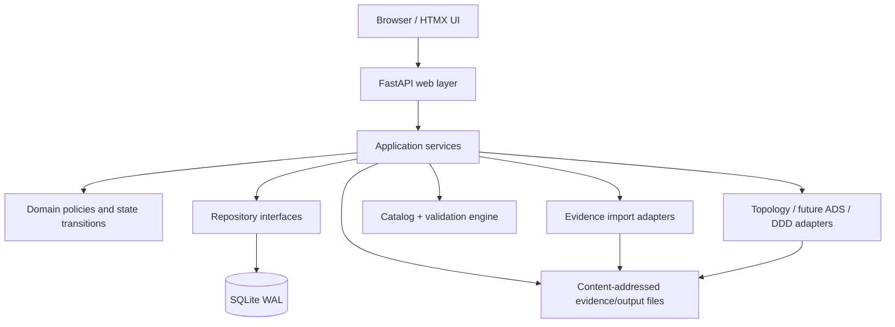
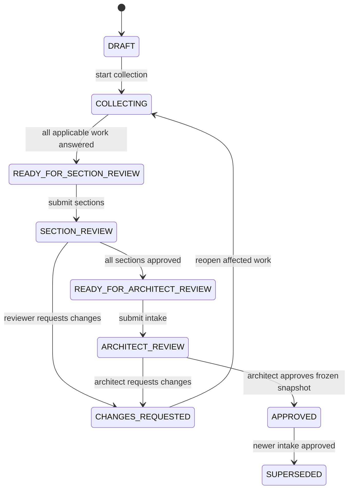
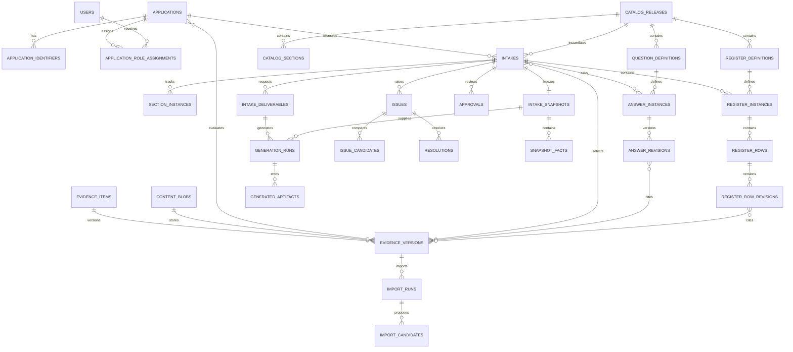

# Migration Intake UI - Detailed Implementation Plan

**Date:** 2026-09-04
**Status:** proposed architecture for team review
**Initial database:** SQLite
**Catalog baseline:** `_data/spike/QUESTION_CATALOG_V0_2.csv`
**Pilot application:** FACET, Correlation/MOTS ID 8375

---

## 1. Executive decision

Build an internal, server-rendered questionnaire application that creates one
versioned intake per application assessment. The system imports known evidence,
asks people only for missing or review-required information, tracks ownership
and review state, and produces a reviewed canonical data set for Topology, ADS,
and DDD generation.

Recommended initial stack:

```text
Python 3.12
FastAPI
SQLAlchemy 2.x
Alembic
SQLite in WAL mode
Pydantic
Jinja2 + HTMX
Vanilla CSS with a small component layer
pytest + Playwright
```

Why this stack:

- It reuses the Python extraction and topology work already proven in `_data/spike`.
- Server-rendered forms fit a dense internal workflow better than a separate SPA.
- HTMX provides autosave, filtering, assignments, and inline review without a
  large front-end state framework.
- SQLAlchemy and Alembic keep a deliberate path from SQLite to PostgreSQL.
- SQLite is appropriate for the first single-process pilot and local team use.

SQLite is **not** the permanent answer for multiple application servers or high
concurrent write volume. The code must use repository/service boundaries and
portable SQL so PostgreSQL can replace it without rewriting the domain.

---

## 2. Evidence and design baseline reviewed

The plan is grounded in the current `_data` set and spike artifacts:

| Source | Architectural implication |
|---|---|
| UAQ v4 CSV | Richest structured application source; SharePoint metadata row requires a dedicated importer |
| Application Questionnaire XLSX | Valuable question seed, but app-per-sheet design has already drifted into 82 variants |
| Deep Dive Notes DOCX | Contains narrative, confirmed DB answers, server table, technology stack, and embedded diagrams; provenance is uneven |
| Interface Tracking XLSX | Requires first-class directional interface register and reconciliation workflow |
| Naming/Tagging XLSX | Naming is a derived service, not a free-text question |
| AMP draw.io + template | Topology output consumes reviewed canonical facts; it must not read UI tables ad hoc |
| ADS v1.3 PPTX | Output adapter contains unsafe sample prose; only reviewed facts may replace or retain content |
| Wave 3 sizing workbook | Defines useful sizing fields and formula-lineage risks, but is not FACET/Wave 4 evidence |
| Question Catalog v0.2 | 112 controls, 20 sections, 25 response types, 19 conditional questions |
| FACET missing-data analysis | Proves imports, human responses, architect decisions, and issue resolution are separate work types |

Important catalog findings:

- 40 `REGISTER_STATUS` controls represent aggregate register gates, not simple
  editable questions.
- Six `DERIVED` controls must be computed, not answered by users.
- Twenty-one `ARCHITECT_DECISION` controls need restricted decision actions.
- Eight `HITL_PORTAL` controls require portal provenance, not portal credentials.
- Forty-seven `HITL_OWNER` controls need assignment and reminders.
- `Required_When` is currently human-readable text, not an executable condition
  language.
- Pipe-delimited owners, sources, outputs, and choices must be normalized before
  catalog import.
- Catalog destinations such as `04_Servers` are semantic register references;
  they must not become arbitrary table names supplied by CSV.

These findings drive a catalog compiler and typed UI registry rather than direct
CSV-to-form rendering.

---

## 3. Scope

### 3.1 First production slice

The first UI release will support:

1. Registering an application by external identifiers.
2. Assigning application owner, migration application architect, and supporting
   domain owners.
3. Creating a versioned intake from one immutable question-catalog release.
4. Selecting required deliverables: Topology, ADS, DDD.
5. Uploading and validating evidence documents.
6. Importing proposed answers and register rows from supported sources.
7. Completing questionnaire sections with conditional questions.
8. Managing server, interface, database, storage, technology, batch, network,
   IAM, target-design, and wave-capacity registers.
9. Assigning and reviewing sections.
10. Detecting missing, conflicting, invalid, stale, and unverified information.
11. Recording architect decisions and accepted risks.
12. Freezing an approved intake revision.
13. Launching topology generation from the approved canonical snapshot.
14. Tracking ADS and DDD readiness, even before those renderers exist.

### 3.2 Explicit non-goals for the first release

- Direct portal login or credential storage.
- Portal scraping.
- Concurrent multi-node application deployment.
- A generic BPM/workflow engine.
- Real-time collaborative editing of the same answer.
- Full ADS and DDD rendering before template contracts are finalized.
- Editing draw.io layout in the questionnaire UI.
- Replacing enterprise document repositories.
- Building every register as a bespoke UI before the generic register workflow
  is proven.

---

## 4. Architecture



### 4.1 Dependency direction

```text
web routes/templates
    -> application services
        -> domain models and policies
        -> repository interfaces
            -> SQLite implementation
        -> import/generation adapters
```

Rules:

- Routes do not write SQL.
- Templates do not calculate workflow status.
- Importers create candidates; they never silently confirm answers.
- Renderers consume a frozen canonical snapshot, not live mutable tables.
- State changes use named transition services, not arbitrary status updates.
- Every state-changing request writes an audit event in the same transaction.

### 4.2 Suggested source layout

```text
src/migration_intake/
  __init__.py
  main.py
  config.py
  db.py
  web/
    routes/
      applications.py
      intakes.py
      questionnaire.py
      registers.py
      evidence.py
      issues.py
      reviews.py
      outputs.py
    templates/
    static/
  domain/
    identity.py
    catalog.py
    answers.py
    registers.py
    evidence.py
    issues.py
    workflow.py
    approvals.py
    outputs.py
  services/
    application_service.py
    intake_service.py
    catalog_service.py
    answer_service.py
    register_service.py
    evidence_service.py
    validation_service.py
    workflow_service.py
    review_service.py
    generation_service.py
    progress_service.py
  repositories/
    interfaces.py
    sqlite/
  importers/
    uaq.py
    application_questionnaire.py
    deep_dive.py
    interface_tracking.py
    wave_sizing.py
  generators/
    topology.py
  catalog/
    compiler.py
    conditions.py
    response_types.py
  migrations/
```

---

## 5. Application identity

### 5.1 Do not use a business field as the database primary key

The UI needs a permanent internal key even when names, acronyms, waves, or
source-system labels change.

Use:

```text
application.id = UUID text generated by the system
```

Store external identities separately:

```text
ITAP_ID
CORRELATION_ID
MOTS_ID
```

The current evidence often treats Correlation ID and MOTS ID as the same value,
but the user has identified iTAP ID and Correlation ID separately. The system
must support both without deciding they are aliases until the team confirms the
source-system contract.

### 5.2 Uniqueness rules

- `application.id` is the internal immutable primary identity.
- `(identifier_type, normalized_value)` is globally unique, including archived
  applications. Identity values are never silently reused; duplicates require
  an explicit merge/correction workflow.
- Correlation ID is required to start the pilot.
- iTAP ID is required before an intake can be submitted for review.
- MOTS ID may equal Correlation ID, but equality is recorded explicitly rather
  than inferred.
- Application display name is required and case-insensitively unique in the
  first release because the team has declared it unique.
- Acronym is required but is not used as the primary key; acronym collisions are
  rejected in the pilot and can later be scoped if real evidence requires it.
- Wave assignment is versioned intake metadata, not application identity.
- Source and target sites are intake facts, not application identity.
- Environment is scope on answers/register rows, not a separate application.

### 5.3 Application metadata

```text
Internal application ID
Correlation ID
MOTS ID
ITAP ID
Application name
Acronym
Portfolio/business unit
Current operational status
Application owner assignment
Primary migration application architect assignment
Migration manager assignment
Current active intake ID
Created/updated timestamps
Archived timestamp
Optimistic concurrency version
```

### 5.4 People and role assignments

Users are identified internally by UUID and externally by ATTUID/email.
Assignments are many-to-many and effective-dated:

```text
APPLICATION_OWNER
APPLICATION_TECHNICAL_LEAD
MIGRATION_APPLICATION_ARCHITECT
MIGRATION_MANAGER
COMPUTE_ARCHITECT
NETWORK_ARCHITECT
DB_ARCHITECT
SECURITY_ARCHITECT
STORAGE_ARCHITECT
CAPACITY_ARCHITECT
INTERFACE_LEAD
OPERATIONS_LEAD
TEST_LEAD
REVIEWER
```

An application can have multiple owners, but the pilot requires exactly one
active primary Application Owner and one active primary Migration Application
Architect before intake collection begins.

---

## 6. State model

A single `application_status` is insufficient. Keep state at the level where the
work happens.

### 6.1 Application lifecycle state

This describes portfolio availability, not questionnaire progress:

```text
ACTIVE
ON_HOLD
ARCHIVED
```

An application remains `ACTIVE` across multiple intake revisions.

### 6.2 Intake workflow state



Stored states:

```text
DRAFT
COLLECTING
READY_FOR_SECTION_REVIEW
SECTION_REVIEW
CHANGES_REQUESTED
READY_FOR_ARCHITECT_REVIEW
ARCHITECT_REVIEW
APPROVED
SUPERSEDED
CANCELLED
```

Readiness states are computed first and transition explicitly only when a user
submits. The system never silently advances an intake because the last question
was answered.

### 6.3 Section workflow state

```text
NOT_STARTED
IN_PROGRESS
BLOCKED
READY_FOR_REVIEW
IN_REVIEW
CHANGES_REQUESTED
APPROVED
NOT_APPLICABLE
```

Each section has an assigned owner and reviewer. An intake can be in collection
while one section is approved and another is blocked.

### 6.4 Answer state

Separate value status from review status.

Value status:

```text
UNKNOWN
PROPOSED
KNOWN
CONFLICT
NOT_APPLICABLE
```

Review status:

```text
UNANSWERED
DRAFT
ANSWERED
NEEDS_EVIDENCE
CHANGES_REQUESTED
CONFIRMED
```

Examples:

- An imported UAQ value is `PROPOSED + ANSWERED`.
- An owner-confirmed value is `KNOWN + CONFIRMED`.
- Two peer sources disagree: `CONFLICT + NEEDS_EVIDENCE`.
- A conditional question whose condition is false: `NOT_APPLICABLE + CONFIRMED`.

Do not represent these combinations as one large status enum.

### 6.5 Register state

```text
NOT_STARTED
IN_PROGRESS
RECONCILIATION_REQUIRED
READY_FOR_REVIEW
CHANGES_REQUESTED
COMPLETE
NOT_APPLICABLE
```

A register status is computed from its row states, expected count, unresolved
mismatches, and owner review. `REGISTER_STATUS` catalog controls display this
state; users do not type it manually.

### 6.6 Evidence state

```text
UPLOADED
VALIDATING
VALID
INVALID
STALE
SUPERSEDED
```

A source can be valid structurally yet not applicable to an application. Add a
separate applicability result:

```text
MATCHED
NOT_MATCHED
AMBIGUOUS
NOT_EVALUATED
```

The Wave 3 workbook is `VALID + NOT_MATCHED` for FACET.

### 6.7 Issue state

```text
OPEN
IN_PROGRESS
RESOLVED
ACCEPTED_RISK
REOPENED
SUPERSEDED
```

Accepted risk requires named approver, rationale, evidence, and expiry/review
 date when applicable.

### 6.8 Deliverable state

Track each requested deliverable independently:

```text
NOT_REQUESTED
BLOCKED
READY_TO_GENERATE
GENERATING
GENERATED_WITH_GAPS
READY_FOR_REVIEW
CHANGES_REQUESTED
APPROVED
REJECTED
FAILED
SUPERSEDED
```

Topology can be ready while ADS is blocked on TSS and DDD is blocked because its
template is unavailable.

### 6.9 Progress is a projection, not a mutable state

Show separate progress dimensions:

```text
Applicable required questions answered
Applicable required questions confirmed
Registers complete
Evidence valid/current
Open blocking issues
Sections approved
Deliverables ready/approved
```

Do not show a single misleading percentage. A dashboard summary can display a
weighted aggregate, but users must be able to see each underlying dimension.

---

## 7. SQLite data model

The executable draft DDL is specified in `docs/SQLITE_SCHEMA_V0_1.sql`.

### 7.1 Entity groups

#### Identity and people

```text
applications
application_identifiers
users
roles
application_role_assignments
```

#### Catalog

```text
catalog_releases
catalog_sections
question_definitions
question_options
question_dependencies
register_definitions
output_mappings
```

#### Intake and workflow

```text
intakes
intake_deliverables
section_instances
work_assignments
workflow_events
```

#### Answers and evidence

```text
answer_instances
answer_revisions
answer_evidence_links
content_blobs
evidence_items
evidence_versions
evidence_application_links
intake_evidence_links
import_runs
import_candidates
```

#### Repeating registers

```text
register_instances
register_rows
register_row_revisions
register_row_evidence_links
```

#### Quality and approval

```text
issues
issue_candidates
issue_links
resolutions
approvals
comments
```

#### Outputs and audit

```text
intake_snapshots
snapshot_facts
generation_runs
generated_artifacts
workflow_events
audit_events
```

### 7.2 Why revisions are separate rows

Never overwrite the only copy of an answer. `answer_instances` identifies the
question within an intake; `answer_revisions` records every value change.

The current revision pointer makes reads fast. The revision history preserves:

- Original imported raw value.
- Normalized value.
- Who changed it.
- Why it changed.
- Evidence links.
- Previous review state.
- Time of change.

Approved intakes are immutable. A change after approval creates a new intake
revision cloned from the approved snapshot with provenance links to its source.

### 7.3 JSON use in SQLite

Use JSON text only for values that are truly catalog-driven or structurally
variable:

- Typed answer value.
- Condition expression AST.
- Register row payload validated against a register schema.
- Import parser diagnostics.
- Artifact metadata.

Use normal columns for identity, state, ownership, timestamps, foreign keys,
counts, and anything used frequently for filtering or constraints.

Require `CHECK(json_valid(column))` where JSON is mandatory.

### 7.4 Attachments

Do not store large XLSX, DOCX, PPTX, draw.io, images, or generated outputs as
SQLite BLOBs.

Store files under a content-addressed root:

```text
var/data/blobs/<sha256-prefix>/<sha256>
```

SQLite stores:

```text
SHA-256
original filename
MIME type
size
storage relative path
source-system metadata
created by/time
```

This keeps backups manageable and supports later migration to enterprise object
storage.

### 7.5 Required SQLite settings

At connection initialization:

```sql
PRAGMA foreign_keys = ON;
PRAGMA journal_mode = WAL;
PRAGMA synchronous = NORMAL;
PRAGMA busy_timeout = 5000;
```

Use one application process in the SQLite phase. Do not deploy multiple workers
against a shared network filesystem database.

### 7.6 Relationship map



### 7.7 Read models and progress projections

Do not persist a generic percent complete. Build read-model queries/views for:

```text
intake_question_progress
section_progress
register_progress
evidence_health
issue_summary
deliverable_readiness
application_portfolio_summary
my_work_queue
```

Question progress denominator:

```text
all active catalog questions where applicability = APPLICABLE
and required_level in (REQUIRED, CONDITIONAL)
```

Question progress produces two counts:

```text
answered = review_status in (ANSWERED, CONFIRMED)
confirmed = review_status = CONFIRMED and value_status in (KNOWN, NOT_APPLICABLE)
```

Register progress is separate:

```text
complete = workflow_state in (COMPLETE, NOT_APPLICABLE)
```

Evidence health is separate:

```text
usable = validation_state = VALID and applicability_state = MATCHED
```

Issue blocking is separate:

```text
blocking = issue link impact = BLOCKING
and issue state not in (RESOLVED, ACCEPTED_RISK, SUPERSEDED)
```

### 7.8 Transition guards

Transitions are commands with explicit guards:

| Command | Required guard |
|---|---|
| Start collection | Required identifiers exist; primary owner and architect assigned; catalog is published |
| Submit section | All applicable required controls in section are ANSWERED or CONFIRMED; registers are reviewable; no invalid evidence dependency |
| Approve section | Reviewer authorized; no open blocking section issue; reviewer is not prohibited by separation-of-duties policy |
| Submit architect review | Every applicable section is APPROVED; all required evidence is usable or has an accepted exception |
| Approve intake | No open blocking issue; target decisions complete; snapshot generated and hash verified |
| Generate deliverable | Intake snapshot exists; deliverable readiness says READY_TO_GENERATE; template/config versions selected |
| Approve deliverable | Artifact exists and hash verifies; review belongs to same generation run; approver authorized |
| Reopen approved work | Create/supersede via a new intake revision; never mutate the approved snapshot |

Transition failures return structured blockers that the UI renders as links to
the exact questions, registers, evidence, issues, or assignments involved.

### 7.9 Constraint ownership

SQLite enforces structural integrity; application services enforce policies
that require cross-row evaluation or authorization.

| Invariant | Enforced by |
|---|---|
| Unique external identifier type/value | SQLite unique constraint |
| One active primary assignment per app/role | SQLite partial unique index |
| One open intake per application | SQLite partial unique index |
| Answer/register revision belongs to its current pointer owner | SQLite FK + trigger |
| JSON validity and enum/state vocabulary | SQLite checks |
| Same file content reused across evidence records | `content_blobs.sha256` uniqueness |
| Evidence applicability differs by application | `evidence_application_links` |
| Required owner and architect before collection | `WorkflowService.start_collection` |
| Conditional required questions answered | `ReadinessService` |
| Register expected/actual count and mismatch gates | `RegisterService.reconcile` |
| State transition is legal for current actor | `WorkflowService` + authorization policy |
| No self-approval where prohibited | `ReviewService` |
| Approved intake is immutable | command policy; database account does not expose generic update paths |
| Snapshot content matches hash | `SnapshotService` before commit and generation |
| Open blocking issue prevents generation | `GenerationReadinessService` |
| Root-fact edit invalidates derived values/readiness | dependency invalidation service |

Every service-level rule receives an integration test that attempts the same
operation through the HTTP command endpoint. Direct generic CRUD endpoints are
not provided for workflow aggregates.

### 7.6 Optimistic concurrency

Mutable aggregate roots include an integer `row_version`.

Updates use:

```sql
UPDATE ...
SET ..., row_version = row_version + 1
WHERE id = ? AND row_version = ?;
```

Zero changed rows means another editor saved first. The UI shows the conflicting
latest revision and lets the user reload or intentionally create a new revision.

---

## 8. Catalog compiler and UI rendering

### 8.1 Do not render the CSV directly

Compile catalog v0.2 into an immutable catalog release after validation.

Compilation steps:

1. Validate required columns and unique stable Question IDs.
2. Normalize pipe-delimited sources, roles, outputs, and options into related
   rows.
3. Resolve section ordering and question ordering.
4. Map `Response_Type` to a registered renderer and validator.
5. Convert `Required_When` to a safe structured expression.
6. Validate every referenced question, register, role, and destination.
7. Split computed controls (`DERIVED`, `REGISTER_STATUS`) from editable prompts.
8. Reject unknown response types or unparseable conditions.
9. Produce a catalog hash and immutable release row.
10. Emit a compiler report for warnings and rejected rows.

### 8.2 Condition language

Do not execute catalog strings as SQL or Python.

Store a JSON expression AST, for example:

```json
{
  "all": [
    {"question": "DB-001", "operator": "equals", "value": true},
    {"deliverable": "DDD", "operator": "requested"}
  ]
}
```

Supported operators for the first release:

```text
equals
not_equals
contains
is_answered
is_not_applicable
requested
register_has_rows
```

The compiler creates a dependency index. When a source answer changes, only
dependent applicability results are recalculated.

### 8.3 Response renderer registry

Do not create 25 unrelated hand-coded components. Normalize into UI families:

| UI family | Catalog response types |
|---|---|
| Text | `TEXT`, `LONG_TEXT`, `IDENTIFIER` |
| Choice | `BOOLEAN`, `SINGLE_SELECT`, `MULTI_SELECT` |
| Structured composite | `TEXT_PAIR`, `COUNT_PAIR`, `CONTROLLED_PAIR`, `CONTROLLED_SET` |
| Measurement | `MEASUREMENT`, `MEASUREMENT_PAIR`, `MEASUREMENT_SET`, `MEASUREMENT_CONTEXT` |
| People | `PEOPLE_LIST`, `DECISION_WITH_PERSON` |
| Evidence | `EVIDENCE_REFERENCE` |
| Register navigation | `REGISTER_STATUS` |
| Computed read-only | `VALIDATION_RESULT`, `ISSUE_REGISTER` |
| Restricted decision | `SINGLE_SELECT_PER_COMPONENT`, `DECISION_REGISTER` |
| Approval | `APPROVAL`, `APPROVAL_REGISTER` |

Each renderer implements:

```text
parse
validate
normalize
render display
render edit
compare revisions
summarize for audit
```

### 8.4 Catalog changes

Catalog releases are immutable. A new release does not mutate open intakes.

Upgrade workflow:

1. Compare old and new catalog releases.
2. Classify added, removed, changed, and retyped questions.
3. Preview answer migration.
4. Require an administrator to approve migration.
5. Create a new intake revision or apply a safe additive upgrade.
6. Preserve old Question IDs and answer history.

---

## 9. UI information architecture

The UI should feel like a focused internal operations tool: compact navigation,
high information density, predictable actions, and clear review state.

### 9.1 Portfolio dashboard

Columns:

```text
Application name
Acronym
Correlation ID
ITAP ID
Wave
Application owner
Migration application architect
Intake version
Intake state
Required answered/confirmed
Blocking issues
Sections approved
Topology/ADS/DDD states
Last activity
```

Filters:

```text
Owner
Architect
Wave
Intake state
Blocking issue severity
Deliverable readiness
Stale evidence
```

Commands:

```text
Create application
Start new intake
Assign work
Export portfolio status
Open review queue
```

### 9.2 Create application wizard

Step 1 - Identity:

- Correlation ID.
- iTAP ID.
- MOTS ID if distinct.
- Name.
- Acronym.
- Duplicate search before submit.

Step 2 - People:

- Primary client application owner.
- Primary migration application architect.
- Migration manager.
- Optional domain owners.

Step 3 - Intake:

- Catalog release.
- Wave assignment.
- Requested deliverables.
- Target dates.

Step 4 - Initial evidence:

- Upload UAQ, Deep Dive, Interface Tracking, Wave sizing, or other documents.
- Create portal collection tasks for absent TSS/iTAP/SUD/PORT/DXC evidence.

Step 5 - Review and create:

- Show duplicate warnings.
- Show missing mandatory metadata.
- Create application and DRAFT intake atomically.

### 9.3 Application workspace

Persistent header:

```text
Name / Acronym
Correlation ID / ITAP ID
Wave
Owner
Migration architect
Intake version/state
Last saved
Blocking issue count
```

Primary navigation:

```text
Overview
Sources
Questionnaire
Registers
Issues
Reviews
Deliverables
History
```

### 9.4 Overview

Show independent progress panels rather than one opaque number:

- Required answers: answered and confirmed.
- Evidence: valid, stale, missing, non-matching.
- Registers: complete, reconciling, blocked.
- Issues: critical/high/medium/low.
- Sections: owner/reviewer state.
- Deliverables: blocked/readiness/approval.

Show "Next actions" sorted by severity, due date, then section order.

### 9.5 Questionnaire

Left column:

- Section navigation.
- Owner.
- Progress.
- Review state.
- Blocking count.

Main panel:

- Question text and help.
- Required/conditional badge.
- Applicability explanation.
- Preferred source.
- Typed control.
- Current value/review status.
- Evidence links.
- History and comments.
- Save/confirm/request-change actions.

Right context panel:

- Source candidates.
- Conflicts.
- Output destinations.
- Dependent questions.
- Assignment and due date.

Behavior:

- Autosave DRAFT values after a short idle interval.
- Explicit `Answer complete` action changes review status to ANSWERED.
- Imported values are visibly PROPOSED until confirmed.
- Conditional hidden questions remain discoverable via "Not applicable because".
- A register status control opens the corresponding register instead of showing
  an editable dropdown.
- Derived controls are read-only with a "How calculated" view.

### 9.6 Registers

Initial generic register UI supports:

```text
Servers
Interfaces
Databases
Storage
Technology stack
Batch jobs
Network rules
IAM roles
Target design resources
Wave capacity
```

Features:

- Grid view with stable row identity.
- Import preview before commit.
- Source versus normalized field comparison.
- Duplicate detection.
- Expected versus actual count.
- Per-row evidence.
- Field-level mismatch indicators.
- Bulk assignment and review.
- Reconciliation summary.
- Export to CSV/XLSX.

High-risk registers such as Interfaces and Network Rules may later receive
specialized views, but use the generic framework first.

### 9.7 Evidence and portal tasks

Evidence page:

- File metadata and hash.
- Source system/record ID.
- Retrieval method and collector.
- As-of/last-modified dates.
- Validation and applicability states.
- Import runs and diagnostics.
- Supersession lineage.

Portal task page:

- Group by TSS, iTAP, SUD, PORT, DXC.
- Show question/register fields needed.
- Navigation hint and expected format.
- Require portal record ID, retrieved by/time, and evidence upload/reference.
- Never request or store a portal password.

### 9.8 Issues

Issue list:

```text
Severity
Type
Canonical fact/register field
Scope
Owner
Status
Affected sections/deliverables
Age
```

Issue detail:

- All candidates and evidence.
- Normalized comparison.
- Why it was raised.
- Required action.
- Affected outputs.
- Resolution choices.
- Named decision and audit trail.

### 9.9 Reviews and approvals

Owner review is section-scoped. Architect review is intake-scoped. Deliverable
approval is artifact-scoped.

The UI must not show an "Approve intake" button unless the readiness service
reports all hard gates satisfied. An authorized architect can explicitly accept
eligible risks; the acceptance is not equivalent to resolving the underlying
fact.

### 9.10 Deliverables

Each deliverable card shows:

- Readiness state.
- Blocking questions/registers/issues.
- Input snapshot ID and hash.
- Template/config version.
- Generation history.
- Generated files/hashes.
- Review comments.
- Approval history.

Generation always creates an immutable run and never overwrites an approved
artifact.

---

## 10. API and route surface

Use HTML routes for pages and a small JSON API only where components need it.

### 10.1 Page routes

```text
GET  /applications
GET  /applications/new
POST /applications
GET  /applications/{app_id}
GET  /applications/{app_id}/intakes/{intake_id}
GET  /applications/{app_id}/intakes/{intake_id}/sections/{section_id}
GET  /applications/{app_id}/intakes/{intake_id}/registers/{register_key}
GET  /applications/{app_id}/intakes/{intake_id}/issues
GET  /applications/{app_id}/intakes/{intake_id}/deliverables
```

### 10.2 Commands

```text
POST /intakes/{id}/start
POST /intakes/{id}/submit-section-review
POST /sections/{id}/approve
POST /sections/{id}/request-changes
POST /intakes/{id}/submit-architect-review
POST /intakes/{id}/approve
POST /answers/{id}/revisions
POST /answers/{id}/confirm
POST /evidence
POST /evidence/{id}/validate
POST /imports
POST /imports/{id}/commit
POST /registers/{id}/rows
POST /registers/{id}/reconcile
POST /issues/{id}/resolve
POST /issues/{id}/accept-risk
POST /deliverables/{id}/generate
POST /deliverables/{id}/approve
```

Every mutation accepts the current `row_version` and returns `409 Conflict` on
stale writes.

---

## 11. Security and data handling

### 11.1 Authentication

Development:

- Local development user selector or trusted header, never used in production.

Production target:

- AT&T SSO/OIDC.
- Map identity claims to internal users and ATTUID.
- Short-lived secure session cookie.

### 11.2 Authorization

Policies are role plus resource based:

- Application owners edit owner questions for assigned apps.
- Domain owners edit/review their assigned sections/registers.
- Migration application architects record architect decisions and approve
  intake revisions.
- Administrators manage catalog releases and role mappings.
- Reviewers cannot approve their own restricted decision where separation of
  duties is configured.

### 11.3 File upload boundary

- Allowlisted extensions: CSV, XLSX, DOCX, PPTX, draw.io, PNG/JPEG/PDF when
  explicitly enabled.
- Size and expansion limits.
- Path traversal and symlink rejection.
- Macro-enabled Office files rejected in the first release.
- Hash before storage.
- Original filename is metadata only; storage path is generated.
- Never render uploaded HTML.
- Escape evidence text in every UI/report.
- Prefix spreadsheet exports that begin with `=`, `+`, `-`, or `@` to prevent
  formula injection.

### 11.4 Secrets

- No portal credentials.
- No secrets in evidence text or logs.
- Environment configuration is read-only and supplied outside source control.
- Log IDs and statuses, not private answer values, by default.

---

## 12. Implementation milestones

### M0 - Architecture contract and catalog normalization

Deliverables:

- Approve this plan.
- Confirm whether iTAP ID, Correlation ID, and MOTS ID are distinct identifiers.
- Confirm app name/acronym uniqueness policy.
- Define role vocabulary and primary owner rules.
- Create catalog v0.3 schema with section/order/help/sensitivity/freshness.
- Convert `Required_When` into structured conditions.
- Classify each v0.2 row as editable question, computed gate, register gate,
  decision, or approval.
- Define register schemas and output mappings.

Tests/checks:

- Catalog compiler rejects unknown response types.
- Every conditional reference resolves.
- Every role, destination, output, and source resolves.
- Every editable response type has renderer and validator support.
- Derived/register controls cannot be manually answered.

Exit gate:

- Immutable catalog v1 release compiles with zero errors.

### M1 - Project scaffold

Deliverables:

- Python package under `src/migration_intake`.
- FastAPI app factory.
- Settings and environment profiles.
- SQLAlchemy session factory.
- Alembic migration setup.
- Jinja2/HTMX base layout.
- Test database fixtures.
- Health/readiness endpoints.

Tests/checks:

- Application starts with a temporary SQLite database.
- Migration upgrade/downgrade smoke test passes.
- Foreign keys and WAL settings are active.
- Request-scoped transaction rollback works.

Exit gate:

- Empty application runs locally and migrations build the schema from zero.

### M2 - Identity, users, assignments, and application registry

Deliverables:

- Users/roles/assignments tables and services.
- Application and external identifier tables.
- Duplicate detection and merge-block workflow.
- Create application wizard.
- Portfolio dashboard.
- Application audit history.

Tests/checks:

- Duplicate correlation/iTAP/MOTS IDs fail atomically.
- Case-insensitive duplicate app names fail under pilot policy.
- One primary owner and architect are required before collection starts.
- Acronym/name changes do not alter internal ID.
- Concurrent edit returns 409.

Exit gate:

- FACET can be registered once with owner and migration architect assignments.

### M3 - Catalog release and intake creation

Deliverables:

- Catalog compiler/import service.
- Immutable catalog release tables.
- Intake creation from a catalog release.
- Deliverable selection.
- Section instances and initial assignments.
- Applicability engine and dependency index.

Tests/checks:

- 112 v0.2 controls compile after approved v0.3 normalization.
- Intake creation is deterministic for a catalog hash.
- Existing intake is unchanged when a new catalog is imported.
- Conditional applicability recalculates only dependents.

Exit gate:

- A FACET intake can be instantiated with all applicable controls and sections.

### M4 - Questionnaire editing and state

Deliverables:

- Response renderer registry.
- Questionnaire section pages.
- Autosave drafts and explicit completion.
- Answer revisions.
- Evidence links.
- Comments and assignments.
- Section progress and review transitions.

Tests/checks:

- All editable UI families parse/validate/round-trip.
- Imported answer is proposed, not confirmed.
- Revision history is append-only.
- Conditional question becomes N/A when condition is false and reopens when true.
- Section cannot enter review with required unanswered controls.

Exit gate:

- App owner can complete assigned FACET sections and submit them for review.

### M5 - Evidence storage and imports

Deliverables:

- Content-addressed evidence storage.
- Source Register UI.
- Evidence validation/applicability state.
- Import preview/commit workflow.
- UAQ, Deep Dive, Interface Tracking, Application Questionnaire, and Wave Sizing
  adapters migrated from spike behavior.
- Portal task generator.

Tests/checks:

- File hash deduplication works.
- Invalid/non-matching Wave evidence cannot populate FACET.
- Import candidates show source locator and confidence.
- Import commit creates proposed revisions and audit events transactionally.
- Reimport with newer evidence supersedes but does not delete old provenance.

Exit gate:

- FACET known data prefills without silently confirming conflicts.

### M6 - Generic registers and reconciliation

Deliverables:

- Versioned register definitions and row schemas.
- Register instance/grid/detail pages.
- Import preview and row reconciliation.
- Expected/actual counts.
- Generic row revision history.
- Initial schemas for Servers, Interfaces, Databases, Storage, Technology Stack,
  Batch Jobs, Network Rules, IAM Roles, Target Design, and Wave Capacity.

Tests/checks:

- Stable row key prevents duplicates.
- Source and derived sizing fields remain distinct.
- Register completion is computed, not manually set.
- Interface direction creates separate rows.
- Mismatch and missing-row issues are generated consistently.

Exit gate:

- FACET server, interface, DB, storage, and technology registers reconcile.

### M7 - Validation and issues

Deliverables:

- Missing/conditional validation.
- Typed normalization.
- Cross-source conflict detection.
- Staleness/applicability rules.
- Issue list/detail/resolution UI.
- Accepted-risk workflow.
- Output-impact links.

Tests/checks:

- Oracle 19.27/19.28/19.31 creates a scoped conflict.
- TDE and backup encryption do not create a false conflict.
- PCI dimensions remain separate.
- Wave 3 evidence is valid but NOT_MATCHED for FACET.
- Root target-fact edit invalidates derived names and dependent output readiness.

Exit gate:

- FACET issues match the reviewed spike issue set plus intake-specific gates.

### M8 - Reviews, approvals, and frozen snapshots

Deliverables:

- Section review queue.
- Architect review workspace.
- Transition policy service.
- Named approvals and change requests.
- Frozen canonical intake snapshot and hash.
- Superseding intake workflow.

Tests/checks:

- UI cannot bypass transitions with crafted HTTP requests.
- Approved snapshot is immutable.
- Changes after approval create a new intake revision.
- Approver identity/time/rationale are always recorded.

Exit gate:

- FACET intake can move through review to an immutable approved snapshot.

### M9 - Topology integration

Deliverables:

- Adapter from approved snapshot to existing topology fact model.
- Generation readiness service.
- Immutable generation runs/artifacts.
- Deliverable page with paired draw.io/gap HTML.
- Topology approval and supersession.

Tests/checks:

- Same snapshot/config produces deterministic bytes.
- Mutable live answers cannot affect an existing generation run.
- Open blocking issue prevents READY_TO_GENERATE.
- Approved topology remains linked to exact intake/catalog/config hashes.

Exit gate:

- The existing FACET topology is reproducible from the SQLite canonical intake.

### M10 - ADS readiness and renderer

Prerequisite:

- Complete ADS slide mapping and sample-text classification.

Deliverables:

- ADS readiness rules per slide.
- ADS draft renderer.
- Placeholder/sample clearing.
- Discrepancy report.
- PPTX artifact review and approval.

Exit gate:

- Every application-specific statement traces to approved evidence/decision.

### M11 - DDD readiness and renderer

Prerequisite:

- Official DDD template/version supplied and mapped.

Deliverables mirror ADS with section-level readiness and traceability.

### M12 - Hardening and PostgreSQL decision

Deliverables:

- AT&T SSO integration.
- Backup/restore runbook.
- Audit export.
- Performance/concurrency test.
- Security review.
- PostgreSQL migration rehearsal.

Migrate from SQLite before production when any is true:

- Multiple web workers are required.
- More than roughly 20 concurrent active editors are expected.
- Database must live on a shared/network filesystem.
- HA/failover is required.
- Long-running import/generation jobs contend with interactive writes.
- Enterprise backup/reporting requires server database tooling.

---

## 13. Testing strategy

### Unit

- Identity normalization.
- State-transition policies.
- Condition evaluator.
- Response validators.
- Progress projections.
- Catalog compiler.
- Issue rules.
- Naming invalidation.

### Integration

- SQLite repositories with real constraints.
- Alembic migrations.
- Transactional commands and audit events.
- Upload storage and import commit.
- Snapshot creation.
- Generation run linkage.

### Browser/E2E

- Create application/intake.
- Assign owner/architect.
- Complete conditional questionnaire.
- Upload evidence/import candidates.
- Resolve conflict.
- Submit section review.
- Request changes/reopen.
- Approve intake.
- Generate topology.
- Verify keyboard navigation and responsive layouts.

### Security

- Role authorization on every command.
- CSRF.
- Malicious filenames/path traversal.
- Office ZIP expansion limits.
- HTML escaping.
- Spreadsheet formula injection.
- Upload type validation.
- Sensitive-answer logging checks.

### Data migration

- Import existing FACET evidence.
- Reconcile expected counts and known conflicts.
- Compare SQLite canonical facts with spike `resolved.json`.
- Regenerate topology and compare semantic cell values/hashes where applicable.

---

## 14. Operational model

### 14.1 Background work

For the SQLite single-process phase, use an in-process job table and one worker
thread/process for imports and generation. Persist job state before execution.
Do not introduce a queue broker until deployment requires multiple workers.

Job states:

```text
QUEUED
RUNNING
SUCCEEDED
FAILED
CANCELLED
```

### 14.2 Backup

- Daily SQLite online backup API to a separate location.
- Copy content-addressed blob store with integrity verification.
- Test restore monthly.
- Record schema migration level with every backup.

### 14.3 Observability

Structured logs contain:

```text
request ID
user ID
application ID
intake ID
command name
state transition
result/error code
duration
```

Do not log answer or evidence content by default.

Metrics:

```text
active intakes by state
open blocking issues
stale evidence count
section review age
generation success/failure duration
SQLite lock/busy events
```

---

## 15. Definition of done for UI v1

- Application registry enforces external-ID uniqueness.
- Primary app owner and migration architect are assigned.
- Catalog v1 compiles and is immutable.
- FACET intake is created against a catalog release.
- Evidence imports prefill proposed values with provenance.
- All applicable response families render and validate.
- Registers reconcile and generate issues.
- Section and architect state transitions are enforced server-side.
- Approved intake snapshot is immutable and hash-addressed.
- Existing topology generator consumes that snapshot.
- Full audit trail answers who changed what, when, why, and from which evidence.
- Backup/restore is demonstrated.
- SQLite concurrency limits are documented and measured.

---

## 16. Decisions required before coding

1. Are iTAP ID, Correlation ID, and MOTS ID distinct source identifiers, aliases,
   or context-dependent names for the same value?
2. Is application name globally unique, and can acronym collide?
3. Who may create an application and assign the primary owner/architect?
4. What exact role is authorized to accept each risk severity?
5. Which section approvals require separation of duties?
6. How long may portal evidence remain current by source type?
7. Where will uploaded evidence and generated artifacts be stored in the pilot?
8. Is SQLite use single-user/local, shared internal server, or both?
9. What user count and concurrent editor count are expected?
10. Which AT&T SSO/OIDC integration is available?
11. Are comments and attachments subject to retention or privacy controls?
12. Does approving an intake approve all facts, or only readiness to generate?
13. Must Topology, ADS, and DDD have separate architects/approvers?
14. What is the official DDD template/version?

Until answers arrive, the plan defaults to a single internal web process,
filesystem artifact storage, separate deliverable approvals, and explicit
application owner plus migration application architect assignments.
