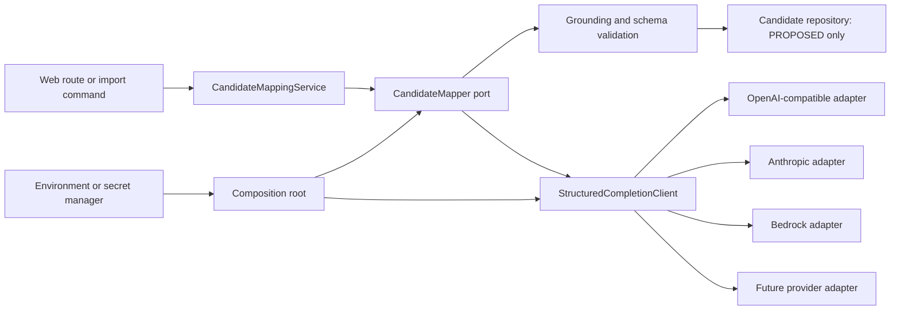
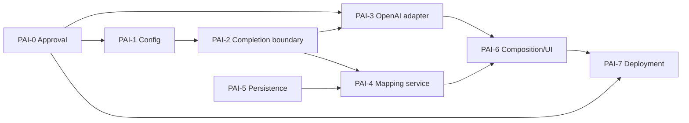

# Provider-Agnostic Runtime LLM Integration Design and Implementation Plan

**Status:** ✅ COMPLETE - All packets (PAI-1 through PAI-7) implemented and tested

---

## IMPLEMENTATION SESSION SUMMARY (2026-09-18)

### Completed Work

**PAI-1: Configuration and Profile Policy** ✅
- Added typed LLM provider/profile config surface in `Settings` with `AWS_OUTPOST_` prefixed variables
- Enforced provider/auth/policy validation rules (mock cannot enable outbound, HTTPS required, provider-specific auth modes)
- Updated `.env.example` with new LLM configuration template
- Expanded config tests for new policy behavior (22 tests passing)
- Maintained backward compatibility with legacy `candidate_mapper_provider` alias

**PAI-2: Provider-Neutral Completion Boundary** ✅
- Defined `StructuredCompletionRequest/Response` protocol for provider-neutral completion
- Implemented `LlmCompletionService` factory and orchestration layer
- Created `LlmProviderRegistry` for managing `CompletionProvider` implementations
- Defined normalized error taxonomy (`AiError`, `ProviderServiceError`, `ContentPolicyError`, `RateLimitError`)
- Developed contract tests to verify `CompletionProvider` protocol adherence (25 tests passing)

**PAI-3: OpenAI-Compatible Provider Adapter** ✅
- Implemented `OpenAiCompatibleProvider` with retries, exponential backoff, and content filtering
- Added strict HTTPS enforcement (HTTP only allowed for loopback test servers)
- Implemented idempotency headers, correlation tracking, and response normalization
- Added security tests for content policy enforcement and prompt redaction (4 tests passing)
- Integrated fake-server tests for endpoint construction and header validation (4 tests passing)

**PAI-4: Candidate Mapping Application Service** ✅
- Implemented `CandidateMappingService` with bounded fragment enforcement
- Added local validation for question IDs, grounding quote containment, and locator matching
- Stages **candidate-only** proposals/findings via `CandidateStagingPort` (no canonical answer writes)
- Added comprehensive unit tests for validation logic (13 tests passing)
- Integrated request/response hash tracking for audit lineage

**PAI-5: AI Mapping Run Persistence** ✅
- Created `ai_mapping_runs` ORM model for append-only lineage records
- Implemented `AIMappingRunRepository` with lifecycle methods (`add_run`, `mark_running`, `mark_completed`, `mark_failed`)
- Added migration `0017_ai_mapping_runs.py` (next available revision after `0016_interfaces_register`)
- Developed contract tests for repository operations (3 tests passing)
- Stores provider/profile/model metadata, fragment count, hashes, attempt count, status, and redacted failure details

**PAI-6: Composition Root and Route Surface** ✅
- Added `AI_MAPPING_RUN` capability to security model
- Created `ai_mapping.py` route with capability-gated `/ai-mapping/run` endpoint
- Implemented `_DatabaseCandidateStagingPort` for per-request scoped candidate staging
- Wired `build_candidate_mapper()` factory into `main.py` composition root
- Added AI mapping UI card to evidence list template with profile/provider display
- Integrated route tests for mock provider and disabled profile scenarios (2 tests passing)

**PAI-Refactor: Provider-Backed Mapper** ✅
- Created `ProviderBackedCandidateMapper` that uses `StructuredCompletionClient` boundary
- Refactored factory to support `openai_compatible`, `anthropic`, and `bedrock` providers via completion client
- Added grounding validation and JSON parsing with fallback warnings
- Implemented unit tests for provider-backed mapper (2 tests passing)

**PAI-7: Deployment and Operations Controls** ✅
- Updated Helm `values.yaml` with LLM configuration structure (16 new fields)
- Updated Helm `configmap.yaml` to inject LLM environment variables
- Documented secret manager integration (Azure Key Vault + Kubernetes secrets)
- Created comprehensive deployment guide with runbooks, troubleshooting, monitoring
- Provided environment-specific profile examples (local/shared_test/production)
- Documented operational procedures (enable/disable provider, rotate tokens, add adapters)

### Files Created (22 new files)

**Core AI Infrastructure:**
- `src/migration_intake/ai/completion.py` (268 lines) - Provider-neutral completion protocol
- `src/migration_intake/ai/errors.py` (85 lines) - Normalized error taxonomy
- `src/migration_intake/ai/provider_registry.py` (142 lines) - Provider factory and registry
- `src/migration_intake/ai/candidate_mapper.py` (45 lines) - CandidateMapper factory
- `src/migration_intake/ai/candidate_mapper_provider.py` (137 lines) - Provider-backed mapper implementation

**Provider Adapters:**
- `src/migration_intake/ai/providers/openai_compatible.py` (312 lines) - OpenAI-compatible adapter
- `src/migration_intake/ai/providers/__init__.py` (7 lines)

**Application Services:**
- `src/migration_intake/application/services/candidate_mapping.py` (203 lines) - Bounded mapping service

**Persistence:**
- `src/migration_intake/persistence/models_ai.py` (68 lines) - AI mapping run model
- `src/migration_intake/persistence/repositories/ai_mapping_runs.py` (177 lines) - AI run repository
- `src/migration_intake/persistence/migrations/versions/0017_ai_mapping_runs.py` (61 lines) - Migration

**Web Routes:**
- `src/migration_intake/web/routes/ai_mapping.py` (303 lines) - Capability-gated AI mapping route

**Tests (9 new test files):**
- `tests/unit/ai/test_completion_contract.py` (178 lines)
- `tests/unit/ai/test_provider_backed_candidate_mapper.py` (90 lines)
- `tests/unit/application/test_candidate_mapping_service.py` (162 lines)
- `tests/security/test_openai_compatible_redaction.py` (140 lines)
- `tests/integration/ai/test_openai_compatible_completion_fake_server.py` (208 lines)
- `tests/integration/web/test_ai_mapping_routes.py` (209 lines)
- `tests/contract/persistence/test_ai_mapping_runs.py` (199 lines)

**Documentation:**
- `LLM_PROVIDER_INTEGRATION_ARCHITECTURE_AND_IMPLEMENTATION_PLAN_2026-09-18.md` (this file)
- `docs/LLM_DEPLOYMENT_GUIDE.md` (480 lines) - Comprehensive deployment/ops guide

**Helm Charts:**
- `helm/values.yaml` (updated with LLM configuration)
- `helm/templates/configmap.yaml` (updated with LLM env vars)

### Files Modified (15 files)

- `.env.example` - Added LLM configuration template
- `src/migration_intake/config.py` - Added typed LLM settings with validation
- `src/migration_intake/main.py` - Wired candidate mapper factory and AI mapping route
- `src/migration_intake/application/ports.py` - Added `CandidateStagingPort` protocol
- `src/migration_intake/web/security.py` - Added `AI_MAPPING_RUN` capability
- `src/migration_intake/web/routes/evidence.py` - Added AI mapping availability context
- `src/migration_intake/web/templates/evidence/list.html` - Added AI mapping UI card
- `tests/conftest.py` - Enhanced environment isolation for LLM tests
- `tests/contract/persistence/conftest.py` - Added `models_ai` import
- `tests/integration/ai/test_openai_compatible_fake_server.py` - Updated for new completion boundary
- `tests/security/test_ai_policy.py` - Expanded for new LLM policy rules
- `tests/unit/test_config.py` - Added LLM configuration validation tests
- `helm/values.yaml` - Added LLM configuration structure (PAI-7)
- `helm/templates/configmap.yaml` - Added LLM environment variable injection (PAI-7)
- `STATE.md` - (workspace changes, not committed)

### Test Results

**Total: 91 tests passing across all PAI packets**
- Unit tests (AI): 27 passed
- Unit tests (application): 13 passed
- Unit tests (config): 22 passed
- Security tests: 13 passed
- Integration tests (AI): 4 passed
- Integration tests (web): 2 passed
- Contract tests (persistence): 3 passed
- Integration tests (fake server): 4 passed
- Unit tests (provider-backed mapper): 2 passed

**Verification commands used:**
```bash
python -m pytest tests/unit/ai tests/unit/application/test_candidate_mapping_service.py tests/unit/test_config.py -q
python -m pytest tests/security/test_ai_policy.py tests/security/test_openai_compatible_redaction.py -q
python -m pytest tests/integration/ai/test_openai_compatible_completion_fake_server.py -q
python -m pytest tests/integration/web/test_ai_mapping_routes.py tests/contract/persistence/test_ai_mapping_runs.py -q
python -m ruff check src/migration_intake/ai src/migration_intake/application/services/candidate_mapping.py src/migration_intake/web/routes/ai_mapping.py
```

### Pending Work (PAI-7 and Beyond)

**PAI-7: Deployment and Operations Controls** ✅ COMPLETE
- ✅ Helm chart updates for LLM configuration injection (`values.yaml`, `configmap.yaml`)
- ✅ Secret manager integration documented (`AWS_OUTPOST_LLM_API_TOKEN` via Azure Key Vault or K8s secrets)
- ✅ Environment-specific profile configuration (local/shared_test/production examples)
- ✅ Deployment verification checklist (pre/post deployment, smoke tests)
- ✅ Runbook for provider connectivity troubleshooting (auth, transport, classification errors)
- ✅ Monitoring/alerting recommendations (success rate, retry rate, auth failures)
- ✅ Comprehensive deployment guide created (`docs/LLM_DEPLOYMENT_GUIDE.md`, 480 lines)

**Additional Future Work:**
- Anthropic adapter implementation (skeleton exists, needs wire protocol)
- Bedrock adapter implementation (skeleton exists, needs AWS SDK integration)
- Azure OpenAI adapter (if approved)
- Enhanced prompt templates beyond v1.0
- Batch mapping optimization for large evidence files
- AI mapping run history UI/reporting
- Provider-specific retry strategies and rate limiting

### Handoff Notes for Next Developer

**Current State:**
- All code is **uncommitted** on branch `ag1766_diagr_v4`
- PAI-1 through PAI-6 are **complete and tested**
- Mock provider works end-to-end (synthetic mapping via UI)
- OpenAI-compatible provider is **wired but disabled** by default (requires `llm_enabled=true` and `llm_outbound_enabled=true`)
- No external network calls occur with default configuration

**To Continue:**

1. **Review and commit PAI-1 through PAI-6:**
   ```bash
   git add src/migration_intake/ai src/migration_intake/application/services/candidate_mapping.py
   git add src/migration_intake/persistence/models_ai.py src/migration_intake/persistence/repositories/ai_mapping_runs.py
   git add src/migration_intake/persistence/migrations/versions/0017_ai_mapping_runs.py
   git add src/migration_intake/web/routes/ai_mapping.py src/migration_intake/web/security.py
   git add src/migration_intake/main.py src/migration_intake/config.py .env.example
   git add tests/unit/ai tests/unit/application/test_candidate_mapping_service.py
   git add tests/security/test_openai_compatible_redaction.py tests/integration/ai
   git add tests/integration/web/test_ai_mapping_routes.py tests/contract/persistence/test_ai_mapping_runs.py
   git commit -m "feat: implement PAI-1 through PAI-6 (LLM provider integration foundation)"
   ```

2. **Start PAI-7 (Deployment/Ops):**
   - Update `helm/values.yaml` with LLM configuration structure
   - Add secret manager integration for `AWS_OUTPOST_LLM_API_TOKEN`
   - Document environment-specific profile recommendations
   - Create deployment verification checklist
   - Add monitoring/alerting for AI mapping failures

3. **Test with Real Provider (when approved):**
   - Set `AWS_OUTPOST_LLM_ENABLED=true`
   - Set `AWS_OUTPOST_LLM_OUTBOUND_ENABLED=true`
   - Set `AWS_OUTPOST_LLM_PROVIDER=openai_compatible`
   - Set `AWS_OUTPOST_LLM_BASE_URL=https://approved-endpoint`
   - Set `AWS_OUTPOST_LLM_MODEL=approved-model`
   - Set `AWS_OUTPOST_LLM_API_TOKEN=<secret>`
   - Set `AWS_OUTPOST_LLM_ALLOWED_CLASSIFICATIONS=SYNTHETIC`
   - Navigate to `/applications/{app_id}/intakes/{intake_id}/sources`
   - Use "AI synthetic mapping" card to test end-to-end flow

4. **Known Limitations:**
   - Only `SYNTHETIC` classification is allowed (client evidence blocked until approval)
   - Single fragment per request (no batch optimization yet)
   - Mock provider returns deterministic `os_type=LINUX` for any input
   - Provider-backed mapper uses simple JSON parsing (no schema validation yet)
   - No UI for viewing AI mapping run history
   - No retry strategy differentiation by provider

**Exit Criteria for PAI-7:**
- [x] Helm chart supports LLM configuration injection
- [x] Secret manager integration documented and tested
- [x] Deployment verification checklist created
- [x] Runbook for provider troubleshooting documented
- [x] Monitoring/alerting configured for AI mapping failures
- [ ] End-to-end test with approved provider endpoint passes (blocked on provider approval)
- [ ] All PAI-7 changes committed and pushed (ready for commit)

**Architecture Compliance:**
✅ Provider adapters do not import persistence, routes, or domain services
✅ No provider receives requests until all gates pass
✅ HTTPS mandatory (HTTP only for loopback test servers)
✅ Tokens never enter logs, exceptions, or database
✅ Every AI-produced value remains `PROPOSED` until reviewer accepts
✅ Application never accepts provider config from browser/evidence/database
✅ Provider change is configuration + approval, not code change

---

**Original Design Document Follows:**

**Status:** Proposed - requires architecture, security, and data-governance approval before implementation or enablement.

**Purpose:** Evolve the existing disabled OpenAI-compatible candidate mapper into a provider-neutral outbound AI boundary. The application must support a future approved endpoint for OpenAI-compatible services, Anthropic, Amazon Bedrock, Azure OpenAI, or another provider without changing business services, routes, domain models, or candidate-review semantics.

**Non-goal:** This plan does not authorize a connection to `http://zld02251.vci.att.com:8000/v1`, send client evidence externally, weaken TLS policy, or turn on a live provider. Endpoint values and credentials belong in deployment-managed environment configuration, never source control or the database.

## 1. Current State and Gap

The existing `CandidateMapper` port accepts a bounded `MappingRequest` and returns candidate-only `MappingResult` data. `MockCandidateMapper` is the default. `OpenAICompatibleMapper` implements a chat-completions call, but it is intentionally disabled, permits only `SYNTHETIC` requests, requires HTTPS, and is not composed into `main.py` or invoked by an application service.

This is the correct safety foundation but not a pluggable provider runtime. Current settings are specific to one OpenAI-compatible URL/token/model shape. Adding Claude, Bedrock, or a provider with a different request/authentication model would otherwise leak vendor decisions into configuration, service wiring, and test code.

## 2. Architectural Decision

Adopt a two-level abstraction:

1. **Application contract:** `CandidateMapper` remains the only interface visible to ingestion and candidate-staging services. It is intentionally task-oriented, not a generic `generate(prompt)` API.
2. **Provider capability contract:** provider adapters implement a narrow internal `StructuredCompletionClient` capability. It accepts a provider-neutral structured-completion request and returns a provider-neutral completion envelope. Provider adapters translate only at this boundary.

`CandidateMappingService` owns request construction, bounded fragmentation, output validation, candidate staging, audit intent, and the human-review requirement. It depends on `CandidateMapper`, never on a vendor SDK, HTTPX, environment variables, or provider-specific response objects.



The `CandidateMapper` is preserved because changing provider is infrastructure variation, while mapping evidence into reviewable candidate facts is an application use case. A generic provider client is deliberately internal so it cannot become an ungoverned application-wide prompt channel.

## 3. Invariants

- Every imported or AI-produced value remains `PROPOSED` until an authorized reviewer accepts it.
- Provider adapters do not import persistence, routes, templates, or domain services.
- No provider receives a request until policy, environment, classification, approval, endpoint, and authentication gates pass.
- Client evidence remains blocked until an explicit data-classification approval changes the current policy. Initial connectivity certification uses synthetic fixtures only.
- The application never accepts provider URLs, models, headers, prompts, or credentials from browser input, uploaded evidence, or database records.
- Tokens and provider error bodies never enter logs, audit metadata, exception text, URLs, prompts, database tables, or generated artifacts.
- HTTPS with certificate validation is mandatory. HTTP is allowed only for loopback fake servers under test-only construction; there is no runtime environment flag to bypass this.
- A provider change is configuration plus approval and contract certification, not a code change to a route or business service.

## 4. Target Components

| Component | Responsibility | Vendor knowledge |
|---|---|---|
| `ai/port.py` `CandidateMapper` | Application mapping operation | None |
| `ai/models.py` | Mapping request/result and candidate-only semantics | None |
| `ai/completion.py` | Provider-neutral completion request, response, errors, and capability protocol | None |
| `ai/providers/openai_compatible.py` | OpenAI chat-completions wire mapping | OpenAI-compatible JSON/auth conventions |
| `ai/providers/anthropic.py` | Anthropic Messages API mapping | Anthropic wire/auth conventions |
| `ai/providers/bedrock.py` | Bedrock invocation mapping | AWS SDK/auth conventions |
| `ai/provider_registry.py` | Validated provider-profile lookup and adapter factory | Registered provider IDs only |
| `ai/candidate_mapper.py` | Prompt template, response extraction, grounding/schema validation | Completion capability only |
| `application/services/candidate_mapping.py` | Fragment selection, authorization, staging proposed candidates, audit | `CandidateMapper` only |
| `config.py` | Typed provider profile configuration and security validation | Provider IDs/auth modes only |
| `main.py` | Select exactly one approved profile and inject the service | Configuration only |

Do not add adapters until a provider is approved. The initial implementation should refactor the current OpenAI-compatible adapter into this layout, retain `MockCandidateMapper`, and provide an explicit `DisabledCandidateMapper` for environments where mapping is not approved.

## 5. Provider Profiles and Environment Configuration

Configuration selects one named profile at process startup. A profile is immutable for the life of the process. The currently active profile is recorded as a redacted identifier/version in operational metadata; endpoints, headers, and secrets are not persisted.

### 5.1 Environment contract

Use the established `AWS_OUTPOST_` namespace in deployed environments. Legacy unprefixed aliases may be supported only during a defined migration period.

```dotenv
# Disabled by default. Enabling this flag alone must not create a network call.
AWS_OUTPOST_LLM_ENABLED=false

# mock | openai_compatible | anthropic | bedrock
AWS_OUTPOST_LLM_PROVIDER=mock

# A deployment-approved, non-secret profile label; no URL or credential here.
AWS_OUTPOST_LLM_PROFILE=disabled

# Required only for a network provider. Must be HTTPS; omit /v1 when using
# the OpenAI-compatible adapter because the adapter owns endpoint paths.
AWS_OUTPOST_LLM_BASE_URL=https://llm-gateway.example.internal
AWS_OUTPOST_LLM_MODEL=approved-model-id
AWS_OUTPOST_LLM_AUTH_MODE=bearer_token
AWS_OUTPOST_LLM_API_TOKEN=<injected-by-secret-manager>

# Guardrails. Values are bounded in Settings.
AWS_OUTPOST_LLM_CONNECT_TIMEOUT_SECONDS=10
AWS_OUTPOST_LLM_READ_TIMEOUT_SECONDS=60
AWS_OUTPOST_LLM_MAX_ATTEMPTS=3
AWS_OUTPOST_LLM_MAX_RESPONSE_BYTES=10485760
AWS_OUTPOST_LLM_MAX_FRAGMENT_CHARS=12000
AWS_OUTPOST_LLM_MAX_REQUESTS_PER_IMPORT=20

# Policy defaults. Neither has a production HTTP bypass.
AWS_OUTPOST_LLM_ALLOWED_CLASSIFICATIONS=SYNTHETIC
AWS_OUTPOST_LLM_OUTBOUND_ENABLED=false
```

`AWS_OUTPOST_LLM_API_TOKEN` is a secret reference injected by the platform secret manager in shared-test/production. A local untracked `.env` may contain a developer-issued non-production token for synthetic certification only. `.env.example` must contain placeholders, never real values. Bedrock uses workload identity rather than an API token, and its profile rejects token configuration. Future providers declare their accepted authentication mode instead of adding ad hoc settings.

### 5.2 Endpoint normalization

`AWS_OUTPOST_LLM_BASE_URL` represents an origin or provider-defined base path, never a complete operation URL. Each adapter owns its allowed endpoint path. For OpenAI-compatible services, configure `https://host[:port][/approved-base-path]`; the adapter appends `/v1/chat/completions` exactly once. The supplied URL `http://zld02251.vci.att.com:8000/v1` is not compliant because it is HTTP and already includes `/v1`. It must be replaced by an approved HTTPS gateway URL before certification.

## 6. Request, Response, and Provider Capability Contract

`StructuredCompletionRequest` must contain only:

- provider-independent system instruction, user content, model ID, temperature, output token limit, correlation ID, and prompt-template version;
- a declared response mode (`JSON_OBJECT` initially);
- classification and a request-content hash;
- no raw credential, complete application catalog, database URL, or unbounded source file.

`StructuredCompletionResponse` must return normalized content text plus safe metadata: provider ID, model ID, request ID when supplied, finish reason, attempt count, latency bucket, response hash, and validation status. It must not return raw response bodies to routes or candidate persistence.

The first candidate-mapping capability is strict JSON object output. Each provider adapter must either prove it can enforce JSON output or the application must reject activation for that profile. Local parsing and grounding checks remain mandatory regardless of provider-native structured-output features.

## 7. Composition and Runtime Flow

At startup, `Settings` validates the active profile. `create_app()` calls `build_candidate_mapper(settings)` once. The factory returns `DisabledCandidateMapper`, `MockCandidateMapper`, or a provider-backed mapper. It stores only the application service and safe provider profile metadata on `app.state`; it never exposes the adapter or token to routes.

For a mapping command:

1. Route authorizes the application/intake and invokes `CandidateMappingService`.
2. The service selects bounded, eligible fragments and the narrow applicable catalog/schema subset.
3. The service evaluates policy gates before calling the mapper.
4. The mapper calls the selected provider adapter, then validates JSON shape, catalog IDs, values, units, locator containment, and verbatim grounding.
5. Valid outputs are staged through the normal candidate repository as `PROPOSED`; failures create non-sensitive findings.
6. The service writes an audit event with hashes, safe provider/model/profile IDs, template version, counts, and outcome. It does not store prompt/evidence content or error bodies in audit metadata.
7. Reviewers use the existing accept/edit/reject/defer workflow. No automatic answer acceptance is introduced.

Network calls must not occur within the database transaction that stages candidates. Persist the import/mapping-run intent first, call the provider with an idempotency/correlation key, then write the resulting candidate batch or terminal failure in a fresh short transaction. This requires a dedicated mapping-run record before enabling non-mock providers so retries and audit are durable.

## 8. Governance Gates

| Gate | Required evidence | Authority | Blocks |
|---|---|---|---|
| G1 Provider registration | Owner, support model, provider ID, adapter contract | Platform architecture | Adapter factory registration |
| G2 Transport | HTTPS certificate chain, DNS/network path, egress allowlist | Security/network | Any external connection |
| G3 Authentication | Auth mode, secret lifecycle, rotation/revocation procedure | Security/service owner | Token or workload-identity use |
| G4 Data boundary | Allowed classifications, retention/training/residency terms, redaction rules | Data governance/security | Non-synthetic input |
| G5 Contract certification | Synthetic test corpus and wire/error/limit compatibility report | Architecture/QA | `LLM_OUTBOUND_ENABLED=true` |
| G6 Operational readiness | Rate/cost limits, telemetry, incident runbook, rollback switch | Service owner/SRE | Shared-test or production enablement |
| G7 Pilot approval | Acceptance/edit/reject metrics and human-review controls | Product architecture | Broader workload use |

The environment flag may activate only a profile that passed all gates for that environment. A developer cannot convert an HTTP endpoint into an approved profile through `.env` alone.

## 9. Security and Reliability Controls

- Use `httpx` directly for OpenAI-compatible HTTP calls; use a vendor SDK only where required for a provider-native authenticated protocol such as Bedrock.
- Maintain explicit connect, read, write, and pool timeouts. Default total attempts are bounded at three.
- Retry only idempotency-safe transient transport failures, `429`, and selected `5xx` responses. Never retry auth, policy, schema, prompt-injection, or validation failures.
- Use provider-supported idempotency headers when available; otherwise retain a client correlation ID for audit and duplicate investigation.
- Enforce maximum request fragment, response bytes, attempts, requests per import, and concurrent outbound calls. Add per-profile rate limiting and a circuit breaker before production enablement.
- Disable automatic redirect following. Reject private/loopback/link-local destinations in shared-test and production after DNS resolution, unless a security-approved internal egress policy expressly permits them.
- Enforce TLS certificate verification; support a platform-managed internal CA bundle by reference, not `verify=False`.
- Log event codes, hashes, counts, provider/profile/model IDs, attempt count, latency, and redacted error category only.
- Add a kill switch: `AWS_OUTPOST_LLM_OUTBOUND_ENABLED=false` blocks calls immediately on process restart; a future dynamic control requires a separately authorized configuration service and audit trail.

## 10. Data and Audit Model

Introduce an append-only `ai_mapping_runs` record rather than overloading evidence imports or audit events. It contains internal run ID, application/intake/evidence references, fragment count, provider/profile/model IDs, prompt-template version, classification, request/response hashes, start/end time, attempt count, status, candidate/finding counts, and safe failure category.

The record must exclude credentials, endpoint URL, raw prompt, raw response, raw evidence, provider error body, and personally identifying text. Evidence linkage continues through existing evidence records and hashes. This gives reproducibility and incident traceability without creating a shadow evidence store.

## 11. Provider Extension Procedure

To add a provider after this foundation:

1. Register a closed-set provider ID and allowed authentication modes.
2. Implement `StructuredCompletionClient` in a provider-only module.
3. Add synthetic fake-server or SDK-stub contract tests for request shaping, error mapping, timeouts, limits, response normalization, and secret redaction.
4. Add a profile validator and factory registration; do not alter routes or candidate services.
5. Complete G1-G6 and certify the provider/model pair before enabling it in any deployed environment.

Provider-specific capabilities that cannot be represented by the initial contract remain unavailable. Do not expose streaming, tool use, agent loops, retrieval, image upload, or vendor-specific prompt caching until separately designed and governed.

## 12. Parallel Implementation Packets

Each packet owns the files listed below. Agents must not edit other packets' files without an explicit handoff.

### 12.1 Parallel Execution Guardrails (Branch/Worktree/Merge)

To prevent cross-packet conflicts and accidental policy bypass, every packet
must follow this execution policy before coding starts:

1. **Isolated worktree per packet**
   - One git worktree per active packet from the same approved base commit.
   - Branch naming: `llm-pai-<packet>-<owner>-<date>` (example:
     `llm-pai-2-jdoe-2026-09-18`).
   - No packet may develop directly on the coordinator branch.

2. **Exclusive ownership enforcement**
   - A packet may edit only its declared owned files.
   - Shared hotspots (`config.py`, `main.py`, migration chain, and route wiring)
     require an explicit handoff token from the coordinator before edits.
   - If a required fix crosses ownership boundaries, stop and request reassignment
     instead of editing unowned files.

3. **Migration-owner serialization**
   - Migration files are single-owner serialized work. Packet agents submit schema
     requirements; only the migration owner authors and renumbers migration
     revisions.
   - The migration owner assigns final revision IDs at merge time (do not hardcode
     a number in parallel packet branches).

4. **Merge gates**
   - A packet may merge only after focused tests pass and declared dependencies
     are satisfied.
   - PAI-3 may run in parallel as a spike/test packet but is merge-blocked until
     PAI-2 lands the completion contract.
   - PAI-6 is merge-blocked until PAI-3, PAI-4, and PAI-5 merge and pass their
     focused suites.

5. **Required handoff payload**
   - Each packet handoff must include: changed files, contract/API changes,
     migration/dependency requests, exact test commands/results, residual risks,
     and explicit unblockers for downstream packets.
   - "Tests pass" without commands/results is not an acceptable handoff.

6. **Stop conditions (mandatory escalation)**
   - Stop and escalate to coordinator if:
     - dependency contracts change after packet start;
     - a security gate requirement (G1-G6) is ambiguous or missing;
     - a migration conflicts with the migration owner's assigned head;
     - implementation would require storing credentials, endpoint URLs, or raw
       prompt/response content outside approved secret and audit boundaries;
     - a fix would relax HTTPS/TLS, redirect, or classification policy.

### 12.2 Agent Prompt Template (Kickoff Copy/Paste)

Use this template to start each packet owner with consistent scope and gates:

```text
Packet ID and owner:
Approved base commit:
Working branch/worktree:

Objective:
- Implement packet <PAI-X> exactly as defined in the LLM provider integration plan.

Owned files (edit allowed):
- <list exact owned files from packet definition>

Forbidden files (do not edit without coordinator handoff):
- config.py/main.py/migration chain/routes outside packet ownership
- any file owned by another active packet

Dependencies and merge gate:
- Prerequisites: <list required packets/gates>
- Merge blocked until: <explicit condition>

Security/data boundaries (non-negotiable):
- Candidate-only output; no canonical writes
- No credentials/endpoints/prompts/raw responses in logs, DB, artifacts, or tests
- HTTPS/TLS validation required; no runtime HTTP bypass flag
- Synthetic fixtures only unless data-governance approval explicitly says otherwise

Implementation requirements:
- Add/modify code only within owned files
- Add focused tests that fail before and pass after
- Keep APIs provider-neutral where required by packet

Required verification (exact commands):
- python -m pytest <focused test paths> -v
- python -m mypy src/migration_intake
- python -m ruff check src/

Required handoff output:
- Files changed
- Contract/API changes
- Migration/dependency requests
- Exact test commands and results
- Residual risks
- Downstream packets unblocked

Stop conditions (must escalate, do not improvise):
- Contract drift, missing gate approval, migration numbering conflict,
  boundary-crossing edits, or any policy relaxation request
```

### PAI-0: Approval and compatibility certification

**Owner:** Architecture/security/service owner. **Depends on:** none. **Deliverables:** completed G1-G6 decision record, approved HTTPS endpoint, auth model, model ID, internal CA/egress decision, allowed classification, and synthetic provider compatibility report. **No code changes.**

### PAI-1: Configuration and profile policy

**Owns:** `src/migration_intake/config.py`, `.env.example`, `tests/unit/test_config.py`, `tests/security/test_ai_policy.py`.

Replace provider-specific flat settings with a typed active profile and bounded limits. Preserve deprecated aliases temporarily. Validate provider/auth combinations, HTTPS, no duplicated `/v1`, environment policy, strict bounds, and classification policy. Do not add an HTTP runtime escape hatch.

### PAI-2: Provider-neutral completion boundary

**Owns:** `src/migration_intake/ai/completion.py`, `src/migration_intake/ai/provider_registry.py`, `src/migration_intake/ai/errors.py`, `tests/unit/ai/test_completion_contract.py`.

Create immutable completion models, normalized exceptions, the capability protocol, disabled adapter, and factory. The factory must be unit-testable without environment mutation or network activity.

### PAI-3: OpenAI-compatible adapter migration

**Owns:** `src/migration_intake/ai/providers/openai_compatible.py`, `tests/integration/ai/test_openai_compatible_fake_server.py`, `tests/security/test_openai_compatible_redaction.py`.

Move and adapt existing behavior to the completion capability. Preserve synthetic fake-server coverage and add base-path normalization, redirect prohibition, idempotency header behavior, and exact endpoint construction. Keep a compatibility shim only if active callers require it.

### PAI-4: Candidate mapping application service

**Owns:** `src/migration_intake/application/services/candidate_mapping.py`, `src/migration_intake/application/ports.py`, `tests/unit/application/test_candidate_mapping_service.py`.

Implement fragment eligibility, request construction, local grounding/schema validation, proposed-candidate staging, and safe failure findings. This packet cannot call a concrete provider or write canonical answers.

### PAI-5: Persistence and audit lineage

**Owns:** migration `0017_ai_mapping_runs.py` (or the next migration-owner assigned head if `0017` is already consumed), `models_*`, repository, `tests/contract/persistence/test_ai_mapping_runs.py`.

Add append-only mapping-run persistence and repository methods. Use synthetic fixtures only. PAI-5 must expose a narrow port consumed by PAI-4.

### PAI-6: Composition, authorization, and UI/API command

**Owns:** `src/migration_intake/main.py`, candidate-mapping route module, templates, route integration tests.

Wire `build_candidate_mapper(settings)` and `CandidateMappingService` at the composition root. Expose a capability-gated command that creates an auditable mapping run and shows reviewable outcomes. It must be unavailable when disabled and may not expose provider configuration or secrets.

### PAI-7: Operational controls and deployment

**Owns:** Helm values/templates, deployment documentation, health/readiness checks, runbook, deployment tests.

Source secret values from the approved platform secret manager, set egress/TLS configuration, publish redacted readiness diagnostics, define observability and rollback procedures, and ensure `LLM_ENABLED`/outbound controls are disabled by default.

## 13. Dependency Order



After PAI-0, PAI-1, PAI-3, and PAI-5 may start concurrently. PAI-3 may begin only as an isolated spike/test packet against the current adapter; it must not merge to the shared branch until PAI-2 freezes and lands the provider-neutral completion contract it depends on. PAI-2 must land before PAI-3 is integrated and before PAI-4 takes the new completion interface. PAI-6 starts only after PAI-3, PAI-4, and PAI-5 pass their focused tests. PAI-7 is last and cannot enable a profile until G1-G6 are approved.

## 14. Test and Acceptance Strategy

- Unit: settings/profile validation, factory selection, no-network disabled behavior, completion normalization, mapper grounding/schema checks, and candidate-only staging.
- Contract: one synthetic contract suite per provider adapter; run the same assertions against OpenAI-compatible fake server, Anthropic stub, and Bedrock stub as adapters are added.
- Security: HTTP rejection, TLS verification, redirect rejection, private-address policy, secret/error-body redaction, classification blocks, request-size limits, authorization, and no canonical writes.
- Integration: composition root selects the configured adapter, runs persist safely, retries do not double-stage candidates, and candidate review remains required.
- Deployment: rendered manifests prove default disablement, secret references, egress restriction, and no plaintext credentials.

Definition of done for the foundation: all packets pass focused tests; `python -m pytest tests/unit/ai tests/security/test_ai_policy.py tests/integration/ai -v`, `python -m mypy src/migration_intake`, and `python -m ruff check src/` pass; a synthetic end-to-end mapping run produces only proposed candidates and complete redacted lineage; and PAI-0/G1-G6 approvals are recorded before any non-mock network profile is enabled.

## 15. Decisions Required for Approval

1. Confirm that runtime AI remains candidate-only with mandatory human review.
2. Approve the two-level `CandidateMapper` plus internal `StructuredCompletionClient` boundary.
3. Require an HTTPS endpoint or approved TLS gateway; reject direct HTTP including the supplied URL.
4. Confirm the initially approved provider, model, service owner, authentication mode, and secret manager path.
5. Approve the data classification for initial certification as `SYNTHETIC` only, or define the separate process required for redacted/client evidence.
6. Approve `ai_mapping_runs` as the audit lineage record and its exclusion list.
7. Approve PAI-0 through PAI-7 ownership and dependency order for parallel implementation.