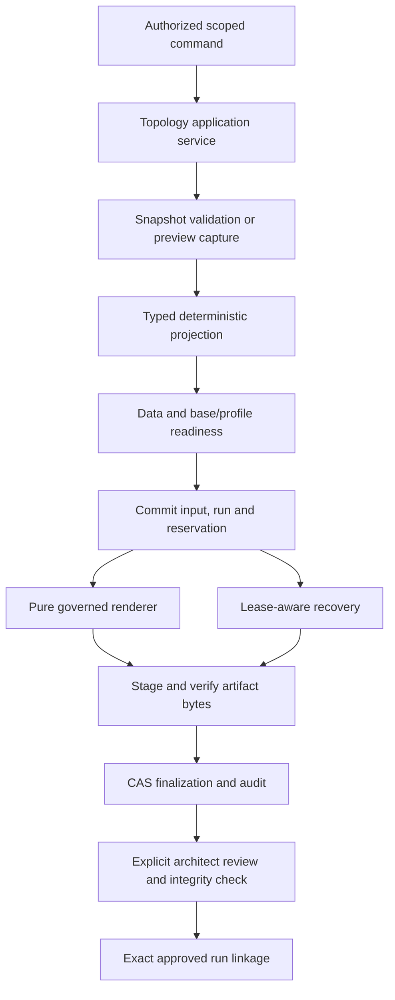
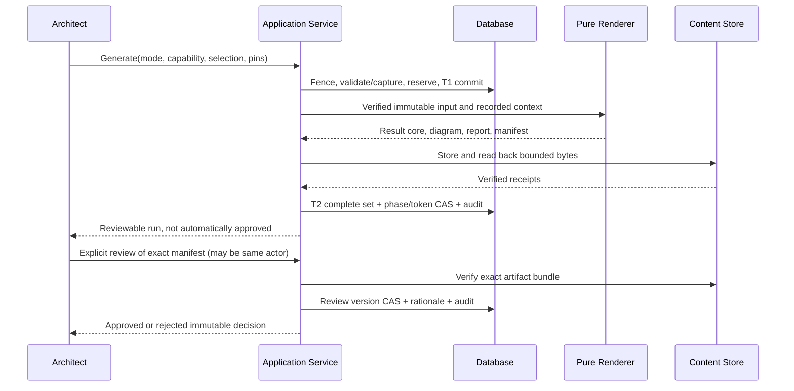

# Topology: Detailed Design and Agent Implementation Plan

**Date:** 2026-09-18  
**Status:** User direction confirmed for Q-01 through Q-05 and Q-15/Q-16; detailed contracts proposed for review, not release approval.  
**Evidence baseline:** review of commit `6ed8af2`. Recheck HEAD and migrations before coding.  
**Implementation status:** Not started by this document. No production behavior changed.

## Latest implementation review and developer handoff (2026-09-20)

Read the [HTML developer handoff](TOPOLOGY_DEVELOPER_HANDOFF_2026-09-20.html)
for current source-grounded findings, synthetic UI screenshots, status workflow,
SQLite acceptance steps and guarded Oracle certification instructions. Its final
focused regression reports `366 passed`, but approval integrity and official
cross-module integration remain blocked. This design remains the intended contract;
historical completion claims below are not release approval. No Oracle work or
official-generation activation was performed for that handoff.

## 0.1 Agent Handoff: Current Implementation State (2026-09-19)

This section is the current handoff for the next implementation agent. The opening
status line above records the state of the design document when it was authored; it
is historical and must not be read as a statement that the repository is still at
the pre-C5 baseline. The implementation work described below exists in the current
working tree and is also recorded in `STATE.md`. Recheck the checkout and `git diff`
before changing any file because several topology, catalog, resource, route, test,
configuration and documentation files may contain unrelated user or automation edits.

### Completed gates and delivered contracts

- **C0.1-C4.3 remain verified** according to the earlier ledger entries in this
  document and the current `STATE.md`. These gates establish the isolated Python
  3.13 test environment, fail-closed route containment, canonical catalog identity,
  strict topology v3 contracts, scoped multi-context selection, resource/revision
  persistence, answer lineage, transactional snapshot capture, and deterministic
  v3 projection. Do not replace those contracts with a parallel serializer, status
  vocabulary, identity model or persistence path.
- **C5.1 strict profile/XML boundary:**
  `src/migration_intake/topology/profiles/loader.py` and the governed parser boundary
  validate packaged profile assets, exact component inventories, confined filenames,
  component digests, canonical manifest semantics, unique IDs and supported versions.
  `src/migration_intake/topology/renderer/core.py` rejects unsafe XML/entity and
  resource-amplification inputs. Synthetic LABEL_ONLY and STRUCTURAL profile assets
  are package resources. The parser bounds and structural policy remain provisional
  where the design marks D-13 as pending.
- **C5.2 actual base/profile compatibility:**
  `src/migration_intake/topology/compatibility.py` inventories real Draw.io
  pages/cells/markers, requires explicit context-page mappings and exact slot
  cardinality, separates capability from profile identity, and emits deterministic
  inventory/result hashes. Compatibility is not projection readiness and must not be
  treated as approval.
- **C5.3 governed LABEL_ONLY renderer:**
  `src/migration_intake/topology/renderer/core.py` and
  `src/migration_intake/topology/renderer/__init__.py` consume the packaged profile,
  strict v3 projection and C5.2 compatibility result. The renderer verifies pins,
  mutates only declared matched slots, preserves manual content, distinguishes
  attempted from changed writes, blocks unresolved mandatory facts, and produces
  deterministic replay bytes/status. The legacy renderer path is not the official
  authority and must not be reintroduced as a fallback.
- **C6.1 topology governance persistence:**
  `src/migration_intake/persistence/models_topology.py` and
  `src/migration_intake/persistence/repositories/topology.py` persist captures,
  immutable inputs, compatibility records, generation runs, reservations, reviews
  and artifacts. Migration `0020_topology_capture_governance.py` added the governed
  topology surface. Legacy rows are explicitly `LEGACY_UNPINNED`; they are not
  silently upgraded with invented hashes. Phase changes, reservation identity and
  artifact type use constrained uniqueness and CAS semantics.
- **C6.2 base governance:**
  `src/migration_intake/application/services/base_diagram.py` performs upload,
  compatibility check, approval, rejection and supersession against stored bytes and
  trusted packaged profiles. It persists the exact compatibility and policy pins,
  revalidates them at approval, uses row-version/CAS and audit transactions, and
  keeps draft/rejected/superseded bases ineligible for official generation. Upload
  never implies approval.
- **C7.1 immutable capture, reservation and runner:**
  `src/migration_intake/application/services/topology_runner.py` uses only validated
  persisted v3 snapshots for official mode. Preview mode captures canonical v3 data
  at the immutable boundary before projection and render. T1 persists the capture,
  immutable `TopologyInput`, semantic reservation, leased run and audit atomically;
  rendering occurs outside the database transaction from a reloaded, strictly
  validated input. Duplicate requests converge on attempt 0; explicit reasoned
  reruns allocate later attempts. Lease tokens and row versions fence stale workers.
  Official execution never falls back to mutable answer reads.
- **C7.2 artifact finalization:**
  `src/migration_intake/application/services/topology_finalization.py` stores the
  complete `DIAGRAM`, `GAP_REPORT` and `MANIFEST` bundle through the existing storage
  port, verifies read-back bytes, sizes and SHA-256 receipts, validates manifest/run
  pins, and finalizes under phase/version/lease CAS. Artifact metadata, review/audit
  rows and completion state are committed atomically. Storage, manifest, stale-lease
  and late-metadata failures leave no false completed bundle and preserve the original
  failure phase.
- **C7.3 recovery and reconciliation:**
  `src/migration_intake/application/services/topology_recovery.py` provides a
  read-only inventory and controlled recovery of expired runs. It verifies artifact
  availability, size and digest without deleting objects, claims only expired work
  with CAS/fencing, records recovery review events, preserves the original failed
  phase and reconciles from immutable run/input identity. It never rebuilds an old
  run from current answers. Healthy leases cannot be reclaimed and stale workers
  cannot advance a recovered run.

### Persistence and migration state

The current Alembic head is **`0021`**. Migration
`src/migration_intake/persistence/migrations/versions/0021_intake_content_epoch.py`
adds the monotonic intake `content_epoch`, immutable input compatibility pins and
the `(intake_id, semantic_input_hash, attempt_number)` uniqueness needed for reasoned
reruns. It upgrades the actual `0020` schema and preserves existing topology rows.
Do not allocate a competing migration revision or edit an earlier migration. The
next schema change must be coordinated with the migration owner and proved from the
actual current head.

### Files and boundaries owned by the completed work

The primary C7 implementation surfaces are:

- `src/migration_intake/application/services/topology_runner.py`
- `src/migration_intake/application/services/topology_finalization.py`
- `src/migration_intake/application/services/topology_recovery.py`
- `src/migration_intake/persistence/repositories/topology.py`
- `src/migration_intake/persistence/models_topology.py`
- `src/migration_intake/persistence/migrations/versions/0021_intake_content_epoch.py`
- `tests/unit/topology/test_governed_runner.py`
- `tests/unit/topology/test_artifact_finalization.py`
- `tests/unit/topology/test_topology_recovery.py`

Base governance, profile loading, compatibility, rendering, routes and migration
tests have also changed during the preceding gates. Read their current contents and
the current `STATE.md` before editing; do not revert or normalize unrelated changes.
The official topology route and generation activation remain default-off. No live
database, configured backend, client evidence, PERF environment, Oracle deployment,
browser journey, installed-wheel certification or shared-storage certification was
performed by these gates.

### Verification evidence

The final focused C7.3 gate ran in the isolated Python 3.13 environment
`C:\Users\ag1766\AppData\Local\Temp\awsdiag-c02-persistent\venv\Scripts\python.exe`,
from a disposable working directory with database/runtime environment variables
cleared and without loading repository `.env`:

- `test_topology_recovery.py`, `test_artifact_finalization.py` and
  `test_governed_runner.py`: **27 passed in 4.33s**.
- Ruff on the new recovery/finalization/runner/repository surfaces:
  **all checks passed**.
- `git diff --check`: **passed**.
- Alembic heads: **`0021 (head)`**.
- The broader C7.1-C7.3 plus migration gate reported **70 passed**.

These are synthetic/disposable proofs, not shared-backend or production
certification. Keep the safe launcher rules: use Python `>=3.13,<3.14`, an external
disposable cwd, explicit disposable database configuration, cleared runtime/database
variables and no private client evidence. A missing external gate is `BLOCKED`, not
`PASSED`; do not inflate focused counts into release evidence.

### Exact next work: C8.1, then C8.2

**C8.1 is the next authorized implementation gate.** Implement it as one focused
slice before changing the operator routes. Its owner is the approval policy,
application-command and review-repository boundary. The required work is:

1. Add fail-closed review checks for every C8.1/section 6.1 precondition: official
   authority, complete verified artifact bundle, exact diagram/report/manifest bytes
   and hashes, manifest/run/input agreement, readiness and compatibility pins,
   approved base/profile/capability, and legal run phase. Any missing, false, stale,
   preview, failed, legacy-unpinned or corrupt condition must deny approval.
2. Require exact issue identifiers and non-empty rationale for permitted warnings;
   derive actor and review time server-side; never accept them as trusted values from
   the client. Preserve the explicit self-approval decision: an authorized architect
   may prepare and approve, but self-approval is a separate audited action and never
   waives a blocker or integrity check.
3. Implement review row-version/CAS and atomic audit behavior. Prove concurrent
   approve/reject has one winner and that stale review attempts cannot mutate the
   result. Preserve immutable run history and exact approved-run identity/digest links.
4. Implement supersession rules for same-selection/capability successors. Deny
   self-supersession, cycles, cross-scope mismatches and attempts to supersede a run
   with a different immutable contract. Do not rewrite old runs or artifacts.
5. Make download validation serve the exact bytes already verified at finalization;
   do not reopen unchecked storage content or recalculate authority from mutable
   answers. Add real bundle/service tests, not dictionary-only tests, covering every
   missing/false precondition, authorization distinction, race, wrong manifest,
   corrupt artifact and invalid supersession case.

Use the plan's C8.1 prompt and the existing approval-test home as the starting point,
but recheck whether those paths exist in the current checkout before adding files.
Run the focused C8.1 tests first, then the applicable C7/C6 regression set, Ruff and
`git diff --check`. Update this handoff, `STATE.md` and the completion ledger only
after the evidence is real.

**C8.2 follows only after C8.1 and C7.3 are verified.** It owns the operator routes,
templates, trusted-principal adapter and the minimal downstream exact-run link. It
must provide the complete upload -> compatibility -> explicit base review -> scoped
preview -> official generation -> architect review -> verified download workflow,
including explicit capability/mode/profile, multi-context authorization as a whole,
base/run diagnostics, phase display, warning rationale and review history. Backend
transitions must remain enforced when UI controls are hidden. ADS/DDD must consume an
exact approved official run ID/digest, never mutable answers or a latest-run query.

Do not invent header authentication or accept user-controlled actor/capability
headers. Stop shared identity enablement until an approved trusted-principal
contract exists. Browser journeys must cover LABEL_ONLY and STRUCTURAL separately,
denied access, stale review, missing data, partial-context authority, responsive
layout and structural diff inspection. Keep public diagnostics free of client
evidence. Official routes, PERF activation and production transition remain disabled
until C8.1/C8.2 and the later C9 certification and owner approvals are complete.

### Remaining gates and owner decisions

- **C5.4:** structural renderer remains deferred until the approved structural
  component/layout and generated-region contract exists; it is not implied by the
  synthetic STRUCTURAL profile asset.
- **D-06/D-07/D-10/D-12/D-13/D-14:** warning policy, downstream linkage, catalog/base
  approval, durable shared storage/backup, parser/layout limits and rerun/duplicate
  UX still require the named owners where applicable.
- **Platform certification:** Oracle DDL/runtime, shared durable storage,
  cross-process concurrency, restart/restore, installed wheel, browser and live
  identity/security certification remain pending.
- **C9.1-C9.3:** full disposable release certification, governed PERF pilot and
  production transition remain future gates. No agent should mark them complete from
  the focused synthetic tests above.

The next agent should begin by reading `STATE.md`, this handoff, the C8.1 section,
the current topology models/repository and any current uncommitted changes. Then make
the smallest C8.1 edit, run its focused executable check immediately, and preserve
the sequential gate discipline. Do not begin C8.2 or enable official generation in
the same slice.

## 1. Purpose and Reading Order

This is the coding specification for closing R-01 through R-23 and the original
G-01 through G-28. It expands, rather than replaces, the evidence in the
[independent implementation review](TOPOLOGY_REMEDIATION_IMPLEMENTATION_REVIEW_2026-09-18.md).
The [original plan](TOPOLOGY_GENERATION_REMEDIATION_DESIGN_PLAN_2026-09-17.md),
[Anil revision](../../TOPOLOGY_GENERATION_REMEDIATION_DESIGN_PLAN_2026-09-17_Anil_2026-09-18.md),
and [audit handoff](../../TOPOLOGY_HANDOFF_CODE_AUDIT_2026-09-18.md) remain historical
requirements and findings. Their completion banners are not current proof.

Read the decision register, relevant contract sections, dependency table, and the
assigned slice before coding. Each slice includes a copy-paste prompt. Prompts are
ordinary implementation instructions, not new agent customization files. Every
prompt incorporates this document and repository rules without requiring the user
to paste another shared preamble.

Keep four different assertions separate:

- **Observed:** source or executed evidence recorded in the review.
- **Proposed:** a technical design specified here for implementation.
- **Pending:** a business/security/platform decision that an agent cannot approve.
- **Verified complete:** implementation passes its named focused and integration gates.

No missing value becomes `No`, no example becomes application evidence, and no
importer or AI output becomes approved canonical data automatically.

## 2. Design Decisions and Open Questions

The user answered Q-01 through Q-05 in chat on 2026-09-18. Those choices supersede
the earlier unavailable-user defaults and conflicting recommendations in the
independent review. The user subsequently accepted the recommended overview/detail
composition and protected manual regions, recorded as Q-15/Q-16. Q-06 through Q-14
remain proposed engineering choices or pending owner decisions. No authentication
provider or storage backend was recommended or selected by that acceptance.
Product direction does not authorize PERF access or substitute
for catalog, security, template, or deployment sign-off. Question IDs complement
the original D-01 through D-15 decisions.

| ID | Decision / Proposal | Reason / Alternative | Approval and Stop Boundary |
|---|---|---|---|
| Q-01 | CONFIRMED: governed PERF pilot first, production later | Certify the synthetic/disposable pipeline before the authorized pilot. Production has a subsequent operational gate. | User direction recorded; platform/data authorization still required for live execution. |
| Q-02 | CONFIRMED: label-only and structural generation as separately governed capabilities | Share inputs and policies, but use different mutation contracts and independent certification. Neither capability may silently fall back to the other. | Both are in this program; certify label-only first and structural second. Pilot enablement is explicit per capability. |
| Q-03 | CONFIRMED: multiple environments and sites in one official diagram | A run captures a sorted explicit context set and reviewed cross-scope edges. Per-context facts remain isolated. | Profile determines approved composition/view layout; do not flatten contexts into a single namespace. |
| Q-04 | CONFIRMED: authorized architect may prepare and approve an official result | Self-approval is allowed but explicit, scoped, rationale-bearing and audited. It cannot waive integrity checks or blockers. | No compulsory two-person rule. Exact role-to-capability and base-review assignments still require identity policy. |
| Q-05 | CONFIRMED: preserve history and migrate explicitly | Frozen snapshots and generated artifacts are not rewritten. Empty drafts may be repinned; answered intakes need a reviewed migration/fork. | No automatic reset, inferred historical pins, or live-data enrichment of old snapshots. |
| Q-06 | Complete all eight resource kinds, with profile-specific requirements | PLACEMENT, ACCOUNT, VPC, SUBNET, SECURITY_GROUP, COMPUTE, ENI, DATABASE are modeled; a profile need not require every kind. | Cloud architect approves required inventory, schemas and relationships. |
| Q-07 | Persisted synchronous runner initially | Capture/commit, execute outside transaction, finalize/commit. Avoid adding a broker before throughput requires it; recovery is still mandatory. | Operations confirms latency/volume. External worker/queue is a later runner adapter, not a different domain contract. |
| Q-08 | Reuse storage port; managed shared volume or object backend | Local filesystem only for isolated development. Backend identity and read-back checks do not by themselves prove durability. | D-12 platform/security approval required for shared/pilot storage and backup. |
| Q-09 | No shared configured-actor bypass | Preserve existing startup refusal until a trusted principal adapter exists. Never accept identity/capabilities from user-controlled headers. | Identity/security owner provides actual integration contract; no invented SSO protocol. |
| Q-10 | Retention and performance values remain pending | No automatic deletion of approved/history objects. Benchmark synthetic maximums before selecting SLOs and leases. | Operations/legal/security approves retention, recovery window and SLOs. |
| Q-11 | New strict snapshot schema version `3.0.0` | Existing v2 lacks mandatory lineage/parent fields. Do not silently redefine v2 or fabricate missing history. | Contract/data owner can choose another new version before C2 freezes; stored v1/v2 bytes remain unchanged. |
| Q-12 | Full resource revision on every audited resource transition | Content, parent, scope and review/lifecycle state reconstruct from a single revision. A separate head row_version is the concurrency token. | Technical/data design approval; avoids event-only graph reconstruction complexity. |
| Q-13 | Exactly reproducible replay, distinct authorized reruns | Replays reuse captured timestamp/IDs; new reruns can have different report metadata. Semantic identity and execution identity are separate. | D-14 product/operations approves duplicate and rerun UX. |
| Q-14 | Blockers never waived; warnings individually reviewable | Missing required facts/slots, integrity errors and ambiguity cannot be approved. | D-06/D-07: owner approves warning code allowlist and downstream linkage rules. |
| Q-15 | CONFIRMED: one combined overview page plus per-context detail pages in the same document | Keep the multi-environment/site overview readable while retaining detailed scoped views. Profile pins page inventory, ordering and references. | User accepted recommendation on 2026-09-18. LABEL_ONLY requires those pages in the approved base; STRUCTURAL may create them only at approved generated anchors. |
| Q-16 | CONFIRMED: structural changes only within designated generated regions; manual structure protected | Profile-controlled components/layout may change generated content, not manually authored shapes, connections or geometry. | User accepted recommendation on 2026-09-18. Existing governed label-slot updates remain bounded by the label contract; manual structural editing needs a separate explicit authorization contract. |

### 2.1 Questions Still Requiring Owners

1. Which environment/site combinations, including primary/DR, must the pilot demonstrate?
2. Which exact regions, page anchors and component/layout rules in the approved base
  establish generated ownership while preserving manual structure under Q-16?
3. Which template variant and exact marker/cell inventory may become a repository profile?
4. Which CTL-001 identifier namespace and CTL-002 name/acronym member order are authoritative?
5. Who approved D-10, which full source/compiled hashes were approved, and what version
   resolves any published `1.0.0` collision without overwriting it?
6. Which evidence/reference systems are authoritative for allocated cloud identifiers,
   placement, freshness windows and application/environment applicability?
7. Which authenticated principal and application-access service is available in shared test?
8. Which architect capabilities cover base approval, run approval and permitted warning codes?
9. Which storage backend, deployment topology, disaster recovery and retention policy apply?
10. Expected concurrent users/runs, largest diagram/resource inventory and response-time target?

Proceed on pure code, synthetic fixtures, negative tests and portable schema design
without these approvals. Stop before inventing bindings, choosing real application
facts, certifying D-10/D-13, enabling shared authentication, publishing live releases,
approving diagrams, activating PERF or deleting historical content.

## 3. Solution Architecture



### 3.1 Ownership and Existing Homes

| Concern | Existing Home / Intended Change |
|---|---|
| HTTP, CSRF, scope, navigation | [topology routes](../../src/migration_intake/web/routes/topology.py); thin handlers, shared principal dependency, no SQL workflow truth. |
| Public commands and transaction phases | [generation service](../../src/migration_intake/application/services/topology_generation.py); integrate repaired pure policies, remove official legacy adapter calls. |
| Vocabulary/state transitions | [domain topology](../../src/migration_intake/domain/topology.py); sole owner of run/base/approval/issue enums. |
| Snapshot capture/serialization | [snapshot service](../../src/migration_intake/application/services/snapshots.py), [serializer](../../src/migration_intake/application/snapshots.py); strict versioned load plus consistent capture. |
| Resource behavior | [resource service](../../src/migration_intake/application/services/resources.py), [repository](../../src/migration_intake/persistence/repositories/resources.py); caller-owned UoW with explicit actor/intake. |
| Projection | [projection module](../../src/migration_intake/topology/projection.py); typed selectors, canonical serializer, no persistence dependency. |
| Profiles/compatibility | [profile loader](../../src/migration_intake/topology/profiles/loader.py); separate manifest validation, template inventory and data requirements. |
| XML/mutation/report | [renderer](../../src/migration_intake/topology/renderer/core.py); reuse proven invariant logic from [legacy filler](../../src/migration_intake/topology/fill.py), then retire duplicate official paths. |
| Base governance | [base service](../../src/migration_intake/application/services/base_diagram.py); implement against the actual repository contract, not imagined methods. |
| Run/review persistence | [topology models](../../src/migration_intake/persistence/models_topology.py), [repository](../../src/migration_intake/persistence/repositories/topology.py); constrained CAS transitions. |
| Storage | [filesystem store](../../src/migration_intake/storage/filesystem.py); extend existing port only for needed integrity/staging operations. |
| Audit | Existing `AuditEvent` and UoW audit API; typed topology/resource detail schema, not a second generic audit framework. |

New files are justified only for a shared contract, registered resource validators,
one parser boundary, one recovery command or focused integration fixtures. Do not
create parallel serializers, actor systems, repository frameworks or status engines.

### 3.2 Explicit Authority

`LEGACY_UNPINNED`, `DRAFT_PREVIEW`, and `OFFICIAL_SNAPSHOT` are different authority
classes. Existing snapshot presence never determines mode. Preview uses an immutable
capture but cannot be approved or consumed downstream as authoritative. Legacy
downloads must identify historical authority and verify available digests.

Immediate containment disables creation/approval of new official results until the
new path is certified. Preserve authorized access to safe historical artifacts.
Invalid XML or corrupt bytes remain blocked even for previews. Do not simply relabel
the unsafe old live-answer path as the new immutable preview implementation.

## 4. Contract Catalog

These are proposed exact semantics. C2 produces executable schemas and golden fixtures.
Use existing Pydantic v2 for boundary validation where suitable (`extra='forbid'`,
strict values); pure domain objects may remain frozen dataclasses. Frozen objects
must not expose mutable dict/list references. Persist canonical bytes plus verified
digests; a `frozen=True` wrapper around mutable dictionaries is not an immutable pin.

### 4.1 Canonical Encoding and Hashes

- UTF-8, JSON objects sorted by key, compact separators, `ensure_ascii=False`,
  `allow_nan=False`; reject duplicate JSON keys on decode.
- UUIDs normalized lowercase canonical form; UTC timestamps with a fixed six-digit
  fractional second and `Z`; reject naive datetime. Record once, never render with now().
- Decimal measurements are normalized decimal strings plus explicit unit, not binary
  floats. Booleans remain booleans, integers remain integers; zero/false are not missing.
- Preserve raw source text separately. Normalize only fields whose schema authorizes
  it; do not case-fold names/IDs universally or silently alter Unicode evidence.
- Explicit order keys: answers `(question_code, instance_id, revision_id)`;
  resources `(scope_key, kind, logical_key, resource_id)`; relationships `(type, from_id,
  to_id)`; evidence references `(source_id, evidence_id, revision_id, locator)`;
  issues `(code, scoped_subject, slot_id)`; bindings `(page_id, cell_id, slot_id)`.
- Duplicate identities/ambiguous selectors are validation errors, not tie-breakers.
  Missing, unknown, explicit not-applicable and known values have distinct states.
- `content_hash = SHA256(canonical_bytes)`. Hash schema/version is explicit at every
  boundary. For snapshots, verify exact stored bytes first, then parse/validate;
  never repair bytes by reserializing and pretend the original digest matched.
- Input identity excludes run ID, worker lease and transport request ID. Execution
  envelope additionally records timestamp, actor, input ID, run ID and attempt ID.
  Pin generator build and parser/policy digest in both the applicable identity and
  execution record. Hash verification is not proof of authorized approval.

### 4.2 Scope and Identity

`ContextKey = {environment, site_id}`; both values are required for an official
partition. `ScopeSelection = {application_id, intake_id, contexts[], view_variant}`
contains a non-empty explicit set of context keys. Normalize against an approved
vocabulary, reject duplicates and unknown values, and sort by `(environment, site_id)`.
The selected context set is part of the immutable input and idempotency identity.
Under Q-15, one official Draw.io document contains a combined overview page followed
by per-context detail pages in canonical context order. The profile pins page IDs,
content and stable overview/detail references; these are views of the same captured
facts, not independently selected or generated inputs. LABEL_ONLY requires the page
inventory in its approved base and blocks if it is missing. STRUCTURAL may instantiate
detail pages only through approved generated anchors under Q-16. It cannot use this
composition requirement as permission to restructure manually authored regions.

Authorization must cover the entire selection before any capture or output; do not
silently remove unauthorized contexts. Readiness runs per partition plus globally.
One blocking partition blocks approval of the combined result. Partial completion
is not official success; the operator must request a new explicit smaller selection.

`FactScope = {lifecycle, environment_state, environment, site_state, site_id,
tier_state, tier, role_state, role}`. Scope state is `KNOWN | GLOBAL | UNKNOWN |
NOT_APPLICABLE`, with values present only for `KNOWN`. GLOBAL is a reviewed assertion
allowed only for declared kinds/selectors, never a default for null.

`scope_key` is the digest of the canonical scope tuple, including all state tags.
Use it as a non-null portable index key; verify the tuple on lookup and fail on any
digest/tuple disagreement. A resource's identity is `(intake_id, kind, logical_key,
scope_key)`. Logical keys are stable within that identity and are not allocated AWS IDs.
Retired identities remain reserved; replacement of the same identity is a new revision
when legal, or a distinct logical key explicitly linked as successor.

Application DB UUID, correlation ID, MOTS and iTAP are distinct namespaces. Identifier
records carry raw/normalized values, namespace and explicit primary decision. Multiple
unreconciled primary candidates block the affected mapping. CTL-001 reconciles against
its approved namespace; name/acronym conflicts produce owner decisions, not metadata wins.

### 4.3 Snapshot V3 and Preview Capture

| Field | Type / Invariant |
|---|---|
| `schema_version` | Literal `3.0.0`; v1/v2 handled by explicit legacy read adapters only. |
| `application` | UUID, reviewed name/acronym source, typed identifiers with raw/normalized values and decision references. |
| `intake` | UUID, catalog pin, frozen state/time/actor, observed row version/content epoch. |
| `catalog` | Release UUID/version, source hash, compiled contract hash, compiler contract version. |
| `answers[]` | Instance/revision UUIDs and revision number, question code, response type/schema, typed payload, review/confirm/applicability state, author/time, provenance[]. |
| `resources[]` | Resource/revision UUIDs, revision number, kind/payload-schema version, logical key, exact scope, lifecycle state, review state, attributes and provenance[]. |
| `relationships[]` | Stable relation identity and revision, type, resource endpoints, review state and provenance; endpoints must exist in the captured graph. |
| `wave_util_rows[]` | Explicit applicable reviewed row/revision identities and scope; never application-wide unqualified facts. |
| `permitted_gaps[]` | Stable code/subject/owner decision and allowed downstream policy, not free-text overrides of blockers. |

Repository envelope owns `snapshot_id`, intake/catalog relations and stored JSON hash.
Avoid a self-hash inside snapshot content. Preview capture has its own ID and `capture_kind`;
it is not stored as a frozen intake snapshot. Capture only reviewed canonical heads;
proposed evidence stays in the candidate workflow. Surface missing/unconfirmed requirements
as gaps, not proposed facts. Legacy v2 cannot be enriched from live rows for official use.

### 4.4 Resource Revisions and Relationships

Head: resource UUID/intake, current revision UUID/number, lifecycle state, row_version,
created/updated audit metadata. Revision: full logical identity/scope, payload-schema
version, attributes, parent/relation references, state/review, author/time/reason,
predecessor revision and lineage. Revision content is append-only.

Every update/review/confirm/reject/reparent/retire/supersede inserts a complete revision,
then CAS-updates head `WHERE id AND intake_id AND row_version AND current_rev_id`.
Insert and head/audit update share a transaction; zero-row CAS rolls everything back.
Use fresh immutable copies of payload and lineage. Unchanged review preserves provenance;
changed fields require retained/removed/added evidence decisions. Review notes are not
undeclared attributes mixed into cloud payload.

Single containment parent is insufficient for all cloud relationships. Define typed
relationships separately: containment plus `COMPUTE_USES_SG`, `ENI_ATTACHED_TO_COMPUTE`,
and profile-approved dependencies. C2 confirms names and cardinalities before migration.
All endpoints share intake and the relationship's approved lifecycle policy.
Containment requires compatible explicit scopes; GLOBAL parent exceptions are
kind-specific and reviewed. Cross-environment/site links are separate reviewed
relationship kinds, never implicit containment or inferred network reachability.
Their endpoint contexts must both be selected, except a profile-authorized external
reference rendered distinctly without importing another context's unknown facts.
Containment is acyclic; dependency cycles are checked under their own semantics,
not an inappropriate universal tree rule. A primary/DR role is an approved fact,
not something inferred from environment names, page position or sort order.

| Kind | Core Validation and Semantics |
|---|---|
| PLACEMENT | Selected reviewed provisioning revision; site/environment, region/AZ and allocated Outpost ID where required. No reference-row existence shortcut. |
| ACCOUNT | 12-digit account ID as string, partition and ownership; no numeric coercion or invented account. Explicit placement/global rule. |
| VPC | Valid allocated ID when required, CIDR using `ipaddress`, account/region membership and non-overlap policy where applicable. |
| SUBNET | Valid ID, CIDR contained in selected VPC, AZ/site compatibility; no cross-VPC containment. |
| SECURITY_GROUP | ID and VPC/account relationship; names are not substitute IDs. |
| COMPUTE | Approved role/logical name, allocated ID only when lifecycle requires one, instance class, placement, count or individual identity according to schema. |
| ENI | Subnet, interface identity, valid IP membership, explicit attachment/SG relationships; multiplicity defined per profile. |
| DATABASE | Engine/version and approved deployment form; managed/cloud identifiers and on-host relationships must not be conflated. |

Support `PLANNED` versus `ALLOCATED` attribute semantics explicitly. A design diagram
may use an approved planned logical name only if its profile allows it; never fill an
allocated-ID slot with a composed name. Validators are versioned per kind; additional
cloud constraints require a reviewed schema, not ad hoc regex in routes.

### 4.5 Projection and Selectors

Proposed pure entry point:

```python
project_snapshot(
    snapshot: ValidatedSnapshot,
  selection: ScopeSelection,
    mapping: MappingRelease,
) -> ProjectionResult
```

`ProjectionResult` contains canonical `projection_bytes`, SHA-256, typed projection
and stable issues. The application passes validated snapshot ID explicitly. No DB
session, filesystem path, provider client or wall clock is accepted by this API.

Mapping row: `{mapping_id, catalog_hash, question_code, response_type,
response_schema_version, selector, output_fact, data_type, unit, scope_rule,
cardinality, missing_policy}`. Selectors are registered typed operations, not Python
eval, arbitrary JSONPath or guessed object-to-string conversion. Examples:
`text_pair_member(first)`, `controlled_set_codes`, `measurement(value, unit)`,
`resource_attribute(kind, logical_key, exact_scope, field)`.

Selector result is `KNOWN(value, lineage)`, `MISSING(issue)`, `NOT_APPLICABLE(decision)`
or `CONFLICT(candidates)`. Null never becomes false. Unknown type/schema is a blocker.
Identical confirmed values may merge only with all lineage retained; distinct values
within exact scope block. Resource selectors require active/confirmed revisions,
reachable valid parents/relations and target context; SOURCE never implicitly matches TARGET.

Projection schema includes `application`, `selection`, `partitions[]`, explicitly
reviewed `shared_resources[]`, `cross_scope_relationships[]`, global `issues` and
lineage. Each partition has a context key, keyed facts, ordered resources, local
relationships and issues. Shared resources retain one canonical identity and may
have multiple display instances; display duplication never creates a new cloud fact.
Renderer selectors require a partition/shared binding and do not search other
partitions when a value is missing. Do not accommodate the current mock projection
by introducing an unversioned second shape. Issues and policy versions are pinned
alongside semantic data.

### 4.6 Profile Release and Render Capability

`RenderCapability = LABEL_ONLY | STRUCTURAL`. It is independent of
`GenerationMode = DRAFT_PREVIEW | OFFICIAL_SNAPSHOT`. A preview may exercise either
certified capability; neither a preview nor a structural change grants authority.
Capability is explicitly chosen and must be permitted by the exact approved profile
release and actor. Profiles may advertise both, but every run pins one capability.
No automatic escalation occurs when label-only capacity is insufficient.

| Profile Component | Required Contract |
|---|---|
| Manifest | Profile UUID/name/version, schema version, capability set, generator/projection compatibility, selected catalog mapping release, context composition rules, component digests and complete profile digest. |
| Slots | Stable slot ID, page/context selector, cell matcher, declared tokens, applicability expression, min/max cardinality, requiredness, render template and unresolved policy. |
| Mappings | Registered typed projection selectors, explicit partition/shared binding, formatting, allowed planned/allocated values; no arbitrary evaluation or default facts. |
| Components | STRUCTURAL only: approved subgraphs, ports, local IDs, fixed geometry rules, allowed facts/styles and node/edge creation/removal policy. |
| Composition | Context/region order, combined overview/detail pages, shared-resource display policy, cross-context connector strategy and layout limits. |
| Issues | Stable codes, severity, scope, blocking phase, owner and allowed warning-review policy. |
| Naming | Reviewed logical/display name rules. Allocated identifiers cannot be generated by naming rules. |
| Parser/layout policy | Exact versions/digests and bounds; no implicit library/platform defaults that change output. |

Manifest approval is an external trusted decision binding its complete digest;
`approved_by` inside an uploaded JSON file is not authorization. Reject empty/missing
hashes, undeclared components, duplicate IDs, unbounded selectors, unsupported schema,
unconfined paths and semantic-version parse failure. Constrain real component paths
including symlinks to the approved profile root. Packaged profiles load through
importlib resources without relying on the source checkout. If using `packaging`
for versions, declare it as a direct runtime dependency.

Hash components over their documented canonical representation or exact immutable
asset bytes. Hash the canonical manifest containing component names/digests and
all executable semantics, excluding only its own digest and detached approval.
Changing a slot, requiredness, capability, context policy, parser limit or layout
version creates a new hash/release and invalidates prior compatibility reuse.

### 4.7 Compatibility Versus Readiness

`inspect_base(base_bytes, profile, selection, capability, parser_policy)` returns
`BaseInventory` and `CompatibilityResult`, without querying canonical answers.
Inventory actual pages/cells, scoped IDs, component regions, marker grammar,
slot matches, protected nodes and graph endpoints. Reject wrong Draw.io root,
missing graph structure, ambiguous page/cell binding and unsupported compressed input.

Compatibility validates template/profile/context composition and structural capacity.
Data readiness separately validates all required facts/resources for each partition
and selected cross-scope relationships. Never use a base hash as a projection hash.
Neither kind presence alone nor XML parse success constitutes compatibility.

`CompatibilityKey = hash(base_hash, profile_hash, selection_hash, capability,
parser_policy_hash, validator_version)`. Save canonical result bytes and digest.
Repeat at review or generation when any pin differs. A failed state-transition CAS
is a conflict even when the inspection itself succeeded; do not swallow it.

### 4.8 Label-Only Mutation Contract

- Match only governed page/cell slots and tokens declared for the selected partition.
  Existing unbound values, even recognizable marker strings, are not editable.
- Require exactly the configured cardinality; too few or too many is a stable issue.
  Missing mandatory slots or mandatory facts block. Optional omissions emit issues.
- Preserve page order/IDs, cell order/IDs, containment, edge endpoints, styles,
  geometry, and every unbound value. Compare an independent before/after inventory.
- Count attempted marker replacements and effective changed cells separately.
  Resolving several markers in one cell counts as one effective cell mutation.
- A clean zero-diff run can be an idempotent success only when all required bindings
  already contain verified desired values and no governed unresolved markers remain.
  Zero matches or unresolved required markers is never a clean no-op.
- XML escaping is not HTML-label sanitization. Insert canonical text using an
  explicit plain-text or restricted-rich-text binding policy, never raw HTML facts.

### 4.9 Structural Mutation Contract

Structural generation is a deterministic graph compiler, not unconstrained diagram
editing or AI layout. Use approved component templates and an intermediate graph
model; do not create nodes directly while selecting facts.

1. Validate and inventory the approved base. Identify protected/manual regions and
  explicit generated regions, including permitted page/container creation anchors.
2. Build `DesiredGraph` from partitioned canonical resources and approved relationships.
  Every generated semantic node/edge references its source resource/relation revision.
  Decorative/group nodes reference profile components, not invented resources.
3. Instantiate approved component subgraphs. Map local IDs/ports to stable generated
  IDs using a documented hash of `(profile_id, component_key, region_key, context_key,
  resource_or_relationship_id, display_role, local_component_id)`. Do not use list
  positions, timestamps or random IDs. Exclude mutable payload/version values so
  stable resources retain IDs across content changes. Detect all ID collisions.
4. Reconcile desired and existing generated inventories into an explicit change set:
  `CREATE_NODE`, `UPDATE_LABEL`, `UPDATE_GENERATED_GEOMETRY`, `CREATE_EDGE`,
  `UPDATE_GENERATED_EDGE`, `REMOVE_GENERATED_EDGE`, `REMOVE_GENERATED_NODE`.
  Each operation includes before/after fingerprints, owner region and reason.
5. Never delete/update protected cells. A generated annotation alone is insufficient
  ownership: require the pinned base inventory or a verified prior generated manifest
  and profile agreement. A removal means removal from the new document, not deletion
  of a canonical resource, base artifact, previous run or historical diagram.
6. No cascading removal of manually authored incident edges. Reject dangling protected
  endpoints. If retirement/supersession cannot be represented safely, block and request
  explicit base/profile review. Unknown or merely absent evidence does not prove retirement.
7. Lay out generated regions using a deterministic constrained algorithm: stable
  context columns/rows, kind/tier ranks, sorted semantic keys, fixed component bounds,
  explicit spacing and reserved cross-context connector channels. Pin font metrics,
  rounding, layout version and routing policy. Do not hand-roll a general graph solver;
  use simple prescribed lanes initially, or select and certify a proven deterministic
  library if profile requirements exceed them. No network assets or runtime font fetches.
8. Apply bounded operations, then independently compare actual graph diff to the planned
  change set. No hidden extra mutation is allowed. Validate endpoint existence, scope,
  containment, geometry bounds, overlap rules, disconnected required components,
  page references and resource/relation-to-display cardinality.

Cross-environment/site connectors require reviewed canonical relations and a profile
rule authorizing their kind and visibility. They are not inferred from similar names,
subnets or proximity. In combined overview pages, endpoint display instances are
explicit. Cross-page references to the Q-15 detail pages use stable paired anchors;
do not create illegal cross-page Draw.io edges. The manifest maps one semantic
relationship to its display instances without double-counting canonical relationships.

Any structural blockers fail the complete combined result. A subset diagram requires
a new explicit request, never silently skipped nodes/contexts. Cap the number of
contexts, components, display instances, edges, operations and total output bytes.
Those provisional limits become certified policy only after synthetic load/security
review; agents cannot claim D-13 approval from defaults.

### 4.10 Renderer, Result and Manifest Contracts

```python
render_topology(render_input: VerifiedRenderInput) -> RenderResult
```

Input contains canonical projection bytes/hash, approved base bytes/hash, immutable
profile release/hash, selection, capability, recorded execution context and policies.
Verify provided bytes against pins at entry; accepting a claimed hash without comparing
bytes is an integrity failure. No DB, environment, network or wall-clock access occurs.

Result includes capability, status, diagram bytes/digest, typed issues, complete bindings,
planned/observed mutation records, partition summaries and structural verdict. Do not
truncate machine-readable diagnostics; the HTML may paginate without losing manifest data.
Mutation ID uses stable page/cell/operation identity, never a counter reset per cell.

One shared result policy applies to both capabilities:

| Condition | Terminal Result | Review Eligibility |
|---|---|---|
| Parse/security/integrity error, missing required slot/fact, ambiguity, unauthorized mutation or invalid graph | FAILED; diagnostic report allowed, no successful official diagram | Never approvable. |
| Complete valid graph/bindings with permitted warning issues | GENERATED_WITH_GAPS | Official mode only, all mandatory integrity checks passed, per-warning rationale required. |
| Complete valid graph/bindings without warning gaps | READY_FOR_REVIEW | Official mode may enter explicit architect review. |
| Preview with either non-failed result above | Same technical result plus DRAFT_PREVIEW authority | Never approvable/downstream-authoritative. |

Avoid a hash cycle: compute canonical `ResultCore` and diagram hash; generate HTML
only from that core and recorded context; build final manifest with result core,
diagram and report digests; compute manifest digest and keep it in artifact metadata.
No report digest inside the report's own hashed core, nor manifest self-hash.
Manifest records all input/policy/build hashes, selected contexts, capability,
authority, stable issues, bindings and actual diff. Diagram preview identity is
embedded using profile-approved metadata/banner cells, never an undeclared mutation.

### 4.11 Public Commands and Errors

Signatures below name contract fields; implementation should use validated command
objects and existing service conventions, not positional untyped dictionaries.

| Command | Inputs Beyond Trusted Actor | Return / Atomicity |
|---|---|---|
| UploadBase | intake, bounded bytes, safe filename, media type | Draft base metadata plus audit after safe parsing/storage receipt; cannot self-approve. |
| CheckBase | base, profile release/hash, selection, capability, expected row_version | Compatibility record and CAS state transition in one UoW. |
| ReviewBase | base, expected row_version/result hash, decision, rationale | Reverified pins, explicit decision and audit. Authorized architect may also be preparer when policy permits. |
| Propose/ReviewResource | intake, resource/relation ID, expected head version, schema payload, lineage and rationale | New immutable revision, head CAS and audit. No independent repository commit. |
| AdoptProvisioning | intake, actual reference ID/revision, selected scope, expected version, rationale | Verified applicability then proposed resource/relation revisions and evidence links, never confirmation. |
| FreezeIntake | intake, expected row_version, readiness expectation | Validated snapshot plus state transition/audit atomically, or rollback. |
| GenerateTopology | intake, mode, snapshot/capture request, base, profile, selection, capability, idempotency request and optional rerun reason | Reserved durable run/input, then completed or recoverable execution status. |
| ReviewRun | run, expected row_version, expected manifest hash, decision, rationale, issue decisions | Integrity recheck plus CAS decision/audit. Trusted actor/time assigned by service. |
| SupersedeRun | predecessor/successor, both expected versions, reason | Same intake/selection/capability/authority constraints, no cycle/self-link; update/audit atomically. |
| DownloadArtifact | scoped run/artifact | Verified bounded bytes and safe download headers, with audited access outcome. |

HTTP compatibility: retain established URL forms where possible. Add explicit mode,
capability and selected-context fields; never infer omitted new fields for official
requests. Existing legacy calls receive a clear validation/disabled-feature response.
New command routes use typed payloads and existing CSRF/principal dependencies.
Persist detailed diagnostics safely; responses expose stable codes and request IDs,
not stack traces, credentials, filesystem addresses or raw private evidence.

Error mapping: unauthorized capability 403; out-of-actor application/intake scope
404; malformed/unknown selector schema 422; row-version/idempotency conflict 409;
bounded upload overflow 413; unsupported media 415; unavailable policy/storage 503.
Use one documented mapping for HTML and API responses; security rejection precedes
content disclosure, and a status page never converts FAILED into success.

## 5. Persistence and Transaction Design

### 5.1 Portable Schema Changes

Proposed names below fit the repository's short Oracle identifier policy. The sole
migration owner freezes actual names with C2. Existing portable UUID/UTC/JSON/hash
types and explicit short constraint names are mandatory. No destructive table reset,
native database enum, SQLite-only partial uniqueness or Oracle empty-string sentinel.

| Table / Change | Key Columns and Constraints | Owner |
|---|---|---|
| `intakes` | Existing row_version plus proposed `content_epoch` integer; increment on every canonical input change within the intake fence. | C4 with migration owner. |
| `res_resources` | UUID/intake, kind/logical_key/scope_key as identity index, current_rev_id, revision_number, state, row_version; unique identity tuple, non-null scope digest, valid state/version checks. Head identity fields mirror immutable creation identity; no in-place scope move. | C3 |
| `res_revisions` | UUID/resource, revision_number, schema version, full immutable payload/scope/state/parent, actor/time/reason, predecessor; unique `(resource_id, revision_number)` and `(resource_id, id)`. | C3 |
| `res_rev_evid` | Resource revision/evidence ID and typed source locator/reviewed source reference; FK-backed local evidence ownership where available. Unique canonical link key; no free-form unchecked lineage string. | C3 |
| `res_links`, `res_link_revs` | Relation head/intake/type/stable endpoints/current revision/row_version; append-only relation scope, attributes, review/state/lineage; unique scoped logical relation identity. | C3 |
| `topo_compat` | UUID/base/profile hash/selection hash/capability/parser-policy hash, canonical result/hash, actor/time; immutable, indexed by exact compatibility key. | C6 |
| `topo_base` | Add row_version, authority, lifecycle, profile release/hash, capability binding, selection/composition contract, compatibility ID, review metadata. Base bytes are immutable; replace by new base artifact. | C6 |
| `topo_inputs` | UUID/intake/mode/snapshot or capture reference, canonical projection bytes/hash, selection JSON/hash, capability, base/profile/catalog/build/policy pins, semantic input hash, capture actor/time. Immutable. | C6 |
| `topo_captures` | Preview-only capture UUID/intake/epoch/schema/JSON/hash/actor/time; no intake FROZEN transition, no official snapshot FK alias. | C4/C6 |
| `gen_keys` | Non-null unique generation key scoped by intake and full semantic identity; original run reference and reservation version. Serialize duplicate requests. | C6/C7 |
| `gen_runs` | Add input FK, mode/capability, row_version, phase/result/authority, semantic key, attempt number, lease token/expiry, captured context, approved manifest hash and metrics. UNIQUE semantic key/attempt; first attempt fixed at 0. | C6/C7 |
| `gen_artifacts` | Unique `(run_id, artifact_type)`; hash/size/backend/key; finalized artifact set only. Required types DIAGRAM, GAP_REPORT, MANIFEST for non-failed results. | C6 |
| `topo_reviews` | Append-only run/base decision, exact manifest/compatibility hash, rationale and issue-level decisions, trusted actor/time; event state mapped from run CAS. Self-review flag derived from actor IDs. | C6/C8 |
| `audit_events` | Reuse existing model: event code/entity/actor/time/payload with versioned payload including intake/selection/capability, old/new versions, decision and artifact IDs. No private evidence bytes or secrets. | All command owners |

Audit writes use the existing repository/service pattern with the caller's SQLAlchemy
session. The current UnitOfWork does not expose a generic audit property; do not call
an imaginary API. Add only explicit repository accessors required by consumers, or
instantiate the established repository with the UoW's session consistently.

Use a composite `(resource_id, current_rev_id)` ownership FK referencing revision
`(resource_id, id)` if validated on both dialects; break insert cycles by creating
head with NULL pointer, inserting revision and assigning pointer in the same UoW.
Committed authoritative heads must never retain NULL. Relations follow the same rule.
FKs do not enforce all scope semantics: repository/domain checks under the fence remain
mandatory. Non-FK external references require verified source version/digest and audit.

Do not rely on status text alone for immutable history. Pin content in append-only
tables; allow only documented head/phase/review fields to change through CAS. Reject
direct arbitrary `update_run_status`/`update_run_approval` setters in public ports.

### 5.2 Migration Sequence and Legacy Records

Current audited head is `0017`, but migration numbering is not reserved. Check the
current integration head before each revision. Do not change previously shipped revisions.

1. Resource heads/revisions/relations/provenance and intake content_epoch.
2. Base compatibility, capture/input records and versioned governance fields.
3. Run reservation/phase/review/artifact constraints and supporting indexes, if not
  safely deployable in step 2; justify any additional revision rather than duplicating it.

Each step includes fresh migration and upgrade tests from supported historical heads
using realistic synthetic rows. Inventory invalid/duplicate existing rows first; migration
must fail with actionable counts or quarantine under an explicit approved policy, not
delete/merge rows or claim unknown hashes. Preserve old approvals as historical decisions;
mark their authority `LEGACY_UNPINNED` without claiming they met new checks.

Use expand/backfill/validate/contract where necessary. Backfill only mechanically
derivable metadata; do not backfill lineage, scope, approval or missing original input
from current mutable answers. Historical v1/v2 snapshots remain byte-identical. New
authoritative generation requires a new valid freeze/migration workflow. Data reset is
not an implementation shortcut. Verify backup restoration and forward recovery before
deploying constraints on shared data; do not promise lossless destructive downgrade.

### 5.3 Freeze and Canonical Write Fence

All canonical input writers use a shared lock order: application, intake(s) ordered
by UUID, then resource/relation/answer heads ordered by UUID. Application lock matters
because identifiers and shared reference registers may change independently of intake.
No writer may update those shared canonical inputs without participating in the same
application fence. This requires an explicit inventory of writer call sites, not just
adding a lock to freeze. Prefer referencing immutable reviewed shared-register revisions
once such a reference is available; do not copy all application rows indiscriminately.

Oracle: acquire documented `SELECT ... FOR UPDATE` locks with bounded wait, before
checking readiness and selecting heads. SQLite: begin the write transaction using
`BEGIN IMMEDIATE` before reads; do not issue it inside an already-open transaction.
SQLAlchemy session/connection lifecycle must use one tested dialect-aware helper,
not random raw BEGIN calls in individual services. Retry only known transient locking
errors with bounded policy; stale caller versions return 409 rather than silent retry.

Freeze algorithm:

1. Authorize, acquire fences and reload intake/catalog identities; require eligible state
  and expected version. If already frozen, validate its existing snapshot and return it
  idempotently without allowing later live readiness changes to break that return.
2. Evaluate applicability/readiness using the exact captured heads and reviewed reference
  revisions. Fetch value, schema and provenance via the same revision identity.
3. Materialize all canonical partitions/resources/relationships into v3; verify complete
  graph, lineage and catalog identity. Reject inconsistent heads; never skip them.
4. Serialize once and create snapshot. CAS intake to FROZEN using expected row_version
  and content_epoch; explicitly inspect the result. Append audit and commit once.
5. Any conflict, validation or audit failure rolls back snapshot, state and links together.
  No file/provider/network operations occur inside the capture transaction.

Confirmation preserves current response schema and existing evidence links when the
value is unchanged; caller-supplied provenance may add reviewed sources but not silently
erase prior lineage. Answered empty/not-applicable values follow explicit response policy.

### 5.4 Generation State and Transaction Protocol

Separate `phase`, `result_status`, `approval_status` and `authority`. Existing SUCCESS
is a legacy status, not another new synonym for READY_FOR_REVIEW. Domain enums own
serialization; web/persistence modules import them rather than redefining them.

| Entity | Allowed Transitions |
|---|---|
| Base | UPLOADED_DRAFT -> COMPATIBLE or REJECTED; COMPATIBLE -> APPROVED or REJECTED; APPROVED -> SUPERSEDED. A changed base/profile binding is a new record or explicit new review, not an in-place content replacement. |
| Run phase | CAPTURED -> RENDERING -> STORING -> VERIFYING -> COMPLETED; any active phase -> FAILED. Recovery resumes the recorded phase only with a newly acquired lease token and verified prerequisites. |
| Run review | PENDING -> APPROVED or REJECTED; APPROVED -> SUPERSEDED with eligible successor. No rejected/superseded-to-approved overwrite. |
| Resource/relation review | PROPOSED -> REVIEWED/REJECTED; REVIEWED -> CONFIRMED/REJECTED. Content change creates new PROPOSED revision; the old confirmed revision remains immutable. |
| Resource/relation lifecycle | ACTIVE -> RETIRED/SUPERSEDED under graph-safe policy; no editing a retired head into an active fact without an explicit versioned restoration rule. |

`semantic_key = SHA256(canonical({intake_id, mode, projection_hash, selection_hash,
capability, base_hash, profile_hash, catalog_contract_hash, generator_build,
parser_policy_hash, layout_policy_hash, result_policy_hash}))`.
Projection hash includes lineage so changed evidence is not treated as an identical
certified input. Original duplicate returns original run; authorized rerun allocates
next attempt under reservation lock, with non-empty reason. Concurrent clients cannot
create two original attempts. Replays reuse execution timestamp/IDs; deliberate reruns
record new execution context and need not have identical HTML bytes.

**T1:** Validate authorization and feature gates, capture or load immutable input,
verify pins and readiness. Insert reservation/input/CAPTURED run/audit; commit. A loser
of a unique reservation race rolls back and reads the winner in a fresh UoW. Failed
readiness returns persisted diagnostics/audit but never a successful render attempt.

**Execution:** Acquire lease with CAS and unique fencing token. Move phases with
expected version/token. Render only captured inputs; no mutable answer queries.
Bound the synchronous operation; do not hold a DB transaction during CPU/render/file I/O.
Never continue the work solely through an untracked FastAPI background task. If bounded
synchronous execution cannot satisfy limits, stop and add a durable worker adapter
through an approved follow-up slice rather than hidden process-local scheduling.

**T2:** After storage read-back validation, CAS expected phase/token, insert all artifact
metadata, final result/metrics and audit in one UoW. A stale worker cannot finalize a run
recovered by another worker. `completed_at` is real finalization time; recorded render
timestamp remains the captured time used for deterministic artifacts.

On exception, rollback the current UoW; record sanitized failure and original failing
phase in a fresh UoW if the worker still owns the lease. Do not commit partial artifact
rows under FAILED and let downloads mistake them for a completed official bundle.

### 5.5 Storage, Recovery and Retention

Use the existing content-addressed store port; record backend ID and key, never an
absolute path. Read and verify existing deduplicated bytes, not just filename/hash.
Size limits apply on writes and reads. Verify before completion, review and download;
the verified bytes must be the bytes streamed to the caller, avoiding a check/reopen
race. Corruption produces an unavailable/quarantined result and audit, not a repaired
object overwritten under an existing trusted digest.

| Failure Point | Required Recovery Behavior |
|---|---|
| Before T1 commit | No durable run or accepted reservation; command may retry. |
| After T1, before render | Stale lease recovery reuses immutable input/execution context. |
| After diagram storage only | No completed artifact set. Reconciliation verifies/reuses orphan candidate bytes or waits for grace period. |
| After complete storage, before T2 | Verify all digests then finalize exactly once under CAS. |
| Worker dies/stale worker returns | New owner changes fencing token; old owner cannot change phase/finalize. |
| Artifact changed/missing after completion | Deny download/approval, append integrity event and require explicit remediation/new run. Never mutate old recorded output hash. |
| Database restored without matching storage | Health/reconciliation identifies unavailable artifacts; disable authoritative operations until consistency is restored. |

Recovery runs as an explicit administrative command or governed scheduled process,
with read-only diagnostic mode first. It never reads fresh application answers to
rebuild an old run. Retention follows reachability from snapshots, inputs, runs,
reviews and downstream references. Disable deletion until retention/grace/legal hold
policy is approved. Shared content may serve multiple runs; deletion requires proving
there are no references, active reservations or leased workers.

## 6. Security, Review and Operator Experience

### 6.1 Capability Matrix

Centralize topology capability codes and map legacy names explicitly. The actor is
trusted server context, with application/intake/selected-context access. A capability
alone without object access is insufficient. Configured actors remain local-test-only.

| Operation | Required Policy |
|---|---|
| Upload / inspect base | BASE_UPLOAD / BASE_REVIEW, access to intake and intended context selection; CSRF for mutations. |
| Approve base | BASE_APPROVE, exact compatibility/policy pins, explicit rationale; role mapping decides whether the preparer holds that capability. |
| Preview | GENERATE_PREVIEW plus LABEL_RENDER or STRUCTURAL_RENDER as selected, full selection access. |
| Official generation | GENERATE_OFFICIAL plus selected render capability, valid frozen snapshot and approved compatible base/profile. |
| Approve/reject run | RUN_APPROVE / RUN_REJECT, full run selection access, expected version/manifest hash and non-empty rationale. Architect self-approval is permitted. |
| Supersede | RUN_SUPERSEDE, eligible same-scope/capability successor, both versions and reason. |
| Download | ARTIFACT_DOWNLOAD plus object access, verified bytes, allowed authority/type and audit. |
| Catalog repair / recovery | Explicit administrative capability and approved operational boundary; no startup writes. |

Self-approval is recorded as a derived audit field and visible in review history.
It does not auto-approve after generation, waive a blocker, bypass rehashing, or allow
the requester to supply another actor's ID. No self-rejection restriction is needed.
Avoid a blanket two-person check copied from the earlier provisional document.

Approval preflight requires all of: completed official mode, correct selection and
capability, complete artifact set, matching input/base/profile/report/manifest/diagram
hashes and policy pins, result status agreement, no blocker, applicable warning
decisions and current scoped authority. Missing data fails closed. Structured
warning decisions require known stable issue IDs, non-blank rationale and trusted
actor/time; reject duplicate/unknown rationale IDs and rationale attached to a different
manifest. Rejection needs a reason but does not pretend corrupt artifacts passed checks.

Supersession requires distinct run IDs, approved official states, same intake,
selection and capability, and no ancestry cycle; cross-selection replacement is a
different business decision not implicitly supported. Supersession preserves previous
bytes/review history and downstream references. Downstream consumers must resolve a
specific approved immutable run, not whichever mutable pointer is latest today.

### 6.2 XML and Input Safety

Select one hardened parser dependency and shared entry point; `defusedxml` is the
proposed Python choice subject to packaging/security checks. Reject DTD and entity
declarations in all accepted encodings; a UTF-8 string search followed by parsing raw
bytes is prohibited. Proposed accepted encoding is UTF-8 with optional BOM; require
explicit policy and tests for anything else. Reject compressed Draw.io and archive
formats initially rather than implement decompression without an approved bound.

Stream with byte ceiling before buffering; safe limits also constrain pages, total
nodes, cells, depth, attributes and lengths, text/tails, generated instances and
structural operations. Check depth iteratively while parsing; post-parse recursion is
not protection against parser memory exhaustion. Profile regex/selectors must be
bounded or disallowed; reject regexes with uncontrolled runtime. Filename/media checks
supplement content validation and cannot establish authenticity. Do not fetch external
images, URLs, XML references or remote profile components while parsing/rendering.

### 6.3 UI and HTTP Journey

Existing topology screens gain explicit mode, capability, profile version and context
selection. Show a compact matrix of environment/site scope, per-partition readiness,
cross-scope relationship issues and combined result eligibility. Selecting another
scope/capability invalidates a stale compatibility display; the backend always rechecks.

Base review shows binding inventory and, for structural profiles, protected/generated
regions and allowed component inventory. Run detail shows full pins, authority, phase,
technical result, selected contexts, partition failures and an inspectable change set.
Structural changes are never concealed behind a simple mutation total.

Approval screen displays the exact manifest identity and asks for explicit decision
and issue rationales. The authorized preparer may review their own run. Hide unavailable
actions for usability, but enforce every rule in services. A browser refresh/double click
uses command/version/idempotency behavior instead of duplicating work. Error responses
retain entered non-sensitive form selections and link stable issue IDs to affected
contexts; do not expose raw private evidence in HTML error text.

### 6.4 Catalog and Historical Migration

Publication compares both source and compiled hash before idempotent return; compiler
changes require explicit compatibility policy, never silent acceptance. Audit exact
release identity. Account for existing global source-hash uniqueness before publishing
the same bytes under another version; do not change constraints or version semantics
without the catalog contract owner's decision. Normal startup is read-only for catalogs.

Explicit repair command: dry-run -> owner-approved preconditions/full hashes -> CAS or
serialized operation -> audit -> verification. Validate persisted questions/options as
well as source identity; never assign compiled hash of a different semantic version.
Different published bytes with the same version require a new governed release decision.

Repinning empty eligible drafts checks answers, registers, evidence/candidate target
bindings, captures and runs before catalog FK change. An intake with dependent data is
not empty merely because its answer count is zero. Produce a compatibility report; do
not rewrite candidate proposals. Answered/frozen data requires a reviewed fork/migration
that records predecessor, explicit mappings and renewed review while preserving original
snapshot bytes. No automatic backfill of nonexistent historical approval or lineage.

## 7. Additional Design Risks from Confirmed Scope

These extend the risk register for the new requirements. They are design risks to
prevent, not additional runtime defects claimed as reproduced in the earlier audit.

| ID | Risk | Required Control / Slice |
|---|---|---|
| N-01 | Same names across environments/sites merge into one fact/node | Partitioned selectors and ID namespace; C2.2/C4.3/C5.4. |
| N-02 | Authorization checks only one partition of a combined diagram | All-or-nothing selection access; C0.2/C8.2. |
| N-03 | Structural reconciliation deletes manual design content | Verified generated-region ownership and independent planned/actual diff; C5.4. |
| N-04 | Rendered connections imply unevidenced network/DR relationships | Reviewed typed cross-scope relations and profile allowlist; C3.2/C4.3/C5.4. |
| N-05 | Layout/output changes across library versions or ordering | Pinned deterministic layout, stable IDs, semantic canonical ordering; C5.4/C9.1. |
| N-06 | Hash/report/manifest circularity or race between verification and download | Result-core hash ordering; serve verified bytes; C5.3/C7.2/C8.1. |
| N-07 | Unknown/missing data treated as authority to remove a node | Complete capture coverage and explicit confirmed lifecycle evidence; C4.3/C5.4. |
| N-08 | Stale recovered worker overwrites the new worker's result | Lease fencing token in every state/finalization CAS; C7.1/C7.3. |
| N-09 | Application-level identifiers/registers race with intake-only freeze lock | Shared application/intake fence or pinned immutable reference revisions; C4.2. |
| N-10 | Self-approval interpreted as automatic trust | Explicit actor-scoped review of exact manifest, same mandatory checks; C8.1. |

## 8. Implementation Sequence and Ownership

Every slice is one coherent reviewable change, with a failing behavior/contract check
before the fix and focused verification immediately after. No slice is complete solely
because types exist or isolated mock tests pass. Sizes are relative, not delivery dates.

| Wave | Slices | Exit Gate / Parallelism |
|---|---|---|
| W0 | C0.1 environment/baseline; C0.2 containment; C1.1 catalog collision repair | G-A: supported-runtime reproducibility and fail-closed entry points. Distinct files may proceed independently. |
| W1 | C2.1 canonical contracts; C2.2 multi-scope graph; C1.2 explicit catalog maintenance | G-B: contract fixtures/hash/state vocabulary frozen. No implementation drift around unresolved owner choices. |
| W2 | C3.1 resource schema; C3.2 lifecycle/adoption; C4.1 lineage; C5.1 profile/parser | G-C: resource/lineage primitives and secure actual profile loading. Migration edits serialized. |
| W3 | C4.2 freeze; C4.3 projection; C5.2 compatibility; C6.1 topology schema | G-D: immutable capture/projection and deployable governance schema. Owners consume C2 fixtures. |
| W4 | C5.3 label renderer; C5.4 structural renderer; C6.2 base governance | G-E-L / G-E-S separately certify capabilities. Renderer edits serialized; component/layout work can be isolated. |
| W5 | C7.1 capture/reservation/runner; C7.2 artifact finalization; C7.3 recovery | G-F: real service produces complete verified replayable bundles with failure recovery. |
| W6 | C8.1 review; C8.2 operator UI/downstream links | G-G: explicit architect self-review, authorization, supersession and browser proof. |
| W7 | C9.1 release certification; C9.2 governed pilot; C9.3 production transition | G-H: authorized pilot, then separate production approval. Neither capability enabled without its own certificate. |

There are 25 slices. C1.2 also owns repinning. C6.1 includes required input/capture/run
migrations; C4.2 may implement pure capture builders before persistence is available,
but its integrated gate waits for C6.1. C6.2 waits for actual C5.2 compatibility. C7 waits
for C4.3/C6.2 and at least the capability being integrated; it must not falsely advertise
the other capability. Both label and structural capability delivery remain in scope.

Integration coordinator owns this document, STATE and package/dependency coordination.
One migration owner allocates revisions across C3/C6; schema requests from other slices
go to that owner. One owner at a time edits generation service, renderer core, snapshot
serializer, shared enums, or topology routes. Parallel work requires explicit independent
file ownership and identical frozen contract fixtures. No automatic branch, worktree,
commit, push or subagent launch is authorized by this document.

## 9. Slice Specifications and Copy-Paste Prompts

### 9.0 Rules Incorporated by Every Prompt

1. Read repository instructions, STATE, this specification and the assigned slice.
  Establish HEAD/worktree status; preserve unrelated changes. Recheck the local
  evidence path rather than assuming the audit's line numbers still match.
2. Implement only the slice and its prerequisites already merged. Stop and report
  any unapproved contract change, shared-file ownership collision or missing gate.
  Do not implement presumed prerequisites in another owner's files opportunistically.
3. Use synthetic fixtures and disposable databases. Never read private `.env` contents,
  use client evidence, connect to configured PERF, invoke external AI, or run migrations
  against non-disposable data. No commit, push, branch or delegation without approval.
4. Reproduce the named defect or write a contract test before modifying behavior.
  Run focused tests after the first substantive edit, then relevant integration gates.
  Never mock the serializer/projection/repository whose contract the test claims to prove.
5. Use existing utilities/test modules and public conventions. Add files only at the
  stated boundary. Record dependency/schema requests; use the package manager for
  approved dependencies and the migration owner for forward-only schema revisions.
6. Python 3.13 is the supported gate. Use an isolated environment; process/test code
  must not load workstation settings. Verify selected interpreter separately from PATH.
  Do not suppress failing tests or downgrade warnings globally to get a green report.
7. Return: slice ID, base commit, failing proof, files/contracts changed, migration/
  dependency impact, exact commands/results, integration evidence, residual risk and
  readiness for the next gate. Update only the slice completion ledger unless assigned
  coordinator ownership of STATE. Never mark a dependent slice complete.

Prompt references are deliberately explicit: copy just the relevant fenced block.
Every prompt requires the full referenced slice and section 9.0, not only its summary.

### C0.1 Supported Runtime and Reproducible Baseline

**Prerequisite:** None. **Findings:** R-06/R-07 evidence quality; release verification.
**Own:** existing project environment/CI test configuration and focused test fixtures;
dependency requests coordinated through [pyproject.toml](../../pyproject.toml).

Establish a clean Python 3.13 environment using declared dependencies, without changing
the user's default interpreter or deleting environments. Resolve the pytest Starlette
warning-category mismatch with a version-compatible configuration/dependency decision,
not a broad ignore. Isolate cwd/env settings for tests; prevent import/fixture-time
database connections. Record the genuine P7 collection error separately from environment
problems. Build a focused regression inventory from R-01 through R-23 before cleanup.

**Proof:** interpreter/dependency provenance; clean collection except named product
defects; synthetic test command cannot reach non-loopback DB URLs. Do not assert 259
passes is the expected new count. Existing failures remain visible and classified.

```text
Implement C0.1 only from docs/architecture/TOPOLOGY_DETAILED_DESIGN_AND_AGENT_IMPLEMENTATION_PLAN_2026-09-18.md.
Read repository rules, STATE, this slice and section 9.0; obey all isolation and scope rules.
Establish Python 3.13 test reproducibility without changing private runtime settings.
Diagnose the warning-category/dependency mismatch, preserve genuine product failures,
and make the focused baseline safe from private .env/database configuration.
Use existing configuration and fixtures; coordinate dependency changes explicitly.
Return exact interpreter, commands, collection/test outcomes and remaining blockers.
Do not repair unrelated topology code or claim release certification.
```

### C0.2 Immediate Route, Mode and Upload Containment

**Prerequisite:** C0.1 execution baseline. **Findings:** R-01/R-02/R-18/R-21, N-02.
**Own:** topology routes/security/service entry guards and existing web/security tests.

Create one capability/object-access gate applied to upload, compatibility, generation,
review and download. Block unsafe official create/approve while replacement gates are
unmet; preserve authorized historical reads after integrity checks. Define explicit
disabled responses for unsupported new modes, not a fallback. Bound upload reads before
buffer allocation. Keep CSRF and wrong-intake 404 checks. Do not enable shared configured
actors; C8.2 integrates the trusted principal only after an approved contract exists.

**Proof:** table-driven deny/allow for every action; denied commands do not call storage
or mutation services; unknown/mixed authorized context selections fail as a whole;
size boundary and boundary+1; unsafe XML rejected; self-approval is not blocked solely
by actor equality once the official review gates eventually pass.

```text
Implement C0.2 only from docs/architecture/TOPOLOGY_DETAILED_DESIGN_AND_AGENT_IMPLEMENTATION_PLAN_2026-09-18.md.
Apply section 9.0 and confirm C0.1. Add fail-closed topology action/object-scope
checks, bounded upload reads, and explicit disabled official create/approval behavior
until the replacement path is certified. Preserve CSRF, safe historical reads and
shared-mode startup authentication rejection. Do not turn the live-answer path into
an allegedly immutable preview. Prove deny-before-side-effect and scoped authorization
with existing web tests. Self-approval policy is allowed, not automatic approval.
Return the route/action matrix, proving commands and next-gate prerequisites.
```

### C1.1 Catalog Identity and Publication Concurrency

**Prerequisite:** C0.1. **Findings:** R-08/R-22, G-19.
**Own:** catalog publication service/repository and existing catalog tests.

Compare existing source, compiled hash and compiler contract before any idempotent
return. Missing old compiled hash is `RECONCILIATION_REQUIRED`, not permission to
assign the caller's hash. Reject source-equal/contract-different requests. Determine
how current source-hash uniqueness interacts with semantic versions; preserve the
published identity invariant. Concurrent publications use a portable serialized/CAS
or unique-reservation approach agreed with the migration owner; map losers to a stable
idempotent result or conflict, not a raw DB exception or duplicate publication.

**Proof:** same complete identity returns same ID; different source/compiled/contract
version cases fail deterministically; null hash demands reconciliation; overlapping
publication sessions have one authoritative winner and no partial sections/options.

```text
Implement C1.1 only from docs/architecture/TOPOLOGY_DETAILED_DESIGN_AND_AGENT_IMPLEMENTATION_PLAN_2026-09-18.md.
Follow section 9.0. Reproduce the same-source/different-compiled-hash early-return
defect using a real synthetic repository, then repair publication identity and
concurrent behavior. Never overwrite a published contract or synthesize a null
historical hash. Check existing source-hash uniqueness before proposing schema changes.
Reuse catalog tests; prove exact idempotency, all identity conflicts and overlapping
publication sessions. Do not choose D-10's artifact or publish to configured databases.
Return contract decisions, focused results and any migration-owner request.
```

### C1.2 Explicit Maintenance, Repinning and Historical Preservation

**Prerequisite:** C1.1; D-10 only for actual release selection. **Findings:** R-22, G-28.
**Own:** catalog bootstrap/admin commands, intake repinning service and their tests.

Make normal startup catalog-read-only; preserve health diagnostics for missing catalog.
Implement explicit dry-run/apply maintenance with complete expected digests, stored
contract verification, actor authorization and audit. Repin eligible empty drafts with
CAS after checking all dependent data, not only answers. For answered/frozen intakes,
return a migration-required plan; do not build an unreviewed general migration engine.
Define predecessor/new-intake mapping output for a future explicitly approved migration.

**Proof:** startup emits no INSERT/UPDATE/DELETE; dry-run writes nothing; stale plan
or changed hashes abort; repin with candidate/register/snapshot dependency blocks;
frozen bytes and catalog rows unchanged; apply and audit roll back together.

```text
Implement C1.2 only from docs/architecture/TOPOLOGY_DETAILED_DESIGN_AND_AGENT_IMPLEMENTATION_PLAN_2026-09-18.md.
Apply section 9.0 and verify C1.1. Remove implicit startup catalog mutations and add
explicit authorized dry-run/apply maintenance with expected complete identities.
Implement only governed empty-draft repinning and migration-required diagnostics for
dependent/answered/frozen data. Preserve historical releases, proposals and snapshots.
Prove no startup/dry-run writes, dependency-aware eligibility, CAS and atomic audit.
Do not approve D-10 or operate on PERF; use synthetic disposable databases only.
```

### C2.1 Canonical Schemas, Hashes and State Vocabulary

**Prerequisite:** C0.1; reviewed Q-11/Q-12 contract choice before final gate.
**Findings:** R-04/R-09/R-14/R-17/R-23, N-06.
**Own:** existing snapshot/domain/projection/input/result contract definitions and
shared synthetic fixtures; consumer implementations remain with later owners.

Implement section 4's strict boundary schemas, immutable representation and canonical
encoding. Freeze new snapshot schema, explicit mode/capability/authority/result/phase
types, typed issues and public error codes. Remove duplicate enum definitions via
compatible imports where safe, without pretending runtime integration is finished.
Create complete, gapped, malformed, tampered and legacy golden fixtures. Define hash
domain fields precisely and avoid self/mutual hash cycles. Reject unknown fields,
duplicate JSON keys, NaN/infinite numbers, naive time and invalid reference identities.

**Proof:** reorder-independent canonical bytes, distinguish null/false/zero/not-applicable,
deep immutability, exact input hash sensitivity, legacy immutable read-only behavior,
unknown schema fails closed; real producer-to-consumer schema round trip.

```text
Implement C2.1 only from docs/architecture/TOPOLOGY_DETAILED_DESIGN_AND_AGENT_IMPLEMENTATION_PLAN_2026-09-18.md.
Read sections 4-5 and apply section 9.0. Establish strict shared schemas, canonical
encoding/hash formulas and one topology vocabulary using existing Pydantic/domain
patterns. Produce synthetic golden fixtures and negative round-trip tests consumed by
later slices. Keep modes, capabilities, authority, phases and review states distinct.
Do not silently redefine stored v2 snapshots or introduce mutable frozen dictionaries.
Stop on unresolved schema decisions; return the exact contract/fixture versions and hashes.
```

### C2.2 Multi-Context Graph and Relationship Contract

**Prerequisite:** C2.1. **Findings:** R-12/R-14/R-15/R-19, N-01/N-04.
**Own:** shared scope/resource/relation/selection contracts and fixture schemas.

Define ScopeSelection with explicit context set, partition/shared facts, one canonical
identity versus display instances, and reviewed cross-scope relationships. Registry
defines kind validators, containment/attachment/dependency endpoint rules, cardinality,
directionality, lifecycle and allowed scope transitions. GLOBAL is explicit; UNKNOWN
never matches all contexts. Include synthetic duplicate names across DEV/PROD and two
sites, shared account, approved DR relation and invalid cross-scope containment.

**Proof:** no implicit namespace collapse; unordered selections hash identically;
different selection hashes differ; invalid endpoint scope blocks; authorized cross-scope
relations survive exactly once semantically; selected endpoint coverage is explicit.

```text
Implement C2.2 only from docs/architecture/TOPOLOGY_DETAILED_DESIGN_AND_AGENT_IMPLEMENTATION_PLAN_2026-09-18.md.
Follow section 9.0 and C2.1 contracts. Model multiple environments/sites together with
isolated partitions, explicit shared identities and reviewed cross-scope relations.
Define typed relationship rules and selection hashing; do not flatten facts or infer
connectivity/DR roles. Add shared fixtures for repeated names, multiple sites, shared
resources, valid cross-scope edges and forbidden containment. Return the agreed graph
contract and downstream fixture API; stop rather than guess real template semantics.
```

### C3.1 Resource and Relationship Persistence

**Prerequisite:** C2.1/C2.2. **Findings:** R-07/R-11/R-12/R-14.
**Own:** resource models/repositories, provenance and relationship persistence;
forward revision allocated exclusively by migration owner.

Create section 5.1 tables/constraints with separate row_version/content revision.
Resource/relation identity, current revision ownership and non-null scope uniqueness
must be portable. Register models in runtime and Alembic metadata. Adapt existing
repository tests to build through Alembic, not manual Table.create. Every command
predicate contains intake, expected version/current pointer and legal state.

**Proof:** fresh/upgrade schemas; FK enabled; NULL/empty-string scope cases;
no current pointer to another resource's revision; rollback removes losing revision;
concurrent duplicate identity has one winner; Oracle disposable schema gate remains
explicitly pending if no authorized environment is available.

```text
Implement C3.1 only from docs/architecture/TOPOLOGY_DETAILED_DESIGN_AND_AGENT_IMPLEMENTATION_PLAN_2026-09-18.md.
Apply section 9.0 and require C2 contracts. Implement resource/relation/provenance
persistence and portable ownership/uniqueness/CAS constraints through one migration
owner. Check the current Alembic head; never reuse 0016/0017 or edit shipped revisions.
Test fresh and historical upgrades via Alembic in disposable databases, not create_all.
Preserve append-only revisions and all historical rows. Return schema/API contracts,
exact migration results and the separately stated Oracle verification status.
```

### C3.2 Resource Lifecycle, Adoption and Readiness

**Prerequisite:** C3.1. **Findings:** R-10/R-11/R-12/R-13/R-14, N-04/N-07.
**Own:** resource service/domain validation plus repository lifecycle methods.

Each transition appends a complete revision and advances row_version with audit in
one caller-owned UoW. Preserve lineage on review; keep notes separate. Validate actual
reviewed provisioning reference and scope/freshness before proposal creation. Reuse
candidate/evidence reference identity if it supplies the required reviewed record;
otherwise stop for an explicit reference-register schema, never accept arbitrary strings.
Enforce frozen-intake fence, parent/relation graph policy, self/cyclic supersession
rejection and graph-safe retirement. Readiness uses selected active/confirmed resources,
valid revisions/parents/lineage and per-profile required kinds, not all historical rows.

**Proof:** provenance survives review/confirmation; reparent never creates a revision
hole; retired resources cannot satisfy readiness; foreign parent/successor rejected;
missing/inapplicable/unreviewed reference adoption denied; child-create versus parent-
retire overlap has a valid serialized outcome; return 409 on stale transitions.

```text
Implement C3.2 only from docs/architecture/TOPOLOGY_DETAILED_DESIGN_AND_AGENT_IMPLEMENTATION_PLAN_2026-09-18.md.
Apply section 9.0 and require C3.1. Reproduce the four audited resource defects before
repairing full-revision transitions, provenance, scoped graph validation and readiness.
Resolve adoption from a real reviewed synthetic reference record, never caller facts
alone. Enforce freeze/write fences, graph-safe retirement and atomic audit/CAS.
Reuse existing service/repository tests and prove overlapping parent/child operations.
Return the snapshot export contract and any unresolved reference-source governance.
```

### C4.1 Answer Confirmation and Lineage

**Prerequisite:** C2.1. **Findings:** R-09/R-10/R-14; preserve P1 fixes.
**Own:** answer confirmation/query services, evidence links and relevant existing tests.

Carry forward schema version and unchanged provenance during confirmation. Preserve
answer author/revision identity and confirmation actor separately. Fetch value and
lineage through the same revision ID in capture queries; no second current-head lookup.
Keep candidate acceptance/link/disposition atomic and non-question target rejection.
Content edits must explicitly decide retained lineage; do not duplicate links or silently
erase them. Avoid introducing a second independently committing answer service path.

**Proof:** synthetic candidate -> accepted draft -> confirmed revision retains payload,
response schema and evidence links; rejected edits roll back; concurrent confirmation
or edit uses the shared fence and returns a valid winner; read model identifies exact
revision lineage without leaking candidates as approved facts.

```text
Implement C4.1 only from docs/architecture/TOPOLOGY_DETAILED_DESIGN_AND_AGENT_IMPLEMENTATION_PLAN_2026-09-18.md.
Follow section 9.0 and frozen C2 schema. Test the real candidate-acceptance then answer-
confirmation path and repair lost schema/evidence lineage. Capture value and lineage
from one immutable revision selection. Preserve P1 atomicity and target-kind safeguards;
do not seed a confirmed answer directly and claim the workflow is covered.
Return focused and cross-boundary tests proving rollback, concurrency and lineage.
```

### C4.2 Consistent Freeze and Preview Capture

**Prerequisite:** C4.1/C3.2; persistence integration waits for C6.1.
**Findings:** R-09/R-14/R-20, N-09.
**Own:** snapshot service/serializer, shared canonical writer fence integration,
preview capture builder and appropriate transaction tests.

Inventory all answer/resource/relation/application-identifier/shared-register writers.
Implement section 5.3 fence with actual dialect behavior and lock order. Freeze and
preview capture materialize the same canonical schema but separate authority/identity.
Validate CAS result and atomically persist state/snapshot/audit; preview creates only
a capture. Include relation and resource parent lineage. Handle already-frozen return
before current live readiness assessment, but verify existing snapshot integrity.

**Proof:** overlapping edit/freeze and identifier/freeze cannot produce mixed payload;
injected CAS failure leaves no snapshot/audit orphan; missing resource revision blocks;
preview capture remains unchanged after edits; old snapshot hashes remain identical.

```text
Implement C4.2 only from docs/architecture/TOPOLOGY_DETAILED_DESIGN_AND_AGENT_IMPLEMENTATION_PLAN_2026-09-18.md.
Apply section 9.0. Require C4.1/C3.2 and coordinate C6.1 capture persistence. Implement
the shared application/intake writer fence, transactional readiness/capture and strict
snapshot loading. Check every CAS result. Keep preview capture separate from official
freeze and preserve historical bytes. Prove races with overlapping real sessions,
including shared application inputs, not only sequential stale-version tests.
Return writer inventory, lock-order rationale and complete freeze/capture evidence.
```

### C4.3 Typed Multi-Context Projection

**Prerequisite:** C4.2/C2.2; actual mapping semantics require owner confirmation.
**Findings:** R-04/R-14/R-15/R-19, N-01/N-04/N-07.
**Own:** projection/selector registry and real snapshot-to-projection fixtures.

Validate repository envelope identity/hash/schema, then run explicit registered
selectors. Map CTL values only under approved member/identifier semantics. Preserve
all lineage, confirmed active graph and selected context partitions. Reject conflict,
unknown shapes or missing scope without guessing. Include reviewed cross-scope relations
only when endpoint coverage/visibility policy permits; distinguish shared resource display
instances from semantic resources. Capture coverage tells structural reconciliation
whether an omitted node is explicitly retired/out-of-selection or merely unknown.

**Proof:** complete actual v3 snapshot to real projection; same names across contexts
stay distinct; SOURCE excluded from TARGET; wrong application/intake/snapshot ID fails;
conflicts block; missing values remain gaps; relation lineage survives; no ORM imports
or SQL calls, and generation later proves the no-live-query boundary independently.

```text
Implement C4.3 only from docs/architecture/TOPOLOGY_DETAILED_DESIGN_AND_AGENT_IMPLEMENTATION_PLAN_2026-09-18.md.
Apply section 9.0 and consume the real C2/C4 snapshot contracts. Build pure typed
selectors and combined-context projection with lineage, identity reconciliation,
explicit conflict/cardinality and coverage rules. No confidence ranking, null wildcard,
SOURCE-to-TARGET leakage, arbitrary JSONPath or fabricated facts. Stop if CTL member
semantics or catalog mapping approval is missing. Prove actual serializer-to-projector
round trips, scope separation, malformed inputs and deterministic canonical hashes.
```

### C5.1 Strict Profiles and Shared Safe XML Boundary

**Prerequisite:** C2.1/C2.2; certified limits require D-13.
**Findings:** R-16/R-17/R-18, G-10/G-11/G-24.
**Own:** profile loader/schema, shared parser and dependency/package requests;
existing parser/profile tests. Do not author real client bindings without approval.

Implement required components, full manifest semantic hash, duplicate/unknown rejection,
confined paths, strict version compatibility and resource-based package loading. Add
actual synthetic profile releases for both capabilities to integration fixtures. One
hardened bounded parser handles all consumers; replace insecure byte-scan assumptions.
Remove runtime fallback to prototype bindings on the new path, then remove legacy
fallback when no safe consumer needs it. Unavailable/invalid profile is an explicit error.

**Proof:** missing/hash-invalid/empty/unknown/duplicate/traversal profile fixtures;
UTF-8/UTF-16 DTD/entity rejection, compressed input, depth/page/node/cell/attribute/text
limits at boundary and +1, invalid roots/IDs; package import with source paths absent.

```text
Implement C5.1 only from docs/architecture/TOPOLOGY_DETAILED_DESIGN_AND_AGENT_IMPLEMENTATION_PLAN_2026-09-18.md.
Apply section 9.0 and frozen C2 contracts. Build strict hash-complete profile loading
and one bounded hardened XML boundary, including the UTF-16 entity counterexample.
Declare approved dependencies and coordinate package changes; do not fall back to
prototype slots or accept unknown profile components. Use actual synthetic profile
files and package-resource loading. Run parser abuse/limit and profile integrity tests.
Do not claim security sign-off for provisional limits or invent production bindings.
```

### C5.2 Actual Base/Profile Compatibility

**Prerequisite:** C5.1/C2.2. **Findings:** R-06/R-16/R-19, N-03.
**Own:** pure base inventory, matcher and compatibility helpers plus existing tests.

Inspect actual Draw.io pages, scoped cell IDs, slot cardinality, marker grammar and
protected/generated regions. Require explicit partition-to-view mapping and declared
cross-scope display strategy. Structural compatibility validates component roots/ports
and reserved regions; label-only compatibility proves required slots exist. Emit
canonical diagnostics keyed to base/profile/selection/capability/policy digests.
Separate template compatibility from projection data readiness; no hash proxies.

**Proof:** zero slots, duplicate matches, cross-page ambiguity, capacity overflow,
unrecognized/stale governed labels, unsupported context/capability all fail; an actual
compatible synthetic base yields deterministic page/cell-level evidence, not kind counts.

```text
Implement C5.2 only from docs/architecture/TOPOLOGY_DETAILED_DESIGN_AND_AGENT_IMPLEMENTATION_PLAN_2026-09-18.md.
Follow section 9.0 and consume C5.1. Replace version/kind-only compatibility with real
base inventory and governed slot/region/context validation for both capabilities.
Keep template compatibility separate from data readiness; use exact pinned hashes.
Test actual multi-page synthetic Draw.io and loaded profiles with zero/duplicate/missing
matches and protected/generated regions. Return the pure API and canonical diagnostics
for C6.2; do not wire repository methods or mutate diagrams in this slice.
```

### C5.3 Governed Label Renderer and Artifact Result

**Prerequisite:** C4.3/C5.2; C2 result contract. **Findings:** R-03/R-19/R-23, N-06.
**Own:** renderer core/status/report and shared result fixtures.

Verify all actual bytes against supplied pins. Resolve only declared partition-bound
slots using the actual typed projection. Reuse independent legacy structural inventory
logic where suitable. Implement changed-cell versus attempted-write counts, stable
mutations/issues and strict non-factual placeholder policy. Generate result core,
HTML and manifest in acyclic hash order. Both report and eventual persistence consume
the same result status; no unconditional success after parsing. Ensure semantic no-op
rules distinguish already-correct cells from absent bindings.

**Proof:** real profile + snapshot projection + base, no mocks of those contracts;
false hashes fail; unresolved mandatory blocks; warnings agree everywhere; structure
and unbound values unchanged; repeated markers counted correctly; same recorded input
produces identical bytes; changed immutable context/policy alters the relevant pins.

```text
Implement C5.3 only from docs/architecture/TOPOLOGY_DETAILED_DESIGN_AND_AGENT_IMPLEMENTATION_PLAN_2026-09-18.md.
Apply section 9.0. Require actual C4.3 projection and C5.2 profile/base compatibility.
Repair LABEL_ONLY rendering, mandatory-slot failure, input-hash verification and
shared status/result/HTML/manifest semantics. Prove independent value-only graph diff,
correct mutation counts, legitimate semantic no-op and byte-identical replay.
No global marker sweep, default cloud identifiers or mock-only profile integration.
Return the G-E-L capability evidence and the renderer port used by orchestration.
```

### C5.4 Governed Structural Graph Compiler

**Prerequisite:** C5.3 shared result pipeline; C2.2 graph; reviewed component/layout policy.
**Findings:** R-19 plus newly requested capability; N-01/N-03/N-04/N-05/N-07.
**Own:** structural graph planning/component/layout helpers behind the same renderer
port; coordinate exclusive access to shared core and result schemas.

Implement section 4.9: build desired scoped graph, instantiate approved components,
stable semantic IDs, reconcile owned regions, produce planned changes, layout within
declared bounds, apply then independently verify actual diff. Only confirmed canonical
relations produce semantic edges. Manual content and old artifacts remain untouched.
Missing facts cannot justify deletion. Profile policy controls allowed create/remove
operations and cross-page references. If a general layout library is necessary,
submit dependency/determinism decision before adopting it; do not improvise a solver.

**Proof:** same-named nodes in multiple contexts have distinct stable IDs; reordering
input preserves layout; adding/retiring a resource yields only permitted diff; unknown
coverage blocks removal; protected cells/edges cannot be deleted; every relationship
maps to correct endpoints; cycles follow relation policy; oversized graph/overlap/dangling
edges fail; combined overview/detail references render coherently. Inspect synthetic
rendered screenshots or an approved viewer, not XML assertions alone, before G-E-S.

```text
Implement C5.4 only from docs/architecture/TOPOLOGY_DETAILED_DESIGN_AND_AGENT_IMPLEMENTATION_PLAN_2026-09-18.md.
Apply section 9.0; require C5.3, C2.2 and approved structural component/layout contracts.
Implement a deterministic STRUCTURAL graph compiler with explicit protected/generated
ownership, stable IDs, typed cross-scope relations and planned-versus-actual graph diff.
Do not infer cloud edges, delete manual content or use missing evidence as retirement.
Preserve the LABEL_ONLY invariant and capability separation. Prove multi-context graph,
removal, layout, collision and visual-viewer cases using synthetic assets only.
Return separate G-E-S evidence; stop on unapproved template or layout-library choices.
```

### C6.1 Deployable Topology Capture, Run and Review Schema

**Prerequisite:** C2 contracts and C3 migration merged. **Findings:** R-06/R-07/R-20/R-21/R-23.
**Own:** topology models/repository, capture/input/run/compatibility/review records,
migrations and constraint tests under the sole migration owner.

Implement section 5.1 persistence with explicit authority and selected-context set;
no fake snapshot IDs or nullable-pin inference of mode. Add CAS transition operations
and required unique artifact/reservation constraints. Provide repository signatures
to C4.2/C6.2/C7/C8, using existing error types consistently. Register metadata and
preserve historical rows with LEGACY_UNPINNED authority. Content stays immutable;
phase/review changes are narrow documented updates. Reuse AuditEvent rather than
creating a parallel generic audit subsystem.

**Proof:** P7 imports use actual repository symbols; fresh/upgraded Alembic databases
support all consumers; stale transitions have zero side effects; duplicate artifact
type/input ownership errors rejected; historical bytes and metadata retained; Oracle
DDL/type/constraint behavior verified on an authorized disposable schema.

```text
Implement C6.1 only from docs/architecture/TOPOLOGY_DETAILED_DESIGN_AND_AGENT_IMPLEMENTATION_PLAN_2026-09-18.md.
Follow section 9.0 and require frozen C2 contracts plus merged C3 migration. Implement
topology input/capture/compatibility/run/review schema and real repository APIs with
CAS, complete pins, selected contexts and artifact/reservation uniqueness. Coordinate
one forward migration chain and preserve LEGACY_UNPINNED history without fake hashes.
Reuse existing audit persistence. Prove Alembic upgrades and repository constraints;
report any Oracle gate not run. Do not mark P7 complete merely because imports resolve.
```

### C6.2 Base Governance Wired to Real Compatibility

**Prerequisite:** C6.1/C5.2. **Findings:** R-06/R-16/R-21.
**Own:** base service and its existing governance tests; minimal route adapter requests
coordinate with C8 owner instead of independently changing shared routes.

Wire real repository operations for upload/check/review/supersede. Reverify stored bytes,
profile trust and exact compatibility key at state transitions. Wrong selection,
capability/profile/parser pin invalidates stale review eligibility. Persist review and
CAS/audit atomically; never swallow conflicts. Upload does not grant approval, but an
authorized preparer may perform a separate approval action according to assigned policy.
Superseded/rejected/draft bases cannot serve new official generation.

**Proof:** all existing P7 tests collect and execute against real repository/schema;
stale profile/bytes, incompatible context, absent required slot and concurrent review
fail correctly; compatible preview vs approved official distinction holds; audit failure
rolls state back; no base hash passed as a projection hash.

```text
Implement C6.2 only from docs/architecture/TOPOLOGY_DETAILED_DESIGN_AND_AGENT_IMPLEMENTATION_PLAN_2026-09-18.md.
Apply section 9.0, C6.1 persistence and C5.2 actual compatibility. Finish the base
state machine with stored-byte revalidation, exact policy/profile/context pins,
CAS and atomic audit. Do not swallow transition conflicts or auto-approve uploads.
Use authorized architect policy without imposing the superseded mandatory two-person
default. Prove the full P7 test module through real persistence and compatibility.
Return the eligible-base contract consumed by C7, not only an import fix.
```

### C7.1 Immutable Capture, Reservation and Runner Integration

**Prerequisite:** C4.3/C6.2/C6.1 and certified selected renderer capability.
**Findings:** R-01/R-04/R-20/R-23, N-08.
**Own:** generation service/orchestration policies and reservation/phase repository APIs.

Implement T1 and execution from section 5.4. Official loads validated snapshot; preview
captures once and persists before render. Reserve exact semantic key and immutable
input with selected contexts/capability, then release the DB transaction. Invoke the
real renderer port with those bytes only. Implement legal phase transitions and lease
token CAS. Unknown mode or missing prerequisite capability certificate blocks explicitly.
Remove legacy live-answer access from official calls and do not use it as error fallback.

**Proof:** SQL execution tripwire rejects mutable-answer queries after capture; changing
live answers cannot alter official/preview captured output; duplicate concurrent request
returns one original run; authorized rerun has reason/new attempt; selection/capability
change changes semantic key; no long database transaction during renderer execution.

```text
Implement C7.1 only from docs/architecture/TOPOLOGY_DETAILED_DESIGN_AND_AGENT_IMPLEMENTATION_PLAN_2026-09-18.md.
Apply section 9.0 and confirm C4/C6 plus the selected C5 capability gate. Wire the
actual immutable snapshot/preview projection into generation, with T1 persistence,
semantic idempotency reservation, exact context/capability pins and leased phases.
Prove no live-answer SQL after capture using a SQL tripwire, not a mocked adapter.
Test overlapping duplicates and explicit reruns; do not hold a DB transaction during
rendering or silently use the legacy path. Return real cross-boundary run evidence.
```

### C7.2 Artifact Bundle Finalization and Integrity

**Prerequisite:** C7.1/C5 result contract, D-12 for shared backend certification.
**Findings:** R-03/R-05/R-20/R-23, N-06/N-08.
**Own:** service storage/finalization phase and existing storage adapter/port tests.

Store diagram/report/manifest with hash receipts; read back actual bounded bytes,
including deduplicated existing content. Implement T2 with complete set uniqueness,
CAS version/lease token, status metrics and audit atomically. Failure records original
phase via fresh UoW; no orphan official success. Artifact names derive from captured
identity/context digest/run reference, sanitized for HTTP, not current application rows.
Reject local non-durable shared storage until D-12 passes.

**Proof:** failpoints at each write/read/metadata/audit step; corrupt dedup object denied;
wrong digest/size blocks completion; stale worker cannot finalize; database/manifest/HTML
status and pins agree; no partial completed set; cross-process retrieval for certified backend.

```text
Implement C7.2 only from docs/architecture/TOPOLOGY_DETAILED_DESIGN_AND_AGENT_IMPLEMENTATION_PLAN_2026-09-18.md.
Follow section 9.0 and require C7.1. Implement complete artifact storage/read-back
verification and T2 finalization under phase/version/lease CAS, with atomic audit.
Reuse the existing storage port; verify deduplicated bytes and preserve immutable
objects. Prove all storage/finalization failure points, stale-worker denial and
manifest/report/database agreement. No configured shared backend writes or invented
D-12 approval. Return recovery-relevant receipts and failure-state contracts.
```

### C7.3 Recovery, Reconciliation and Restore

**Prerequisite:** C7.2; operations values may remain proposed, deletion disabled.
**Findings:** R-20/R-23, N-08; G-23/G-27.
**Own:** bounded recovery command/service, lease repositories and recovery tests.

Implement read-only inventory then controlled reconciliation of expired runs, staged
objects and unavailable finalized artifacts. Claim work using CAS/fencing; resume
captured execution without querying current facts. Preserve attempt/recovery events
and error phases. Never reclaim a healthy lease blindly or automatically delete retained
history. Document consistent DB+storage backup/restore and verification; retention has
dry-run reachability output but no deletion until policy approval.

**Proof:** process restart after T1/partial storage/pre-T2; concurrent recovery contenders;
late old worker; missing/corrupt backend; shared content referenced by another run;
restore discovers incomplete pairs and disables authoritative consumption safely.

```text
Implement C7.3 only from docs/architecture/TOPOLOGY_DETAILED_DESIGN_AND_AGENT_IMPLEMENTATION_PLAN_2026-09-18.md.
Apply section 9.0 and C7.2 contracts. Add an explicit recovery/reconciliation command
with diagnostic mode, leased CAS/fencing and replay from captured immutable input.
Prove restart/failpoint and competing-worker behavior, reference-safe orphan handling
and DB/storage restore consistency using disposable data. Keep deletion disabled
pending retention approval and never rebuild an old run from current answers.
Return the operational recovery matrix, exact tests and pending platform decisions.
```

### C8.1 Fail-Closed Review, Self-Approval and Supersession

**Prerequisite:** C7.2/C6.1; D-06 warning policy for actual exceptions.
**Findings:** R-05/R-21/R-23, N-06/N-10.
**Own:** approval policies/application commands/review repositories and existing tests.

Require all preflight checks in section 6.1, including actual verified bytes. Missing
checks/artifacts/hash/manifest/readiness fail closed. Validate exact issue IDs/non-empty
rationale and derive actor/time server-side. Authorized architect self-approval is
allowed and audited, but never automatic or exempt from blockers. Implement review
CAS and distinct same-selection/capability successor rules; preserve history and exact
downstream links. Download validation must serve the verified bytes, not reopen unchecked files.

**Proof:** every missing/false precondition denied; preview/failed/legacy unpinned
approval denied; authorized self-review succeeds with audit; unauthorized self-review
denied; concurrent approve/reject has one winner; self/cycle/cross-scope supersession
denied; rationale for wrong manifest rejected; corrupt artifact cannot be downloaded.

```text
Implement C8.1 only from docs/architecture/TOPOLOGY_DETAILED_DESIGN_AND_AGENT_IMPLEMENTATION_PLAN_2026-09-18.md.
Apply section 9.0 and require completed C6/C7 contracts. Reproduce fail-open approval
and self-supersession, then implement mandatory integrity/readiness/authority checks,
issue-level rationales and CAS/audit. Authorized architect self-approval is explicitly
allowed, but no check is waived. Reject preview/legacy/blocker cases and invalid
supersession. Serve the bytes that were verified. Prove races and negative policy
matrix using real artifact bundles; return exact review/download evidence.
```

### C8.2 Operator Workflow, Principal Boundary and Downstream Links

**Prerequisite:** C8.1/C7.3; trusted identity contract before shared enablement.
**Findings:** R-02/R-21; N-02/N-10.
**Own:** topology routes/templates, principal adapter and browser tests; minimal downstream
run-reference integration at existing approved-snapshot consumption boundary.

Implement section 6.3 selection matrix, explicit capability/mode/profile, base diagnostics,
run phases, complete change inspection, warning rationale and self-approval history.
Every route uses shared capability/object scope; selected contexts authorized as a whole.
Trusted principal integration remains blocked if upstream identity contract is unknown;
do not manufacture a header-auth path. ADS/DDD consumes exact approved official run
IDs/digests, not live answers or a latest-run query. Backend rejects invalid transitions
even when UI hides controls. Render no client evidence in public error diagnostics.

**Proof:** browser upload -> compatibility -> explicit base review -> multi-context
preview -> official generate -> architect self-review -> verified downloads. Separate
journeys for label/structural capability and denied access, stale review, missing data,
partial-context authority, responsive layout and structural diff inspection.

```text
Implement C8.2 only from docs/architecture/TOPOLOGY_DETAILED_DESIGN_AND_AGENT_IMPLEMENTATION_PLAN_2026-09-18.md.
Follow section 9.0 and require C8.1/C7.3. Build the operator workflow within the
existing UI design, with explicit combined scope, rendering capability, authority,
base/run diagnostics and permitted architect self-review. Enforce backend access to
all selected contexts and bind downstream links to exact approved immutable runs.
Stop shared authentication work if no approved trusted-principal contract exists;
never accept untrusted actor headers. Run synthetic browser journeys for both
capabilities and negative cases; return screenshots/test evidence and pending gates.
```

### C9.1 Release Certification in Disposable Environments

**Prerequisite:** implemented C0-C8; named profile/parser/layout contract approvals.
**Findings:** all R findings plus N risks; original CG-5.
**Own:** integration/release tests, installed-wheel gate and operational evidence ledger.

Build/install wheel in isolated Python 3.13 outside source tree; load exact reviewed
catalog/profile/components and exercise actual end-to-end capture/render/review. Run
full applicable pytest/mypy/Ruff, migration/Oracle, browser, security, concurrent writer,
recovery, restore and deterministic multi-context output gates. Check every finding's
proof row and residual risks. Certify label/structural separately; unrun external gates
remain pending, not green. No private/live evidence in fixtures, screenshots or logs.

**Proof:** full gate ledger with command, environment, base/build digest, result and
reviewer; exact capability certificates; no shadow source import fallback; repeated
replay byte/diff checks and visual inspection; backup/restore and cross-process storage.

```text
Execute C9.1 only from docs/architecture/TOPOLOGY_DETAILED_DESIGN_AND_AGENT_IMPLEMENTATION_PLAN_2026-09-18.md.
Apply section 9.0 and verify all prerequisite slice evidence. Certify the installed
wheel in isolated supported Python, with actual catalog/profile assets and the real
multi-context pipeline. Run the specified full, security, migration, concurrency,
browser, recovery and storage gates using synthetic disposable data. Record separate
LABEL_ONLY/STRUCTURAL results and every R/N closure proof. Do not waive failures or
call unavailable Oracle/browser tests passing. Return release evidence, not PERF activation.
```

### C9.2 Governed PERF Pilot

**Prerequisite:** C9.1 for selected capabilities and explicit named live authorization.
**Own:** runbook/evidence collection; human owners approve execution and data decisions.

Prepare a read-only preflight runbook: code/schema/build identities, catalog census,
approved principals/storage/profile, actual evidence applicability/freshness, backup,
credentials handled outside agent context, rollback and stop criteria. List every
intended write separately: migration, publication, repin/adoption/review, freeze, base
approval, generation and run approval. Enable only the capability explicitly certified
and authorized. Record verification without copying client values into repository docs.

**Proof:** explicit authorization record plus redacted gate evidence and run/input/output
identities. Any unexpected schema/hash/identity/scope/integrity result stops the pilot;
no automatic repair of live data. A successful pilot is not production approval.

```text
Prepare C9.2 only from docs/architecture/TOPOLOGY_DETAILED_DESIGN_AND_AGENT_IMPLEMENTATION_PLAN_2026-09-18.md.
Read section 9.0 and require the selected capability's C9.1 evidence. Produce a governed
PERF pilot runbook with named approvals, read-only preflight, individually listed writes,
backup/rollback, redacted evidence and stop criteria. Do not connect, read client data,
run migrations, publish, approve or activate anything without separate explicit
authorization for those operations. Unknown approval is a blocker, not permission.
Return the reviewable runbook and pending authorization checklist.
```

### C9.3 Production Transition

**Prerequisite:** successful governed pilot, approved identity/storage/operations and change window.
**Own:** deployment/runbook verification and production-readiness decision packet.

Validate enterprise identity and scoped roles, trusted transport, durable storage,
capacity/SLOs, alarms, recovery ownership, retention/hold policy, support processes,
deployment migration coordination and safe rollback. Verify exact build/capability
certificate promoted from pilot, not a similarly named mutable version. Rehearse
recovery and unauthorized-access scenarios. Keep feature/capability enablement explicit.

**Proof:** platform/security/data/operations approvals and release evidence tied to
the build. Production activation is a separately authorized operation, not an agent
side effect of tests or a document completion marker.

```text
Prepare C9.3 only from docs/architecture/TOPOLOGY_DETAILED_DESIGN_AND_AGENT_IMPLEMENTATION_PLAN_2026-09-18.md.
Apply section 9.0 and require a completed authorized PERF pilot. Assemble production
readiness for exact certified build/capabilities, enterprise identity, scoped access,
durable storage, capacity, monitoring, recovery, retention and migration rollback.
List missing owner decisions and verification plainly. Do not deploy, change live
settings or enable capabilities without an explicit production change authorization.
Return the decision packet and remaining gates; pilot success alone is insufficient.
```

## 10. Finding-to-Slice Closure Matrix

The original finding remains open until both its focused regression and real
cross-boundary proof pass. Unit coverage of a helper is not closure of a runtime gap.
All rows start OPEN; this document records design coverage, not completed remediation.

| Finding | Primary Slices | Required Regression / Closure Evidence |
|---|---|---|
| R-01 Official live reads | C4.3, C7.1 | Official service uses stored verified snapshot/projection; post-capture SQL tripwire rejects current-head reads; modifying live answers cannot change artifacts. |
| R-02 Route capabilities | C0.2, C8.2 | Every route/action denied without exact capability and full selection/object access before side effects; scope and CSRF matrix plus browser journey. |
| R-03 False renderer success | C5.3, C5.4, C7.2 | Real loaded profile, mandatory slots, false hashes and unresolved markers; failure cannot finalize an official bundle. Result/manifest/HTML/DB agree. |
| R-04 Projection IDs/mappings | C2.1, C4.3 | Snapshot UUID differs from intake UUID in fixture; explicit envelope identity, typed selectors and mappings produce expected canonical facts. |
| R-05 Approval fail-open | C8.1 | Parameterize each missing artifact/hash/readiness/manifest precondition; all deny. Reproduce minimal official-mode-only input rejection. |
| R-06 Broken base imports/contracts | C6.1, C6.2 | Entire P7 module collects and passes through real migrated repository plus actual base compatibility and audit. |
| R-07 Missing schema | C3.1, C6.1 | Fresh/upgrade Alembic on supported SQLite/Oracle; metadata registered; one head; constraints tested without manual table creation. |
| R-08 Catalog identity bypass | C1.1 | Same source/version with changed compiled hash or incompatible compiler contract cannot return idempotent success; concurrent publication proof. |
| R-09 Freeze consistency | C4.1, C4.2 | Readiness/heads/lineage in one fence; failed CAS rolls back; overlapping edits and shared-identity changes never create mixed snapshots. |
| R-10 Confirmation/review lineage | C3.2, C4.1 | Candidate acceptance -> answer confirmation and resource review preserve schema/revision/evidence lineage into actual freeze. |
| R-11 Resource revision holes | C3.1, C3.2 | Every reparent/retire/supersede yields a valid complete revision and incremented row_version; no snapshot omission or unaudited actor/reason loss. |
| R-12 Resource ownership/scope | C2.2, C3.1, C3.2 | Foreign intake/incompatible lifecycle/scope/retired parent and self/cyclic successor denied; portable uniqueness across unknown/global/known scope. |
| R-13 Incorrect readiness | C3.2, C4.3 | Retired/missing-revision/unconfirmed resources cannot satisfy per-partition requirements; all partitions and cross-scope constraints contribute to combined readiness. |
| R-14 Incomplete canonical graph | C2.1, C2.2, C3.2, C4.2 | Round-trip all kinds, parent/relation IDs, author/schema/raw-normalized identity/provenance through capture/projection/manifest without loss. |
| R-15 Scope/shape leakage | C4.3 | SOURCE excluded, UNKNOWN not wildcard, context-specific duplicates distinct, same-scope conflicts blocking, unexpected response shapes rejected. |
| R-16 Absent/false compatibility | C5.1, C5.2, C6.2 | Actual governed profile assets and Draw.io inventory; zero/duplicate/missing matches cannot become compatible/approved. No base-hash proxy. |
| R-17 Profile integrity boundary | C2.1, C5.1 | Manifest semantic changes alter hash; missing hashes/duplicate IDs/unknown components/path escape fail; strict versions and installed dependencies. |
| R-18 XML/upload safety | C0.2, C5.1, C9.1 | Stream limits and parser matrix across encoding/entities/DTD/compression/root/depth/pages/nodes/attributes/text; synthetic UTF-16 counterexample rejected. |
| R-19 Ungoverned mutation | C5.2, C5.3, C5.4 | Label-only independent invariant; structural planned/actual diff; stable page/mutation identity; actual typed selectors and no invented defaults. |
| R-20 Storage/DB atomicity | C7.1, C7.2, C7.3 | Durable T1, no long render transaction, complete atomic T2, hash-verified reads, failpoints/restart and stale-worker fencing. |
| R-21 Review/supersession | C6.1, C8.1, C8.2 | Explicit official mode, complete integrity/rationale, review CAS/audit, authorized self-approval and forbidden self-supersession; downstream exact-run link. |
| R-22 Catalog governance | C1.1, C1.2, C9.2 | Startup read-only; signed/full-identity D-10 before publication; safe dry-run/apply repair; dependency-aware repin; legacy data unchanged. |
| R-23 Inconsistent contracts | C2.1, C5.3, C7.1, C8.1 | Deterministic readiness/semantic hashes excluding random IDs; strict versions; legal phase matrix, original failure phase, one mode/status vocabulary and exact agreement. |

### 10.1 Original Gap Coverage

| Original Gaps | Required Slices |
|---|---|
| G-01, G-04, G-05 | C4.1/C4.2/C4.3; owner-approved typed identity/member semantics. |
| G-02, G-09, G-14 | C2.1/C4.3/C7.1/C7.2; real pinned execution. |
| G-03, G-12, G-26 | C5.3/C5.4/C7.2; shared policy/diff and recorded-context determinism. |
| G-06, G-07, G-15 | C2.2/C3.1/C3.2/C4.3; scoped resource/relation model, no confidence arbitration. |
| G-08, G-10, G-13 | C5.1/C5.2/C6.2; actual fail-closed profile/base compatibility. |
| G-11 | C5.1/C9.1 installed-wheel loading and end-to-end proof. |
| G-16 | Coordinator updates status/ledger from executable evidence after every gate. |
| G-17, G-18 | Preserve candidate ingress fixes; C3.2/C4.1/C4.2 exercise adoption/confirmation lineage. |
| G-19, G-28 | C1.1/C1.2 explicit catalog identity/publication/repair. |
| G-20 | C0.2/C8.2/C9.2; environment boundary and trusted actor authorization. |
| G-21, G-22, G-25 | C3.1/C6.1/C6.2/C8.1; portable schema, CAS, explicit review/audit. |
| G-23, G-27 | C7.2/C7.3/C9.1; durable backend, verified bundle and recovery/restore. |
| G-24 | C0.2/C5.1/C5.4/C9.1; bounded parsing and structural-output amplification controls. |

## 11. Concrete Contract Examples and Algorithms

All values below are synthetic design examples, not deployable cloud facts or
approved profile content. IDs shown symbolically are replaced by valid UUID fixture
constants when C2 creates executable schemas. Digests are computed, never copied
from example labels such as `<computed>`.

### 11.1 Combined Selection

```json
{
  "application_id": "11111111-1111-4111-8111-111111111111",
  "intake_id": "22222222-2222-4222-8222-222222222222",
  "contexts": [
    {"environment": "DEV", "site_id": "SITE_A"},
    {"environment": "PROD", "site_id": "SITE_A"},
    {"environment": "PROD", "site_id": "SITE_B"}
  ],
  "view_variant": "combined-overview-with-details"
}
```

Canonical sort above is intentional. Reversing the request order does not alter
selection identity. Removing SITE_B does: resulting readiness/profile compatibility,
semantic key and review target are different. A reviewed PROD primary/DR relation
is included only when its endpoints are selected and its profile rule is approved.
The DEV partition does not inherit the PROD VPC because their logical names match.

### 11.2 Profile Slot and Component Examples

```json
{
  "slot_id": "partition.application_title",
  "capability": "LABEL_ONLY",
  "partition_binding": "EACH_SELECTED_CONTEXT",
  "page_selector": {"operation": "context_page"},
  "cell_matcher": {"operation": "exact_slot_attribute", "value": "application_title"},
  "cardinality": {"min": 1, "max": 1},
  "tokens": ["APP_NAME", "ENVIRONMENT", "SITE_NAME"],
  "render_template": "{APP_NAME} / {ENVIRONMENT} / {SITE_NAME}",
  "requiredness": "MANDATORY",
  "unresolved_policy": "BLOCK"
}
```

The operations are proposals to freeze in the registered selector vocabulary, not
instructions to accept arbitrary JSON operators. A legacy base without the governed
slot attribute must have a reviewed exact matcher in its profile; do not inject
attributes during label-only matching. Component profiles for STRUCTURAL add approved
generated-region anchors, local subgraph IDs/ports, input facts and geometry policy.
Every `component_key` binds an immutable component digest; missing facts cannot select
a different component based on confidence or an LLM answer.

### 11.3 Resource Transition Pseudocode

```text
authorize(actor, intake, operation)
with intake_write_fence(application_id, intake_id):
    head = load_owned_head(resource_id, intake_id)
    require head.row_version == command.expected_row_version
    require head.current_rev_id == command.expected_current_rev_id
    previous = load_revision(head.current_rev_id)
    validate_intake_state_and_transition(previous, command)
    validate_graph_and_lineage(previous, command)
    revision = derive_complete_new_revision(previous, command, trusted_actor, time)
    insert_revision(revision)
    changed = cas_head(head, revision, expected_version, legal_state)
    require changed == 1
    append_typed_audit(previous, revision, command.reason)
    commit
```

Resource retirement validates affected active relations/children under the same fence.
Explicit child reparent/retire operations in one command are applied in deterministic
ID order, then all final invariants checked before commit. No implicit cascading
canonical mutation or deletion is allowed. Snapshot exporter loads current pointers,
not a guessed revision number and silent `continue` when missing.

### 11.4 Execution and Approval Sequence



The renderer never reaches D or S. The review step cannot reuse unchecked UI-supplied
status, issue lists, actor IDs or digests as proof. Policy version and actual verified
manifest bind the decision. A storage verification failure results in no approval.

### 11.5 Required Negative Test Families

| Test Family | Minimum Cases |
|---|---|
| Identity | Wrong app/intake/catalog/snapshot relation, same source/different compiled hash, explicit ID namespace mismatch, missing primary decision. |
| Canonical bytes | Duplicate JSON keys, unknown fields/version, null vs false vs zero, NaN/infinity, decimal/unit normalization, raw text preservation, deep immutability. |
| Scope graph | Repeated names across DEV/PROD/sites, UNKNOWN/GLOBAL distinctions, missing selected endpoint, invalid cross-scope containment, approved cross-scope dependency, shared display instances. |
| State/CAS | Concurrent confirmation/freeze, reparent/retire/child creation, publish/publish, base/run review, duplicate generate, late recovered worker. |
| Profiles | Missing/hash-invalid/empty manifest, semantic manifest mutation, duplicate token/slot IDs, unknown component/selector, path traversal/symlink, unsupported version/capability. |
| Parser/bounds | UTF-8/UTF-16 DTD/entities, compressed/base64 Draw.io, gzip/archive, wrong root, deep nesting, excessive nodes/pages/cells/attributes/text/tails, duplicate scoped IDs, boundary+1. |
| Label renderer | Missing/duplicate mandatory slot, optional gap, unbound marker, HTML-label escaping, multiple markers per cell, verified clean no-op, false pins, before/after structure. |
| Structural renderer | Protected deletion, ownership spoofing, unknown coverage removal, dangling edge, ID collision, illegal operation, amplified display count, overlap, cross-page reference, stable layout. |
| Approval | No artifacts/readiness/manifest/hash, preview/legacy/failed mode, blocker, empty/duplicate/unknown rationale, wrong manifest, unauthorized/self-authorized distinction, stale review. |
| Storage/recovery | Corrupt dedup object, read/check/open race, partial bundle, DB rollback/audit failure, restart at each phase, orphan shared object, unavailable backend, inconsistent restore. |
| Delivery | Wheel imports outside source, actual asset digests, portable Alembic upgrades, schema constraints, browser multi-context workflows and operator-readable diagnostics. |

## 12. Verification, Documentation and Completion Ledger

### 12.1 Test Environment Rules

The previous review's `259 passed, 1 collection error` result is evidence from
Python 3.12.7, not a release gate. Python 3.13 suite execution was blocked by warning
configuration/dependency issues; five dependency-free probes did reproduce there.
Do not propagate either count as a future expected pass threshold.

Implementation C0.1 establishes an isolated supported environment and safe test launcher.
Before database tests, verify that every engine points to a disposable SQLite path or
separately authorized disposable Oracle schema. Root Alembic configuration can load cwd
`.env`; use isolated cwd, explicit connection/configuration and no inherited private URLs.
Never print environment values or secrets as evidence. Sanitizing output does not make
an unintended database connection acceptable.

### 12.1.1 Existing Test Entry Points

Use these existing homes before creating another overlapping test suite. Paths are
verified at design time; each slice rechecks the current checkout. C0.1's safe isolated
launcher must be in place before execution, particularly for database/web fixtures.
Running the named file is the starting focused check, not proof of a missing case
until that regression is added and actually fails before the fix.

| Slices | Existing Test Home / Focused Invocation After Environment Isolation |
|---|---|
| C0.2, C8.2 | [Topology route tests](../../tests/integration/web/test_topology_routes.py): `python -m pytest tests/integration/web/test_topology_routes.py -q`. Add action/selection matrix here; browser journeys follow repository browser conventions. |
| C1.1 | [Publication contract](../../tests/contract/persistence/test_catalog_publication.py), [census](../../tests/unit/catalog/test_catalog_census.py): `python -m pytest tests/contract/persistence/test_catalog_publication.py tests/unit/catalog/test_catalog_census.py -q`. |
| C1.2 | [Bootstrap tests](../../tests/integration/test_catalog_bootstrap.py), [catalog admin publish service](../../tests/unit/application/test_catalog_admin_publish_service.py): `python -m pytest tests/integration/test_catalog_bootstrap.py tests/unit/application/test_catalog_admin_publish_service.py -q`. Repin coverage belongs beside existing intake service tests. |
| C2.1, C4.2 | [Snapshot serializer](../../tests/unit/application/test_snapshot_serializer.py), [snapshot service](../../tests/unit/application/test_snapshot_service.py), [snapshot repository](../../tests/contract/persistence/test_snapshot_repository.py): run these modules together for the real freeze contract. |
| C3.1, C3.2 | [Resource repository](../../tests/unit/persistence/test_resource_repository.py), [resource service](../../tests/unit/application/test_resource_service.py): `python -m pytest tests/unit/persistence/test_resource_repository.py tests/unit/application/test_resource_service.py -q`; replace create_all-only schema setup with migration-backed proof. |
| C2.2, C4.3 | [Projection tests](../../tests/unit/topology/test_projection.py): `python -m pytest tests/unit/topology/test_projection.py -q`; consume the shared multi-context snapshot fixtures rather than a different invented payload. |
| C5.1, C5.2 | [Profile loader tests](../../tests/unit/topology/test_profile_loader.py): `python -m pytest tests/unit/topology/test_profile_loader.py -q`; parser tests also live with the renderer until the shared parser boundary warrants its own focused module. |
| C5.3, C5.4 | [Renderer tests](../../tests/unit/topology/test_renderer.py), [status tests](../../tests/unit/topology/test_topology_status.py): `python -m pytest tests/unit/topology/test_renderer.py tests/unit/topology/test_topology_status.py -q`. Structural tests may use a neighboring focused module but share the real profile/result fixtures. |
| C6.1, C6.2 | [Base governance tests](../../tests/unit/topology/test_base_diagram_governance.py): `python -m pytest tests/unit/topology/test_base_diagram_governance.py -q`; import success alone is insufficient. Migration coverage follows existing contract/persistence layout. |
| C7.1, C7.2, C7.3 | [Orchestration tests](../../tests/unit/topology/test_orchestration.py), [boundary tests](../../tests/unit/topology/test_topology_boundaries.py): `python -m pytest tests/unit/topology/test_orchestration.py tests/unit/topology/test_topology_boundaries.py -q`; add a real migrated capture-to-artifact integration journey and recovery failpoints. |
| C8.1 | [Approval tests](../../tests/unit/topology/test_approval.py): `python -m pytest tests/unit/topology/test_approval.py -q`; add real service/bundle/race proofs rather than testing dictionaries only. |

For C4.1, use the existing candidate/answer service tests found by symbol lookup and
add the actual acceptance-to-confirmation fixture there; do not guess a new filename.
For C9, focused checks above must be followed by the full gates and installed-wheel
journey. Record the exact isolated command and actual interpreter, not just the generic
command examples. This map does not authorize any network or live database test.

### 12.1.2 Final Verification Commands

Run focused existing files for each slice, then the relevant cross-boundary journey.
Final required commands in the certified environment:

```text
python -m pytest tests/ -v
python -m mypy src/migration_intake
python -m ruff check src/
git diff --check
```

Installed-wheel, browser, concurrency/recovery and authorized Oracle gates are named
separately with exact commands established by their implementing slices. A missing
tool/environment is BLOCKED, not PASSED. Review coverage uses independent oracles:
SQL tripwire, graph diff, hash round trip and durable state after restart. Do not
delete tests encoding a requirement without replacing the requirement's real proof.

### 12.2 Documentation Changes Per Slice

Every slice updates its owned contract/API behavior and test evidence in the completion
ledger; coordinator updates STATE at gate boundaries. Record migration IDs only after
allocation, real file paths only after creation, fixture/hash revisions and backward-
compatibility effects. Do not rewrite the original audit to remove historical findings.

At G-E-L/G-E-S, document approved profile/component inventory and capability certificate.
At G-F, document run phase/recovery commands and storage failure policy. At G-G, document
principal/capability mapping, explicit self-approval and immutable downstream references.
At G-H, document operational owners, authorized pilot actions and production separation.
Keep private values out of reports/screenshots/test assets. No extra completion document
per small slice unless the repository's established release process actually requires it.

### 12.3 Slice Ledger Template

The ledger below records the current implementation state. No agent may replace it
with blanket COMPLETE or mark a dependent slice complete.
The coordinator appends one row per implemented/reviewed slice using this template:

| Slice | State | Base / Change Reference | Focused Proof | Cross-Boundary Proof | Contract/Migration Version | Residual Risk / Next Gate |
|---|---|---|---|---|---|---|
| Assigned slice | NOT_STARTED / IN_PROGRESS / BLOCKED / VERIFIED | Actual commit or reviewed unstaged change reference | Exact command and result | Named behavior and result | Actual schema/fixture/migration IDs | Explicit pending decisions |

| C0.1 | VERIFIED | Clean baseline `6ed8af2`; no repository runtime files changed | Disposable Python 3.13.13 environment installed declared `[dev]` dependencies: pytest 8.4.2, SQLAlchemy 2.0.54, FastAPI 0.141.1, Starlette 1.6.0, mypy 1.20.2, Ruff 0.16.8. Isolated focused baseline with no warning suppression: `259 passed, 1 collection error`; classification with `-o filterwarnings=default`: `259 passed, 65 warnings, 1 collection error`. | Environment reproducible; product collection defect isolated to `test_base_diagram_governance.py` importing missing `BaseDiagramNotFoundError` from `repositories.topology`. | None. External disposable venv cleaned. | P7/base-governance import remains a product defect; C6.1/C6.2 blocked until repaired. Repository `.venv` points to a removed Python 3.14 executable and must not be used. |
| C0.2 | VERIFIED | Current working tree changes in `config.py`, `web/routes/topology.py`, `tests/integration/web/test_topology_routes.py` | From disposable working directory with runtime variables cleared: `python -m pytest tests/integration/web/test_topology_routes.py -q --tb=short` -> `12 passed` (Python 3.13.13). | Upload/generate/download actions enforce capabilities before service access; upload reads in bounded chunks; overflow returns 413; legacy generation and approval are default-off with 503 gate. | `AWS_OUTPOST_TOPOLOGY_GENERATION_ENABLED` default false; `AWS_OUTPOST_MAX_TOPOLOGY_BASE_BYTES` default 10 MiB. | Shared authentication remains pending. First root-run attempt loaded repository `.env` and produced LLM HTTPS validation errors; isolated cwd is mandatory. |
| C1.1 | VERIFIED | Current working tree changes in `application/services/catalogs.py`, `tests/contract/persistence/test_catalog_publication.py` | Disposable Python 3.13.13 environment, isolated cwd, runtime variables cleared: `python -m pytest tests/contract/persistence/test_catalog_publication.py tests/unit/catalog/test_catalog_census.py -q --tb=short` -> `22 passed`. | Same source/version with different compiled hash now raises `CatalogVersionConflictError`; exact identity remains idempotent; existing source/version conflicts remain covered. | No migration. Compiled hash and compiler version are now part of the idempotent identity check. | C1.2 must still remove startup repair writes and add explicit governed maintenance/repinning. |
| C1.2 | VERIFIED | Current working tree changes in `catalog/bootstrap.py`, `application/services/catalog_admin_publish.py`, `application/services/catalog_maintenance.py`, `pyproject.toml`, integration/unit tests | From isolated Python 3.13.13 environment: `tests/unit/application/test_catalog_maintenance.py`, `tests/integration/test_catalog_bootstrap.py`, `tests/unit/application/test_catalog_admin_publish_service.py` -> `18 passed`; startup remains read-only and explicit CLI/admin publication remains covered. | Fresh startup creates no release; malformed packaged catalog does not trigger compile; maintenance dry-run writes nothing; eligible empty draft repin uses row-version CAS and audit; candidate dependency blocks; admin publication passes compiled hash. | New `migration-intake-catalog-maintenance` entry point; no migration. `AWS_OUTPOST_LLM_ENABLED=false` explicitly set in bootstrap fixtures to prevent repository `.env` contamination. | Repinning answered/dependent intakes remains blocked by design; actual authenticated admin principal and live catalog authorization remain pending. |
| C2.1 | VERIFIED | Current working tree changes in `topology/contracts.py`, `topology/orchestration.py`, `tests/unit/topology/test_contracts.py` | Isolated Python 3.13.13: `py_compile` passed; `python -m pytest tests/unit/topology/test_contracts.py tests/unit/topology/test_orchestration.py tests/unit/application/test_snapshot_serializer.py -q --tb=short` -> `65 passed`. | Strict v3 topology snapshot load/serialize, duplicate-key/NaN/unknown-schema/tamper/noncanonical rejection, deep immutable document, canonical hash domain, shared mode/phase/readiness vocabulary and capability-sensitive input identity are proven. Existing v2 intake serializer remains untouched for historical compatibility. | `SNAPSHOT_SCHEMA_VERSION=3.0.0`; `SUPPORTED_TOPOLOGY_SNAPSHOT_VERSIONS={3.0.0}`; `TopologyInputIdentity` semantic hash; shared `GenerationMode`, `RunPhase`, `ReadinessStatus`. | C2.2 must consume these contracts for explicit multi-context selection/scope/relationship fixtures; no renderer or persistence integration is implied by C2.1. |
| C2.2 | VERIFIED | Current working tree changes in `topology/scope.py`, `tests/unit/topology/test_scope.py` | Isolated Python 3.13.13: `python -m pytest tests/unit/topology/test_contracts.py tests/unit/topology/test_scope.py tests/unit/topology/test_orchestration.py -q --tb=short` -> `50 passed`. | Explicit multi-context selection/hash, repeated logical names with distinct scope keys, target endpoint coverage, global/non-global scope rules, reviewed typed relationships, DR cross-context relation and invalid cross-context containment are proven purely. | `ContextKey`, `ScopeSelection`, `ScopedResourceRef`, `TopologyRelationship`, `TopologyGraph`, `RelationshipType`, `ScopeState`. No migration. | C3.1 must persist these identities/relationships portably through Alembic; no database or renderer wiring was added. |
| C3.1 | VERIFIED | Current working tree changes in resource models/repository, Alembic `0018_resources_and_relationships.py`, migration metadata registration, resource tests | Isolated Python 3.13.13: `tests/unit/persistence/test_resource_repository.py` -> `18 passed`; absolute-config Alembic upgrade on disposable SQLite -> tables `res_resources`, `res_revisions`, `res_links`, `res_link_revisions` present and `alembic_version=0018`. | Resource creation/revision repository remains green with explicit UNKNOWN scope hashes; Alembic creates the resource and typed relationship persistence surface from the linear `0017 -> 0018` chain. | Alembic `0018`; `scope_key` and `row_version` on resource heads; typed relationship/link-revision tables. | Initial root-cwd Alembic command failed only because `alembic.ini` has a relative script path; certified invocation must set absolute `script_location` when cwd is disposable. C3.2 still owns lifecycle/provenance/scope transition defects. |
| C3.2 | VERIFIED (focused) | Current working tree changes in resource repository/service and resource tests; migration `0019_resource_revision_lineage.py` added | Isolated Python 3.13.13: resource repository/service suite -> `47 passed`. | Reparent, retire and supersede now append complete revisions with provenance/reason/state; parent/successor scope and self checks are enforced; retired resources are excluded from active readiness; legacy fixtures now declare explicit parent scope. | Alembic `0019` adds revision parent/state/reason fields; repository head row_version advances on revisions. | Full Alembic upgrade from `0017` through `0019`, Oracle disposable DDL, actual provisioning-reference existence/freshness validation and relationship persistence remain separate certification sub-gates. |

| C3.2-CERT | VERIFIED | Additional disposable absolute-config Alembic proof | Upgraded `0017 -> 0018 -> 0019`; reached `alembic_version=0019`; verified `res_resources`, `res_revisions`, `res_links`, `res_link_revisions` and revision columns `parent_id`, `resource_state`, `change_reason`. | Full SQLite migration chain is linear and creates the C3.1/C3.2 persistence contract. | Alembic `0019` | Oracle DDL, actual provisioning-reference freshness/existence and relationship persistence integration remain pending sub-gates. |
| C4.1 | VERIFIED (focused) | Current working tree changes in answer service/repository and `tests/unit/application/test_answer_service.py` | Isolated Python 3.13.13: `python -m pytest tests/unit/application/test_answer_service.py -q --tb=short` -> `18 passed`. | `confirm_answer()` carries response schema version, current revision evidence links and confirmation rationale into the appended revision; repository exposes exact revision metadata. Synthetic evidence lineage regression passes. | No migration. `AnswerRevision` lineage fields plus `AnswerEvidenceLink` carry-forward link type `CONFIRMATION_CARRY_FORWARD`. | C4.2 owns shared writer fences/transactional freeze and must prove candidate acceptance -> confirmation -> snapshot without mixed heads. |
| C4.2 | VERIFIED (focused) | Current working tree changes in snapshot service/intake repository/answer repository and `tests/unit/application/test_snapshot_service.py` | Isolated Python 3.13.13: snapshot service/serializer/repository tests -> `41 passed`. | Freeze uses `with_for_update()` where supported, checks intake CAS, rolls back snapshot on failed CAS, and captures answer provenance from the joined confirmed revision ID instead of re-querying a mutable pointer. | No migration; existing v2 snapshot persistence remains unchanged. | Dialect-specific lock behavior, application/identifier writer inventory and real overlapping-session races remain operational sub-gates. |
| C4.3 | VERIFIED (focused) | Current working tree changes in `topology/strict_projection.py`, `tests/unit/topology/test_strict_projection.py` | Isolated Python 3.13.13: `python -m pytest tests/unit/topology/test_contracts.py tests/unit/topology/test_scope.py tests/unit/topology/test_strict_projection.py -q --tb=short` -> `15 passed`. | Strict v3 projection validates snapshot hash/schema/identity, uses typed selectors, preserves provenance, partitions repeated resource names by context, rejects unknown mappings and explicit unknown target scope, and hashes immutable projection data deterministically without ORM/SQL. | Pure projection contract only; legacy v2 adapter remains untouched. | Approved catalog selector semantics, full relationship visibility policy and C5 profile integration remain pending; official generation remains disabled. |
| C5.1 | VERIFIED (focused) | Current working tree changes in `topology/profiles/loader.py`, `topology/renderer/core.py`, synthetic package profile assets, `pyproject.toml`, profile/renderer tests | Isolated Python 3.13.13 from disposable cwd with runtime/database variables cleared: `python -m pytest tests/unit/topology/test_profile_loader.py tests/unit/topology/test_renderer.py -q --tb=short` -> `75 passed`. | Loader requires the exact component set, exact confined filenames, SHA-256 component pins, full canonical manifest semantic hash, nonempty collections, unique IDs and valid parsed versions; packaged synthetic LABEL_ONLY/STRUCTURAL assets load through package resources. Shared parser rejects UTF-8/UTF-16 DTD/entity input, compressed/archive bytes, non-`mxfile` roots, duplicate/missing cell IDs and page/node/cell/depth/attribute/text limits. | Declared `packaging>=24.0,<25.0`; wheel force-includes synthetic profile assets. Limits remain provisional pending D-13. | No real client bindings or base/profile compatibility inventory exists; legacy filler fallback remains isolated from the not-yet-wired governed path. C5.2 owns actual base/profile compatibility. |
| C5.2 | VERIFIED (focused) | Current working tree changes in `topology/compatibility.py`, `tests/unit/topology/test_compatibility.py` | Isolated Python 3.13.13: `python -m pytest tests/unit/topology/test_compatibility.py -q --tb=short` -> `9 passed`. | Pure `inspect_base()` inventories named pages/cells/markers, enforces explicit context-to-page mapping, governed marker declarations, exact slot cardinality, capability/profile separation and deterministic inventory/result hashes. Missing/duplicate/ambiguous pages or slots, unknown markers, duplicate context views and structural policy absence fail closed. Compatibility remains separate from projection data readiness. | `CompatibilityResult`, `BaseInventory`, `SlotMatch`; `CompatibilityKey = hash(base, profile, selection, capability, parser policy, validator version)`. No migration. | Synthetic assets only; real approved base inventory, structural component policy and C6.2 repository wiring remain pending. |
| C5.3 | VERIFIED (focused) | Current working tree changes in `topology/renderer/core.py`, `topology/renderer/__init__.py`, `tests/unit/topology/test_governed_renderer.py` | Isolated Python 3.13.13: governed renderer plus C5.1/C5.2 regression suite -> `94 passed`. | `render_label_only()` consumes real packaged profile, strict C4.3 projection and C5.2 result; verifies all supplied pins, resolves only matched declared slots, preserves manual content, distinguishes attempted writes/changed cells, blocks unresolved mandatory facts and returns shared `READY_FOR_REVIEW`/`FAILED` status. Replay diagram/report/manifest bytes are stable; false hashes fail. | Governed LABEL_ONLY renderer port; legacy renderer tests/path remain for compatibility and no official route is wired. | Result-core/HTML/manifest hash ordering still needs C7.2 artifact finalization; no official generation enablement or real client/base approval. |
| C6.1 | VERIFIED (focused) | Current working tree changes in `persistence/models_topology.py`, `persistence/repositories/topology.py`, migration `0020_topology_capture_governance.py`, C6.1 persistence tests | Fresh ORM schema: `python -m pytest tests/unit/topology/test_capture_persistence.py -q --tb=short` -> `5 passed`; disposable SQLite Alembic upgrade `0017 -> 0020` reaches `0020` and creates `topo_compat`, `topo_captures`, `topo_inputs`, `gen_keys`, `topo_reviews` plus additive governed columns. Combined C5/C6.1 suite -> `94 passed`. | New immutable capture/input envelopes pin projection, selection, base/profile/catalog/build/parser/layout/result hashes; legacy base/run rows default to explicit `LEGACY_UNPINNED`; reservations serialize `(intake, semantic_input_hash)`, phase transitions use row-version/phase CAS, and artifact type is unique per run. Duplicate reservation/artifact inserts are savepoint-protected. | Alembic `0020`; topology governance tables and additive `topo_base/gen_runs/gen_artifacts` fields. | Oracle DDL/constraint certification, real cross-session race proof, service/base-governance wiring and full P7 execution remain C6.2/integration gates. No live data or PERF access. |
| C4.2 | VERIFIED (focused) | Current working tree changes in snapshot service/intake repository/answer repository and `tests/unit/application/test_snapshot_service.py` | Isolated Python 3.13.13: snapshot service/serializer/repository tests -> `41 passed`. | Freeze reloads under `with_for_update()` when supported, checks intake CAS result, rolls back snapshot on failed CAS, and captures evidence provenance using the joined confirmed revision ID instead of re-querying a mutable pointer. | No migration. Snapshot v2 compatibility remains unchanged; C2.1 v3 contract is not yet persisted by this slice. | Dialect-specific lock behavior, application/identifier shared writer inventory and real overlapping-session race remain C4.2 operational sub-gates. |

Handoff payload:

| C8.1 | VERIFIED (focused) | Current working tree changes in `application/services/topology_review.py`, `application/services/topology_generation.py`, `persistence/repositories/topology.py`, `web/security.py`, and `tests/unit/topology/test_topology_review_service.py` | Isolated Python 3.13: persisted review/integrity/supersession service tests plus C8.1/C6/C7 route regression -> `96 passed`; `py_compile` passed; `git diff --check` passed. | Real SQLite/FilesystemStore bundles prove complete diagram/report/manifest approval, manifest size/hash verification, warning rationale, blocker/preview/legacy denial, server-derived self-review audit, exact approve/reject/supersede capabilities, verified approved downloads, tamper denial, CAS review race, valid supersession, self-supersession and pin mismatch denial. | Existing Alembic `0021`; append-only `topo_reviews`; no migration added. | Shared trusted-principal contract, Oracle/shared-storage certification, browser evidence, and downstream exact-run consumer integration remain pending; official generation remains disabled. |
| C8.2 | IN PROGRESS | Current working tree changes in topology routes/templates, route tests, and `tests/integration/web/test_topology_routes.py` | Isolated route matrix -> `15 passed`; topology pages expose authority/mode/capability/profile/readiness/input/manifest pins and complete artifact links; manifest route is scope/capability covered. | Foreign object scope returns `404`; missing action capability returns `403`; approved artifact delivery is receipt-verified; legacy generation remains `503`; route tests explicitly disable LLM to avoid `.env` contamination. | No migration. Added distinct `TOPOLOGY_RUN_APPROVE`, `TOPOLOGY_RUN_REJECT`, and `TOPOLOGY_RUN_SUPERSEDE` capabilities; configured actor remains development-only. | No topology browser journey exists; trusted identity source is undecided; no ADS/DDD consumer currently binds topology. Multi-context selection controls, LABEL_ONLY/STRUCTURAL browser journeys, stale/missing-data/partial-authority journeys, screenshots, and shared enablement remain next gates. |

```text
Slice and prerequisite evidence:
Baseline HEAD and preserved unrelated changes:
Observed failing behavior before implementation:
Owned files and API/schema changes:
Dependencies/migrations requested or completed:
Focused command + result:
Real cross-boundary command + result:
Negative/race/security cases proved:
Documentation/ledger updated:
Unverified gates and owner decisions:
Next safe slice; no commit/push or live activation assumed:
```

### 12.4 Design Validation Versus Product Certification

This deliverable is documentation only. Validate link targets, heading/prompt parity,
decision consistency, R/G traceability and whitespace. Do not rerun the product suite
merely to claim this document fixed the known runtime failures. Runtime tests and
defect probes quoted in the evidence review remain dated prior observations.

The seven confirmed choices (Q-01 through Q-05 and Q-15/Q-16) are incorporated.
Q-06 through Q-14 and the remaining owner questions are proposals/pending approvals.
The specification is sufficiently explicit
to implement synthetic technical slices, but profile bindings, production identity,
D-10 release authority, security limits and live activation cannot be invented by an agent.

## 13. Confirmed Follow-Up and Remaining Decisions

The user accepted the two recommended follow-up choices on 2026-09-18:

1. **Combined view (Q-15):** one overview page spanning selected environments/sites,
  with per-context detail pages in the same document, all derived from one captured input.
2. **Structural ownership (Q-16):** generator-owned regions use pinned component/layout
  rules; manually authored structure remains protected. Editing manual structure is
  outside this authorization and requires a separate explicit contract.

**Platform boundary remains undecided:** identify the pilot's trusted principal source
and durable shared storage backend. No specific provider/backend recommendation was
made, so acceptance of the recommendations does not select one. The plan deliberately
does not invent an SSO/header contract or approve a workstation filesystem for shared use.
Exact profile bindings, generated-region inventories and named owner approvals also
remain pending as listed in section 2.1. Do not reopen Q-15/Q-16 as unanswered questions.
Continue safe synthetic contract work; stop only at the affected approval/activation gate.