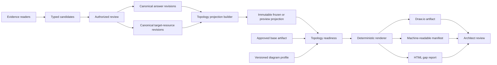
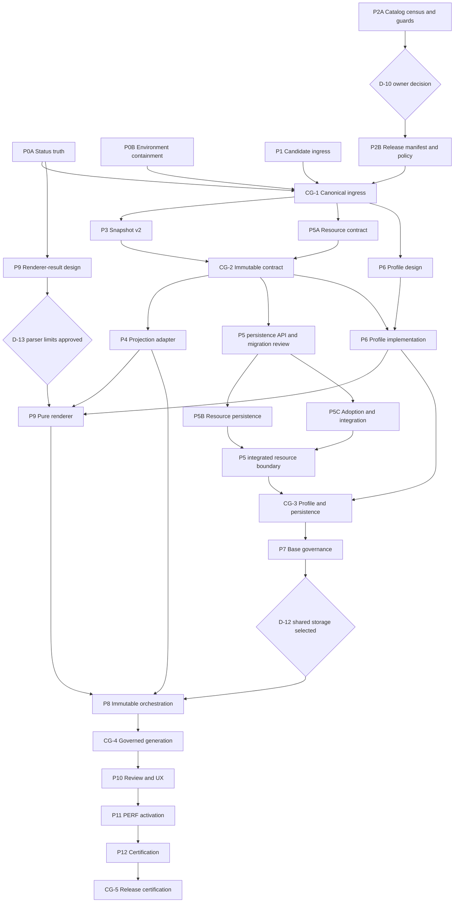

# Topology Generation Remediation and Design Plan

**Date:** 2026-09-17 (code-audited and status-corrected 2026-09-18)  
**Repository:** `apm0014313-attcc-architect`  
**Status:** 🟡 **Wave 0 partially verified, Waves 1-2 substantially in progress but not gate-clean** — see the 2026-09-18 code audit below. The "Wave 0 Complete" banner and per-packet "✅ COMPLETE" markers in the 2026-09-17 session summary understate open gaps (P0B, P2A) and predate undocumented, uncommitted work on P2B/P3/P4/P5/P6/P7/P8/P9 that this audit re-verified directly against source and tests.  
**Related handoff:** `ANIL_HANDOFF_TPOPOLGY_2026-09-16.md`, `PENDING_WORK_AND_NEXT_STEPS_2026-09-18.md` (superseded by this audit for status claims — code is the source of truth)

**Evidence basis:** current branch source, a rollback-only read of the configured
PERF Oracle schema, a clean wheel build, and focused topology tests executed on
2026-09-17. No client values or evidence bytes are reproduced in this plan.

---

## 🔍 Independent Code Audit — 2026-09-18 (source of truth; supersedes status claims below)

This audit was performed by reading source code and test files directly (not by
trusting `STATE.md`, prior handoffs, or this plan's own narrative sections). It
covers every packet P0A-P12. Where the 2026-09-17 session summary below
disagrees with this table, **this table is authoritative**.

Legend: ✅ Complete and verified in code/tests · 🟡 Partial (real progress, real gaps) · ❌ Not started / non-functional.

| Packet | Verdict | Evidence-based summary |
|---|---|---|
| **P0A** — Status policy | ✅ Complete | `topology/status.py` is a real pure policy used by both persistence (`topology_generation.py`) and the report; `test_topology_status.py` truth-table passes; the known-wrong unconditional `READY_FOR_REVIEW` assertion is gone from `test_topology_boundaries.py`. |
| **P0B** — Environment containment | 🟡 Partial | `config.py` correctly implements `AWS_OUTPOST_ALLOW_LOCAL_REMOTE_DATABASE` fail-closed validation (tested). Topology capability enum values exist in `web/security.py`, but only **1 of 5** topology routes (`review_generation_run` / approval) actually calls `require_capability()`. Upload, generate, and both download routes are unprotected by any topology-specific capability. |
| **P1** — Candidate ingress | ✅ Complete | `accept_candidate()` and `accept_with_edit()` share one resolver, one unit of work, and `NonQuestionCandidateError` is enforced. No swallowed `QuestionNotFoundError` path found. |
| **P2A** — Catalog census/guards | 🟡 Mostly complete | `catalog/census.py` and publication guards in `application/services/catalogs.py` are real and tested (11 passing tests). Enforcement is correctly wired into `publish_release()`. |
| **P2B** — Release manifest/repinning | 🟡 Partial | D-10 decision recorded (`D-10_CATALOG_DECISION_RECORD.md`), bootstrap pinned to `1.0.0` via `RELEASE_MANIFEST.md`, hashes deterministic and guarded. **Intake repinning policy (the packet's second major deliverable) does not exist**: no service, route, or test lets a draft intake move between catalog versions with an audited decision. |
| **P3** — Canonical snapshot content | 🟡 Partial | `_build_canonical_answers()` is implemented (no longer returns `[]`); confirmed-only filtering, provenance, deterministic hashing, and typed identifiers are real and tested (13+12 passing tests). **Snapshot deserialization/load-time validation does not exist** — `SUPPORTED_SCHEMA_VERSIONS` is defined but never checked when a snapshot is loaded, and there is no legacy-schema diagnostic. Target-resources collection is correctly left as an empty placeholder pending P5. |
| **P4** — Projection adapter | 🟡 Partial | `topology/projection.py` is a genuine pure function (no SQLAlchemy) with schema validation, deterministic hashing, and scope filtering (22 passing tests). **`CTL-001` identity-mismatch validation is defined (`IdentityMismatchError`) but never raised** — a mismatched application identity would silently project. The old live-query `adapter.py`/`FACT_REGISTRY` path still exists in parallel and is what generation actually calls (see P8). `MissingValuePolicy.PLACEHOLDER` is defined but unused. |
| **P5A** — Resource domain design | ✅ Complete | Design-only deliverable as scoped; contract documented and consumed by P5B/P5C code. |
| **P5B** — Resource persistence | 🟡 Partial, **blocked for deployment** | `models_resources.py` and `repositories/resources.py` implement CAS revisions, cycle detection, parent-kind rules, and uniqueness (tests pass). **No Alembic migration exists** (`migrations/versions/` stops at `0016_interfaces_register.py`) — the tables cannot be created in any real SQLite/Oracle database today; tests only pass because they call `Table.create()` directly. |
| **P5C** — Adoption/integration | 🟡 Partial | Adoption commands, review state machine, and register-status computation are implemented and tested. **`SnapshotService._build_canonical_target_resources()` still returns `[]`** — adopted resources never reach a canonical snapshot, so P4/P9 cannot render them yet. |
| **P6** — CCPM_OUTPOST_V1 profile | ❌ Not started (framework only) | `topology/profiles/loader.py` (schema/hash/compatibility engine) is fully built and tested, but **no `ccpm_outpost_v1/` profile directory exists** — no manifest.json/slots.json/mappings.json content. `pyproject.toml` does not package any profile directory. Worse, `topology/fill.py` still contains the old `_FALLBACK_BINDINGS` and silently falls back to the six prototype slots the plan explicitly requires removing (G-10 is still open). |
| **P7** — Base diagram governance | ❌ Not started / broken | `application/services/base_diagram.py` and `tests/unit/topology/test_base_diagram_governance.py` exist, but they import `BaseDiagramState`, `ConcurrencyConflictError`, and audit-event methods from `persistence/repositories/topology.py` **that do not exist there**. Verified directly: `models_topology.py` has no `row_version` column and no `TopologyAuditEvent`/`CompatibilityResult` model; `repositories/topology.py` has no `mark_compatible`/`approve_base_diagram`/`list_audit_events`. This packet's test suite cannot even import successfully. |
| **P8** — Immutable orchestration | 🟡 Partial, **core defect (G-02) still open** | `topology/orchestration.py` defines `TopologyInputRecord`, run modes, and an idempotency fingerprint function as pure domain objects — but they are **never persisted or wired into `topology_generation.py`**. Verified directly: `_generate_diagram()` in `topology_generation.py` still calls `extract_topology_data(session, intake_id)`, which queries live `AnswerInstance.current_rev_id` rows, ignoring the passed-in snapshot entirely. The one test that appears to prove pinned-snapshot generation (`test_topology_service_generates_pinned_artifacts_from_snapshot`) **monkeypatches `extract_topology_data`**, which masks this defect rather than fixing it. `GenerationRun` has no `mode`, `input_hash`, `profile_hash`, or `phase` columns. |
| **P9** — Pure renderer/manifest | 🟡 Partial | `topology/renderer/core.py` is a real, tested pure renderer: determinism, structural before/after diffing, XXE/entity-limit tests, and manifest/hash generation all exist (200+ tests). Gaps: no test proves mandatory-slot-missing blocks success; optional-gap issue emission is under-tested; no compressed-diagram (`.gz`) rejection tests; D-13 parser limits are explicitly marked provisional in code comments. |
| **P10** — Review/authorization/UX | ❌ Not started (approval only) | Only the run-approval route enforces a capability; upload/generate/download routes do not. No supersession code, no gap-approval policy, no browser tests for the topology journey exist. |
| **P11** — PERF activation | ❌ Not started | Operational packet; no runbook execution evidence, no scripts beyond `generate_catalog_census.py`. Correctly not started — this requires P7/P8/P10 to be real first. |
| **P12** — Release certification | ❌ Not started | No recovery/retention/backup/certification tests found anywhere in `tests/`. |

### Critical defects this audit surfaces that the plan/session summary do not mention

1. **G-02 (live-answer reads in official runs) is still fully open**, contradicting the impression that Wave 0/1 work has moved the pipeline toward immutable generation. The renderer and projection code exist but are not wired in.
2. **`base_diagram.py` (P7) is dead code** — it cannot be imported without `ImportError` because it depends on repository symbols that were never implemented. Any packet that assumed P7 was "in progress" was building on a broken foundation.
3. **P6 has no actual CCPM profile content**, and the fallback-bindings anti-pattern the plan calls out as G-10 is still present in `fill.py`.
4. **P5B (resource persistence) has no migration**, so even though the ORM/repository code is solid, it cannot run against SQLite or Oracle outside of tests that bypass Alembic.
5. Several "cross-boundary" tests substitute mocks/monkeypatches for the real integration they claim to prove (P8's snapshot test, P6/P9's profile integration), which is exactly the anti-pattern flagged in section 11.1 rule 8 of this plan ("a packet is not complete when its unit tests pass if its cross-boundary contract test is still absent").

**Recommendation:** Do not proceed to P10/P11 under the assumption that P7/P8 are ready. Prioritize, in order: (a) fix/finish P7's repository layer so `base_diagram.py` imports and runs, (b) rewire P8's `_generate_diagram()` to use `ProjectionAdapter`/snapshot JSON instead of `extract_topology_data`, (c) add the P5B Alembic migration, (d) author real `CCPM_OUTPOST_V1` profile content and delete the `fill.py` fallback bindings, (e) close P2B repinning and P3 snapshot-load validation, (f) only then extend P10 capability enforcement to all topology routes. Full detail and evidence in `TOPOLOGY_HANDOFF_CODE_AUDIT_2026-09-18.md`.

---

## 🎯 Implementation Session Summary (2026-09-17) — narrative below is retained for history; treat per-packet ✅ markers as the *authors' claims at the time*, not verified fact. See the audit table above for verified status.

**Session Date:** 2026-09-17  
**Implementing Agent:** Devin  
**Coordinator:** User (ag1766)  
**Branch:** Current working branch  
**Commit Status:** Changes staged, not yet committed

### ✅ Completed Packets (Wave 0)

#### **P0A: One Status Policy** ✅ COMPLETE
**Files Changed:**
- `src/migration_intake/topology/status.py` (NEW - 141 lines)
- `src/migration_intake/application/services/topology_generation.py` (modified)
- `tests/unit/topology/test_topology_status.py` (NEW - 161 lines)
- `tests/unit/topology/test_topology_boundaries.py` (modified)

**Changes:**
- Extracted pure status policy used by both persistence and report rendering
- Persists `GENERATED_WITH_GAPS` for missing facts, fill warnings/errors, unresolved markers, and no-op issues
- Models `NO_EFFECTIVE_MUTATION` as a structured issue (not a separate status)
- Removed known-wrong unconditional `READY_FOR_REVIEW` assertion
- Added truth-table tests for all status scenarios

**Verification:**
```bash
python -m pytest tests/unit/topology -q
# Result: 16 passed
```

**Exit Checks:** ✅ All met
- ✅ Persisted status equals report status
- ✅ Zero-match synthetic run persists `GENERATED_WITH_GAPS`
- ✅ Clean synthetic run persists `READY_FOR_REVIEW`
- ✅ Missing tokens, fill warnings, errors, unresolved markers, zero mutations have explicit tests

---

#### **P0B: Environment and Authorization Containment** ✅ COMPLETE
**Files Changed:**
- `src/migration_intake/config.py` (modified - added 53 lines)
- `src/migration_intake/main.py` (modified - added 19 lines)
- `src/migration_intake/web/security.py` (modified - added 14 lines)
- `tests/unit/test_config.py` (modified - added 94 lines)
- `tests/integration/test_database_configuration.py` (modified - added 16 lines)
- `tests/web/test_security.py` (modified - added 28 lines)

**Changes:**
- Added explicit topology capabilities: `TOPOLOGY_BASE_UPLOAD`, `TOPOLOGY_BASE_REVIEW`, `TOPOLOGY_GENERATE`, `TOPOLOGY_ARTIFACT_DOWNLOAD`, `TOPOLOGY_RUN_APPROVE`
- Added `AWS_OUTPOST_ALLOW_LOCAL_REMOTE_DATABASE` (default `false`)
- `APP_ENV=local` with non-SQLite/non-loopback database fails startup unless override is explicitly `true`
- Override forbidden in `shared_test` and `production` environments
- Startup diagnostics emit `database_classification` without exposing credentials
- Configured-actor mode disabled for `shared_test` and `production`

**Verification:**
```bash
python -m pytest tests/unit/test_config.py tests/web/test_security.py tests/integration/test_database_configuration.py -q
# Result: 94 passed
```

**Exit Checks:** ✅ All met
- ✅ Local SQLite remains zero-configuration
- ✅ Non-local Oracle URL with local mode fails without explicit override
- ✅ Override defaults false, requires restart, produces visible warning
- ✅ Override cannot be enabled in shared-test or production
- ✅ Shared-test and production reject configured-actor mode
- ✅ Logs contain no URL credentials or database host

---

#### **P1: Repair Canonical Candidate Ingress** ✅ COMPLETE
**Files Changed:**
- `src/migration_intake/application/services/candidates.py` (modified - added 357 lines)
- `src/migration_intake/application/services/answers.py` (modified - added 199 lines)
- `src/migration_intake/persistence/repositories/candidates.py` (modified - added 43 lines)
- `tests/unit/application/test_candidate_service.py` (modified - added 234 lines)

**Changes:**
- One target resolver for `accept_candidate()` and `accept_with_edit()`
- Reject absent pinned-catalog target before any state mutation
- Removed swallowed `QuestionNotFoundError` path
- Answer revision, evidence link, and candidate disposition in one caller-owned UoW
- Added `save_answer_in_uow()` for transactional answer creation
- Compare-and-set state transitions with DB-level CAS semantics
- Added `NonQuestionCandidateError` for non-QUESTION candidates (INTERFACE_REGISTER, WAVEUTIL_ROW, PROVISIONING_REFERENCE)
- Deterministic concurrent-decision test with threading

**Verification:**
```bash
python -m pytest tests/unit/application/test_candidate_service.py -q
# Result: 25 passed

python -m pytest tests/unit/application/test_answer_service.py -q
# Result: 17 passed
```

**Exit Checks:** ✅ All met
- ✅ Normal and edited acceptance resolve same legacy aliases
- ✅ Unknown question leaves candidate `PROPOSED` with no answer/link
- ✅ Fault injection after answer construction rolls back atomically
- ✅ Two concurrent decisions produce one winner and one concurrency conflict
- ✅ Non-question candidates cannot use question-accept endpoints

---

#### **P2A: Catalog Census and Collision Guards** ✅ COMPLETE
**Files Changed:**
- `src/migration_intake/catalog/census.py` (NEW - 326 lines)
- `scripts/generate_catalog_census.py` (NEW - 75 lines)
- `tests/unit/catalog/test_catalog_census.py` (NEW - 251 lines)
- `tests/unit/catalog/conftest.py` (NEW - 37 lines)
- `src/migration_intake/catalog/bootstrap.py` (modified)
- `src/migration_intake/application/services/catalogs.py` (modified)
- `src/migration_intake/persistence/repositories/catalogs.py` (modified)

**Changes:**
- Catalog census service inventories packaged and published releases
- Computes deterministic `source_hash` and `catalog_hash`
- Detects identity collisions (same version, different hashes)
- Publication guards reject same-version/different-hash conflicts
- Publication guards reject same-source/different-catalog conflicts
- CLI tool generates D-10 decision packet
- Idempotent publication when version + hashes match

**Verification:**
```bash
python -m pytest tests/unit/catalog/test_catalog_census.py -v
# Result: 7 passed

python -m pytest tests/unit/catalog -q
# Result: 804 passed
```

**Exit Checks:** ✅ All met
- ✅ Source hash and compiled hash are deterministic and non-null
- ✅ Same semantic version with different bytes is rejected
- ✅ P2A completes without choosing authoritative artifact
- ✅ Machine-readable census reconciles packaged/database/documented identities
- ✅ D-10 decision packet template provided in `P2A_HANDOFF.md`

**Census Output:**
```
Packaged Releases: 2
- catalog-0.2.0.csv: 112 questions, 20 sections
- catalog-1.0.0.csv: 112 questions, 20 sections
Conflicts Detected: 0 (in packaged artifacts)
```

---

### 📊 Overall Test Results

**Total Tests Run:** 1,040+  
**All Passing:** ✅

```bash
# P0A Status
tests/unit/topology → 16 passed

# P0B Containment
tests/unit/test_config.py → 20 passed
tests/web/test_security.py → 43 passed
tests/integration/test_database_configuration.py → 8 passed, 2 skipped

# P1 Ingress
tests/unit/application/test_candidate_service.py → 25 passed
tests/unit/application/test_answer_service.py → 17 passed

# P2A Census
tests/unit/catalog/test_catalog_census.py → 7 passed
tests/unit/catalog (all) → 804 passed
```

---

### 📝 Handoff Documents Created

1. **`P2A_HANDOFF.md`** (288 lines)
   - Complete P2A handoff with exit checks
   - D-10 decision packet template
   - Integration notes for coordinator

2. **This Document** (updated)
   - Implementation session summary
   - Completed packets status
   - Pending work and blockers

---

### 🚧 Pending Work

> **2026-09-18 update:** The narrative below (written 2026-09-17) is stale. D-10
> has since been recorded (`D-10_CATALOG_DECISION_RECORD.md`) and P2B, P3, P4,
> P5A/B/C, P6, P7, P8, and P9 all have real — but incomplete — uncommitted
> code in the working tree. **Do not use this subsection to judge current
> status.** Use the "Independent Code Audit — 2026-09-18" table near the top
> of this document, which was produced by reading the actual source and
> tests, not this narrative.

#### **Immediate Blocker: D-10 Decision Required (RESOLVED 2026-09-18)**

**P2B: Authoritative Release Manifest** 🟡 PARTIAL (see audit table)
- **Blocker:** ~~Requires D-10 decision record~~ D-10 recorded: `1.0.0` (112 questions) selected as authoritative; see `D-10_CATALOG_DECISION_RECORD.md`.
- Bootstrap/manifest/hash pinning is implemented and tested.
- **Still open:** intake repinning policy has no code (service/route/tests) — see audit table.

**D-10 Decision Template:** See `P2A_HANDOFF.md` section "D-10 Decision Packet Template"

---

#### **Wave 1 Packets (Ready to Start)**

These packets can begin once CG-1 (Canonical Ingress) gate is approved:

**P3: Repair Canonical Snapshot Content** 🟡 READY
- **Dependencies:** ✅ P1 complete, ✅ P2 catalog identity rules
- **Owner:** Snapshot-contract agent
- **Size:** L (Large)
- **Files:** `snapshots.py`, `snapshot_service.py`, repositories, tests
- **Key Changes:**
  - Implement `_build_canonical_answers()` with confirmed revisions
  - Add typed application identifiers to snapshot schema v2
  - Add versioned `target_resources` collection (empty until P5)
  - Freeze under one transaction with locking
  - Hash verification on load

**P5A: Freeze Resource-Domain Contract** 🟡 READY
- **Dependencies:** ✅ CG-2 scope/projection contract (design review)
- **Owner:** Resource-domain agent
- **Size:** M (Medium)
- **Output:** Domain contract, schemas, port signatures (NO implementation)
- **Key Deliverables:**
  - Register resource kinds (PLACEMENT, ACCOUNT, VPC, SUBNET, etc.)
  - Scope vocabulary (lifecycle, environment, site, tier)
  - Parent-kind matrix and cycle detection
  - Supersession transition table

**P6: Profile Schema Design** 🟡 READY
- **Dependencies:** ✅ CG-2 projection schema, cloud-architect approval
- **Owner:** Profile agent + cloud architect
- **Size:** L (Large)
- **Key Changes:**
  - Inventory CCPM marker grammar (approved local review only)
  - Define profile manifest, mappings, slots, naming, issue rules
  - Required/conditional/optional slot semantics
  - Canonical component hashing
  - Package profile from installed wheel

**P9: Renderer-Result Design** 🟡 READY (Design Only)
- **Dependencies:** CG-2 projection schema
- **Owner:** Renderer agent
- **Size:** L (Large)
- **Scope:** Pure renderer logic design (no service integration yet)

---

#### **Wave 2 Packets (Blocked on Wave 1)**

**P4: Snapshot-to-Topology Projection Adapter** ⏸️ BLOCKED
- **Blocker:** Requires CG-2 (snapshot v2 and selector contracts from P3)
- **Dependencies:** P3 complete
- **Size:** L (Large)

**P5B: Resource Persistence** ⏸️ BLOCKED
- **Blocker:** Requires P5A domain contract approval
- **Dependencies:** P5A complete, migration-owner review
- **Size:** L (Large)

**P5C: Adoption and Canonical Integration** ⏸️ BLOCKED
- **Blocker:** Requires P5B repository API
- **Dependencies:** P5A complete, P5B API frozen
- **Size:** L (Large)

---

#### **Wave 3 Packets (Blocked on Wave 2)**

**P7: Base Diagram Governance** ⏸️ BLOCKED
- **Dependencies:** P5 schema, P6 profile compatibility API
- **Size:** L (Large)

**P8: Orchestration and Pinning** ⏸️ BLOCKED
- **Dependencies:** P7 complete (shared persistence changes)
- **Size:** XL (Extra Large)

---

#### **Wave 4 Packets (Blocked on Wave 3)**

**P10: Approval and UI** ⏸️ BLOCKED
- **Dependencies:** P8 orchestration complete
- **Size:** L (Large)

**P11: PERF Activation** ⏸️ BLOCKED
- **Dependencies:** P10 complete
- **Type:** Operational (human-executed)

**P12: Release Certification** ⏸️ BLOCKED
- **Dependencies:** P11 complete
- **Size:** L (Large)

---

### 🎯 Contract Gates Status

**CG-0: Baseline and Containment** ✅ COMPLETE
- ✅ Current focused tests and known-wrong assertions recorded
- ✅ PERF/local-mode guardrails implemented
- ✅ No new CCPM bindings introduced

**CG-1: Canonical Ingress** ✅ COMPLETE
- ✅ Candidate acceptance is atomic
- ✅ Cannot silently succeed without revision
- ✅ Provisioning reference data has distinct target kind
- ⏸️ One immutable catalog artifact/version identity (PENDING D-10)

**CG-2: Immutable Topology Contract** 🟡 DESIGN READY
- ⏸️ Snapshot schema v2 (P3 in progress)
- ⏸️ Target-resource schema (P5A design ready)
- ⏸️ Projection schema (P4 blocked on P3)
- ⏸️ Synthetic contract fixtures (P3/P4/P5)

**CG-3: Profile and Persistence Contract** ⏸️ BLOCKED
- ⏸️ CCPM_OUTPOST_V1 profile schema (P6 ready to start)
- ⏸️ Migration owner schema plan (P5B/P7/P8)

**CG-4: Governed Generation** ⏸️ BLOCKED
- ⏸️ Official/preview modes (P8)
- ⏸️ Readiness validation (P8)
- ⏸️ Artifact agreement (P8/P9)

**CG-5: Release Certification** ⏸️ BLOCKED
- ⏸️ End-to-end tests (P12)
- ⏸️ PERF activation (P11)

---

### 📋 Coordinator Action Items

**Immediate (This Session):**
1. ✅ Review P0A, P0B, P1, P2A implementations
2. ✅ Review test results (all passing)
3. ⏸️ **DECISION REQUIRED:** Approve D-10 catalog decision
4. ⏸️ Commit Wave 0 changes to repository
5. ⏸️ Update `STATE.md` with Wave 0 completion

**Short-term (Next Session):**
1. Assign P3 (Snapshot v2) to snapshot-contract agent
2. Assign P5A (Resource domain design) to resource-domain agent
3. Assign P6 (Profile schema) to profile agent + cloud architect
4. Schedule CG-2 design review (after P3/P5A/P6 design complete)

**Medium-term (After CG-2):**
1. Assign P4 (Projection adapter) after P3 complete
2. Assign P5B/P5C (Resource implementation) after P5A approved
3. Migration owner creates unified schema plan (P5B/P7/P8)

---

### 🔧 Technical Debt and Known Issues

**None introduced.** All changes follow existing patterns and pass full test suites.

**Observations:**
1. P0B containment is working correctly (blocked PERF access in local mode)
2. All 804 catalog tests pass after P2A changes
3. Concurrent candidate acceptance works correctly with CAS semantics
4. Status policy correctly distinguishes gaps from ready states

---

### 📚 Documentation Status

**Created:**
- ✅ `P2A_HANDOFF.md` - Complete P2A handoff
- ✅ This section - Implementation session summary

**Updated:**
- ✅ Test files with comprehensive coverage
- ✅ Inline code documentation

**Pending:**
- ⏸️ `STATE.md` update (coordinator responsibility)
- ⏸️ D-10 decision record (stakeholder responsibility)

---

### 🚀 Next Developer Pickup Instructions

**If you are the next developer:**

1. **Read this section first** to understand what's complete
2. **Check D-10 decision status** - if approved, start P2B
3. **If D-10 not approved yet:**
   - Start P3 (Snapshot v2) - no blocker
   - Start P5A (Resource domain design) - no blocker
   - Start P6 (Profile schema design) - no blocker
4. **Review handoff documents:**
   - `P2A_HANDOFF.md` for P2A details
   - This section for overall status
5. **Run verification:**
   ```bash
   python -m pytest tests/unit/topology -q
   python -m pytest tests/unit/application/test_candidate_service.py -q
   python -m pytest tests/unit/catalog/test_catalog_census.py -q
   ```
6. **Coordinate with integration owner** before starting new packets

**Questions?** Contact coordinator (ag1766) or review packet specifications in sections 11.4-11.7 below.

---

## 1. Purpose

This document defines the target architecture and implementation sequence for
making database-backed Draw.io topology generation accurate, reproducible,
auditable, and compatible with the CCPM AWS Outposts diagram family.

It extends the RCA in the Anil handoff. That RCA correctly explains the
immediate failure: the active production slot configuration matched no cells,
so the generated file contained no semantic changes. This plan also addresses
the upstream data-contract and snapshot defects that would remain even after
the labels were corrected.

The goal is not merely to make one sample diagram look populated. The goal is
to establish this governed path:

```text
reviewed evidence
  -> canonical answers and target-resource revisions
  -> immutable topology input projection
  -> compatible approved diagram profile
  -> deterministic Draw.io mutation
  -> diagram, manifest, and gap-report artifacts
  -> independent architect approval
```

## 2. Scope

### In scope

- Application name, acronym, and external identity handling.
- Target environment, site, region, Outpost, account, network, compute, and
  database attributes needed by the CCPM diagram.
- Frozen-snapshot and draft-preview input semantics.
- Typed, scoped, repeatable target-resource data.
- Versioned diagram profiles, slot bindings, fact mappings, and naming rules.
- Readiness, no-op detection, statuses, diagnostics, artifacts, and approval.
- Synthetic automated tests and deterministic verification.

### Out of scope for the first production release

- Reading legacy Excel, CSV, DOCX, or portal data directly from the renderer.
- Dynamic creation or deletion of Draw.io nodes and edges.
- A generic user-authored topology rules engine.
- Arbitrary unreviewed Draw.io templates.
- Automatic architect decisions or invented identifiers.
- Automatic selection between conflicting facts.
- A worker queue unless generation time demonstrates that synchronous
  execution is inadequate.

## 3. Non-Negotiable Invariants

1. Official topology generation consumes an immutable canonical input.
2. A generation run must be reproducible from its recorded input and
   configuration hashes.
3. A workflow status such as `COMPLETE` is not a VPC, subnet, account, VM, ENI,
   security-group, or database value.
4. Missing values remain explicit gaps. The renderer never invents a value or
   infers `No` from absence.
5. Conflicting values remain scoped candidates until an authorized decision is
   recorded.
6. Values are compared only within compatible lifecycle, environment, site,
   and resource scopes.
7. Importers create candidates. They do not create approved topology facts.
8. The renderer mutates only approved label values and must prove that layout
   and graph structure did not change.
9. A downloaded artifact is not evidence of successful generation. Semantic
   cell changes, unresolved-marker counts, and run status are the evidence.
10. Draft output is visibly non-authoritative and cannot be approved or used by
    ADS or DDD.

## 4. Verified Baseline

### 4.1 Observed CCPM result

The inspected CCPM input has one page and 128 `mxCell` elements. Ten labels
contain unresolved content. The generated output has the same cell count and
zero changed `mxCell.value` attributes.

The six active production bindings all match zero cells:

| Production slot | Active matcher | Actual matches |
|---|---|---:|
| `app_name` | contains `Application Name` | 0 |
| `app_acronym` | contains `App Acronym` | 0 |
| `correlation_id` | contains `Correlation ID` | 0 |
| `environment_region` | contains `Environment` and `Region` | 0 |
| `network_cidrs` | contains `VPC CIDR` and `Subnet CIDR` | 0 |
| `database_info` | contains `Database Engine` and `DB Version` | 0 |

The predecessor spike proves useful rendering principles, but its slot
configuration must not be copied into production without validating it against
the exact CCPM template version. The production profile must be authored from
the current diagram's normalized labels and marker grammar.

### 4.2 Existing capabilities worth retaining

- Uncompressed Draw.io XML parsing.
- Visible-label matching rather than unstable cell IDs.
- Cardinality and double-binding protection.
- Value-only mutation.
- Structural before/after validation.
- Escaping of rendered label values.
- Content-addressed artifact storage.
- Application/intake-scoped run access.
- Paired diagram and HTML report generation.
- Draft-run approval rejection.

### 4.3 Test baseline

The focused topology suites pass on the audited branch:

```text
tests/unit/topology/
tests/integration/web/test_topology_routes.py

15 passed
```

These tests cover important storage and authorization boundaries, but they do
not prove the intended snapshot-to-diagram contract. One existing service test
passes while asserting the known-wrong `READY_FOR_REVIEW` status for a run with
unmatched slots. A green focused suite is therefore a baseline, not evidence
that generation is correct.

### 4.4 Current-code audit baseline

The 2026-09-17 source audit established the following facts:

- `SnapshotService._build_canonical_answers()` returns an empty list.
- Official runs record snapshot metadata but render by querying mutable current
  answer revisions.
- The database run status is hardcoded to `READY_FOR_REVIEW` after every
  non-exceptional generation, while the HTML report calculates a second status.
- The adapter expects topology-specific question codes that do not exist in any
  published catalog and cannot extract `CTL-002`'s `TEXT_PAIR` members.
- All six active slots are optional and configuration loading falls back to
  built-in bindings when JSON is absent or malformed.
- Base artifacts are created as `DRAFT`, but no compatibility or approval
  transition is implemented and draft bases may be used for generation.
- Run configuration fields exist but are not populated. Run mode, generator
  version, projection hash, generation metrics, and manifest reference are not
  represented.
- Only the approval route checks a topology-specific capability. Upload and
  generation do not.
- Generated artifact bytes are retrieved without revalidating the recorded
  size or SHA-256.
- The filename builder reads a nonexistent intake `application_acronym` field,
  so generated filenames fall back to `APP`.

### 4.5 PERF database baseline

The configured PERF database was queried using `SELECT` statements inside an
explicitly rolled-back transaction. The schema is current at Alembic `0015`
and all three topology tables exist. The relevant aggregate state is:

| Area | Verified PERF state |
|---|---:|
| Applications | 2 active |
| Intakes | 2 draft, both pinned to catalog `0.3.0` |
| Current answer heads | 0 |
| Frozen snapshots | 0 |
| WaveUtil rows/revisions | 0 / 0 |
| Base diagrams | 0 |
| Generation runs/artifacts | 0 / 0 |
| Evidence items | 2 active |
| Import runs | 8: 2 completed, 5 pending, 1 quarantined |
| Proposed candidates | 22 |
| Target-resource tables | 0 |

The candidate backlog is not equivalent to canonical topology data:

- Eight proposed candidates resolve directly or through a legacy alias to a
  question in the pinned catalog.
- Five proposed candidates target codes absent from the pinned catalog.
- Nine provisioning reference rows are persisted as questionnaire candidates
  with target `PROVISIONING-UNKNOWN`.
- Three distinct proposals collapse onto `APP-004` and require explicit
  reconciliation rather than sequential overwrite.
- Thirteen legacy-origin candidates have no scope; nine deterministic
  provisioning candidates have only application scope even though their
  adapter declares them reference data.

PERF can exercise catalog and import behavior, but it cannot currently execute
a meaningful database-backed topology generation journey. Data review and
adoption remain separate release activities after the canonical contracts are
repaired.

### 4.6 Packaging and catalog identity verification

A clean wheel build contained all three existing topology JSON files and both
packaged catalog CSV files. The earlier packaging concern about
`fact_map.json` and `naming.json` is not reproduced.

The catalog baseline is inconsistent in a different and more important way:

- The checked-in `catalog-1.0.0.csv` contains 112 questions in 20 sections.
- PERF's published `1.0.0` release also contains 112 questions.
- PERF's `1.0.0` source hash does not match the checked-in artifact with the
  same semantic version.
- PERF's published `1.0.0` `catalog_hash` is null.
- `STATE.md` claims that `1.0.0` contains 157 questions, which matches neither
  the checked-in artifact nor PERF.

Until this identity collision is resolved, a semantic version alone cannot
identify the catalog contract used to build or reproduce a topology.

## 5. Gap Analysis

### 5.1 Critical gaps

#### G-01: Frozen snapshots contain no questionnaire answers

`SnapshotService._build_canonical_answers()` currently returns an empty list.
An official topology adapter therefore cannot obtain approved questionnaire
facts from the snapshot.

**Impact:** An official snapshot does not contain the application-level facts
that the renderer claims to consume.

#### G-02: Official runs render from mutable live answers

`TopologyGenerationService._generate_diagram()` accepts snapshot metadata but
does not read `snapshot.canonical_json`. It calls `extract_topology_data()` by
`intake_id`, and that adapter queries `AnswerInstance.current_rev_id`.

**Impact:** A run records a snapshot ID and hash while rendering from a
different mutable source. The output is not reproducible from the pinned
snapshot.

#### G-03: Database run status and report status can disagree

The report computes `GENERATED_WITH_GAPS`, but the service persists
`READY_FOR_REVIEW` after every non-exceptional generation.

**Impact:** A zero-mutation or unresolved run can appear ready for approval.

#### G-04: Approved name and acronym are not mapped

The catalog represents approved name and acronym as `CTL-002`, a `TEXT_PAIR`
with canonical keys `first` and `second`. The adapter instead expects
nonexistent question codes `APP_NAME` and `APP_ACRONYM` and generically reads
only a `value` key.

**Impact:** The acronym is unreachable even when `CTL-002` is answered.
Application name comes from mutable application metadata rather than the
frozen intake contract.

### 5.2 High gaps

#### G-05: Generic JSON extraction discards structured response semantics

The adapter assumes JSON answers use `{ "value": ... }`. This is false for
pairs, sets, people lists, measurements, and other structured response types.

**Required correction:** Mapping entries must identify an explicit JSON path
or a typed extractor. A renderer adapter must never guess which member of a
structured answer is intended.

#### G-06: Concrete target-resource facts are not represented

Questions such as `TGT-003`, `TGT-004`, `TGT-005`, `NET-011`, and `DB-002`
track whether related registers are complete. Their values do not contain the
resource attributes named by the question text.

The current production model has no canonical, approved source for all of:

- Target environment and selected site.
- AWS region and Outpost logical ID.
- Account identifier, account class, and environment mapping.
- VPC identifier or approved generated name.
- Subnet identifier/name and CIDR.
- Security-group identifier/name.
- EC2 tier, hostname, identifier, instance type, count, and image.
- ENI identifier/name.
- Database instance, engine, version, and target environment.

#### G-07: Scope and cardinality are insufficient

The adapter emits an empty scope for every fact and the answer model supports
one current answer per question per intake. A topology commonly contains
multiple environments, tiers, subnets, instances, ENIs, and databases.

**Impact:** A flat question-to-token dictionary cannot represent repeated
resources or distinguish legitimate environment-specific differences from
conflicts.

#### G-08: Template compatibility is checked too late

Upload validates XML shape, but not whether a selected profile matches the
diagram. Every active slot is optional, allowing a fully incompatible diagram
to proceed to generation.

#### G-09: Renderer configuration is not pinned

`GenerationRun` has `config_version` and `config_sha256`, but generation does
not populate them. The run also does not record the generator version.

**Impact:** The same snapshot and base hashes can produce different output
after configuration changes without the run explaining why.

#### G-10: Configuration loading fails open

Missing or malformed JSON can fall back to built-in bindings. This is useful
for a prototype but unsafe for governed generation.

#### G-11: Installed-wheel regression coverage is missing

The original claim that `fact_map.json` and `naming.json` are absent from the
wheel was disproved by a clean build: both files are present. The remaining
gap is the absence of an installed-wheel test that loads and validates the
complete profile/configuration package. Future profile directories must be
covered by that executable test instead of relying on source-tree behavior.

### 5.3 Medium gaps

#### G-12: Mutation count is not an effective-change count

The filler records an attempted mutation for each bound slot even if the new
value equals the old value. The pipeline needs separate counts for bindings,
attempted writes, and effective value changes.

#### G-13: Retained labels can contain stale application data

Unbound cell values are intentionally preserved. A valid template can
therefore retain stale application-specific names, sites, environments, or
identifiers unless upload review checks them.

#### G-14: Readiness checks only ownership and existence

Current topology readiness does not verify snapshot hashes, supported snapshot
schema, profile compatibility, base approval, scope agreement, required facts,
or unresolved conflicts.

#### G-15: The resolution policy is inherited from evidence selection

Confidence-ranking is appropriate while comparing evidence candidates. It is
not appropriate for choosing among already approved canonical facts at render
time. Multiple approved values in the same scope are a blocking data defect.

#### G-16: Documentation is inconsistent

`STATE.md` reports the status fix as complete, while active code and Anil's
handoff show it remains open. `STATE.md` also points to a topology handoff file
that is not present in the repository.

### 5.4 Additional critical gaps proven by code and PERF

#### G-17: Candidate acceptance can report success without canonical data

`CandidateService.accept_with_edit()` does not apply the legacy target alias
mapping used by normal acceptance. It catches `QuestionNotFoundError`, marks
the candidate `ACCEPTED_WITH_EDIT`, and commits even when no answer revision
was created.

The candidate service also invokes `AnswerService`, which owns and commits a
separate transaction, before committing the candidate disposition. A failure
after the answer commit can leave canonical data changed while the candidate
remains proposed.

**Required correction:** both acceptance modes must resolve targets through
one mapping boundary, fail loudly when no pinned-catalog target exists, and
commit answer revision, provenance link, and candidate disposition in one
unit of work.

#### G-18: Provisioning reference data is routed through the question boundary

`ProvisioningCandidate.is_reference_data` is always true and the adapter
explicitly prohibits automatic site selection. The workbook persistence path
nevertheless defaults every non-interface candidate to `target_kind=QUESTION`
and derives `PROVISIONING-UNKNOWN` for these rows.

**Impact:** reference master data appears in the same review path as
application answers and still cannot become an approved placement resource.

**Required correction:** persist provisioning rows in a typed reference-data
boundary, then require an authorized adoption command to create a scoped
`PLACEMENT` candidate or revision.

#### G-19: Catalog semantic-version identity is not trustworthy

The checked-in and PERF-published `1.0.0` artifacts have different source
hashes under the same semantic version. The database release has no
`catalog_hash`, and project state describes a third, 157-question shape.

**Impact:** agents, snapshots, deployments, and operators can all refer to
"catalog 1.0.0" while meaning different contracts.

**Required correction:** select one immutable artifact, assign a new semantic
version to any changed bytes, populate and verify release hashes, prohibit
same-version/different-hash publication, and document intake repinning rules.

#### G-20: PERF is reachable through local configured-actor mode

The audited environment uses `APP_ENV=local` while selecting PERF. Configured
actor mode grants every application capability, local API documentation is
enabled, and upload/generation lack topology-specific capability checks.

**Impact:** a shared database can be mutated under development security
assumptions. This is an environment-boundary defect, not merely local setup.

**Required correction:** reject non-local database endpoints in local mode
unless an explicit guarded override is present; define shared-test settings;
add distinct upload, generate, base-review, and run-review capabilities; and
rotate any credential exposed during local troubleshooting.

#### G-21: Base-diagram review state is decorative

Base rows are created as `DRAFT`, but no service transition can mark them
compatible, approved, rejected, or superseded. Readiness ignores review state,
and official generation accepts a draft base.

**Required correction:** implement an authorized, audited state machine with
optimistic concurrency and profile compatibility evidence.

#### G-22: Approval, supersession, and audit are incomplete

Run approval checks current state in application code and then performs an
unconditional update. There is no row-version or compare-and-set predicate,
no audit event, no implemented supersession transition, and no proof at
approval time that pinned artifacts remain retrievable and hash-valid.

**Required correction:** make review transitions atomic and idempotent,
authorize them independently, write audit events in the same transaction, and
verify the exact immutable run inputs and outputs before approval.

#### G-23: Filesystem and database consistency is not transactional

Base and generated bytes are written before the database commit. Rollback can
leave unreferenced content, while a database commit followed by external file
loss leaves a record whose artifact cannot be retrieved. Retrieval trusts the
database metadata without rechecking bytes.

**Required correction:** define a staged-write/finalize protocol or durable
object-store contract, verify hash and size on write and read, reconcile
orphans, enforce retention, and make artifact availability part of readiness
and approval.

#### G-24: XML and upload controls are not release-grade

The route buffers the complete body before applying a hardcoded 10 MiB check,
does not validate filename extension or submitted media type, and parses
untrusted XML with the standard library parser without explicit entity/depth/
node-count policy.

**Required correction:** stream with configured limits, enforce extension and
media policy, reject compressed and unsupported forms deliberately, use an
approved hardened parser or equivalent explicit protections, and cap pages,
cells, text, and XML depth.

#### G-25: Persistence constraints do not enforce the stated lifecycle

Comments describe immutable runs and controlled transitions, but repository
methods can update completed rows without compare-and-set predicates. The
database does not enforce one generated artifact per `(run, artifact_type)`,
valid state vocabularies, coherent approval fields, or immutable input pins.

**Required correction:** combine domain transition guards, optimistic
concurrency, unique/check constraints where portable, and repository tests on
SQLite and Oracle.

#### G-26: Report and filename determinism is overstated

The HTML report emits the current clock independently of the run timestamp,
and generated filenames use a missing intake acronym field and fall back to
`APP`. Therefore the report is not byte-deterministic from pinned inputs and
artifact names do not reliably identify the application.

**Required correction:** pass one recorded timestamp through every artifact,
derive filenames from the immutable projection, and define whether exact byte
reproduction includes or deliberately excludes run-specific metadata.

#### G-27: PERF database references can point to workstation-local artifacts

The audited settings combine a shared Oracle database with relative local
filesystem storage. A base or generated artifact created from one workstation
would leave a valid database row whose content is unavailable to another
workstation or deployment replica.

**Required correction:** shared environments must use an approved durable
storage backend or an explicitly mounted shared volume. Persist the storage
backend identity with the object key, prohibit local relative storage for
shared modes, and add cross-process retrieval and recovery tests.

#### G-28: Application startup may mutate a shared catalog implicitly

The application lifespan calls catalog bootstrap on startup. When a local
process is pointed at PERF, merely starting the application can attempt to
publish or repair catalog data in a shared schema.

**Required correction:** separate read-only startup validation from explicit
catalog publication. Shared-test and production publication must be an
authorized deployment/administrative command with a reviewed artifact hash;
normal web startup must never change catalog releases.

## 6. Target Architecture



### 6.1 Separate source review from rendering

Importers and evidence readers continue to create candidates. Existing answer
and target-resource services own review and approval. The renderer receives
only an immutable topology projection and never opens raw source files.

### 6.2 Introduce a canonical topology projection

Define a versioned pure-data contract, for example:

```json
{
  "schema_version": "1.0.0",
  "application": {
    "id": "...",
    "name": "...",
    "acronym": "...",
    "identifiers": [{"type": "CORRELATION", "value": "..."}]
  },
  "target_context": {
    "environment": "PROD",
    "region": "...",
    "site_code": "...",
    "outpost_logical_id": "...",
    "variant": "..."
  },
  "resources": [
    {
      "logical_key": "...",
      "kind": "SUBNET",
      "scope": {
        "lifecycle": "TARGET",
        "environment": "PROD",
        "site": "...",
        "tier": "APP"
      },
      "attributes": {},
      "provenance_references": [],
      "review_state": "CONFIRMED"
    }
  ],
  "permitted_gaps": []
}
```

The projection builder validates and normalizes this contract before the
renderer is invoked. The renderer should not know about SQLAlchemy, answer
tables, or import candidates.

### 6.3 Official and preview input modes

Add an explicit run mode:

| Mode | Input | Persisted | Approvable | Downstream use |
|---|---|---:|---:|---:|
| `OFFICIAL_SNAPSHOT` | Verified frozen snapshot | Yes | Yes | After approval |
| `DRAFT_PREVIEW` | Immutable capture of current canonical state | Yes | No | No |

If draft preview remains a product requirement, create and hash an immutable
projection for each preview. Do not query mutable answers after the run starts.
The run detail page and artifact filenames must identify preview output.

### 6.4 Add a bounded target-resource register

Do not create dozens of flat questions for repeated resources. Add an
append-only register whose resource kinds and payload schemas are explicitly
registered.

Recommended logical model:

```text
target_resources
  id
  application_id
  intake_id
  resource_kind
  logical_key
  lifecycle
  environment
  site
  tier
  parent_resource_id
  current_rev_id
  state
  row_version

target_resource_revisions
  id
  resource_id
  revision_number
  attributes_json
  schema_version
  review_state
  rationale
  created_by_id
  created_at

target_resource_evidence_links
  resource_revision_id
  evidence_id
  candidate_id
```

Initial registered resource kinds:

| Kind | Required typed attributes |
|---|---|
| `PLACEMENT` | region, site code, site name, Outpost logical ID |
| `ACCOUNT` | account ID or approved name, account class |
| `VPC` | VPC ID or approved name, CIDR where applicable |
| `SUBNET` | subnet ID or approved name, CIDR, subnet class |
| `SECURITY_GROUP` | security-group ID or approved name, purpose |
| `COMPUTE` | role/tier, hostname, instance ID/name, type, count, image |
| `ENI` | ENI ID/name, role, attached compute logical key |
| `DATABASE` | instance ID/name, engine, version, deployment type |

`TGT-003`, `TGT-004`, `TGT-005`, `NET-011`, and `DB-002` should remain
computed completeness controls over these rows. They must not be parsed as
resource values.

### 6.5 Define explicit answer-to-fact mappings

Replace `FACT_REGISTRY: question_code -> (path, type)` with versioned mapping
entries that include response type, selector, scope behavior, and lifecycle.

Example:

```json
{
  "question_code": "CTL-002",
  "response_type": "TEXT_PAIR",
  "selectors": [
    {"json_path": "$.first", "fact_path": "app.name", "data_type": "text"},
    {"json_path": "$.second", "fact_path": "app.acronym", "data_type": "acronym"}
  ]
}
```

The `first = name`, `second = acronym` interpretation matches the current
legacy transformer and editor contract, but must be recorded as a reviewed
catalog mapping before being treated as permanent.

Application identity should be represented in the snapshot as typed
identifiers. Where `CTL-001`, application identifiers, and application metadata
overlap, the projection builder must require equality or raise a conflict. It
must not silently choose one source.

### 6.6 Separate allocated identifiers from composed names

The model must distinguish:

- **Allocated value:** supplied by an approved system or architect, such as an
  AWS account ID, VPC ID, subnet ID, or ENI ID.
- **Approved logical name:** a reviewed resource name.
- **Proposed composed name:** deterministic output from approved naming rules.

A naming rule may propose or validate a name. It must not fabricate an
allocated cloud identifier.

### 6.7 Use versioned diagram profiles

Create a checked-in profile directory rather than one global slot file:

```text
src/migration_intake/topology/profiles/
  ccpm_outpost_v1/
    manifest.json
    mappings.json
    slots.json
    naming.json
    issues.json
```

The profile manifest should include:

- Stable profile ID and semantic version.
- Supported topology projection schema versions.
- Generator compatibility version.
- Template family and variant.
- Expected page count or named page policy.
- Marker grammar and compatibility rules.
- Required and optional slot definitions.
- Hashes of all component files.
- A combined canonical profile SHA-256.

The first profile should be `CCPM_OUTPOST_V1`. Its matchers must be authored
from the exact normalized labels in the governed CCPM template family. Client
diagram bytes must not be copied into test fixtures; tests use a minimal
synthetic diagram carrying the same marker grammar.

### 6.8 Define strict slot semantics

Each slot should define:

```text
slot_name
page selector
label matcher
expected cardinality
requiredness
render template
required token names
allowed unresolved behavior
stale-content policy
```

Recommended requiredness:

- `MANDATORY`: zero or incorrect matches blocks generation.
- `CONDITIONAL`: required when its applicability expression is true.
- `OPTIONAL`: zero matches is allowed and reported only when useful.

Any multiple match, duplicate binding, unsupported matcher, or malformed
template blocks generation. A profile with zero applicable governed slots is
incompatible, not successful with warnings.

### 6.9 Validate the base before generation

Upload and review should be separate transitions:

```text
UPLOADED_DRAFT
  -> COMPATIBLE
  -> APPROVED
  -> SUPERSEDED or REJECTED
```

Compatibility validation should report:

- Detected or selected profile and version.
- Page count and selected page/variant.
- Every slot's matcher, expected count, and actual count.
- Unresolved marker inventory by governed slot.
- Unbound application-specific labels requiring review.
- Environment/site/variant metadata.
- File and profile hashes.

Official generation requires an approved base. Draft preview may use a
compatible draft base but must state that fact in the report.

### 6.10 Pin every generation input

Every run must record or reference:

- Run mode.
- Snapshot or immutable preview-projection ID and SHA-256.
- Catalog ID/version/SHA-256.
- Base artifact ID/SHA-256 and review state.
- Profile ID/version/combined SHA-256.
- Generator version.
- Selected environment, site, and variant.
- Readiness result and issue summary.
- Binding, attempted mutation, effective mutation, and unresolved counts.
- Paired artifact IDs and hashes.

The existing `config_version` and `config_sha256` columns can store the profile
version and combined manifest hash. Add columns only for input dimensions that
cannot be represented unambiguously by existing fields.

### 6.11 Make rendering deterministic and fail closed

The renderer receives only:

```text
TopologyProjection
ApprovedBaseDiagram bytes and hash
ValidatedDiagramProfile bytes and hash
```

It returns a pure result:

```text
filled XML bytes
binding results
attempted mutations
effective mutations
unresolved marker inventory
structured issues
```

Unknown projection schema versions, invalid hashes, unknown response schemas,
ambiguous scope, malformed profile configuration, and required-slot
cardinality errors must fail before successful artifact status is persisted.

Do not use evidence confidence ranking to select among approved snapshot
values. More than one distinct approved value for the same exact scope is a
blocking conflict.

## 7. Token and Source Design

The final CCPM binding table must be reviewed before configuration is written.
The initial source design should be:

| Diagram concept | Canonical source | Notes |
|---|---|---|
| Application name | Snapshot application identity plus `CTL-002.first` consistency check | Render only if the profile has a governed name slot. |
| Application acronym | `CTL-002.second` | Required for composed names that use the acronym. |
| Correlation ID | Snapshot typed application identifier plus `CTL-001` consistency check | Never use request correlation IDs. |
| Target environment | Selected topology target context | `APP-005` describes current environments and is not automatically the target. |
| Region/site/Outpost | Confirmed `PLACEMENT` resource revision | Provisioning imports remain reference candidates until adopted. |
| Application account | Confirmed `ACCOUNT` resource or approved naming rule | Keep account ID and account name distinct. |
| Workload VPC | Confirmed `VPC` resource or approved composed name | Do not use `TGT-004=COMPLETE` as the value. |
| Private application subnet | Confirmed `SUBNET` resource | Includes environment/site and parent VPC scope. |
| Workload subnet CIDR | Confirmed subnet attribute | Validate as CIDR. |
| Application security group | Confirmed `SECURITY_GROUP` resource | Preserve ID versus name semantics. |
| EC2 labels | Confirmed `COMPUTE` resources by role/tier | Repeated resources require stable logical keys. |
| ENI labels | Confirmed `ENI` resources linked to compute rows | Never default suffixes such as `01`. |
| Database details | Confirmed `DATABASE` resource by environment | Distinguish current from target lifecycle. |
| Direct Connect gateway | Confirmed network resource or approved composed name | Add only if this profile actually renders it. |

For each of the CCPM unresolved markers, the design review must record:

```text
page and normalized source label
profile slot name
token name
fact path or resource selector
scope and cardinality
source owner
requiredness
missing-value behavior
expected match count
```

## 8. Readiness and Status Model

### 8.1 Readiness checks

#### Input integrity

- Snapshot/projection hash verifies.
- Snapshot/projection schema is supported.
- Application and intake identities agree.
- Catalog hash agrees with the run input.
- Official input contains confirmed facts only.

#### Data readiness

- Required identity facts are present and consistent.
- Exactly one target context is selected for the requested run.
- Mandatory resource facts exist in the requested scope.
- No same-scope approved conflicts exist.
- All values pass typed validation.
- Every missing value is either blocking or explicitly permitted by policy.

#### Diagram readiness

- Base artifact belongs to the application and intake.
- Base review state is sufficient for the requested run mode.
- Base environment, site, and variant match the target context.
- Profile hash verifies and supports the projection schema.
- Mandatory and applicable conditional slots match expected cardinality.
- No cell is bound by multiple slots.
- Retained labels pass the stale-content review policy.

### 8.2 Run states

Use one status calculation for persistence, HTML, and machine-readable output:

| Status | Meaning |
|---|---|
| `RUNNING` | Run exists and generation has not completed. |
| `FAILED` | Integrity, profile, parsing, cardinality, storage, or structural validation failed. |
| `GENERATED_WITH_GAPS` | Artifacts exist, but open permitted gaps, optional unmatched slots, unresolved governed markers, or semantic no-op issues remain. |
| `READY_FOR_REVIEW` | Artifacts exist with all applicable slots resolved and no open issues. |

Keep `NO_EFFECTIVE_MUTATION` as a structured issue code rather than a separate
lifecycle status. It results in `GENERATED_WITH_GAPS` unless the profile can
prove that the base already contains every expected canonical value and no
target marker remains.

### 8.3 Semantic no-op rule

Record separately:

- `matched_slot_count`.
- `attempted_mutation_count`.
- `effective_mutation_count`, where normalized old and new values differ.
- `unresolved_marker_count_before` and `after`.

Raise `NO_EFFECTIVE_MUTATION` when the selected profile identifies target
markers but `effective_mutation_count == 0`. XML serialization differences do
not count.

## 9. Persistence Changes

### Required

1. Implement confirmed answer serialization in the existing snapshot payload.
2. Extend the canonical snapshot schema to include typed application
   identifiers and target-resource revisions.
3. Add target-resource, revision, and provenance-link tables.
4. Add explicit `run_mode` to generation runs.
5. Populate existing `config_version` and `config_sha256` columns.
6. Add generator version and immutable input-projection reference/hash if the
   existing snapshot columns cannot represent preview input cleanly.
7. Persist readiness JSON and generation metrics for successful and failed
   runs.

### Migration principles

- Use a forward Alembic migration from current head `0015`.
- Keep Oracle identifier limits and portable custom types.
- Do not backfill historical draft runs as official.
- Historical runs with null configuration hashes remain explicitly
  `LEGACY_UNPINNED`; do not synthesize a profile hash.
- Do not mutate existing snapshot JSON or hashes.

## 10. Configuration Design

### Validation at startup or profile load

- Unique profile and slot names.
- Supported manifest and projection schema versions.
- Positive integer cardinalities.
- Valid requiredness values.
- Exactly one supported matcher form per slot.
- Every template token is declared by the profile.
- Every declared direct fact maps to a supported source selector.
- Every composed token references declared inputs.
- Every issue rule references a reachable fact path.
- No fallback to built-in production configuration.

### Packaging

Package the complete profile directory, including manifest, mappings, slots,
naming rules, and issue rules. Add a build test that constructs a wheel and
loads a profile from the installed artifact.

## 11. Parallel Implementation Program

This program is intentionally divided into agent-sized packets. Parallelism is
allowed only across packets whose input contracts are frozen and whose file
ownership does not overlap. A coordinator integrates each wave and runs its
gate before dependent agents start.

### 11.1 Rules for parallel agents

1. One integration coordinator owns this plan, `STATE.md`, dependency-gate
   decisions, final conflict resolution, and release evidence.
2. One migration owner maintains a single Alembic chain. Feature agents submit
   schema requirements; they do not independently create competing revisions.
3. An agent may edit only the files assigned to its packet. Shared hotspot
   files are transferred explicitly at a wave boundary.
4. Every behavior packet starts with a failing focused test or executable
   probe that demonstrates its stated defect.
5. Agents use synthetic fixtures only. They must not copy client diagrams,
   evidence values, identifiers, or database payloads into tests or handoffs.
6. PERF access is read-only until P11 and requires an explicitly authorized
   operational step. No agent repairs PERF with ad hoc SQL.
7. A packet handoff contains the commit/diff identifier, changed files,
   contract changes, migration assumptions, exact commands and results,
   residual risks, and the next packet it unblocks.
8. A packet is not complete when its unit tests pass if its cross-boundary
   contract test is still absent.

### 11.2 Shared-file ownership and serialization

| Surface | Owner and sequence | Parallel rule |
|---|---|---|
| `STATE.md` and this plan | Integration coordinator only | Agents report facts; coordinator edits. |
| Alembic revisions | Migration owner only | Maintain one linear chain from `0015`. |
| `topology_generation.py` | P0A, then P7, then P8, then P10 | Never edited by two active agents. |
| `web/routes/topology.py` | P7, then P10 | P0B changes capabilities/config only. |
| `models_topology.py` and topology repository | P7/P8 through migration owner | Schema contract freezes before implementation. |
| Snapshot serializer/service | P3, then P5 integration | P5 supplies resource serializer through an agreed interface. |
| Projection types and selectors | P4 | P5 and P6 consume; only P4 changes the contract during its wave. |
| Profile directory and loader | P6 | P9 consumes the immutable profile API. |
| Filler/report pure logic | P9 | P0A may change status wiring, not rendering semantics. |
| `pyproject.toml` | Integration coordinator | Dependency/package requests merge centrally. |

### 11.3 Contract gates

#### CG-0: Baseline and containment

- Current focused tests and known-wrong assertions are recorded.
- PERF/local-mode guardrails are agreed.
- No new CCPM bindings are introduced.

#### CG-1: Canonical ingress

- Candidate acceptance is atomic and cannot silently succeed without a
  revision.
- Provisioning reference data has a distinct target kind.
- One immutable catalog artifact/version identity is approved.

#### CG-2: Immutable topology contract

- Snapshot schema v2, typed identifiers, target-resource schema, topology
  projection schema, immutable topology-input envelope, scope vocabulary, and
  provenance references are frozen.
- The contract distinguishes the projection JSON consumed by P9 from the
  persistence envelope consumed by P8. The envelope fixes mode, projection
  hash, source snapshot reference/hash, catalog identity/hash, target context,
  creator, and capture timestamp without changing projection semantics.
- Synthetic contract fixtures are checked in and independently consumable.

#### CG-3: Profile and persistence contract

- `CCPM_OUTPOST_V1` profile schema and hash algorithm are frozen.
- The migration owner has one reviewed linear schema plan for resources, base
  governance, input projections, run pins, metrics, constraints, and audit.

#### CG-4: Governed generation

- Official and preview modes consume immutable projections.
- Base/profile/data readiness passes before rendering.
- Diagram, manifest, report, database state, and audit record agree.

#### CG-5: Release certification

- Synthetic end-to-end, installed-wheel, browser, SQLite, and Oracle checks
  pass.
- PERF activation evidence is reviewed without exposing client data.

### 11.4 Parallel waves

| Wave | Packets that may run in parallel | Gate |
|---|---|---|
| W0 | P0A status truth, P0B environment containment, P1 candidate ingress, P2A catalog census/guards | CG-0; D-10 then P2B; then CG-1 |
| W1 | P3 snapshot v2; P5A resource-domain design; P6 profile-schema design; P9 renderer-result design; D-13 security-limit review | CG-2 design review and migration-owner schema review |
| W2 | P4 projection adapter, P5B/P5C resource implementation, P6 profile implementation, P9 pure renderer implementation | CG-2 and CG-3 |
| W3 | P7 base governance, then P8 orchestration/pinning after P7's shared persistence changes merge | CG-4 |
| W4 | P10 approval/UI; then P11 authorized PERF activation; then P12 certification | CG-5 |

P7 and P8 are deliberately serialized even though their design can be
reviewed concurrently: both change topology persistence and orchestration
hotspots. P4, P5, P6, and P9 gain the largest safe parallelism because they
communicate through the frozen projection/profile contracts and synthetic
fixtures.

### 11.5 Standard agent handoff

Every agent must return this compact handoff:

```text
Packet and prerequisite gate:
Behavior proved before change:
Files changed:
Public contracts added or changed:
Migration/dependency request:
Focused verification and exact result:
Cross-boundary verification and exact result:
Known residual risk:
Ready-to-merge dependencies:
```

The coordinator rejects a handoff that says only "tests pass" without naming
the behavior, command, and result.

### 11.6 Agent workspace and prompt protocol

Use one isolated git worktree per active packet whenever the agent edits code.
The integration coordinator keeps the main checkout and assigns each worktree
from the same gate-approved base commit. Agents must not merge, push, rewrite
history, or modify another packet's worktree without explicit authorization.
If commits are not yet authorized, each agent returns a patch/diff and keeps
its worktree intact for coordinator review.

Every implementation-agent prompt must include:

```text
Repository and packet ID:
Approved gate/base commit:
Problem statement and failing behavior:
Owned files and forbidden shared files:
Input contract versions and fixture hashes:
Required implementation outcomes:
Required focused and cross-boundary tests:
Security/data-handling constraints:
Migration/dependency constraints:
Required handoff format from section 11.5:
Stop conditions requiring coordinator decision:
```

An agent must stop and return a decision request instead of improvising when:

- A catalog, projection, profile, scope, or resource schema must change after
  its contract gate.
- A required edit crosses into another active packet's owned files.
- Real client evidence would be needed for a test or design conclusion.
- A migration conflicts with the migration owner's current head.
- A proposed fix would rewrite immutable snapshots, releases, revisions, runs,
  or artifacts.
- PERF would need a write, approval, migration, or catalog publication.

### 11.7 Gap-to-packet traceability

A gap closes only when its primary packet's focused proof and the named release
proof both pass. Supporting packets may not mark another packet's gap complete.

| Gap | Primary packet | Supporting packet(s) | Release proof |
|---|---|---|---|
| G-01 empty snapshot answers | P3 | P1 | Confirmed synthetic answers and provenance appear in hash-stable snapshot v2. |
| G-02 live reads in official runs | P4 | P3, P8 | Official generation completes with an answer-query tripwire that would fail on access. |
| G-03 split status truth | P0A | P9, P8 | Database, manifest, and HTML agree for clean, gapped, no-op, and failed runs. |
| G-04 name/acronym unreachable | P4 | P3, P2B | `CTL-002` selectors and application identity reconciliation pass. |
| G-05 structured JSON discarded | P4 | P3 | Every supported mapped response shape has selector contract tests. |
| G-06 missing concrete resources | P5 | P3, P4 | Complete scoped resource graph survives review, freeze, projection, and render. |
| G-07 flat scope/cardinality | P5A | P4, P5B | Repeated cross-scope resources project distinctly; same-scope conflict blocks. |
| G-08 late compatibility | P6 | P7 | Incompatible base cannot enter compatible/approved state or generate. |
| G-09 unpinned configuration | P8 | P6, P7 | Run records verified profile/config and generator versions/hashes. |
| G-10 fail-open config | P6 | P12 | Missing, malformed, or hash-invalid profile fails startup/readiness. |
| G-11 wheel regression gap | P6 | P2B, P12 | Clean installed wheel loads exact catalog and profile assets. |
| G-12 ineffective mutation count | P9 | P0A | Manifest count equals independent `mxCell.value` diff count. |
| G-13 stale retained labels | P6 | P7, P9 | Compatibility and postflight apply the profile stale-content policy. |
| G-14 shallow readiness | P8 | P4, P6, P7 | Readiness truth table covers input, data, base, profile, scope, conflict, and storage. |
| G-15 confidence at render boundary | P4 | P5A | Approved same-scope ambiguity blocks without confidence ranking. |
| G-16 stale documentation | Coordinator | Every packet | `STATE.md` and plan reflect executable results at each gate. |
| G-17 silent/non-atomic acceptance | P1 | P5C | Fault and concurrency tests prove atomic canonical revision/link/disposition. |
| G-18 provisioning misrouting | P1 | P5C | Reference rows are non-question targets and placement requires adoption. |
| G-19 catalog identity collision | P2A/P2B | Coordinator | Same-version/different-hash publication is rejected and census reconciles. |
| G-20 local mode against PERF | P0B | P10 | Startup fails closed and route capability matrix denies unauthorized actions. |
| G-21 decorative base review | P7 | P6, P10 | Authorized audited state machine gates official generation. |
| G-22 review/supersession/audit | P10 | P7, P8 | Concurrent review, integrity recheck, audit, and supersession journey pass. |
| G-23 storage/DB inconsistency | P8 | P12 | Failure-injection and reconciliation tests leave no false-success run. |
| G-24 XML/upload controls | P9 | P10 | Streaming limits and parser policy reject the complete abuse matrix. |
| G-25 unenforced persistence lifecycle | P7 | P5B, P8, P10 | SQLite/Oracle constraints plus compare-and-set transition tests pass. |
| G-26 nondeterministic report/name | P9 | P8 | Repeated render context produces identical bytes and stable projection-derived names. |
| G-27 workstation-local shared artifacts | P8 | P0B, P12 | Shared mode uses durable storage and passes cross-process retrieval/recovery. |
| G-28 startup catalog mutation | P2B | P0B, P12 | Normal startup performs no catalog writes; explicit admin publication is audited. |

### 11.8 Agent capacity and packet sizing

Sizes are relative engineering complexity, not calendar commitments. A packet
larger than `L` must keep its named subpackets and should not be assigned as one
undifferentiated task.

| Packet | Relative size | Parallel staffing guidance |
|---|---:|---|
| P0A | S | One agent; merge before P9 implementation. |
| P0B | M | One security/config agent. |
| P1 | L | One lead agent; optional reviewer for transaction/concurrency design. |
| P2A / P2B | S / M | One catalog agent across both sides of D-10. |
| P3 | L | One snapshot-contract agent. |
| P4 | L | One projection agent after CG-2. |
| P5A / P5B / P5C | M / L / L | Domain agent, persistence agent plus migration owner, and application agent. |
| P6 | L | One profile agent paired with a cloud-architect reviewer. |
| P7 | L | One topology-persistence agent plus migration owner. |
| P8 | XL | Split internally into input/readiness and orchestration/storage tasks, but serialize shared service edits. |
| P9 | L | One pure-renderer agent paired with security review. |
| P10 | L | One route/UI agent after orchestration stabilizes. |
| P11 | Operational | Named human owners execute; agents may provide read-only diagnostics only. |
| P12 | L | One release coordinator with independent architecture/security reviewers. |

Recommended peak implementation capacity is four coding agents plus the
integration coordinator and migration owner. More agents do not improve the
critical path because the shared orchestration, migration, and contract gates
must remain serialized.

### P0: Establish executable truth and environment containment

**Parallel split:** P0A and P0B may run concurrently. P0A exclusively owns
status wiring. P0B owns configuration and capability definitions and must not
edit topology routes until P7.

#### P0A: One status policy

**Changes**

- Extract one status policy used by report and persistence.
- Persist `GENERATED_WITH_GAPS` for missing facts, fill warnings/errors,
  unresolved markers, and semantic no-op issues.
- Model `NO_EFFECTIVE_MUTATION` as a structured issue and include it whenever
  governed markers exist but no value changes effectively.
- Remove the existing test assertion that encodes unconditional
  `READY_FOR_REVIEW`; replace it with status truth-table tests.
- Return status and issues from one pure policy input so HTML generation cannot
  independently reinterpret severity.

**Likely files**

- `src/migration_intake/application/services/topology_generation.py`
- New `src/migration_intake/topology/status.py` if a pure policy module keeps
  the service small.
- `src/migration_intake/topology/report.py`
- `tests/unit/topology/test_topology_boundaries.py`

The known-wrong assertion is in
`test_topology_service_generates_pinned_artifacts_from_snapshot` in
`tests/unit/topology/test_topology_boundaries.py`; P0A owns that test change.

**Must not change**

- Slot labels, canonical fact mappings, snapshot behavior, or database schema.
- `STATE.md`; the coordinator updates it only after executable verification.

**Exit checks**

- Persisted status equals report status.
- A zero-match synthetic run persists `GENERATED_WITH_GAPS`.
- A clean synthetic run persists `READY_FOR_REVIEW`.
- Missing tokens, fill warnings, fill errors, unresolved governed markers, and
  zero effective mutations each have an explicit test case.
- Existing failed-run persistence behavior remains covered.

#### P0B: Environment and authorization containment

**Changes**

- Add explicit topology capabilities for base upload, base review, generation,
  artifact download, and run approval rather than relying on one approval
  capability.
- Define a safe configuration rule for local mode connected to a non-local
  database. Add `AWS_OUTPOST_ALLOW_LOCAL_REMOTE_DATABASE`, default `false`.
  `APP_ENV=local` with a non-SQLite/non-loopback database fails startup unless
  this value is explicitly `true`.
- Treat the override as process-start configuration because `Settings` is
  immutable. Enabling it requires a restart, emits a structured security
  warning and audit/operations signal without endpoint details, and displays
  the existing configured-actor/non-production warning prominently. It is
  forbidden in `shared_test` and `production`.
- Keep OpenAPI exposure and configured-actor behavior disabled for shared-test
  and production modes.
- Add startup diagnostics that identify mode and database class in redacted
  form without exposing host, user, or credentials.
- Add an operations requirement to rotate the PERF credential observed during
  this audit; never record the credential in source or test output.

**Likely files**

- `src/migration_intake/config.py`
- `src/migration_intake/web/security.py`
- `src/migration_intake/main.py`
- `tests/unit/test_config.py`
- Security/configuration tests under `tests/`.

**Exit checks**

- Local SQLite remains zero-configuration.
- A non-local Oracle URL with local mode fails without the explicit override.
- The override defaults false, requires restart, produces a visible/logged
  warning, and cannot be enabled in shared-test or production.
- Shared-test and production reject configured-actor mode.
- Logs and validation errors contain no URL credentials or database host.

### P1: Repair canonical candidate ingress

**Dependencies:** none. Merge before snapshot/resource activation work.

**Changes**

- Use one target resolver for `accept_candidate()` and `accept_with_edit()`.
- Reject an absent pinned-catalog target before any state mutation.
- Remove the swallowed `QuestionNotFoundError` path. A candidate cannot enter
  an accepted state unless the expected canonical revision and provenance link
  exist.
- Move answer revision creation, evidence-link creation, and candidate
  disposition into one caller-owned unit of work. Refactor the answer command
  so candidate acceptance does not invoke a separately committing service.
- Preserve optimistic concurrency with a compare-and-set update, not only an
  in-memory version comparison.
- Introduce a non-question target kind for provisioning reference rows. Do not
  make reference rows answer-review eligible.
- Validate every candidate target against its intake's pinned catalog or a
  registered non-question target schema before persistence.
- Preserve historical proposals. Do not silently rewrite PERF rows; produce a
  diagnostic classification consumed by P11.

**Likely files**

- `src/migration_intake/application/services/candidates.py`
- `src/migration_intake/application/services/answers.py`
- `src/migration_intake/application/services/workbook.py`
- `src/migration_intake/imports/legacy_intake_mappings_v1.py`
- Candidate/answer repositories and focused unit/integration tests.

**Exit checks**

- Normal and edited acceptance resolve the same legacy aliases.
- An unknown question leaves the candidate `PROPOSED` and writes no answer or
  evidence link.
- A fault injected after answer construction rolls back answer, link, and
  candidate disposition together.
- Two concurrent decisions produce one winner and one concurrency conflict.
- Provisioning rows persist as reference data and cannot use question-accept
  endpoints.
- The 22-row PERF classification can be reproduced read-only: eight mappable,
  five unmapped, nine reference rows, and a three-way `APP-004` collision.

### P2: Repair catalog release identity and publication governance

No existing published release bytes may be overwritten. Split this packet so
safe discovery and guard implementation can begin while the content decision
remains with the product/data owners.

#### P2A: Census and collision guards

**Dependencies:** none. P2A may run in Wave 0 before D-10.

**Changes**

- Inventory packaged and published releases by semantic version, source hash,
  compiled catalog hash, question count, and section count.
- Make publication reject both same-version/different-hash and
  same-hash/different-contract anomalies.
- Define and populate `catalog_hash` from the deterministic compiled contract,
  distinct from the source-file hash.
- Produce a decision packet for D-10 that compares contract metadata and
  compatibility without exposing application values or selecting content on
  behalf of the data owner.

#### P2B: Authoritative release manifest and repinning policy

**Dependencies:** recorded D-10 outcome. P2B must stop if no owner-approved
artifact/version decision exists.

**Changes**

- Select the owner-approved artifact. If bytes differ from an existing
  release, publish them under a new semantic version such as `1.1.0`; never
  republish changed bytes as `1.0.0`.
- Pin bootstrap to an explicit release manifest rather than an ambiguous
  filename alone.
- Document and implement intake repinning rules. Answered or frozen intakes
  require an explicit compatibility/migration decision.
- Correct the 112-versus-157 question claim only after the authoritative
  artifact is approved.

**Likely files**

- `src/migration_intake/catalog/bootstrap.py`
- `src/migration_intake/catalog/compiler.py`
- Catalog publication service/repository tests.
- A versioned release manifest under `src/migration_intake/catalog/data/`.
- `STATE.md` through the integration coordinator.

**Exit checks**

- Source hash and compiled hash are deterministic and non-null.
- Same semantic version with different bytes is rejected.
- P2A can complete without choosing or publishing an authoritative artifact.
- P2B cannot start or publish until D-10 is recorded with owner, date,
  selected artifact/version, rationale, and compatibility decision.
- A wheel-installed bootstrap publishes exactly the reviewed release.
- PERF remediation is expressed as an authorized new publication/repinning
  operation, not an update of existing immutable release rows.
- A machine-readable census reconciles packaged, database, and documented
  release identities.

### P3: Repair canonical snapshot content

**Dependencies:** P1 target/provenance contract and P2 catalog identity rules.
P3 owns the snapshot schema and serializer. P5 supplies target-resource rows
through a versioned interface after its domain contract is approved.

**Changes**

- Implement `_build_canonical_answers()` using deterministic confirmed current
  revisions.
- Serialize only applicable current revisions whose confirmation/review state
  satisfies the frozen-snapshot policy. Empty revisions and candidates remain
  excluded.
- Include question code, response type, response schema version, normalized
  response payload, answer review state, revision confirmation state, revision
  number, author reference, and sorted provenance references.
- Add typed application identifiers to snapshot schema `2.0.0`; preserve raw
  and normalized values without treating request correlation IDs as identity.
- Add a versioned `target_resources` collection populated through the P5
  serializer interface. The collection may be empty before P5 merges, but its
  schema and ordering rules must be fixed at CG-2.
- Define canonical ordering for identifiers, answers, resources, provenance,
  and permitted gaps.
- Keep schema `1.0.0` snapshots readable and immutable. Do not rewrite or
  rehash historical snapshots.
- Add strict hash verification and relational identity checks when a snapshot
  is loaded for topology.
- Freeze under one transaction with explicit locking/version checks so answer
  heads cannot change between readiness and serialization.

**Likely files**

- `src/migration_intake/application/snapshots.py`
- `src/migration_intake/application/services/snapshots.py`
- `src/migration_intake/persistence/repositories/answers.py`
- `src/migration_intake/persistence/repositories/snapshots.py`
- `tests/unit/application/test_snapshot_service.py`
- `tests/unit/application/test_snapshot_serializer.py`
- New synthetic snapshot contract fixtures under `tests/fixtures/`.

**Exit checks**

- A confirmed synthetic `CTL-002` answer appears unchanged in canonical JSON.
- Draft and candidate-only values do not appear.
- Provenance survives confirmation and freeze.
- Editing live rows after freeze cannot change snapshot extraction.
- Two equivalent freezes produce the same canonical payload and SHA-256.
- Unknown or tampered schema/hash combinations fail before projection.
- Legacy snapshots receive a stable unsupported/upgrade-required diagnostic,
  not an attempted best-effort interpretation.

**Agent handoff artifact:** snapshot v2 JSON example, field/ordering table,
compatibility policy, and the exact fixture hash used by P4.

### P4: Add a pure snapshot-to-topology projection adapter

**Dependencies:** CG-2 snapshot v2 and selector contracts. P4 owns projection
types and answer selectors; it does not query SQLAlchemy or render XML.

**Changes**

- Define a versioned `TopologyProjection` schema with application identity,
  selected target context, typed scoped resources, provenance references,
  permitted gaps, and projection issues.
- Parse and validate canonical snapshot JSON rather than querying answer
  tables. Add a separate builder input for immutable preview captures.
- Replace `FACT_REGISTRY`'s guessed code-to-path tuples with profile-independent
  mapping records containing source kind, response type, selector, fact path,
  data type, lifecycle, scope rule, cardinality, and missing policy.
- Implement explicit response-type-aware selectors, including `TEXT_PAIR`,
  `CONTROLLED_SET`, measurements, identifiers, and resource attributes. Unknown
  response schemas fail closed.
- Map `CTL-002.first` and `.second` only after the data owner confirms the
  name/acronym order. Record that decision in the mapping manifest.
- Validate `CTL-001` against snapshot typed application identifiers. Require
  equality or a structured blocking conflict.
- Remove confidence-based selection from the approved rendering boundary.
- Resolve facts by exact scope. More than one distinct confirmed value for one
  path and exact scope is a blocking canonical-data defect.
- Require an explicit selected environment/site/variant context. Current
  environments such as `APP-005` do not implicitly select the target context.
- Serialize and hash the projection canonically before any renderer call.

**Likely files**

- `src/migration_intake/topology/adapter.py`
- New `src/migration_intake/topology/projection.py` and schema module.
- `src/migration_intake/topology/resolution.py`
- `tests/unit/topology/test_projection.py`

**Exit checks**

- The adapter is a pure function of canonical JSON plus profile mappings.
- Unknown schema, unknown response shape, and identity mismatch fail closed.
- Application name, acronym, and correlation ID are covered by tests.
- The official projection path has an executable guard proving no answer-table
  query occurs.
- Same-scope conflicts block; cross-environment resources remain distinct.
- Projection serialization is byte-identical for equivalent ordered input.
- No placeholder strings are stored as facts; missing data becomes an issue.

**Agent handoff artifact:** projection JSON schema, selector registry API,
synthetic complete/gapped/conflicting fixtures, and expected hashes for P5,
P6, P8, and P9.

### P5: Introduce the target-resource and placement-adoption boundary

**Dependencies:** CG-2 scope/projection contract and P1 reference-data target
kind. The migration owner creates the schema revision. P5 is split because its
domain contract, persistence, and adoption workflow have different ownership.

#### P5A: Freeze the resource-domain contract

**Owner:** resource-domain agent. **Gate:** completes before CG-2.

- Register resource kinds `PLACEMENT`, `ACCOUNT`, `VPC`, `SUBNET`,
  `SECURITY_GROUP`, `COMPUTE`, `ENI`, and `DATABASE` with versioned payload
  validators. A kind cannot accept undeclared attributes silently.
- Require stable logical keys and typed scope: lifecycle, environment, site,
  tier/role where applicable, parent logical key, and resource kind.
- Distinguish allocated cloud identifiers, approved logical names, and proposed
  composed names in every relevant resource schema.
- Detect cycles, duplicate logical keys in the same scope, parent-kind errors,
  and same-scope confirmed conflicts.
- Define parent links between stable resource identities, not individual
  revisions. Parent-kind constraints are registered, cycles are forbidden,
  and a child cannot reference a missing or superseded parent.
- Never hard-delete a resource after its first revision. Retirement and
  supersession are explicit append-only state transitions. Superseding a
  parent does not silently move children; the same command must explicitly
  reparent or retire affected children atomically before the old parent can
  leave active use.

**P5A output:** kind/payload schemas, scope vocabulary, parent-kind matrix,
lifecycle and supersession transition table, repository port signatures,
snapshot serializer interface, projection examples, and a synthetic resource
graph. No migration or production persistence code is written in P5A.

#### P5B: Implement resource persistence

**Dependencies:** approved P5A contract, CG-2, and migration-owner review of
the schema/API. **Owner:** resource-persistence agent plus migration owner.

- Add append-only resource revisions and provenance links. The mutable resource
  head stores only current revision/state/concurrency metadata.
- Implement repository ports and compare-and-set writes exactly as frozen by
  P5A.
- Add portable uniqueness, relationship, and state constraints where SQLite
  and Oracle can enforce them consistently.
- The migration owner creates the single forward revision from current head
  and validates upgrade behavior on disposable SQLite and Oracle schemas.
- Add repository, transition, concurrency, and migration contract tests.

**P5B output:** migration revision, ORM/repository implementation, verified
repository API, and test evidence. It does not edit candidate/workbook,
snapshot, or projection services.

#### P5C: Implement adoption and canonical integration

**Dependencies:** approved P5A contract and frozen P5B repository API. P5B and
P5C may run in parallel after that API freeze. **Owner:** resource-application
agent.

- Add candidate review commands for resource proposals. They validate target
  kind, payload schema, scope, parent relationship, current head, and evidence
  provenance before creating a revision.
- Add an explicit provisioning adoption command. It selects one reviewed
  reference row and creates a scoped `PLACEMENT` proposal/revision; import
  order or confidence may not choose a site.
- Compute register-status questions from register completeness and review state
  where product policy requires it. Never parse `COMPLETE` as a resource value.
- Implement P3/P4 integration through their frozen serializer/projection ports.
  P5C does not edit P3/P4-owned files; those owners make any adapter changes.
- Add service, authorization, provenance, and integration tests.

**P5C output:** application commands and port implementations, provisioning
adoption journey, computed-status policy, and integration evidence.

**Aggregate likely files**

- New `src/migration_intake/domain/target_resources.py`.
- New models/repository under `src/migration_intake/persistence/`.
- New service under `src/migration_intake/application/services/`.
- Candidate target registry and provisioning adoption service.
- Migration-owner revision `0016` from current head `0015`.
- Snapshot integration through the P3 serializer interface.
- Domain, repository, service, migration, and Oracle tests.

**Exit checks**

- Multiple environments and repeated resources remain distinct.
- Same-scope conflicting approved revisions block projection.
- Cross-scope values do not create false conflicts.
- Every projected resource value retains provenance.
- A provisioning reference row cannot become placement without an explicit
  authorized adoption command.
- Revision history is append-only and concurrent writes produce one winner.
- Parent/child resource relations and deletion/supersession rules are tested.
- Snapshot v2 round-trips all registered kinds without schema loss.

**Agent handoff artifact:** resource-kind registry, scope vocabulary, migration
requirements, synthetic resource graph, and projection examples for P6/P8.

### P6: Build and validate `CCPM_OUTPOST_V1`

**Dependencies:** CG-2 projection schema and cloud-architect approval of one
template variant. P6 owns profile schemas/configuration and compatibility
analysis, not renderer mutation logic.

**Changes**

- Inventory the governed CCPM marker grammar in an approved local review. Store
  only configuration approved for the repository; never copy client diagram
  bytes into fixtures.
- Add profile manifest, mappings, slots, naming, and issue rules.
- Define required `MANDATORY`, applicability-driven `CONDITIONAL`, and
  `OPTIONAL` slot semantics with page selector, matcher, cardinality, render
  template, declared tokens, unresolved policy, and stale-content policy.
- Bind each token to one projection path/resource selector with scope and
  cardinality. A profile mapping may not query answers or invent identifiers.
- Define canonical component hashing and a combined profile SHA-256 in the
  manifest. Verify component hashes on load.
- Add strict configuration validation and remove runtime fallback. Missing,
  malformed, unsupported, or hash-invalid production profiles fail closed.
- Add explicit profile selection for v1. Detection may recommend a profile but
  cannot silently select among ambiguous variants.
- Return structured compatibility diagnostics: page inventory, slot match
  counts, duplicate bindings, marker inventory, unbound suspicious labels, and
  environment/site/variant agreement.
- Package and load the complete profile from an installed wheel.

**Likely files**

- New `src/migration_intake/topology/profiles/ccpm_outpost_v1/`.
- New `src/migration_intake/topology/profiles.py`.
- `src/migration_intake/topology/fill.py`.
- `pyproject.toml`.
- `tests/unit/topology/test_profiles.py`.
- Synthetic Draw.io fixtures under `tests/fixtures/`.

**Exit checks**

- Every mandatory synthetic CCPM slot matches exactly once.
- Missing, duplicate, and cross-page matches produce deterministic diagnostics.
- Installed-wheel profile loading succeeds.
- No client diagram bytes are present in tests.
- Every profile token resolves to a declared projection selector and every
  mandatory slot is reachable.
- Invalid config never falls back to the six prototype bindings.
- A diagram with zero applicable governed slots is incompatible.

**Agent handoff artifact:** profile schema, combined hash algorithm, approved
binding/source matrix, synthetic compatible/incompatible diagrams, and loader
API for P7/P8/P9.

### P7: Govern base diagrams and schema transitions

**Dependencies:** P5 schema requirements and P6 profile compatibility API.
P7 and the migration owner exclusively own topology persistence until merged.

**Changes**

- Add base states `UPLOADED_DRAFT`, `COMPATIBLE`, `APPROVED`, `REJECTED`, and
  `SUPERSEDED` with a domain transition matrix.
- Persist selected profile ID/version/hash, environment, site, variant,
  compatibility-result JSON/hash, row version, reviewer, review timestamp, and
  rationale.
- Require compatibility before preview and approval before official generation.
- Reverify base bytes, hash, XML safety limits, and profile compatibility at
  state transitions. Approval cannot trust upload-time metadata alone.
- Use compare-and-set updates and write audit events in the same transaction.
- Add unique/index/check constraints supported by both SQLite and Oracle.
- Surface per-slot matching diagnostics before generation and review.
- Centralize migration requirements from P5 and P8 into one ordered chain. The
  recommended sequence is `0016` for target resources and `0017` for topology
  inputs/base/run governance; exact numbering remains migration-owner control.

**Likely files**

- `src/migration_intake/application/services/topology_generation.py`
- `src/migration_intake/persistence/models_topology.py`
- `src/migration_intake/persistence/repositories/topology.py`
- `src/migration_intake/web/routes/topology.py`
- `src/migration_intake/web/templates/topology/index.html`
- Domain transition policy and audit integration.
- Migration-owner revisions and SQLite/Oracle migration tests.

**Exit checks**

- An incompatible base cannot be used.
- Wrong environment/site/variant is rejected.
- A base cannot approve itself through upload.
- Review transitions are authorized and audited.
- Concurrent reviews yield one successful transition.
- Official generation cannot reference `DRAFT`, merely compatible, rejected,
  or superseded bases.
- Migration upgrades from `0015` on SQLite and Oracle and preserves historical
  rows as `LEGACY_UNPINNED` without synthesizing hashes.

**Agent handoff artifact:** transition table, final migration revision IDs,
repository APIs, and compatibility record fixture for P8/P10.

### P8: Pin immutable inputs and orchestrate generation

**Dependencies:** P0A, P3-P7, and CG-3. P8 takes exclusive ownership of
`topology_generation.py` after P7 merges.

**Changes**

- Add explicit `OFFICIAL_SNAPSHOT` and `DRAFT_PREVIEW` modes.
- Introduce an immutable topology-input record containing projection schema,
  canonical projection JSON, SHA-256, mode, source snapshot ID/hash when
  applicable, catalog ID/version/hash, target context, creator, and timestamp.
- For official mode, verify and project snapshot JSON without querying live
  answers. For preview mode, capture current canonical heads once under a
  consistent transaction, build the projection, persist it, and never query
  mutable data during rendering.
- Run complete data, base, profile, and storage readiness before creating a
  successful render attempt. Persist the readiness result and hash.
- Populate profile/config version and SHA-256, generator contract/build
  version, selected environment/site/variant, and immutable input reference.
- Use a phased transaction protocol: commit an auditable `RUNNING` run and
  input; render/store outside the database transaction; verify bytes; finalize
  artifacts and status atomically. Reconcile stale runs and orphaned content.
- Persist matched-slot, attempted-write, effective-mutation, and unresolved
  before/after counts.
- Define an idempotency fingerprint over mode, projection hash, base hash,
  profile hash, and generator version. An explicit rerun reason is required to
  create another run for identical inputs.
- Require an approved durable storage backend in shared environments and
  record its backend identity without recording absolute paths.
- Keep preview artifacts visibly non-authoritative and non-approvable.

**Likely files**

- `src/migration_intake/domain/topology.py`
- `src/migration_intake/application/services/topology_generation.py`
- `src/migration_intake/persistence/models_topology.py`
- `src/migration_intake/persistence/repositories/topology.py`
- `src/migration_intake/web/templates/topology/run_detail.html`
- Storage port/backend configuration and reconciliation service.
- Migration-owner topology governance revision.

**Exit checks**

- Every run has an immutable input hash and profile hash.
- Official rendering uses snapshot JSON and performs no answer query.
- Preview approval is rejected by run mode, not only by a nullable field.
- Changing live answers after official or preview capture cannot alter output.
- A process failure between phases leaves a recoverable `RUNNING`/`FAILED`
  record, not a false success.
- Stored bytes are verified before completion and on retrieval.
- Shared mode refuses local relative artifact storage.
- Identical-input idempotency and explicit rerun behavior are tested.

**Agent handoff artifact:** orchestration sequence diagram, topology-input
schema, readiness payload, idempotency formula, and failure-recovery matrix.

### P9: Complete the pure renderer, manifest, and deterministic reports

**Dependencies:** P0A status contract, P4 projection fixtures, P6 profile
fixtures, and recorded D-13 parser/limit values. P9 owns pure
renderer/filler/report code and can run before P8 orchestration integration.

**Changes**

- Define a pure renderer input of projection, approved base bytes/hash, loaded
  profile/hash, and one recorded render context. No database, environment, or
  wall-clock access is permitted.
- Parse XML under explicit byte, page, cell, depth, attribute, and text limits
  using the approved hardened parser or equivalent verified protections.
- Return structured binding diagnostics and distinguish matched slots,
  attempted writes, exact effective value changes, and semantic no-ops.
- Detect governed unresolved markers before and after fill. Report unbound
  suspicious application-specific labels according to profile policy.
- Preserve page count/order, cell IDs/order, parent/edge/source/target, style,
  geometry, and every unbound value. Verify this from independent before/after
  snapshots rather than trusting the mutation loop.
- Produce a canonical machine-readable manifest containing all pins, bindings,
  mutations, unresolved markers, issues, metrics, and artifact hashes.
- Generate HTML exclusively from the manifest. Use the one recorded timestamp;
  never call the wall clock inside report rendering.
- Derive artifact filenames from immutable projection identity and a stable run
  reference, not from mutable intake metadata.
- Keep status calculation in P0A's policy and include the resulting status in
  both manifest and report without recomputation.

**Likely files**

- `src/migration_intake/topology/fill.py`
- `src/migration_intake/topology/report.py`
- New renderer/manifest schema modules under `src/migration_intake/topology/`.
- Synthetic security, structural, and determinism fixtures/tests.

**Exit checks**

- Same input and recorded render context produce byte-identical artifacts.
- Only expected `mxCell.value` attributes change.
- XML reserialization alone never counts as a mutation.
- Report, manifest, and database status agree.
- Missing mandatory slots fail before an artifact is marked successful.
- Optional gaps produce explicit issues and the correct shared status.
- XML bombs, excessive structures, duplicate IDs, compressed forms, and
  unsupported matcher/profile forms fail with stable error codes.
- Manifest hash and artifact hashes verify after a storage round trip.

**Agent handoff artifact:** pure API signature, manifest schema, structural
diff algorithm, deterministic fixtures/hashes, security-limit table, and an
explicit P8 integration contract listing every required run/input field and
hash.

### P10: Complete authorization, review, supersession, and operator UX

**Dependencies:** P0B capability vocabulary, P7 base transitions, P8 run
records, and P9 manifest. P10 exclusively owns topology routes/templates.

**Changes**

- Enforce explicit capabilities on upload, base compatibility review, base
  approval, preview generation, official generation, downloads, run approval,
  rejection, and supersession.
- Add content-type/extension checks and streaming upload limits derived from
  application settings.
- Implement run review as compare-and-set transitions with rationale,
  reviewer, timestamp, row version, and same-transaction audit event.
- Before approval, reverify input/profile/base/artifact hashes, official mode,
  readiness status, required artifact set, and manifest/report/database status
  agreement.
- Define gap approval policy: blockers are never approvable; explicitly
  permitted non-blocking gaps require issue-level rationale and authority.
- Superseding a run never mutates its artifacts. It records the successor and
  removes downstream eligibility from the predecessor.
- Expose preflight diagnostics and exact effective mutation/unresolved counts
  before review. Preview output is visibly labeled in page copy and filenames.
- Add stable HTTP error handling without leaking paths, XML fragments, SQL,
  credentials, or private evidence values.
- Add browser coverage for the complete synthetic journey and authorization
  denials.

**Exit checks**

- Full synthetic journey passes from reviewed inputs to approved artifact.
- Changed snapshot, base, or profile creates a new run.
- Superseded runs remain immutable and downloadable according to retention
  policy.
- Only an approved official run is eligible for ADS/DDD linkage.
- Two reviewers racing on one run produce one accepted transition and one 409.
- Tampered/missing artifacts cannot be downloaded as valid or approved.
- Every state-changing topology command writes one audit event.

**Agent handoff artifact:** capability matrix, route/state matrix, browser
evidence, audit-event vocabulary, and operator-facing error catalog.

### P11: Activate reviewed PERF data through governed workflows

**Dependencies:** P10, CG-4, explicit product/data-owner authorization,
approved catalog artifact, shared-mode configuration, and durable shared
storage. This packet is operational and must not be delegated to an agent
allowed to infer or approve client values.

**Pre-activation read-only checks**

- Reconfirm migration head, catalog identities/hashes, intake pins, candidate
  states, snapshot count, resource count, topology rows, and storage backend.
- Reproduce the sanitized 22-candidate classification and verify no rows
  changed since design review.
- Confirm the application is not running in local configured-actor mode.

If any pre-activation count, hash, state, migration, catalog, authorization, or
storage assumption differs from the approved activation record, stop before
the first write and return a decision-required handoff. Do not reinterpret the
plan against changed client state.

**Authorized data actions**

- Publish the approved catalog as a new immutable version if its bytes differ
  from any existing release. Do not update an existing release in place.
- Decide whether each draft intake remains on `0.3.0` or is explicitly
  repinned. Record compatibility and audit evidence.
- Review the eight mappable candidates; do not bulk accept. Resolve the
  three-way `APP-004` collision according to the approved pair semantics.
- Reject, defer, or remap the five absent-catalog targets through a reviewed
  mapping release. Never accept them into nowhere.
- Preserve the nine historical `PROVISIONING-UNKNOWN` proposals. Create typed
  reference replacements linked to the original evidence and require explicit
  placement adoption; do not rewrite their history.
- Capture missing identity answers and target resources through normal review
  services, confirm them, freeze a new snapshot, upload and approve a compatible
  base, then request official generation.

Execute each authorized action as its own audited application command and
verify its postcondition before continuing. If a later action discovers a
conflict or fails, stop and record the last completed checkpoint. Do not delete
or rewrite committed immutable history to simulate rollback; recovery uses an
authorized compensating revision, rejection, supersession, or repinning
decision.

**Exit checks**

- Every accepted proposal has a canonical revision and provenance link.
- Every projected topology value has confirmed state, scope, and provenance.
- PERF has a verified snapshot v2 and approved base/profile combination.
- A generated run records all required hashes/versions and passes independent
  artifact verification.
- The handoff records only counts, versions, hashes where approved, run state,
  and remaining issue codes; it contains no client values.

### P12: Certify release and operational recovery

**Dependencies:** all prior packets and CG-4.

**Changes**

- Run focused, domain, application, web, migration, security, browser, wheel,
  full-suite, and Oracle checks from a clean environment.
- Add restart/recovery tests for stale `RUNNING` runs, missing objects, orphaned
  content, duplicate requests, storage outage, and database failure after
  object write.
- Define retention for uploaded bases, previews, failed runs, rejected runs,
  approved runs, superseded runs, manifests, and audit records.
- Add backup/restore and hash-reconciliation runbooks for the shared storage
  backend and Oracle metadata.
- Add deployment health checks for schema head, catalog identity, profile load,
  storage write/read/delete probe policy, and configured security mode.
- Perform an independent architecture/security review of the final diff and
  threat model before enabling downstream ADS/DDD linkage.

**Exit checks**

- CG-5 evidence is complete and independently reviewed.
- No known-wrong test assertions remain.
- Release rollback does not invalidate immutable historical artifacts.
- Recovery procedures distinguish recoverable infrastructure failure from
  canonical-data or profile incompatibility.
- The exact approved official run is the only topology reference exposed to
  downstream generators.

## 12. Test Strategy

Tests are owned by the packet that changes behavior, but contract fixtures are
shared only after their gate is approved. A test that reproduces a current bug
must fail before the implementation change and pass afterward.

### Packet verification matrix

| Packet | Minimum focused proof | Cross-boundary proof |
|---|---|---|
| P0A | Status-policy truth table | Persisted run, manifest, and HTML status agree. |
| P0B | Settings/capability matrix | Local mode cannot silently target a shared database. |
| P1 | Candidate acceptance rollback and concurrency | Candidate, answer, and evidence link commit atomically. |
| P2A/P2B | Catalog census/collision tests, then approved publication tests | Wheel artifact and published release identity reconcile. |
| P3 | Snapshot v2 serializer/hash tests | Confirmed answer plus provenance freezes and reloads. |
| P4 | Selector/scope/conflict tests | Snapshot projection performs no live-answer query. |
| P5 | Resource schema/revision tests | Adopted placement and repeated resources enter snapshot v2. |
| P6 | Profile schema/cardinality/hash tests | Profile loads from the installed wheel and diagnoses a base. |
| P7 | State-machine/concurrency/migration tests | Approved base is required for official generation. |
| P8 | Orchestration failure-injection tests | Immutable input pins survive restart and reproduce output. |
| P9 | Pure renderer/security/determinism tests | Manifest hashes match stored diagram and HTML bytes. |
| P10 | Route authorization/browser tests | Reviewed official run is auditable and supersedable. |
| P11 | Sanitized read-only and authorized PERF checks | One reviewed PERF journey preserves provenance and hashes. |
| P12 | Full release/recovery suite | Clean deployment, restart, restore, and rollback are proven. |

### Unit tests

- Snapshot answer and identifier serialization.
- Candidate target resolution, acceptance atomicity, and compare-and-set
  conflicts.
- Catalog source/compiled hash and semantic-version uniqueness.
- Projection schema validation.
- Explicit selectors for all supported response shapes.
- Scope-aware conflict detection.
- Resource-kind payload validation.
- Resource parent/child validation and revision transitions.
- Profile manifest and slot validation.
- Matcher cardinality and duplicate binding.
- Effective mutation calculation.
- Status policy truth table.
- XML escaping and unresolved-marker detection.
- XML resource-limit and malformed-input rejection.
- Base/run transition truth tables and authorization matrices.
- Artifact filename and report determinism from a recorded render context.

### Integration tests

- Import proposal to canonical answer/resource revision in one transaction.
- Confirmed answer and resource revision to frozen snapshot.
- Frozen snapshot to topology projection without live-answer reads.
- Immutable draft capture to preview projection without subsequent live reads.
- Profile-compatible base upload and approval.
- Generation with all required facts.
- Generation with permitted optional gaps.
- Blocking missing facts and same-scope conflicts.
- Zero semantic mutations.
- Artifact storage and hash verification.
- Failure after object write and before database finalization.
- Reconciliation of stale `RUNNING` rows and unreferenced objects.
- Concurrent base/run reviews and duplicate generation requests.
- SQLite and Oracle migration behavior.
- Application/intake/run/artifact authorization.
- Catalog publication from an installed wheel without startup mutation.

### Synthetic Draw.io assertions

For every generation fixture, assert:

1. Page count and page identity are unchanged.
2. Cell count, IDs, ordering, parents, edges, sources, and targets are unchanged.
3. Geometry and style are unchanged.
4. Only expected cell values changed.
5. Old and new normalized labels are recorded.
6. Effective mutation count equals the actual value-diff count.
7. Governed unresolved-marker count is correct.
8. Report, manifest, and database status are equal.
9. Repeating the renderer with the same recorded context produces identical
  diagram, manifest, and HTML bytes.
10. Parser limits reject oversized structure before mutation begins.

### Browser journey

```text
create or open application
  -> review canonical identity and target resources
  -> freeze official snapshot
  -> upload/select compatible base
  -> approve base
  -> review topology readiness
  -> generate
  -> inspect diagnostics and report
  -> download diagram and manifest
  -> approve or reject exact run
```

### Suggested verification commands

Agents run their smallest packet-specific command first. The coordinator runs
the applicable gate commands after integration; agents do not claim the full
program is green based only on their packet suite.

```powershell
$env:PYTHONPATH=(Get-Location).Path + '\src'
python -m pytest tests/unit/topology/ -q
python -m pytest tests/unit/application/test_candidate_service.py -q
python -m pytest tests/unit/application/test_snapshot_service.py -q
python -m pytest tests/integration/web/test_topology_routes.py -q
python -m pytest tests/integration/migrations/ -q
python -m pytest tests/security/ -q
python -m mypy src/migration_intake
python -m ruff check src/migration_intake
git diff --check
```

Additional required gates when their packets exist:

- Build a wheel in a temporary directory, install it into a clean environment,
  and load the catalog and topology profile from the installed package.
- Run browser tests against a temporary SQLite database and synthetic storage.
- Upgrade a disposable SQLite database from the previous head and downgrade
  only where repository policy requires downgrade support.
- Run Oracle migration and repository tests only against the dedicated Oracle
  test schema selected by `ORACLE_TEST_URL`, never against PERF.
- Run the full non-browser suite after focused checks. Record unrelated
  environment failures separately, but do not waive failures in changed
  boundaries.

## 13. Security and Operational Requirements

- Enforce upload size while streaming and validate MIME/extension policy before
  durable storage.
- Parse XML defensively under explicit page, cell, depth, attribute, and text
  limits; approve the parser choice through security review.
- Reject compressed, malformed, duplicate-ID, or unsupported-page diagrams.
- Never resolve external links or remote assets during generation.
- Escape every evidence-derived value in Draw.io XML and HTML.
- Do not expose absolute paths, credentials, or raw private evidence in reports.
- Verify stored bytes against recorded hashes on write, retrieval, approval,
  and recovery scans.
- Persist a failed run and stable error code when generation starts but cannot
  complete.
- Do not mark success until all required artifacts are stored and verified.
- Require durable shared storage outside local/test mode and record a storage
  backend identifier separately from its object key.
- Define retention, legal hold, cleanup, backup, restore, and reconciliation
  behavior for base and generated artifacts.
- Separate startup validation from catalog publication and schema migration.
  Normal web startup in shared environments is read-only with respect to
  catalog and schema metadata.
- Emit audit events for upload, compatibility review, base approval/rejection,
  generation request/completion/failure, artifact integrity failure, run
  approval/rejection, and supersession.
- Redact database endpoints, object-store locations, exception internals, and
  evidence-derived values from logs and user-facing errors.
- Treat profile and catalog files as executable configuration: verify hashes,
  review changes, and fail startup/readiness when required assets are invalid.
- Use synthetic fixtures in tests.

## 14. Governance Decisions and Decision Records

Each decision receives an ID, owner, date, selected option, rationale, and
affected contract version. The coordinator records decisions in this section
or a linked architecture-decision record before opening the dependent gate.

| ID | Decision | Recommended default | Owner | Required before |
|---|---|---|---|---|
| D-01 | Keep draft preview? | Yes, as immutable `DRAFT_PREVIEW`, never approvable. | Product owner and Cloud Architect | CG-2 |
| D-02 | Flat questions or resource register? | Typed, scoped target-resource register. | Product and Data Architect | P5 |
| D-03 | Arbitrary templates or profiles? | Approved versioned profiles only for v1. | Cloud Architect | P6 |
| D-04 | Name composition authority? | Rules propose/validate names; allocated IDs require approved data. | Cloud and Network Architects | P4/P5 |
| D-05 | Multi-environment support? | Model all scopes; render one selected target context per v1 run. | Product and Data Architect | CG-2 |
| D-06 | Are gaps approvable? | Only explicitly permitted non-blocking gaps with issue-level rationale. | Cloud Architect and Migration Lead | P10 |
| D-07 | Is topology approval required by ADS/DDD? | Yes; link downstream output to the exact approved run. | Product owner | P10 |
| D-08 | Can application metadata override `CTL-002`? | No; require equality or explicit reconciliation. | Application owner and Data Architect | P4 |
| D-09 | Which CCPM variant is first? | One explicitly selected governed variant; no automatic selection in v1. | Cloud Architect | P6 |
| D-10 | Authoritative catalog after the `1.0.0` collision? | Preserve existing releases; publish approved bytes under a new version. | Product and Data owners | P2 |
| D-11 | Provisioning adoption authority? | Cloud architect selects a reviewed reference row into scoped placement. | Cloud Architect | P5 |
| D-12 | Shared artifact backend? | Approved durable object storage or managed shared volume; no workstation-local paths. | Platform and Security owners | P8 |
| D-13 | XML parser and resource limits? | Security-approved hardened parser and measured conservative limits. | Security Architect | P9 |
| D-14 | Duplicate identical run behavior? | Return prior result unless an authorized rerun reason is supplied. | Product and Operations owners | P8 |
| D-15 | PERF activation authority? | Named data owner approves catalog, candidate, placement, freeze, and generation actions. | Product/Data owner | P11 |

## 15. Delivery Order and Dependencies



### Critical path

The release critical path is P1/P2A -> D-10 -> P2B -> P3/P5A -> CG-2 ->
P5B/P5C -> P7 -> P8 -> P10 -> P11 -> P12. P0A, P0B, P6, and P9 should run
in parallel where shown, but their merge gates remain mandatory.

### Merge-wave procedure

For each wave the coordinator performs these steps:

1. Freeze input contracts and assign exclusive file ownership.
2. Launch agents with one packet each and the standard handoff template.
3. Review contract changes before implementation changes that consume them.
4. Merge the smallest foundational packet first; rebase remaining packet work
   without discarding user or agent changes.
5. Run packet checks, then cross-boundary gate checks.
6. Record exact results and open risks in `STATE.md`.
7. Open the next gate only when every required artifact is present.

### Wave 0 launch briefs

The first four agents can start immediately from the same baseline. P2A
produces the evidence needed for D-10; only P2B waits for the owner decision.
P0B implements the override contract defined in P0B and does not require a
PERF write:

**Concurrent starter set:** `P0A`, `P0B`, `P1`, and `P2A`.
`P2B` is explicitly excluded until D-10 is recorded.

| Agent | Packet | Exclusive surface | Required output |
|---|---|---|---|
| Status agent | P0A | Status policy, service status wiring, report status tests | Failing repro, pure truth table, corrected persistence/report tests. |
| Security/config agent | P0B | Settings, security capability vocabulary, startup guards | Mode matrix, redaction tests, non-local/local guard. |
| Canonical-ingress agent | P1 | Candidate/answer transaction and workbook target routing | Atomic acceptance tests, reference target kind, PERF classifier. |
| Catalog agent | P2A | Catalog publication/bootstrap identity guards | Release census, collision guard, and D-10 decision packet; no publication. |

After D-10 is recorded, assign P2B to the catalog agent or a fresh agent using
the same handoff contract. Do not launch P3 implementation until P1 and P2B
merge. P5A and P6 may begin design-only work during Wave 0, but they must not
publish schemas or bindings before CG-2. Record D-13 before P9 implementation,
and schedule the migration-owner schema review before P5B starts.

## 16. Definition of Done

The topology pipeline is complete for the first CCPM profile only when all of
the following are true:

- Confirmed application identity and target-resource values are present in an
  immutable canonical projection.
- Candidate acceptance cannot report success without an atomic canonical
  revision and provenance link.
- Provisioning reference data is separate from application truth and placement
  requires an authorized adoption decision.
- Every catalog semantic version resolves to exactly one source hash and one
  compiled contract hash.
- Official generation reads that projection and does not query live answers.
- Draft preview uses a persisted immutable capture and cannot be approved.
- Application name, acronym, and external identifiers are consistent and
  traceable.
- Every intended CCPM marker has a reviewed profile binding and cardinality.
- Every rendered value has a typed source, scope, provenance, and review state.
- Missing and conflicting values remain visible structured issues.
- The approved base, profile, catalog, generator, and input hashes are pinned.
- The base has an authorized compatibility and approval history.
- Semantic preflight passes before generation.
- Effective cell changes are recorded and independently verifiable.
- No unbound label, geometry, style, edge, source, target, or parent changes.
- The database, JSON manifest, and HTML report carry the same status.
- Stored artifact size/hash is verified on write, read, and approval.
- Shared environments use durable shared storage and cannot start in local
  configured-actor mode.
- Draft output is unmistakably non-authoritative and cannot be approved.
- The exact official run can be approved, rejected, and superseded without
  mutating its artifacts.
- Review transitions are authorized, optimistic-concurrency protected, and
  audited in the same transaction.
- Synthetic focused, integration, security, migration, installed-wheel,
  browser, recovery, and applicable Oracle tests pass.
- Startup validates but does not mutate catalog or schema state.
- Retention, reconciliation, backup, restore, and failed-run recovery are
  documented and executable.
- A newly generated governed CCPM artifact is visually reviewed in diagrams.net.

## 17. Immediate Next Action

1. Assign one integration coordinator and one migration owner.
2. Adopt the P0B fail-closed override contract documented in section 11. The
  implementation still requires normal review, but no further interface
  decision is needed to start P0B.
3. Launch the four Wave 0 agents from section 15 with exclusive file ownership:
  P0A, P0B, P1, and P2A.
4. Require each agent to return the section 11.5 handoff and a focused failing
   repro before its implementation is reviewed.
5. Use P2A's census and compatibility packet to record D-10. Then implement
  and merge P2B; do not let an agent select catalog content autonomously.
6. Merge P0A and P0B first, then P1 and P2B, and run CG-1 verification.
7. During Wave 1, record D-13 security limits, complete P5A, and schedule the
  migration-owner schema review. Record D-12 before P8 begins.
8. Start P3 implementation plus P5A/P6/P9 design work only after CG-1.

Do not add CCPM slot bindings, mutate PERF rows, republish catalog `1.0.0`, or
generate an official diagram during Wave 0. Those actions would make output
look more complete without first establishing trustworthy canonical inputs,
immutable release identity, and a governed shared-environment boundary.