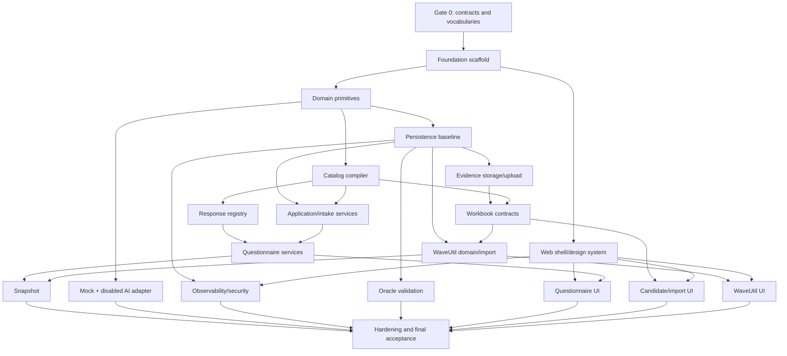

# Migration Intake Production Foundation
# TDD Implementation Plan and Parallel-Agent Execution Guide

**Version:** 0.5
**Updated:** 2026-09-08  
**Status:** Implementation in progress — backend foundation through A03/B06 is integrated; UI01 and UI02 are implemented; the user-facing intake workflow (UI03–UI08), candidate application (A04), WaveUtil completeness (V05), snapshot/readiness (A05/S01), and web hardening (SEC01) remain pending.
**Implementation root:** `src/migration_intake`  
**Architecture source:** `src/PRODUCTION_FOUNDATION_ARCHITECTURE_AND_TECHNICAL_DESIGN.md`  
**Decision review:** `src/production-shaped thin vertical spike_review.md`  
**UI reference:** `_data/spike/mockup/index.html`, `styles.css`, and `app.js`

> This plan is optimized for agent execution and token efficiency. An agent must read the execution index, its assigned task packet, and only the architecture sections named by that packet. Do not load the entire architecture or implementation plan unless performing final integration review.

---

## Implementation Progress

### Completed Packets

| Packet | Status | Date | Tests | Notes |
|--------|--------|------|-------|-------|
| G0 | ✅ COMPLETE | 2026-09-08 | N/A | Contract closure - blocking decisions approved (items 1-4, 6, 8) |
| F01 | ✅ COMPLETE | 2026-09-08 | 23 passing | Python project scaffold with config, main, health endpoints |
| F02 | ✅ COMPLETE | 2026-09-08 | 67 passing | Domain primitives: IDs, states, errors, values |
| F03 | ✅ COMPLETE | 2026-09-08 | 15 passing | Application ports, DTOs, commands, queries |
| R00 | ✅ COMPLETE | 2026-09-08 | 32 passing | Response registry interface and base classes |
| R01 | ✅ COMPLETE | 2026-09-08 | 110 passing | Scalar types: BOOLEAN, SINGLE_SELECT, TEXT, LONG_TEXT, IDENTIFIER |
| R02 | ✅ COMPLETE | 2026-09-08 | 140 passing | Collection types: MULTI_SELECT, TEXT_PAIR, COUNT_PAIR, CONTROLLED_PAIR, PEOPLE_LIST |
| R03 | ✅ COMPLETE | 2026-09-08 | 135 passing | Measurement types: MEASUREMENT, MEASUREMENT_PAIR, MEASUREMENT_SET, MEASUREMENT_CONTEXT |
| R04 | ✅ COMPLETE | 2026-09-08 | 121 passing | Decision types: BOOLEAN_WITH_RATIONALE, CONTROLLED_SET, SINGLE_SELECT_PER_COMPONENT, DECISION_WITH_PERSON, APPROVAL |
| R05 | ✅ COMPLETE | 2026-09-08 | 98 passing | Computed types: REGISTER_STATUS, VALIDATION_RESULT, ISSUE_REGISTER, DECISION_REGISTER, APPROVAL_REGISTER, EVIDENCE_REFERENCE |
| C01 | ✅ COMPLETE | 2026-09-08 | 47 passing | Catalog definitions and diagnostics |
| C02 | ✅ COMPLETE | 2026-09-08 | 59 passing | Safe condition AST compiler and evaluator |
| C03 | ✅ COMPLETE | 2026-09-08 | 31 passing | Catalog CSV compiler |
| R06 | ✅ COMPLETE | 2026-09-08 | 23 passing | Registry integration and catalog coverage |
| P01 | ✅ COMPLETE | 2026-09-08 | 34 passing | Persistence foundation: engine, session factory, portable types (SQLite contract) |
| UI01 | ✅ COMPLETE | 2026-09-08 | 57 passing | Design tokens, base shell, nav component, CSS system, app.js |
| AI01 | ✅ COMPLETE | 2026-09-08 | 25 passing | CandidateMapper models, port, MockCandidateMapper, validate_grounding |
| O01 | ✅ COMPLETE | 2026-09-08 | 28 passing | Structured logging, correlation IDs, event codes, credential redaction |
| E01 | ✅ COMPLETE | 2026-09-08 | 13 passing | EvidenceStore port, FilesystemStore (atomic writes, path-traversal defence) |
| P02 | ✅ COMPLETE | 2026-09-08 | 14 passing | ORM models (12 tables: actors, applications, app_identifiers, cat_releases, cat_sections, cat_questions, cat_options, cat_src_rels, intakes, ans_instances, ans_revisions, audit_events); Oracle-safe naming convention (≤30 chars) |
| B01 | ✅ COMPLETE | 2026-09-08 | 24 passing | APP_DATA_CAPTURE_V1 contract; WorkbookInspector (ZIP/XML, no formula execution); macro/traversal/bomb defence |
| AI02 | ✅ COMPLETE | 2026-09-08 | 22 passing | OpenAICompatibleMapper with 5-gate policy; ThreadingHTTPServer fake-server integration tests; AI policy security tests |
| P03 | ✅ COMPLETE | 2026-09-08 | 7 passing | Alembic baseline and migration smoke coverage |
| P04 | ✅ COMPLETE | 2026-09-08 | 14 passing | Unit of work and application/catalog/intake/answer repositories |
| B02–B05 | ✅ COMPLETE | 2026-09-08 | 107 passing | App, iTAP, TSS, Provisioning, Infra, and Database adapters |
| V01–V03 | ✅ COMPLETE | 2026-09-08 | 102 passing | WaveUtil contract, observations, lineage, matching, and reconciliation |
| SEC02 | ✅ COMPLETE | 2026-09-08 | 22 passing | XLSX and storage abuse security suite |
| A01 | ✅ COMPLETE | 2026-09-08 | 16 passing | Application and intake services |
| O02 | ✅ COMPLETE | 2026-09-08 | 10 passing | Liveness/readiness probes |
| P05 | ⚠️ PARTIAL | 2026-09-08 | 15 passing | Evidence and WaveUtil persistence plus migration 0002; candidate and snapshot persistence are absent |
| A02 | ⚠️ PARTIAL | 2026-09-08 | 17 passing | Append-only answer lifecycle exists; response-registry schema validation and full command-contract alignment remain |
| V04 | ⚠️ PARTIAL | 2026-09-08 | 12 passing | Canonical import and atomic batch review exist; candidate-only import invariant remains |
| E02 | ✅ COMPLETE | 2026-09-08 | 10 passing | Evidence metadata/upload service |
| P05b | ⚠️ PARTIAL | 2026-09-08 | 10 passing | Import runs, sheet results, and findings plus migration 0003; no persisted candidates |
| B06 | ✅ COMPLETE | 2026-09-08 | 9 passing | Workbook orchestration; stores run/results/findings but cannot persist reviewable candidate records yet |
| A03 | ⚠️ PARTIAL | 2026-09-08 | 18 passing | Application/workspace/questionnaire/import summaries exist; remaining UI read models are absent |
| UI02 | ⚠️ PARTIAL | 2026-09-08 | 14 passing | Application list/create/workspace routes exist and now use UI01; root redirect, intake creation, portfolio metrics, and visual regression coverage remain |

**Verified baseline:** `python -m pytest tests/ -q` → 1500 passed, 1 platform-specific symlink test skipped on Windows. A passing baseline does not mean the production-foundation slice is complete; several tests describe isolated contracts that are not yet connected into a user-facing workflow.

### Catalog Bootstrap Implementation Checkpoint (2026-09-09)

The reviewed questionnaire catalog is now shipped as the sanitized, versioned artifact `src/migration_intake/catalog/data/catalog-0.2.0.csv`. It is deliberately distinct from `_data/App Data Capture_intake_1.xlsx`: the workbook remains private application evidence and must not be packaged or committed.

Developers create the immutable database release with the explicit, idempotent command below after migrations:

```bash
python -m alembic upgrade head
migration-intake-bootstrap-catalog
```

The command compiles the packaged CSV, rejects compiler errors, and delegates publication to `CatalogPublicationService`; rerunning with the same version and hash returns the existing published release. It does not run at application startup. Migration `0007_catalog_question_metadata` keeps both clean installs and older local databases compatible with the current `CatalogQuestion` ORM.

### Authoritative Pending Sequence

This sequence supersedes stale historical wave labels elsewhere in this document. Execute one numbered gate at a time. Parallel work is permitted only where the table says so and only with exclusive file ownership.

| Gate | Packets | Can run in parallel | Outcome required before next gate |
|------|---------|---------------------|-----------------------------------|
| **R0 — Contract reconciliation** | G1, A02b, UI02b | Yes, with separate owners | One command model strategy; registry-valid answer boundary; published-catalog/local-intake bootstrap; root/workspace navigation works |
| **R1 — First usable intake** | UI03, UI04 | UI03 templates can be split by response family; UI04 shell may use fixtures until contracts freeze | User can open a real intake, navigate catalog sections, edit supported direct response types, clear/confirm, and see stale/validation states |
| **R2 — Evidence visibility** | UI05 | No parallel persistence edits | User can upload permitted evidence, process a workbook, and inspect file/run/sheet/finding states without implying candidates were accepted |
| **R3 — Candidate persistence/review** | P06, A04, UI06 | P06 first; UI06 may use synthetic DTO fixtures while P06/A04 run | Reviewable candidates persist independently of findings and can be accepted-with-edit/rejected/deferred without losing evidence |
| **R4 — WaveUtil completeness** | V05, UI07 | Service and fixture-based UI may proceed separately after DTO contract freezes | Rows are paginated/reviewable and completeness/blockers are computed from canonical rows and policy |
| **R5 — Freeze and canonical export** | P07, S01, A05, UI08 | S01 pure serializer may run beside P07; UI08 may use fixtures | Readiness blocks unsafe freeze; successful freeze is immutable/idempotent and canonical JSON/manifest can be downloaded safely |
| **R6 — Web hardening** | SEC01, UI-QA, OPS01 | Yes after route surface freezes | CSRF, resource authorization, escaping, headers, responsive/accessibility journeys, and operations/recovery verification pass |

### Explicit Scope Boundary

- **Included in this plan:** questionnaire capture, answer revision/confirmation, evidence upload/import status, candidate review, WaveUtil review, readiness, immutable snapshot, canonical JSON/manifest download, and safe diagnostic export.
- **Deferred:** complete Topology, ADS, and DDD document renderers; final DDD contract; enterprise artifact repository. The mockup Deliverables screen is visual vocabulary and future-state intent, not proof that those renderers exist.
- Future renderers must consume an immutable snapshot ID/hash. They must never read mutable answer, candidate, evidence, or register heads directly.

### G0 Approved Decisions

1. **APP-004 Vocabularies:** `business_criticality` = CRITICAL/HIGH/MEDIUM/LOW/UNKNOWN; `emergency_tier` = TIER_1/TIER_2/TIER_3/TIER_4/UNKNOWN
2. **TGT-002 Codes:** OUTPOST, AWS_REGION, LOCAL_ZONE, WAVELENGTH, ON_PREMISES, OTHER
3. **Named Fields:** CTL-002 (application_name, acronym), APP-004 (business_criticality, emergency_tier), NET-007 (internet_required, proxy_required), APP-006 (internal_users, external_users), NET-009 (latency, bandwidth)
4. **Condition AST:** 14 compilable (DB-001=YES, BAT-001=YES, SEC combinations, CTL-003 membership); 5 unresolved marked as CONDITION_PENDING
5. **Role codes:** Deferred beyond M1
6. **Header aliases:** `Resonse` → `Response`, `Instantace Type` → `Instance Type`; exact match or explicit alias only
7. **Infra/Database:** Deferred beyond M1
8. **App identity:** Internal UUID; duplicate normalized external IDs produce error
9. **WaveUtil mappings:** Deferred beyond M1
10. **Oracle:** Deferred to post-M3

### F01 Deliverables

**Files created:**
- `pyproject.toml` — Project manifest with FastAPI, Pydantic, SQLAlchemy, Alembic, openpyxl, httpx
- `README.md` — Project documentation
- `src/migration_intake/__init__.py` — Package version 0.1.0
- `src/migration_intake/config.py` — Typed immutable settings with safety gates
- `src/migration_intake/main.py` — FastAPI app factory with /health/live and /health/ready
- `tests/conftest.py` — Pytest fixtures for isolated testing
- `tests/unit/test_config.py` — 13 configuration tests
- `tests/web/test_health_bootstrap.py` — 10 health/bootstrap tests

**Verification:**
```bash
pip install -e ".[dev]"
python -m pytest tests/ -v  # 23 passed in 0.99s
```

### F02 Deliverables

**Files created:**
- `src/migration_intake/domain/__init__.py` — Domain package exports
- `src/migration_intake/domain/ids.py` — UUID-backed ID types (ApplicationId, IntakeId, ActorId, etc.)
- `src/migration_intake/domain/states.py` — State enumerations with transition policies
- `src/migration_intake/domain/errors.py` — Domain error types
- `src/migration_intake/domain/values.py` — Value objects (NormalizedName, SafeDecimal, UtcTimestamp, etc.)
- `tests/unit/domain/test_ids.py` — 19 ID tests
- `tests/unit/domain/test_states.py` — 18 state tests
- `tests/unit/domain/test_values.py` — 30 value tests

**Verification:**
```bash
python -m pytest tests/unit/domain/ -v  # 67 passed in 0.38s
```

### F03 Deliverables

**Files created:**
- `src/migration_intake/application/__init__.py` — Application package exports
- `src/migration_intake/application/ports.py` — Port protocols (UnitOfWork, repositories, EvidenceStore)
- `src/migration_intake/application/dto.py` — DTOs including ActorContext
- `src/migration_intake/application/commands.py` — Command objects for state changes
- `src/migration_intake/application/queries.py` — Query objects and read DTOs
- `tests/unit/application/test_port_contract_shapes.py` — 15 port/DTO tests

**Verification:**
```bash
python -m pytest tests/unit/application/ -v  # 15 passed in 0.33s
```

### R00-R05 Deliverables (Response Types)

**R00 - Registry Interface (32 tests):**
- `src/migration_intake/catalog/__init__.py` — Catalog package exports
- `src/migration_intake/catalog/response_types/__init__.py` — Response types package
- `src/migration_intake/catalog/response_types/base.py` — ResponseType protocol, base class, result envelopes
- `src/migration_intake/catalog/response_types/registry.py` — ResponseTypeRegistry
- `tests/unit/catalog/response_types/test_registry.py` — 32 registry/protocol tests

**R01 - Scalar Types (110 tests):**
- `src/migration_intake/catalog/response_types/scalar.py` — BOOLEAN, SINGLE_SELECT, TEXT, LONG_TEXT, IDENTIFIER
- `tests/unit/catalog/response_types/test_scalar.py` — 110 scalar type tests

**R02 - Collection Types (140 tests):**
- `src/migration_intake/catalog/response_types/collections.py` — MULTI_SELECT, TEXT_PAIR, COUNT_PAIR, CONTROLLED_PAIR, PEOPLE_LIST
- `tests/unit/catalog/response_types/test_collections.py` — 140 collection type tests

**R03 - Measurement Types (135 tests):**
- `src/migration_intake/catalog/response_types/measurements.py` — MEASUREMENT, MEASUREMENT_PAIR, MEASUREMENT_SET, MEASUREMENT_CONTEXT
- `tests/unit/catalog/response_types/test_measurements.py` — 135 measurement type tests

**R04 - Decision Types (121 tests):**
- `src/migration_intake/catalog/response_types/decisions.py` — BOOLEAN_WITH_RATIONALE, CONTROLLED_SET, SINGLE_SELECT_PER_COMPONENT, DECISION_WITH_PERSON, APPROVAL
- `tests/unit/catalog/response_types/test_decisions.py` — 121 decision type tests

**R05 - Computed Types (98 tests):**
- `src/migration_intake/catalog/response_types/computed.py` — REGISTER_STATUS, VALIDATION_RESULT, ISSUE_REGISTER, DECISION_REGISTER, APPROVAL_REGISTER, EVIDENCE_REFERENCE
- `tests/unit/catalog/response_types/test_computed.py` — 98 computed type tests

**Verification:**
```bash
python -m pytest tests/unit/catalog/response_types/ -v  # 636 passed
python -m pytest tests/ -v  # 741 passed in 1.72s
```

### C01 Deliverables (Catalog Definitions and Diagnostics)

**Files created (47 tests):**
- `src/migration_intake/catalog/definitions.py` — CatalogRelease, Section, QuestionDefinition, AllowedValue, etc.
- `src/migration_intake/catalog/diagnostics.py` — DiagnosticSeverity, Diagnostic, DiagnosticCollector, CompilerReport
- `tests/unit/catalog/test_definitions.py` — 24 definition tests
- `tests/unit/catalog/test_diagnostics.py` — 23 diagnostic tests

**Verification:**
```bash
python -m pytest tests/unit/catalog/test_definitions.py tests/unit/catalog/test_diagnostics.py -v  # 47 passed
python -m pytest tests/ -v  # 788 passed in 4.85s
```

### C02 Deliverables (Safe Condition AST)

**Files created (59 tests):**
- `src/migration_intake/catalog/conditions.py` — ConditionCompiler, ConditionEvaluator, CycleDetector, ASTValidator
- `tests/unit/catalog/test_conditions.py` — 59 condition tests

**Features:**
- Compile expressions: eq, ne, in, not_in, contains, answered, known, not, all, any
- Reject prose/unresolved references (marked as pending)
- Reject Python/SQL expressions
- Detect dependency cycles
- Three-valued logic: TRUE, FALSE, UNKNOWN
- UNKNOWN does not become FALSE (blocks readiness)
- Prose-to-AST mapping registration

**Verification:**
```bash
python -m pytest tests/unit/catalog/test_conditions.py -v  # 59 passed
python -m pytest tests/ -v  # 847 passed in 2.01s
```

### C03 Deliverables (Catalog CSV Compiler)

**Files created (31 tests):**
- `src/migration_intake/catalog/compiler.py` — CatalogCompiler with full pipeline
- `tests/unit/catalog/test_compiler.py` — 31 compiler tests

**Features:**
- Parse CSV with column validation and alias handling
- Validate unique question IDs
- Normalize sections, sources, owners, outputs, destinations
- Parse pipe-delimited allowed values
- Validate response types against registry
- Compile Required_When conditions to AST
- Detect dependency cycles
- Canonical serialization with deterministic hash
- Comprehensive compiler report with diagnostics

**Verification:**
```bash
python -m pytest tests/unit/catalog/test_compiler.py -v  # 31 passed
python -m pytest tests/ -v  # 878 passed in 2.26s
```

### Current Packet

**P01 — Persistence foundation** ← NEXT (M1 Scaffold milestone)

### Deferred Items

- Oracle validation (ORA00-ORA04) — deferred to post-M3
- Role vocabulary (G0 item 5) — deferred beyond M1
- Infra/Database dispositions (G0 item 7) — deferred beyond M1
- WaveUtil mappings (G0 item 9) — deferred beyond M1

---

## 1. Outcome

Build the first production-quality vertical slice of the AWS Outposts Migration Intake application under `src/migration_intake` using:

- Python 3.12.
- FastAPI, Jinja2, HTMX, and minimal JavaScript.
- Pydantic v2.
- SQLAlchemy 2.x and Alembic.
- SQLite for local development.
- Local Oracle AI Database 26ai Free for early and mandatory cross-dialect integration validation; an enterprise Oracle environment remains a later deployment certification boundary.
- openpyxl for per-application intake workbooks.
- Mock plus disabled OpenAI-compatible candidate mapper.
- pytest and focused Playwright tests.

The completed slice must:

1. Compile catalog v0.2 into an immutable release.
2. Support intentional workflows for all 112 controls and all 25 response types.
3. Create applications and versioned intakes.
4. Edit, validate, autosave, confirm, and revise questionnaire answers.
5. Upload and process one per-application consolidated workbook.
6. Quarantine unexplained catalog/workbook drift.
7. Parse all seven workbook sheets under explicit contracts.
8. Stage candidates/findings without silently changing canonical values.
9. Implement WaveUtil as the first complete repeated-row register.
10. Review candidates and create append-only answer/WaveUtil revisions.
11. Freeze deterministic immutable snapshots.
12. Run the same persistence behavior against SQLite and Oracle.
13. Preserve the mockup's enterprise command-center look and feel.

---

## 2. Non-negotiable implementation rules

- Write a failing test before production behavior: Red -> Green -> Refactor.
- Tests use synthetic data only.
- Never copy private `_data` evidence into tests, source, logs, snapshots, or AI fixtures.
- Never infer missing facts or silently resolve conflicts.
- Routes do not query SQLAlchemy or calculate workflow state.
- Templates consume detached view models, not ORM entities.
- Importers and runtime AI create candidates only.
- Runtime AI is disabled by default and synthetic-only in this slice.
- No database transaction remains open during workbook parsing or AI calls.
- Answer and WaveUtil revisions are append-only.
- Snapshot output is immutable and deterministic.
- One SQLAlchemy implementation must serve SQLite and Oracle.
- Do not add generic CRUD, workflow-engine, queue, SPA-state, or agent frameworks.
- Do not create every target file in advance; introduce files with tested behavior.

---

## 3. Token-efficient agent protocol

### 3.1 Every implementation agent reads

1. Root `AGENTS.md`.
2. Root `STATE.md`.
3. This document's sections 1–5.
4. Only its assigned task packet.
5. Only architecture sections named under `Read scope`.
6. Neighboring code/tests created by prerequisite tasks.

### 3.2 Every agent returns

```text
Task packet:
Files changed:
Tests written first:
Verification commands/results:
Architecture decisions applied:
Open blockers or deviations:
STATE.md update needed:
```

### 3.3 Task-state rules

- One task packet has one owner at a time.
- Mark a packet complete only after all packet tests and gates pass.
- If a packet reveals a design contradiction, stop that packet and record the exact decision required.
- Do not expand scope opportunistically.
- Integration agents review completed packet outputs; they do not rewrite unrelated areas.

### 3.4 Context isolation

To prevent duplicated token usage:

- Catalog agents do not read WaveUtil UI sections unless their packet says so.
- UI agents read view-model/route contracts and mockup assets, not persistence internals.
- Persistence agents read domain/application port contracts, not CSS/mockup files.
- AI agents read candidate/security sections, not all questionnaire response schemas.
- Oracle agents read migrations/persistence contracts, not workbook UX.

---

## 4. Execution phases and dependency graph



### 4.1 Sequential gates

The following cannot be safely parallelized before their prerequisite stabilizes:

1. M0 contract closure.
2. Project scaffold and test commands.
3. Domain ID/state/error contracts.
4. Initial SQLAlchemy naming/type conventions.
5. Catalog compiler output DTO shape.
6. Response registry interface.
7. Application command/query ports.

### 4.2 Safe parallel waves

#### Parallel wave A — after scaffold/domain contracts

- Catalog compiler and condition AST.
- Persistence baseline, migrations, and local Oracle smoke/DDL execution.
- UI shell/design system.
- Mock candidate-mapper port/models.
- Local Oracle schema readiness may start before code and must finish before Oracle migrations.

These streams own separate files and avoid shared composition edits until integration. Oracle work is part of the persistence stream rather than a late hardening activity.

#### Parallel wave B — after catalog/persistence interfaces

- Five response-type groups.
- Application/intake services.
- Evidence storage/upload.
- Workbook package validation.
- Web page shells using fake services/view models.
- SQLite and local Oracle execution of every completed persistence contract tranche.

#### Parallel wave C — after response/application/workbook contracts

- Questionnaire UI.
- Sheet adapters: App/iTAP/TSS/Provisioning/extensions.
- WaveUtil domain/parser/reconciliation.
- Candidate queue UI.
- OpenAI-compatible fake-server adapter tests.
- Local Oracle evidence/candidate repository contracts as soon as their migrations merge.

#### Parallel wave D — after WaveUtil and commands

- WaveUtil UI.
- Snapshot/readiness.
- Security tests.
- Observability/health.
- Local Oracle WaveUtil, concurrency, snapshot, and pool tests.

Oracle validation is incremental: each persistence migration and contract must pass on SQLite and local Oracle before its packet is considered integrated. Final enterprise Oracle certification remains separate and cannot be proven by Oracle Free.

### 4.3 Shared-file rule

Parallel agents must not edit the same high-contention files:

- `pyproject.toml` — foundation/integration owner only.
- `main.py` — integration owner only.
- Alembic head/migration chain — persistence owner only.
- Central response registry — one registry integrator; type agents contribute separate modules/tests.
- Base template/design tokens — UI shell owner only until stable.
- `STATE.md` — coordinating agent updates after merging packet results.

---

## 5. Planned project structure

Create files incrementally toward:

```text
pyproject.toml
alembic.ini
src/
  migration_intake/
    __init__.py
    main.py
    config.py
    domain/
      ids.py
      models.py
      values.py
      states.py
      policies.py
      errors.py
    application/
      ports.py
      commands.py
      queries.py
      dto.py
      services/
        applications.py
        answers.py
        evidence.py
        candidates.py
        wave_util.py
        snapshots.py
    catalog/
      definitions.py
      compiler.py
      conditions.py
      registry.py
      response_types/
    imports/
      contracts.py
      workbook.py
      app_sheet.py
      itap.py
      tss.py
      provisioning.py
      extensions.py
      wave_util.py
    ai/
      models.py
      port.py
      mock.py
      openai_compatible.py
    persistence/
      database.py
      models.py
      repositories/
      unit_of_work.py
      types.py
      migrations/
    storage/
      port.py
      filesystem.py
    web/
      dependencies.py
      forms.py
      view_models.py
      errors.py
      routes/
      templates/
      static/
    observability/
      logging.py
      health.py
tests/
  unit/
  integration/
  contract/
  web/
  browser/
  security/
  fixtures/
```

Do not create empty folders/modules merely to match this tree.

**Checkpoint: complete — Sections 1–5 define outcome, implementation rules, token-efficient agent protocol, dependency graph, parallel waves, and target structure.**

---

## 6. TDD workflow and universal quality gates

### 6.1 Packet loop

For every task packet:

1. Read packet prerequisites and named design sections.
2. Inspect existing neighboring code and tests.
3. Write the smallest failing behavioral test.
4. Run it and record the expected failure reason.
5. Implement only enough production code to pass.
6. Run focused tests.
7. Refactor while tests remain green.
8. Run packet-level lint/type/test checks.
9. Review diff for architecture, security, and accidental scope.
10. Return packet report for integration.

A test that fails because imports/files do not exist may be acceptable for first scaffold behavior, but subsequent red tests must fail on the intended behavior—not syntax or unrelated setup.

### 6.2 Required verification layers

| Change | Minimum checks |
|---|---|
| Pure domain/schema | Focused unit tests and full affected module tests |
| SQLAlchemy/migration | SQLite contract tests and migration smoke |
| Web route/template | HTTP full-page + HTMX tests, escaping and CSRF where applicable |
| Response type | Valid/invalid/blank/unknown/form/workbook/compare/round-trip matrix |
| Workbook adapter | Synthetic XLSX contract, locator, drift, resource-limit tests |
| WaveUtil | Unit parsing/reconciliation plus persistence and pagination tests |
| AI adapter | Mock tests and fake local HTTP server; external network blocked |
| Security boundary | Focused negative/security tests |
| Snapshot | Deterministic hash and immutability tests |
| Release candidate | Full SQLite suite, browser suite, security suite, migration smoke, Oracle gate |

### 6.3 Test naming

Use behavior-oriented test names:

```text
test_save_answer_rejects_stale_row_version
test_app_sheet_quarantines_changed_response_type
test_waveutil_blank_metric_does_not_become_zero
test_ai_candidate_rejects_quote_missing_from_fragment
```

Avoid tests named only after implementation methods.

### 6.4 Coverage policy

Do not chase a global percentage as a substitute for behavior. Require branch coverage of decision-heavy policies and explicit matrix coverage listed in each packet. Report meaningful untested paths during packet closure.

### 6.5 Temporary fakes

In-memory repository fakes may support early application-service TDD, but every persistence-sensitive behavior must also pass the real SQLAlchemy contract. Do not let fake behavior become the specification for transactions, uniqueness, or concurrency.

---

## 7. Gate 0 — contract closure before implementation

**Packet ID:** G0  
**Status:** ✅ COMPLETE (2026-09-08)  
**Owner:** Lead architect/product data owner  
**Parallel:** No  
**Code changes:** None except validated contract fixtures/configuration after approval

### Read scope

- Design sections 10–16 and 18–20.
- Catalog v0.2.
- Workbook sheet/header inventory summarized in the design.

### Decisions required

1. Approve `APP-004` business-criticality and emergency-tier vocabularies.
2. Approve `TGT-002` target component/platform vocabulary.
3. Confirm named fields/vocabularies for all pair/set response types.
4. Map every prose `Required_When` phrase to a safe AST or classify it unresolved.
5. Normalize role labels into stable role codes.
6. Approve workbook header aliases and sheet roles.
7. Approve Infra/Database row dispositions, including duplicate Database question.
8. Confirm application identifier uniqueness assumption for the slice.
9. Confirm WaveUtil environment/platform mappings and natural matching key.
10. Complete local Oracle readiness: create a dedicated non-`SYSTEM` application/test schema, choose secure credential injection, verify host connectivity, thin-driver access, privileges, quota, and cleanup ownership. Record enterprise Oracle certification as a later external gate.

### Tests first

Create contract-validation tests using synthetic catalog/workbook rows that fail for every unresolved decision. These tests may initially be marked as expected contract blockers only through an explicit marker/report—not silently skipped.

### Exit criteria

- Machine-readable decision table exists in code/config plan.
- No response schema uses generic text as a placeholder.
- Catalog compiler can theoretically publish v0.2 without unresolved prose.
- Local Oracle dedicated-schema readiness passes without using `SYSTEM` for application tests; enterprise Oracle certification dependency is recorded separately.

---

## 8. Foundation packet series

### F01 — Python project scaffold

**Packet ID:** F01  
**Status:** ✅ COMPLETE (2026-09-08)  
**Depends on:** G0 sufficient to establish dependencies  
**Parallel:** No  
**Read scope:** Design sections 6–9, 58–60

#### Files

```text
pyproject.toml
README.md
src/migration_intake/__init__.py
src/migration_intake/main.py
src/migration_intake/config.py
tests/__init__.py
tests/conftest.py
tests/unit/__init__.py
tests/unit/test_config.py
tests/web/__init__.py
tests/web/test_health_bootstrap.py
```

#### Red tests (all passing)

- ✅ Valid local settings produce SQLite configuration and mock AI.
- ✅ Shared/production settings reject implicit SQLite.
- ✅ Enabled LLM rejects HTTP or incomplete configuration.
- ✅ Invalid actor UUID/upload limits fail startup.
- ✅ Minimal FastAPI app exposes liveness.
- ✅ Package import has no side effects.
- ✅ Settings are immutable.

#### Implementation (complete)

- ✅ Declare runtime/dev dependencies only from accepted stack.
- ✅ Configure package discovery and pytest markers.
- ✅ Typed immutable settings with Pydantic v2.
- ✅ Minimal app factory/composition entry.
- ✅ Health endpoints (/health/live, /health/ready).
- ✅ No feature behavior yet.

#### Gates (all passed)

- ✅ Clean environment install works: `pip install -e ".[dev]"`
- ✅ Focused tests pass: 23 tests in 0.99s
- ✅ Importing package has no database/file/network side effects.
- ✅ Verified commands documented in README and AGENTS.md.

### F02 — Domain primitives

**Packet ID:** F02  
**Status:** ✅ COMPLETE (2026-09-08)  
**Depends on:** F01  
**Parallel:** Can run alongside UI tokens after F01  
**Read scope:** Design sections 2–4, 23–30

#### Files

```text
src/migration_intake/domain/__init__.py
src/migration_intake/domain/ids.py
src/migration_intake/domain/states.py
src/migration_intake/domain/errors.py
src/migration_intake/domain/values.py
tests/unit/domain/__init__.py
tests/unit/domain/test_ids.py
tests/unit/domain/test_states.py
tests/unit/domain/test_values.py
```

#### Red tests (all passing)

- ✅ Parse/reject malformed UUID-backed IDs.
- ✅ Normalize identifier/name/acronym predictably.
- ✅ Decimal values reject NaN/infinity.
- ✅ State transition policies reject invalid direct transitions.
- ✅ UTC clock values remain timezone-aware.

#### Implementation (complete)

- ✅ UUID-backed ID types with type distinction
- ✅ State enums with transition policies
- ✅ Domain error hierarchy
- ✅ Value objects for normalization/validation
- ✅ No Pydantic/SQLAlchemy/FastAPI dependencies in domain

### F03 — Application ports and actor context

**Packet ID:** F03  
**Status:** ✅ COMPLETE (2026-09-08)  
**Depends on:** F02  
**Parallel:** No with application-service packets; safe alongside catalog/persistence implementation  
**Read scope:** Design sections 23–24, 28–30

#### Files

```text
src/migration_intake/application/__init__.py
src/migration_intake/application/ports.py
src/migration_intake/application/dto.py
src/migration_intake/application/commands.py
src/migration_intake/application/queries.py
tests/unit/application/__init__.py
tests/unit/application/test_port_contract_shapes.py
```

#### Red tests (all passing)

- ✅ Actor context ignores untrusted browser actor fields through boundary construction.
- ✅ Command DTOs require expected versions for mutable state.
- ✅ Ports expose no SQLAlchemy/openpyxl/httpx types.

#### Implementation (complete)

- ✅ ActorContext with capability checking
- ✅ UnitOfWork protocol with repository access
- ✅ Repository protocols for Application, Intake, Catalog, Audit
- ✅ EvidenceStore protocol for content-addressed storage
- ✅ Command objects for all major operations
- ✅ Query DTOs for list and detail views

#### Exit (achieved)

Stable interfaces allow catalog, persistence, AI, and web agents to proceed independently.

---

## 9. Persistence packet series

### P01 — Engine/session and portable types

**Packet ID:** P01  
**Status:** ✅ COMPLETE (2026-09-08, 34 tests)  
**Depends on:** F01, F02  
**Parallel:** Catalog and UI shell  
**Read scope:** Design sections 31–36

#### Files

```text
src/migration_intake/persistence/database.py
src/migration_intake/persistence/types.py
tests/contract/persistence/test_database_config.py
tests/contract/persistence/test_portable_types.py
```

#### Red tests

- SQLite connections enable foreign keys and intended pragmas.
- UUID/UTC/Decimal/canonical JSON round trip.
- Empty string/null handling is explicit.
- Engine diagnostics redact credentials.
- In-memory versus file database connection behavior is intentional.

### P02 — Initial ORM model tranche

**Packet ID:** P02  
**Status:** ✅ COMPLETE (2026-09-08, 14 tests)  
**Depends on:** P01 ✓, F03 ✓  
**Parallel:** Catalog compiler after agreed DTOs  
**Read scope:** Design sections 31, 33–34

#### Files

```text
src/migration_intake/persistence/models.py
src/migration_intake/persistence/naming.py
tests/contract/persistence/test_model_metadata.py
```

#### First models

- actors, applications, identifiers.
- catalog releases/sections/questions/options/dependencies/sources/mappings.
- intakes, answer instances/revisions.
- audit events.

#### Red tests

- Stable Oracle-safe constraint names.
- Required foreign keys/uniques/indexes.
- No SQLite-only collation/JSON correctness dependency.
- Revision/current-pointer relationships are insertable.

### P03 — Alembic baseline ✓ COMPLETE (7 tests)

**Depends on:** P02  
**Parallel:** No other migration author  
**Read scope:** Design section 37

#### Files

```text
alembic.ini
src/migration_intake/persistence/migrations/env.py
src/migration_intake/persistence/migrations/script.py.mako
src/migration_intake/persistence/migrations/versions/0001_core_catalog_answers.py
tests/integration/migrations/test_sqlite_upgrade.py
```

#### Red tests

- Empty SQLite file upgrades to head.
- Application readiness sees current/behind schema.
- Upgrade is repeatable.
- Application startup does not auto-migrate.

### P04 — Repositories and unit of work ✓ COMPLETE (14 tests)

**Depends on:** P02  
**Parallel:** Can split repositories by aggregate after UoW conventions freeze  
**Read scope:** Design sections 24, 31–32, 38

#### Files

```text
src/migration_intake/persistence/unit_of_work.py
src/migration_intake/persistence/repositories/applications.py
src/migration_intake/persistence/repositories/catalogs.py
src/migration_intake/persistence/repositories/intakes.py
src/migration_intake/persistence/repositories/answers.py
tests/contract/persistence/test_application_repository.py
tests/contract/persistence/test_answer_repository.py
tests/contract/persistence/test_uow_atomicity.py
```

#### Red tests

- Normalized duplicate identity rejected/translated.
- Answer revision and current pointer commit atomically.
- Rollback removes revision/pointer/audit together.
- Stale version updates zero rows and become concurrency conflict.
- Reload from a new session proves persistence.

### P05 — Evidence/candidate/WaveUtil/snapshot persistence ⚠️ PARTIAL

**Depends on:** P04 and relevant domain DTO contracts  
**Parallel:** Split by non-overlapping repository files; one model/migration integrator  
**Read scope:** Design sections 18–21, 31–38, 49

#### Files

```text
additional ORM model modules or cohesive models.py edits
migration revisions 0002–0005
repositories/evidence.py
repositories/imports.py
repositories/wave_util.py
repositories/snapshots.py
corresponding contract tests
```

#### Gate

Each persistence tranche passes on SQLite, compiles for the Oracle dialect, and executes against the local dedicated Oracle test schema before integration. If local Oracle is temporarily stopped, implementation may continue on independent non-persistence packets, but the persistence packet remains incomplete.

#### Verified current boundary (2026-09-08)

- Evidence and WaveUtil tables/repositories exist through migration `0002`.
- Import runs, per-sheet results, and findings exist through migration `0003`.
- Reviewable import candidates, answer-to-evidence lineage, intake snapshots, and snapshot facts do not yet exist in the production ORM/migrations.
- Candidate counts in an import summary are not a substitute for persisted candidate records.
- Complete this persistence series through P06/P07 in the continuation handoff before marking P05 complete.

---

## 10. Catalog and response packet series

### C01 — Catalog definitions and diagnostics

**Packet ID:** C01  
**Status:** ✅ COMPLETE (2026-09-08)  
**Depends on:** F02  
**Parallel:** P01, UI shell  
**Read scope:** Design section 10

#### Files

```text
src/migration_intake/catalog/definitions.py
src/migration_intake/catalog/diagnostics.py
tests/unit/catalog/test_definitions.py
tests/unit/catalog/test_diagnostics.py
```

#### Implementation (complete)

- ✅ CatalogRelease, Section, QuestionDefinition structures
- ✅ AllowedValue, ApplicabilityCondition, SourceRelationship
- ✅ OwnerRelationship, DestinationMapping
- ✅ RequiredLevel, CollectionMode enumerations
- ✅ DiagnosticSeverity, Diagnostic, DiagnosticCodes
- ✅ DiagnosticCollector, CompilerReport
- ✅ 47 tests passing

### C02 — Safe condition AST

**Packet ID:** C02  
**Status:** ✅ COMPLETE (2026-09-08)  
**Depends on:** C01, G0 condition mappings  
**Parallel:** C03 compiler parsing  
**Read scope:** Design 10.6 and 27.3

#### Files

```text
src/migration_intake/catalog/conditions.py
tests/unit/catalog/test_conditions.py
```

#### Implementation (complete)

- ✅ ConditionCompiler with expression parsing
- ✅ Supported operators: eq, ne, in, not_in, contains, answered, known, not, all, any
- ✅ ConditionEvaluator with three-valued logic
- ✅ CycleDetector for dependency cycle detection
- ✅ ASTValidator for AST structure validation
- ✅ CompileResult and EvaluationResult structures
- ✅ Prose-to-AST mapping registration
- ✅ Python/SQL expression rejection
- ✅ 59 tests passing

### C03 — Catalog CSV compiler

**Packet ID:** C03  
**Status:** ✅ COMPLETE (2026-09-08)  
**Depends on:** C01, response-registry interface stub, C02  
**Parallel:** Response-type module implementation after interface freeze  
**Read scope:** Design sections 10–11

#### Files

```text
src/migration_intake/catalog/compiler.py
tests/unit/catalog/test_compiler.py
```

#### Implementation (complete)

- ✅ CatalogCompiler with full pipeline
- ✅ CSV parsing with column validation and alias handling
- ✅ Unique question ID validation
- ✅ Relationship normalization (sources, owners, outputs, destinations)
- ✅ Allowed values parsing (pipe-delimited)
- ✅ Response type validation against registry
- ✅ Condition compilation to AST
- ✅ Cross-reference validation
- ✅ Dependency cycle detection
- ✅ Canonical serialization with deterministic hash
- ✅ CompileResult and comprehensive diagnostics
- ✅ 31 tests passing

### R00 — Response registry interface

**Packet ID:** R00  
**Status:** ✅ COMPLETE (2026-09-08)  
**Depends on:** G0, F02  
**Parallel:** No until interface frozen  
**Read scope:** Design section 11

#### Files

```text
src/migration_intake/catalog/__init__.py
src/migration_intake/catalog/response_types/__init__.py
src/migration_intake/catalog/response_types/base.py
src/migration_intake/catalog/response_types/registry.py
tests/unit/catalog/__init__.py
tests/unit/catalog/response_types/__init__.py
tests/unit/catalog/response_types/test_registry.py
```

#### Implementation (complete)

- ✅ ResponseType protocol with all required methods
- ✅ ResponseTypeBase abstract class with default implementations
- ✅ ResponseTypeCodes constants for all 25 types
- ✅ ParseResult, ValidationResult, ComparisonResult envelopes
- ✅ ResponseTypeRegistry with registration and lookup
- ✅ 32 tests passing

### R01–R05 — Parallel response-type groups

**Status:** ✅ ALL COMPLETE (2026-09-08) - Executed in parallel with 5 agents

Each group owns separate modules/tests. All groups completed with comprehensive test coverage.

#### R01 scalar group ✅ COMPLETE (110 tests)

Types: `BOOLEAN`, `SINGLE_SELECT`, `TEXT`, `LONG_TEXT`, `IDENTIFIER`.
File: `src/migration_intake/catalog/response_types/scalar.py`

#### R02 collection group ✅ COMPLETE (140 tests)

Types: `MULTI_SELECT`, `TEXT_PAIR`, `COUNT_PAIR`, `CONTROLLED_PAIR`, `PEOPLE_LIST`.
File: `src/migration_intake/catalog/response_types/collections.py`

#### R03 measurement group ✅ COMPLETE (135 tests)

Types: `MEASUREMENT`, `MEASUREMENT_PAIR`, `MEASUREMENT_SET`, `MEASUREMENT_CONTEXT`.
File: `src/migration_intake/catalog/response_types/measurements.py`

#### R04 structured decision group ✅ COMPLETE (121 tests)

Types: `BOOLEAN_WITH_RATIONALE`, `CONTROLLED_SET`, `SINGLE_SELECT_PER_COMPONENT`, `DECISION_WITH_PERSON`, `APPROVAL`.
File: `src/migration_intake/catalog/response_types/decisions.py`

#### R05 computed group ✅ COMPLETE (98 tests)

Types: `REGISTER_STATUS`, `VALIDATION_RESULT`, `ISSUE_REGISTER`, `DECISION_REGISTER`, `APPROVAL_REGISTER`, `EVIDENCE_REFERENCE`.
File: `src/migration_intake/catalog/response_types/computed.py`

#### All groups implemented tests for

- ✅ Valid and invalid shapes.
- ✅ Blank and unknown semantics.
- ✅ HTML form parsing.
- ✅ Workbook parsing.
- ✅ Semantic comparison/no-op.
- ✅ Candidate diff.
- ✅ Canonical serialization.
- ✅ Computed group: direct-save rejection.

### R06 — Registry integration and catalog coverage

**Packet ID:** R06  
**Status:** ✅ COMPLETE (2026-09-08)  
**Depends on:** R01–R05, C03  
**Parallel:** No

#### Files

```text
src/migration_intake/catalog/response_types/__init__.py (updated with get_default_registry)
tests/unit/catalog/response_types/test_integration.py
```

#### Implementation (complete)

- ✅ get_default_registry() factory function
- ✅ All 25 types registered in default registry
- ✅ Registry completeness tests (exactly 25 types)
- ✅ Catalog row resolution tests
- ✅ Editor and computed workflow assignment tests
- ✅ No generic text fallback verification
- ✅ Controlled vocabulary tests
- ✅ Type group coverage tests (R01-R05)
- ✅ Compiler integration tests
- ✅ 23 tests passing

**Checkpoint: R00-R06 complete — All 25 response types implemented with registry integration. Total test suite: 901 tests passing.**

---

## 11. Application-service packet series

### A01 — Application and intake services ✓ COMPLETE (16 tests)

**Depends on:** F03, C03, P04  
**Parallel:** Questionnaire UI shell may proceed with fake query service  
**Read scope:** Design sections 23–30

#### Files

```text
src/migration_intake/application/services/applications.py
src/migration_intake/application/services/intakes.py
tests/unit/application/test_application_service.py
tests/unit/application/test_intake_service.py
tests/integration/application/test_application_intake_sqlite.py
```

#### Red tests

- Create application with internal UUID and normalized identifiers.
- Duplicate normalized identifier returns typed error.
- Update identity rejects stale application version.
- Create intake only for active application/published catalog.
- One open intake policy enforced transactionally.
- Audit events committed atomically.
- CTL-001/CTL-002 projections cannot diverge from application identity.

### A02 — Answer service ⚠️ PARTIAL (17 tests)

**Depends on:** R06, P04, A01  
**Parallel:** Evidence service after ports stable  
**Read scope:** Design sections 25.2, 27.3, 30

#### Red tests

- Save each direct response type through parameterized fixtures.
- Reject direct save for computed/approval/register controls.
- Evaluate applicability server-side.
- Semantic no-op creates no revision/audit.
- Append revision/current pointer atomically.
- Clear differs from unknown and not-applicable.
- Stale expected version returns current metadata.
- Confirmation requires current value/capability.
- Dependency change recalculates pending/applicability without deleting history.

#### Verified current boundary (2026-09-08)

Append-only save, clear, confirm, and not-applicable operations exist, but A02 is not complete against the architecture contract. The service currently accepts generic dictionaries, does not use `ResponseTypeRegistry` for type-specific validation/normalization/comparison, does not enforce `expected_revision_number`, and blocks only generic names rather than every registry type whose `is_computed` flag is true. Complete A02b before wiring questionnaire POST routes.

### A03 — Query/read-model services ⚠️ PARTIAL (18 tests)

**Depends on:** A01, A02  
**Parallel:** UI templates  
**Read scope:** Design section 26

#### Red tests

- Questionnaire section has stable ordering and one query plan without N+1 growth.
- View models are detached and serializable.
- Progress exposes independent dimensions.
- Resource IDs from another application return not found/forbidden safely.
- Pagination has unique tie-breaker.

#### Verified current boundary (2026-09-08)

Application list/workspace, a basic questionnaire section projection, and import-run summaries exist. The questionnaire projection still lacks the complete editor contract: schema version, editor key, options, help, field names/units, applicability reason, owner/source/output metadata, candidate/evidence counts, and resource-graph authorization. Add these deliberately as their persistence contracts become available; never fill absent metadata from the mockup.

### A04 — Candidate application services

**Depends on:** P05 candidate persistence, A02, candidate domain contracts  
**Parallel:** Candidate UI with fake service  
**Read scope:** Design sections 25.4, 49–50

#### Red tests

- Acceptance revalidates schema/applicability/current revision.
- Accepted-with-edit preserves original candidate and accepted value.
- Reject/defer never changes canonical answer.
- Stale candidate recomputes diff and returns 409-level error.
- Field-level partial merge changes only selected fields.
- Conflict resolution retains losing evidence.

### A05 — Snapshot/readiness services

**Depends on:** A02, WaveUtil service, P05  
**Parallel:** AI adapter  
**Read scope:** Design sections 25.5, 26.3, 60, 64

#### Red tests

- Block freeze with required unanswered/condition-pending/conflict/WaveUtil blockers.
- Canonical ordering/hash deterministic.
- Same frozen intake returns existing snapshot idempotently.
- Frozen snapshot cannot mutate.
- New evidence after freeze requires new intake workflow.
- Audit and state transition atomic.

---

## 12. Evidence and workbook packet series

### E01 — Evidence storage port and filesystem adapter

**Packet ID:** E01  
**Status:** ✅ COMPLETE (2026-09-08, 13 tests)  
**Depends on:** F01, F02  
**Parallel:** P04/catalog/UI shell  
**Read scope:** Design sections 24.2, 54

#### Files

```text
src/migration_intake/storage/port.py
src/migration_intake/storage/filesystem.py
tests/contract/storage/test_filesystem_store.py
tests/security/test_storage_paths.py
```

#### Red tests

- Stream bytes, compute SHA-256, promote atomically.
- Same bytes deduplicate content without sharing authorization metadata.
- User filename cannot affect storage path.
- Path traversal/symlink escape rejected.
- Interrupted write leaves no promoted corrupt content.
- Open/existence use storage keys only.

### E02 — Evidence metadata and upload service ✓ COMPLETE (10 tests)

**Depends on:** E01, P05 evidence repository  
**Parallel:** Workbook parser  
**Read scope:** Design sections 25.3, 54

#### Red tests

- Upload enforces size/media/signature.
- Metadata references stored hash/key.
- Duplicate bytes may support distinct evidence metadata intentionally.
- Metadata failure cleans only provably orphaned content.
- Evidence access validates application/intake graph.
- Audit excludes file content.

### B01 — Workbook package inspection

**Packet ID:** B01  
**Status:** ✅ COMPLETE (2026-09-08, 24 tests)  
**Depends on:** F01 ✓, E01 ✓  
**Parallel:** P02, AI02  
**Read scope:** Design sections 12.2–12.4, 54.1

#### Files

```text
src/migration_intake/imports/contracts.py
src/migration_intake/imports/workbook.py
tests/unit/imports/test_workbook_inspection.py
tests/security/test_xlsx_packages.py
```

#### Synthetic tests

- Valid APP_DATA_CAPTURE_V1 recognized.
- Missing/duplicate/renamed required sheets.
- Oversized compressed/expanded package.
- Macro, encrypted, external link, unsafe embedded object.
- Formula preserved, never evaluated.
- Known header alias normalized; fuzzy alias rejected.
- Workbook closed after result.

### B02 — App projection adapter ✓ COMPLETE (16 tests)

**Depends on:** C03, R06, B01  
**Parallel:** Other sheet adapters  
**Read scope:** Design section 13

#### Red tests

- Current 112-row projection matches catalog-equivalent synthetic fixture.
- Response column excluded from semantics.
- Question/type/options/required/source drift quarantines.
- Missing/additional/reordered rows quarantine v1.
- Column reorder accepted by unique headers.
- Blank response creates no candidate.
- Typed populated response creates deterministic candidate with exact cell locator.

### B03 — iTAP adapter ✓ COMPLETE (29 tests)

**Depends on:** B01, response parsers  
**Parallel:** B02/B04/B05  
**Read scope:** Design 14.1

#### Tests

- Known labels map exactly after approved normalization.
- Duplicate same/different values create corroboration/conflict outcomes.
- Unknown items become findings.
- Identity mismatch blocks applicability.
- Copied values are not marked authoritative portal export.

### B04 — TSS and Provisioning adapters ✓ COMPLETE (18 tests)

**Depends on:** B01  
**Parallel:** B02/B03/B05  
**Read scope:** Design 14.2–14.4

#### Tests

- Zero-width header normalization only through aliases.
- Empty TSS rows ignored; typed rows become candidates.
- TSS lifecycle assertion lacks portal authority unless provenance supplied.
- Provisioning syntax/incomplete/duplicate/contradictory rows produce findings.
- Provisioning never auto-selects application target placement.

### B05 — Infra/Database extension adapters ✓ COMPLETE (44 tests)

**Depends on:** G0 mapping table, B01  
**Parallel:** Other adapters  
**Read scope:** Design section 15

#### Tests

- Every known nonblank row receives explicit disposition.
- `N/A`, `NO`, and broad text normalize only when target schema permits.
- Duplicate RAC/Data Guard rows corroborate/conflict correctly.
- Unknown/fuzzy-only mappings stay findings.
- Runtime import never creates catalog questions.

### B06 — Workbook orchestration/import service ✓ COMPLETE (9 tests)

**Depends on:** B02–B05, WaveUtil parser, E02, import repository  
**Parallel:** Import UI  
**Read scope:** Design section 16 and 25.3

#### Tests

- Persist per-sheet status/candidate/finding counts transactionally.
- Same evidence/catalog/contract/parser is idempotent.
- Partial sheet success follows policy.
- Unsafe package parses nothing.
- App quarantine controls candidate reviewability.
- Parsing occurs without open canonical transaction.
- Process restart/reprocess behavior is explicit.

---

## 13. WaveUtil packet series

### V01 — WaveUtil value model and header contract ✓ COMPLETE (52 tests)

**Depends on:** F02, B01  
**Parallel:** Other workbook adapters  
**Read scope:** Design sections 17–18

#### Files

```text
src/migration_intake/domain/wave_util.py
src/migration_intake/imports/wave_util.py
tests/unit/wave_util/test_values.py
tests/unit/imports/test_waveutil_headers.py
```

#### Red tests

- All 34 headers map to canonical fields.
- `Environment` maps to hosting platform; `Server Type` maps application environment.
- Target Data Center splits CLLI versus disposition.
- `Instantace Type` known alias only.
- OS version remains text.
- Decimal fields reject negative/NaN/infinity/ambiguous locale.
- Cached Excel errors become invalid findings, not zero.

### V02 — Observation and derived lineage ✓ COMPLETE (35 tests)

**Depends on:** V01  
**Parallel:** Matching/reconciliation  
**Read scope:** Design 18.2, 20

#### Red tests

- Measurement requires window to be fully defensible.
- Missing metrics require reason.
- Formula/cached/source value retained separately.
- Missing algorithm/version yields `DERIVED_UNVERIFIED`.
- Defaults/fallbacks explicit.
- p95 > max and observations > allocation produce findings, not silent correction.

### V03 — Matching and reconciliation ✓ COMPLETE (15 tests)

**Depends on:** V01  
**Parallel:** V02  
**Read scope:** Design section 19

#### Red tests

- Exact, probable, new, ambiguous, mismatch, duplicate, invalid identity outcomes.
- Server name alone does not force match.
- Blank candidate never clears canonical value.
- Different scope not direct conflict.
- Field-level differences preserve observed/derived separation.
- Missing from new source is finding, not retirement.
- Identical duplicate source rows retain locators.

### V04 — WaveUtil persistence and atomic review ⚠️ PARTIAL (12 tests)

**Depends on:** V01–V03, P05  
**Parallel:** WaveUtil UI shell  
**Read scope:** Design section 21, 31–38

#### Red tests

- UUID head plus append-only revisions.
- Decimal/UTC/lineage round trip.
- Current pointer/version atomic.
- Stable indexed pagination/filtering.
- Duplicate match behavior.
- Bounded batch acceptance all-or-nothing.
- Stale row/candidate conflict.

#### Verified current boundary (2026-09-08)

Canonical row persistence and atomic batch revision acceptance exist. The current `WaveUtilImportService` writes `NEW_ROW` and `EXACT_MATCH` results directly to canonical rows, which conflicts with the project invariant that importers create candidates rather than approved facts. V04b must route imported rows through persisted candidates before V05/UI07 can be considered complete.

### V05 — WaveUtil service and completeness

**Depends on:** V02–V04, A04  
**Parallel:** UI with fake service  
**Read scope:** Design section 20–21

#### Red tests

- Structural/semantic/applicability/lineage/reconciliation/review dimensions.
- Expected count uses independent source.
- Complete only when all required blocker policies satisfied.
- Row retire requires command/rationale/evidence.
- Bulk acceptance revalidates inside transaction.

---

## 14. Snapshot and runtime AI packet series

### S01 — Canonical snapshot serializer

**Depends on:** A02, V05  
**Parallel:** AI packets  
**Read scope:** Design 24.6, 25.5, 64

#### Tests first

- Stable ordering independent of insertion/query order.
- Decimal/date/Unicode canonical encoding.
- Same state produces same bytes/hash.
- Different canonical value changes hash.
- Evidence lineage uses stable references/hashes.
- Unsupported/unvalidated payload fails serialization.

### S02 — Freeze/readiness service

Covered by A05; integrate serializer and persistence, then test immutable manifest page.

### AI01 — CandidateMapper models and mock

**Packet ID:** AI01  
**Status:** ✅ COMPLETE (2026-09-08, 25 tests)  
**Depends on:** F02/F03  
**Parallel:** Catalog/persistence/UI work  
**Read scope:** Design sections 51 and 57

#### Files

```text
src/migration_intake/ai/models.py
src/migration_intake/ai/port.py
src/migration_intake/ai/mock.py
tests/unit/ai/test_mock_mapper.py
tests/unit/ai/test_grounding_validation.py
```

#### Tests

- Deterministic fixed mapping.
- Target/schema subset enforced.
- Supporting quote must exist in fragment.
- Unknown unit/scope remains unknown.
- Prompt-injection text has no instruction authority.
- AI output remains candidate only.

### AI02 — Disabled OpenAI-compatible adapter

**Packet ID:** AI02  
**Status:** ✅ COMPLETE (2026-09-08, 22 tests)  
**Depends on:** AI01 ✓, F01 ✓  
**Parallel:** P02, B01  
**Read scope:** Design sections 52–53

#### Files

```text
src/migration_intake/ai/openai_compatible.py
tests/integration/ai/test_openai_compatible_fake_server.py
tests/security/test_ai_policy.py
```

#### Tests

- Network disabled by default.
- Synthetic classification required.
- HTTP endpoint rejected.
- Auth header/body/timeouts correct against local fake server.
- 400/401/403/429/5xx/timeout/oversize/malformed handled.
- Token and error body never logged.
- No external network.

**Checkpoint: complete — Sections 11–14 define application, evidence/workbook, WaveUtil, snapshot, and runtime-AI implementation packets with TDD contracts.**

---

## 15. UI design system and visual fidelity plan

### 15.1 Visual source of truth

Use the mockup as the visual vocabulary:

- `_data/spike/mockup/index.html`
- `_data/spike/mockup/styles.css`
- `_data/spike/mockup/app.js` for page composition examples only

Do not copy fabricated data or JavaScript rendering/state. Recreate the presentation as Jinja templates, HTMX fragments, local assets, and server DTOs.

The source-of-truth precedence is:

1. Architecture invariants and application/domain contracts decide behavior and authority.
2. `web/static/css/tokens.css` decides reusable visual values.
3. Shared production templates/components decide markup and interaction patterns.
4. The mockup decides information hierarchy, density, terminology, and visual character.
5. The mockup's `demo` object, inline styles, CDN script, and client-side state mutations are examples only and must never become production data or workflow logic.

Every production page must extend `web/templates/base.html`; no packet may ship a second standalone `<html>` document. Every route must return a purpose-built detached view model or dictionary, never an ORM object.

### 15.2 Required visual identity

Preserve:

- Navy global header and gradient application command bar.
- Cyan primary actions and active navigation accent.
- Pale blue-gray page canvas.
- White compact panels with restrained borders/shadows.
- Dense enterprise tables and form layouts.
- Rounded status pills and compact badges.
- Four-up metric cards on wide screens.
- Persistent left application navigation.
- Three-column questionnaire layout where viewport permits.
- Aptos/Segoe/system sans-serif font stack.
- Green/amber/red statuses with text/icons, not color alone.

Initial design tokens should reproduce the mockup palette, including navy `#061733`/`#082247`, cyan accents, canvas `#edf5f7`, white surface, line colors, and restrained shadow. Token names should be semantic aliases layered over raw palette values.

### 15.3 No external UI runtime dependencies

- Serve CSS and icon assets locally.
- Do not use the mockup's public Lucide CDN.
- Prefer vendored approved icons or a small local SVG icon set.
- Do not introduce Bootstrap/Tailwind/component frameworks merely to approximate existing CSS.
- Preserve CSP compatibility and avoid inline event handlers.

#### 15.3.1 Runtime asset gate

The production shell currently mounts `/static`, but the local icon directory is empty and no HTMX runtime is present. Before using either capability:

- Add a pinned, approved local asset under `web/static/vendor/` or a local SVG sprite under `web/static/icons/`.
- Record the package/version and integrity hash in a short vendor manifest.
- Load the asset from `base.html` with `defer`; never use the mockup's `unpkg.com` URL.
- Keep every core form usable with normal HTTP Post/Redirect/Get when JavaScript is unavailable.
- Use HTMX only as progressive enhancement for focused fragments. If the runtime is not approved or vendored, implement normal forms first and do not add inert `hx-*` attributes.

#### 15.3.2 CSS and design-token ownership

All reusable visual values are centralized:

| File | Sole responsibility |
|------|---------------------|
| `web/static/css/tokens.css` | Palette, semantic colors, typography, spacing, dimensions, radii, shadows, focus ring, motion duration/easing, and responsive constants |
| `web/static/css/base.css` | Reset, document typography, links, focus visibility, screen-reader utilities, and element defaults |
| `web/static/css/layout.css` | Global header, command bar, side navigation, page grids, responsive layout, and viewport containment |
| `web/static/css/components.css` | Buttons, status badges, cards/panels, tables, forms, metrics, validation summaries, pagination, dialogs, and question/evidence components |

Rules:

- Outside `tokens.css`, do not introduce hexadecimal, named, HSL, or RGB color literals. Use `var(...)`, `currentColor`, `transparent`, or `inherit`.
- Do not add inline `style` attributes or page-specific `<style>` blocks.
- Add a token only for a repeated semantic or design-system purpose; do not create page-specific color names.
- Primary action tokens remain cyan. State tokens remain semantic and distinct from actions.
- `ACTIVE` uses dark green text, a pale green background, and a visible green border. Do not use the pale mockup-on-dark-header foreground on white surfaces.
- Unknown state codes render with the neutral badge; templates never construct arbitrary class names from untrusted state text.
- Maintain one shared Jinja component/macro for status badges, icons, page headers, metrics, validation summaries, empty states, and pagination once a second page needs the pattern.
- Cards are page-level content panels only; do not nest decorative cards inside cards.

Add a focused static test that rejects color literals outside `tokens.css`, inline styles in production templates, external URLs, and production templates that fail to extend `base.html` (except true fragments/components).

#### 15.3.3 Mockup-to-production mapping

| Mockup source | Production packet | Required adaptation |
|---------------|-------------------|---------------------|
| `index.html` global header, command bar, side navigation | UI01/UI02b | Reuse shell hierarchy with server links and real application/intake context |
| `renderPortfolio()` | UI02b | Real paginated applications, independent progress dimensions, no fabricated counts |
| `renderOverview()` | UI02b | Real active-intake summary and actionable links; omit unavailable metrics rather than inventing values |
| `renderQuestionnaire()`, `questionRow()`, `questionEditor()` | UI03/UI04 | Server view models, registry-selected editors, real answer revisions, evidence context, and normal-form fallback |
| `renderSources()` | UI05 | Real evidence/upload/import states and links to persisted findings/candidates |
| `renderRegisters()` | UI07 | Real paginated WaveUtil rows and accessible detail pages; never ship 34 columns as the only mobile experience |
| `renderIssues()` | UI06 | Candidate/finding review with all conflicting evidence retained |
| `renderDeliverables()` | UI08 plus future renderer packets | Readiness and immutable snapshot download now; no enabled ADS/DDD generation until renderers exist |
| `renderHistory()` | Future audit UI | Do not fabricate history; defer unless backed by an audit query |

The mockup's visual labels may be reused only when the production model supports them. Counts, people, dates, statuses, output readiness, and evidence names must come from persisted/query data or be omitted with an honest empty state.

### UI01 — Design tokens and base shell

**Packet ID:** UI01  
**Status:** ✅ FOUNDATION COMPLETE (2026-09-08, 57 tests); UI01b centralization/runtime audit pending
**Depends on:** F01  
**Parallel:** Domain/catalog/persistence  
**Owner files:**

```text
web/templates/base.html
web/templates/components/*.html
web/static/css/tokens.css
web/static/css/base.css
web/static/css/layout.css
web/static/css/components.css
web/static/icons/
web/static/js/app.js
```

#### Red tests

- Base page has skip link, semantic header/nav/main.
- Local static assets only; no external script/style URLs.
- Active navigation and application context render from view model.
- CSP-compatible markup.
- Mobile navigation control has labels/state.

#### Visual acceptance

Compare at representative widths: 1440, 1024, 768, and 390 px. Preserve mockup hierarchy, spacing density, colors, active states, and no incoherent overlap/horizontal page overflow.

### UI02 — Application list/create/workspace overview

**Depends on:** UI01, A01/A03  
**Parallel:** Questionnaire response templates  
**Read scope:** mockup portfolio/overview renderers; design sections 39–40

**Status:** ⚠️ PARTIAL. Routes and shell-aligned templates exist. Root redirect, catalog/intake bootstrap, workspace navigation into the active intake, independent progress dimensions, and approved visual baselines remain pending in UI02b.

#### Tests

- Empty/list/paginated states.
- Duplicate application error.
- Application context and independent progress dimensions.
- No fabricated production values.
- Full-page and HTMX fragments where used.

### UI03 — Response editor templates, parallel groups

After R00 freezes the renderer contract, the same R01–R05 agents or paired UI agents own matching templates and focused template tests.

Each editor must match the mockup's compact question panel style while supporting:

- Label/help/required state.
- Field validation.
- Status/provenance metadata.
- Save indicator.
- Revision token.
- Keyboard and screen-reader semantics.

Computed types render summary cards and links rather than disabled fake form controls.

### UI04 — Questionnaire section page

**Depends on:** UI01, UI03, A02/A03  
**Parallel:** Sources/import UI  
**Read scope:** Design sections 41 and 47; mockup questionnaire styles/rendering

#### Layout

Desktop:

```text
section list | question list/edit surface | evidence/context panel
```

At narrower widths, context moves below and navigation becomes responsive without losing access.

#### Red tests

- Stable catalog ordering and section navigation.
- All 25 type templates render through registry.
- Autosave success/validation/stale states.
- Pending condition versus not applicable.
- Focus retained after HTMX swap.
- Imported unsafe HTML escaped.

### UI05 — Sources/upload/import summary

**Depends on:** UI01, E02, B06  
**Parallel:** UI04/UI06  
**Read scope:** Design section 42

#### Required states

- No evidence.
- Upload form.
- Stored/validating/valid/quarantined/failed.
- Contract/application match.
- Per-sheet status.
- Candidate/finding counts linking to filters.
- Duplicate hash/version behavior.

The page must not use “Imported answers” for staged candidates.

### UI06 — Candidate queue and detail

**Depends on:** UI01, A04  
**Parallel:** UI04/UI05/UI07  
**Read scope:** Design sections 42.3–42.4, 44, 49–50

#### Tests

- Filters and pagination.
- Deterministic versus AI label.
- Side-by-side and field-level diff.
- Accept/edit/reject/defer command validation.
- Conflict retains all candidates.
- Stale candidate preserves submitted intent and displays new state.

### UI07 — WaveUtil list/detail

**Depends on:** UI01, V05  
**Parallel:** Snapshot UI  
**Read scope:** Design sections 22, 43–44

#### Visual behavior

- Compact enterprise table consistent with mockup panels/tables.
- Grouped/toggleable column views.
- Sticky identifiers only if tested without overlap.
- Server-side pagination/filter/sort.
- Row detail page/drawer for 34 fields.
- Findings and review badges.
- Accessible narrow-screen row cards/detail, not unusable full-width table only.

#### Tests

- Stable pagination/sorting/filter allowlists.
- 10k-row synthetic performance boundary.
- Bulk action limit and all-or-nothing feedback.
- Stale row conflict UI.
- Exact evidence locator display.

### UI08 — Snapshot/readiness

**Depends on:** A05/S01, UI01  
**Parallel:** Hardening  
**Read scope:** Design sections 25.5, 64

Display multidimensional readiness, actionable blocker links, freeze confirmation, immutable hash/manifest, actor/time, and clear distinction between generation-ready intake and future deliverable approval.

### 15.4 Visual regression process

Before implementation, capture approved reference screenshots of the mockup at desktop/mobile widths if tooling permits. For each implemented page:

1. Render deterministic synthetic fixture data.
2. Capture screenshot at agreed viewport.
3. Review structure, typography, palette, density, statuses, and responsive behavior.
4. Use screenshot-diff automation only after baselines are approved; do not accept fragile pixel-perfect thresholds before font/runtime stabilization.

### 15.5 UI definition of done

- Same visual language as mockup, not necessarily exact fabricated content/layout for every new workflow.
- No public CDN.
- No page-level horizontal overflow at target widths.
- Keyboard critical workflows.
- WCAG-oriented labels/focus/errors/status.
- Full page works when HTMX request enhancement is unavailable for core commands.
- Browser tests and approved visual review pass.

---

## 16. Observability, security, and operations packets

### O01 — Structured logging and correlation

**Packet ID:** O01  
**Status:** ✅ COMPLETE (2026-09-08, 28 tests)  
**Depends on:** F01  
**Parallel:** Most domain work  
**Read scope:** Design section 58

#### Tests

- Correlation ID generated/validated/propagated.
- Safe fields logged.
- Tokens, URLs with credentials, answers, raw fragments absent/redacted.
- Stable event codes.

### O02 — Liveness/readiness ✓ COMPLETE (10 tests)

**Depends on:** P03, E01, catalog publication  
**Parallel:** UI feature work  
**Read scope:** Design 58.5, 59

#### Tests

- Liveness independent of dependencies.
- Readiness fails for DB/schema/storage/catalog.
- Optional disabled LLM does not fail readiness.
- Responses reveal no paths/connection details.

### SEC01 — Web authorization/CSRF/escaping

**Depends on:** UI routes/application services  
**Parallel:** Upload security after boundaries stable

### SEC02 — XLSX/storage abuse suite ✓ COMPLETE (22 tests)

**Depends on:** E01/B01

### SEC03 — AI policy/grounding suite

**Depends on:** AI01/AI02

### OPS01 — Operational documentation and recovery verification

**Depends on:** scaffold, migrations, health, storage  
**Files:** project README/runbook sections; no standalone change-summary document

Document verified setup, migration, run, backup/recovery boundary, failure behavior, and test commands.

---

## 17. Oracle validation packets

### 17.1 Verified local baseline

The local environment currently provides:

```text
Host runtime: Windows with Docker
Container: oracle-free, reported healthy
Image: container-registry.oracle.com/database/free:latest
Image digest recorded in private setup handoff
Database: Oracle AI Database 26ai Free
Reported version: 23.26.3.0.0
Host listener: localhost:1521
Service: FREEPDB1
Administrative SQL connectivity: verified with SELECT SYSDATE FROM DUAL
```

This proves container and administrative connectivity only. It does not yet prove application-driver connectivity, dedicated-schema privileges, Alembic migrations, SQLAlchemy behavior, concurrency, or enterprise-production equivalence.

The setup handoff is `_data/spike/oracle_local setup.md`. It contains no password and must remain outside routine agent context. Agents receive only the safe facts above. Never put `ORACLE_PWD` or a SQLAlchemy URL containing credentials in source, tests, logs, commands recorded in documentation, or agent prompts.

### ORA00 — Dedicated local schema readiness

**Can begin:** Immediately, in parallel with G0/F01  
**Owner:** Local Oracle/platform coordinator  
**Destructive operations:** none without explicit confirmation

Required actions:

1. Verify Docker volume persistence and container health.
2. Create a dedicated application/test schema or user; do not run application tests as `SYSTEM`.
3. Grant only the DDL/DML privileges required for this local development schema.
4. Assign bounded quota to an appropriate tablespace rather than using unrestricted administrative behavior where practical.
5. Choose `python-oracledb` thin mode initially; use thick mode only if a demonstrated requirement appears.
6. Supply password through an ignored local environment/secret mechanism.
7. Verify host-side Python connectivity to `localhost:1521/FREEPDB1` using the dedicated user.
8. Define test cleanup ownership and a unique test-run prefix/namespace.
9. Record safe version/service/driver-mode facts, never credentials.

Exit evidence:

- Dedicated user can connect from Python on the Windows host.
- User can create/drop a disposable test table within its own schema.
- User cannot rely on `SYSTEM` privileges.
- Container restart preserves intended database volume.
- Credential file/environment is ignored and absent from repository content.

### ORA01 — Oracle engine and first migration smoke

**Depends on:** ORA00, P01, P03  
**Runs in parallel with:** C01–C03, UI01, AI01  
**Read scope:** Design sections 36–38 and 61

TDD/verification:

- SQLAlchemy `oracle+oracledb` engine connects in thin mode.
- Safe diagnostics identify dialect/version without credentials.
- Empty dedicated schema upgrades to current Alembic head.
- Migration rerun is idempotent/no-op at head.
- Readiness reports current versus stale schema.
- Oracle-safe object/constraint names are verified.
- SQLite and Oracle migrations remain one revision chain.

### ORA02 — Incremental persistence contracts

**Depends on:** ORA01 and each persistence packet  
**Execution rule:** Run incrementally, not only after P05.

After each packet:

- P01/P02: portable type and model metadata/round-trip tests.
- P03: migration upgrade tests.
- P04/A01/A02: identity, intake, answers, audit, rollback, stale writes.
- P05/E/B: evidence, imports, candidates, findings.
- V04/V05: WaveUtil decimals, paging, revisions, batch acceptance.
- S01/A05: snapshots and canonical payloads.

The same test functions are parameterized by backend where possible. Backend-specific tests are limited to explicitly documented behavior.

### ORA03 — Concurrency, query, and pool validation

**Depends on:** P04, V04, local Oracle readiness

Test:

- Competing answer updates.
- Candidate acceptance against changed canonical state.
- Revision allocation race.
- One-open-intake policy.
- WaveUtil batch atomicity.
- Stable pagination/filtering.
- Connection pool under expected local worker/test concurrency.
- Stale connection/restart recovery.

Do not run destructive shared-schema truncation/drop commands. Tests clean only records/objects they own under the dedicated test schema policy.

### ORA04 — Local Oracle completion evidence

Create a safe report containing:

- Oracle Free/version/service class.
- `python-oracledb` and SQLAlchemy versions/mode.
- Alembic head.
- Test commands and result counts.
- Performance/concurrency observations.
- Dialect-specific deviations.
- Explicit statement that local Oracle Free validation is not enterprise Oracle certification.

No credentials, private data, full connection URL, or administrative password.

### ORA05 — Future enterprise Oracle certification

This remains a later deployment gate requiring the approved enterprise Oracle version, networking, wallet/TLS, DBA migration process, runtime identity, pool limits, backup/HA, and full contract execution.

Status model:

```text
SQLITE_VALIDATED
LOCAL_ORACLE_VALIDATED
ENTERPRISE_ORACLE_CERTIFICATION_PENDING
PRODUCTION_ORACLE_CERTIFICATION_BLOCKED
```

The local production-foundation slice can complete through `LOCAL_ORACLE_VALIDATED`. Deployment to enterprise production on Oracle remains blocked until ORA05.

---

## 18. Reorganized integration waves and agent assignments

### 18.1 Scheduling principles

- Local Oracle is available, so database execution begins with the first persistence tranche rather than at final hardening.
- G0 contract decisions and ORA00 dedicated-schema readiness run concurrently.
- Only the coordinator edits `pyproject.toml`, `main.py`, central registry aggregation, ORM metadata aggregation, Alembic chain ordering, base CSS, and `STATE.md`.
- Agents do not share write ownership of files.
- Every persistence packet is integrated only after SQLite and local Oracle tests for that tranche pass.
- Enterprise Oracle certification remains outside the local execution waves.

### Wave 0A — contracts and Oracle readiness in parallel

**Can start now with two agents plus coordinator.**

| Agent | Packets | Exclusive output |
|---|---|---|
| Contract architect | G0 items 1–9 | Vocabularies, conditions, role codes, workbook mappings; no application scaffold |
| Oracle coordinator | ORA00 | Dedicated local schema/readiness evidence; no project source edits except approved safe test config docs later |
| Coordinator | Plan/state integration | Resolves decisions, protects credentials, updates `STATE.md` |

**Wave gate:** G0 machine-readable contracts approved enough for scaffold; dedicated local Oracle user connects from host Python. These two streams are independent and should not wait on each other except before P01/P03 Oracle execution.

### Wave 0B — sequential shared foundation

**One foundation agent/coordinator:**

```text
F01 -> F02 -> F03 -> R00
```

Why sequential: these establish project manifest, domain IDs/errors, application ports, and central response-registry interface consumed by all later agents.

**Gate:** clean install; base tests; interfaces frozen for Wave 1. No broad features.

### Wave 1 — five parallel foundation streams

| Agent | Packets | Exclusive ownership | Oracle responsibility |
|---|---|---|---|
| Persistence/Oracle | P01–P03 + ORA01 + early ORA02 | persistence database/types/models/migrations and persistence tests | SQLite + local Oracle on every tranche |
| Catalog | C01–C03 | catalog definitions/diagnostics/conditions/compiler | None |
| UI shell | UI01 + UI02 static/fake-service portions | base templates, design tokens, local icons, shell tests | None |
| AI boundary | AI01 | AI models/port/mock/grounding tests | None |
| Observability | O01 | logging/correlation only | Safe dialect metadata tests, no engine ownership |

**Merge order:** F contracts -> P01/P02 metadata -> C definitions -> UI shell -> AI/O01 -> P03 migration. Coordinator alone updates composition/manifest if dependencies change.

**Wave gate:** catalog compiler interface, ORM/migration baseline on both databases, UI shell, mock mapper, and logging contracts green.

### Wave 2A — response types and core repositories in parallel

Up to six agents:

| Agent | Packets | Files |
|---|---|---|
| Scalar responses | R01 | scalar response modules/tests |
| Collection responses | R02 | pair/list modules/tests |
| Measurement responses | R03 | measurement modules/tests |
| Decision responses | R04 | decision modules/tests |
| Computed responses | R05 | computed modules/tests |
| Repository/application core | P04 + A01 | UoW, app/catalog/intake/answer repositories and application/intake services |

Persistence agent runs P04 contracts on SQLite and local Oracle while response agents remain database-independent.

### Wave 2B — integration gate

One registry integrator runs R06 and one persistence integrator resolves metadata/migration changes. Then run:

- All 25 response matrices.
- All 112 catalog coverage.
- Application/intake repository/service tests on SQLite and local Oracle.
- Base UI shell smoke.

Do not start questionnaire implementation until this gate passes.

### Wave 3 — six parallel feature streams

| Agent | Packets | Exclusive ownership |
|---|---|---|
| Questionnaire service/UI | A02, A03, UI03, UI04 | answer/query services, response templates, questionnaire routes/tests |
| Evidence/storage | E01, E02, B01 | storage, upload service, workbook package inspection |
| App/iTAP adapters | B02, B03 | App and iTAP adapters/tests |
| TSS/Provisioning/extensions | B04, B05 | remaining non-WaveUtil sheet adapters/tests |
| WaveUtil core | V01–V03 | WaveUtil domain, parser, matching/reconciliation |
| AI network adapter | AI02 | disabled OpenAI-compatible adapter/fake-server tests |

The evidence/storage agent and persistence integrator coordinate schema interfaces but do not edit the same repository/model files simultaneously. If P05 is needed, a separate persistence sub-wave follows adapter DTO stabilization.

### Wave 3P — persistence integration tranche

One persistence owner executes P05 for evidence/import/candidate/WaveUtil/snapshot heads as contracts stabilize. Run each migration and repository suite on SQLite and local Oracle before feature agents consume it.

This sub-wave can overlap UI work that uses fakes, but database-backed service integration waits for its relevant P05 tranche.

### Wave 4 — five parallel vertical integrations

| Agent | Packets |
|---|---|
| Workbook orchestration/UI | B06 + UI05 |
| Candidate service/UI | A04 + UI06 |
| WaveUtil persistence/service/UI | V04 + V05 + UI07 |
| Snapshot/readiness/UI | S01 + A05 + UI08 |
| Health/security baseline | O02 + SEC01 |

Persistence-sensitive streams run SQLite and local Oracle focused contracts before merge. UI tests may run with SQLite/default services; Oracle tests validate services/repositories, not browser styling.

### Wave 5 — parallel hardening and local Oracle certification

| Agent | Scope |
|---|---|
| Upload security | SEC02 |
| AI security | SEC03 |
| Browser/accessibility/visual | Critical Playwright journeys and approved mockup comparison |
| Performance | Synthetic 10k-row WaveUtil, query counts, memory/time boundaries |
| Oracle certification | ORA02 final coverage, ORA03, ORA04 |
| Operations | OPS01, recovery/configuration/runbook checks |

### Wave 6 — final integration review

One coordinating integration agent:

1. Runs full SQLite/mock suite.
2. Runs full local Oracle persistence/migration/concurrency suite.
3. Runs browser/security/performance suites.
4. Reviews architecture dependency rules and sensitive-data absence.
5. Produces local slice evidence and records `LOCAL_ORACLE_VALIDATED` if all gates pass.
6. Leaves `ENTERPRISE_ORACLE_CERTIFICATION_PENDING` explicit.

### 18.2 Merge/order rules

1. Merge interfaces before implementations.
2. Integrate one packet at a time and run its focused tests before broad suites.
3. Central registry, ORM aggregation, Alembic head, base CSS, and composition root have one owner.
4. Do not create compatibility shims for unmerged parallel code; align to the frozen interface.
5. Persistence changes require SQLite and local Oracle execution before completion.
6. Parallel agents never edit `STATE.md`; coordinator updates after each merge/wave.
7. Oracle tests never use `SYSTEM`; credentials never appear in commits/prompts/results.
8. Do not let Oracle container availability block independent catalog, UI, importer, or AI packets; mark only the persistence packet blocked.

### 18.3 Recommended active-agent limits

Start with 2–4 agents until merge discipline is proven. Wave 2 can use six agents because response modules are strongly isolated. More agents are not inherently faster when central contracts are moving.

### 18.4 Exact immediate sequence

Historical M0–M7 implementation is already present in the repository. Do not restart those waves or infer completion from their old labels. The authoritative continuation order is R0–R6 under **Authoritative Pending Sequence** and the packet contracts in section 23.

Immediate sequence:

```text
Coordinator audit -> G1 command/contract convergence
                  -> C04 catalog persistence/bootstrap
                  -> A02b typed answer/concurrency completion
                  -> UI01b design-system/runtime audit
                  -> UI02b root + intake creation/resume navigation
                  -> UI03 response editors
                  -> A03b questionnaire read model
                  -> UI04 questionnaire vertical slice
                  -> P06/B06b/A04/UI05/UI06 candidate/evidence slice
                  -> V04b/V05/UI07 WaveUtil slice
                  -> P07/S01/A05/UI08 snapshot and canonical export
                  -> SEC01/UI-QA/OPS01 hardening
```

Do not start a downstream UI against an invented repository or DTO. A UI agent may build with deterministic synthetic fixtures only after the coordinator freezes the corresponding view-model and command contracts.

---

## 19. Capability milestone acceptance table

These milestone names describe product capability, not historical commit labels. Status is based on integrated behavior available from the production web application.

| Milestone | Included packets | Current status | Acceptance |
|---|---|---|---|
| M0 Contracts | G0 | Complete | All schema/vocabulary/mapping blockers explicit and resolved or status-blocking |
| M1 Scaffold | F01–F03, O01 | Complete | Install/start/test commands work; boundaries compile |
| M2 Catalog foundation | C01–C03, R00–R06 | Partial integration | 112 controls/25 types compile; runtime publication/persistence and UI metadata remain C04 |
| M3 Questionnaire | P01–P04, A01–A03b, UI01–UI04 | Partial | Create/resume/edit/revise with registry validation, concurrency, and mockup-aligned UI |
| M4 Workbook | E01–E02, B01–B06b, P06, UI05 | Partial | Secure per-app upload; stored-byte processing; drift quarantine; persisted candidates/findings |
| M5 WaveUtil | V01–V05, UI07 | Partial | Candidate-first 34-field import/reconcile/review/revision/pagination and completeness |
| M6 Candidate/Snapshot | A04–A05, P06–P07, S01, UI06/UI08 | Not integrated | Safe candidate review; immutable snapshot; canonical JSON/manifest download |
| M7 AI boundary | AI01–AI02 | Complete for first slice | Mock/fake-server only; synthetic gate; no external client-evidence calls |
| M8 Platform hardening | O02, SEC01–03, UI-QA, OPS01 | Partial | Health/security/accessibility/recovery/performance evidence |
| M9 Local Oracle | ORA00–ORA04 | Pending | Dedicated-user local Oracle migrations and persistence/concurrency contracts pass; record `LOCAL_ORACLE_VALIDATED` |
| Future deliverables | New renderer packets | Deferred | Topology/ADS/DDD consume immutable snapshots under separately approved output contracts |
| Future enterprise certification | ORA05 | Pending | Approved enterprise Oracle environment passes deployment-specific certification before production |

---

## 20. Final full-system TDD scenarios

1. Create application with typed IDs, reject normalized duplicate.
2. Publish catalog 0.2 and create pinned intake.
3. Render all sections and prove all 25 response workflows.
4. Autosave answer, detect semantic no-op, preserve revision history.
5. Two sessions create stale answer conflict without data loss.
6. Upload valid synthetic per-app workbook; stage candidates only.
7. Change App response type; quarantine App sheet with exact diagnostic.
8. Process iTAP identity mismatch; block applicability.
9. Process duplicate Database detail rows; corroborate/conflict without catalog mutation.
10. Import synthetic WaveUtil rows with all matching outcomes and lineage findings.
11. Accept bounded WaveUtil batch atomically; stale row rejects batch.
12. Missing server in later workbook produces finding, not retirement.
13. Reject/defer candidate and prove canonical state unchanged.
14. Accept-with-edit candidate and preserve source proposal/evidence.
15. Attempt direct save of computed/approval control and reject.
16. Freeze blocked intake and receive actionable blockers.
17. Resolve blockers, freeze deterministic immutable snapshot.
18. Repeat snapshot command idempotently; mutation prohibited.
19. Mock AI produces grounded synthetic candidate.
20. Fake provider malformed/prompt-injected output rejected.
21. Client-classified AI request rejected before network.
22. Cross-application evidence/candidate/row access denied.
23. Malicious/oversized XLSX and unsafe filename rejected.
24. Same persistence scenarios pass on SQLite and Oracle.
25. Browser pages match approved mockup visual language across target widths.

---

## 21. Final release gates

### Code and architecture

- No prohibited cross-layer imports.
- No generic CRUD/workflow/queue/SPA framework.
- No ORM entities in web DTOs/templates.
- No network/file parsing inside canonical transactions.
- No direct candidate-to-canonical write bypass.

### Tests

- Full default SQLite/mock suite passes.
- All response-type matrix tests pass.
- Workbook/security suites pass.
- Browser/accessibility/visual review passes.
- Synthetic WaveUtil performance boundary documented.
- Local Oracle dedicated-user migration, persistence, and concurrency suites pass.
- Enterprise Oracle certification remains explicitly pending until an approved environment exists.

### Security/data

- No private data in committed fixtures/logs/AI calls.
- Runtime AI disabled by default and client data prohibited.
- CSRF/resource authorization/upload defenses verified.
- Secrets redacted.

### Operations

- Schema/version readiness.
- Verified setup/migration/run/test commands.
- Safe structured logs and health endpoints.
- Recovery boundaries documented.
- Configured actor visibly non-production.

### Product

- All 112 controls have intentional workflows.
- Workbook Option B and drift behavior proven.
- WaveUtil complete.
- Immutable snapshot proven.
- Deferred items explicitly remain deferred.

---

## 22. Implementation-plan handoff format

For each packet the coordinator should create a short assignment containing only:

```markdown
# <Packet ID and name>

Goal:
Prerequisites/merged commits:
Read scope:
Exclusive files:
Tests to write first:
Implementation constraints:
Verification commands:
Done when:
Return format:
```

Do not paste this entire plan into every subagent. Parallel agents are stateless; include exact paths and interfaces established by prerequisite packets.

When a packet completes, the coordinator records in `STATE.md`:

- Completed packet IDs.
- Verified commands/results.
- Current integration head/baseline if Git exists.
- Active blockers.
- Exact next packet/wave.

---

## 23. Authoritative continuation handoff

**Handoff date:** 2026-09-08

**Purpose:** This section is the execution source of truth for completing the production-foundation vertical slice from the current repository. It supersedes historical "next wave" text. An implementation agent should receive this section, its assigned packet section, and only the architecture sections named in that packet.

### 23.1 Target user journey

The next implementation is complete only when a developer can use the production application, not the static mockup, to perform this synthetic-data journey:

1. Start from a migrated local database and explicitly publish an approved catalog release.
2. Open `/`, reach the applications portfolio, create or select an application, and create/resume its one open intake.
3. Open the questionnaire, navigate sections, and see catalog questions in stable order.
4. Enter, save, clear, mark not applicable, and confirm supported answers through all 25 registered response workflows.
5. See validation, applicability, provenance, revision, save, and stale-concurrency states without losing submitted text.
6. Upload an allowed workbook as evidence, process its stored bytes, and see file/run/sheet/finding states.
7. Review persisted candidates; accept, accept with edit, reject, or defer without deleting evidence or silently overwriting canonical values.
8. Review WaveUtil candidates/rows, resolve reconciliation states, and see multidimensional completeness.
9. See actionable readiness blockers, freeze a ready intake into one immutable deterministic snapshot, and download its canonical manifest/package.
10. Continue to see Topology, ADS, and DDD generation as deferred until separate renderer contracts are approved and implemented.

### 23.2 Verified repository baseline and known gaps

Do not infer capability from test count. The following was verified against source on 2026-09-08:

| Area | Implemented now | Missing or inconsistent |
|------|-----------------|-------------------------|
| Web surface | Health routes and three application routes; UI02 templates extend `base.html`; `/static` is mounted | No root redirect, intake-create route, questionnaire, evidence, candidate, WaveUtil, readiness, snapshot, or export routes |
| Design system | `tokens.css`, `base.css`, `layout.css`, `components.css`, base shell, side nav, local JS shell | Literal colors remain outside tokens; icon directory is empty; no local HTMX runtime; no Playwright journeys or approved screenshots |
| Catalog | Compiler and immutable in-memory release with all 112 controls/25 types; release/section/question/option/source ORM tables | No production publication/bootstrap command; reduced ORM omits response schema version, help, field names, units, owners, and output mappings needed by UI |
| Intake | Application service can create an intake for a published catalog | No web path to choose a catalog/create an intake; fresh local database therefore cannot reach a questionnaire |
| Answers | Append-only save, clear, confirm, and not-applicable service operations | Two command/actor DTO families; registry validation/normalization not integrated; expected revision ignored; applicability/authority incomplete; answer head lacks row version and evidence links |
| Questionnaire query | Basic section/questions/current-answer dictionary with stable ordering | No section navigation/progress/editor metadata/options/provenance/history/candidate counts or resource-graph ownership check |
| Evidence/import | Content-addressed upload, workbook adapters, run/sheet/finding persistence | Web upload absent; orchestration accepts caller-built `sheet_rows` instead of stored bytes; App adapter receives an empty catalog; candidates are counted but discarded |
| Candidates | Candidate DTO/state concepts and adapter-specific candidate objects | No common persisted candidate, repository, migration, application service, evidence lineage, or web UI |
| WaveUtil | Canonical rows/revisions, matching, direct import, atomic batch revision acceptance | Import writes `NEW_ROW`/`EXACT_MATCH` directly to canonical storage, violating candidate-only intake; completeness/retire/read UI absent |
| Snapshot/export | Freeze command shape and canonical JSON persistence type | No snapshot tables/repository/serializer/readiness service/UI/download; no final deliverable renderers |
| Security | Upload package defenses, escaping defaults, configured actor boundary | No CSRF enforcement, route capability policy, security headers, or complete cross-application web authorization |

### 23.3 Non-negotiable implementation rules

1. **Canonical authority:** importers and runtime AI create candidates only. They never create or update approved answers/register rows directly.
2. **No invented values:** absent data remains absent/unknown. Never infer `No`, an owner, a status, a count, a date, or a deliverable state from missing evidence.
3. **Scoped provenance:** every accepted candidate retains its import run, evidence item, exact source locator, raw proposal, normalized accepted value, schema version, actor, time, and rationale where required.
4. **Append-only history:** answer, candidate disposition, WaveUtil, audit, and snapshot history is never updated in place except for guarded current-head/state pointers.
5. **Resource graph:** every route validates `application -> intake -> child resource`. Cross-application IDs return `404` or `403` according to the security contract without confirming another application's data exists.
6. **One transaction per command:** validation and optimistic checks that protect a write occur inside the same UoW as revision, head update, disposition, and audit.
7. **One command model:** do not add a third command/actor DTO family. Complete G1 before adding route commands.
8. **Registry-owned response semantics:** `ResponseTypeRegistry` decides parsing, validation, normalization, semantic equality, editor key, and direct-editability. Routes and templates never switch on question IDs.
9. **Server authority:** conditions, permissions, versions, file limits, allowed filters/sorts, and readiness are server-evaluated. Client behavior is enhancement only.
10. **Mockup fidelity:** preserve visual hierarchy and interaction vocabulary; never copy mockup demo values, inline styles, CDN dependencies, or client-side workflow truth.
11. **No dead UI:** hide unavailable actions or label genuinely deferred outputs clearly. Never show an enabled action that only displays a placeholder toast.
12. **No private fixtures:** tests and screenshots use synthetic names, IDs, workbooks, evidence, and question values.

### 23.4 Gate R0 — contract, bootstrap, and UI foundation reconciliation

R0 is mandatory before questionnaire routes. It prevents the next agent from building forms over inconsistent service contracts or an empty catalog.

#### G1 — Canonical command and actor contracts

**Goal:** Eliminate ambiguity between `application/commands.py`, `application/dto.py`, and `application/services/commands.py`.

**Required decision:** `migration_intake.application.commands` is the canonical command module and `migration_intake.application.dto.ActorContext` is the canonical actor type. Preserve the concrete service behavior while migrating imports and tests. Browser forms never submit actor IDs, actor types, roles, or audit fields.

**Files owned:**

```text
src/migration_intake/application/commands.py
src/migration_intake/application/dto.py
src/migration_intake/application/__init__.py
src/migration_intake/application/services/commands.py
src/migration_intake/application/services/*.py  # imports/signatures only
tests/unit/application/test_port_contract_shapes.py
tests/unit/application/test_command_contracts.py
```

**Steps:**

1. Write contract tests for field names/types used by current services and future answer/candidate/freeze routes.
2. Merge the working string/domain ID conventions deliberately; normalize at one application boundary, not independently in each service.
3. Add expected-version fields required by architecture to save/clear/confirm/not-applicable/candidate/freeze commands.
4. Migrate imports atomically and remove the duplicate service command definitions only after workspace references reach zero.
5. Do not introduce a compatibility shim that leaves both modules authoritative.

**Done when:** one `ActorContext`, one class per command intent, all services/web/tests import them from canonical modules, and focused plus full tests pass.

#### P05c/C04 — Questionnaire integrity and catalog publication

**Goal:** Make the compiled catalog and answer state complete enough for a real questionnaire.

**Migration ownership:** one persistence agent owns migration `0004_questionnaire_runtime.py`, ORM aggregation, and metadata tests. Constraint/index names remain Oracle-safe (≤30 characters).

**Minimum schema additions:**

- `cat_questions`: response schema version, help text, units/field-name metadata needed by the registry editor.
- Persist owner-role relationships and output/destination mappings from the compiled immutable catalog. Role codes are descriptive metadata here; enterprise role assignment remains deferred.
- `ans_instances`: applicability, value/review state, updated time, and integer row version for compare-and-swap.
- `ans_revisions`: response schema version, optional raw boundary value, and change reason.
- Answer-revision-to-evidence linkage with relationship and locator; do not embed evidence bytes in answers.

Use the normalized schema draft in `docs/SQLITE_SCHEMA_V0_1.sql` as a semantic reference, but adapt table/column names to the existing reduced production schema rather than copying its separate user/evidence-version model blindly.

**Catalog publication service:**

- Accept a compiled `catalog.definitions.CatalogRelease` and persist release, sections, questions, options, sources, owners, and destinations in one transaction.
- Idempotency key is immutable release/source hash plus semantic version; a conflicting same-version/different-hash publish fails visibly.
- Do not auto-publish from application startup.
- Provide an explicit operator CLI using a supplied `--source` path and synthetic tests. A local developer may point it at an approved local catalog; do not copy `_data` into fixtures or application packages.
- Add repository query for latest published release and all ordered sections for an intake.

**Files owned:**

```text
src/migration_intake/persistence/models.py
src/migration_intake/persistence/migrations/versions/0004_questionnaire_runtime.py
src/migration_intake/persistence/repositories/catalogs.py
src/migration_intake/persistence/repositories/answers.py
src/migration_intake/application/services/catalogs.py
src/migration_intake/catalog/publish.py
tests/contract/persistence/test_catalog_repository.py
tests/contract/persistence/test_answer_repository.py
tests/integration/catalog/test_catalog_publication.py
```

**Tests first:** publish idempotence; conflicting release rejection; exact section/question order; all metadata round trips; 25 response types resolve; conditional AST round trips; optimistic answer-head update affects exactly one row; revision/evidence link cannot cross an intake; migration upgrade on empty and `0003` databases.

#### A02b — Typed answer and concurrency completion

**Goal:** Bring the current `AnswerService` up to architecture section 25.2 before exposing it to browser POSTs.

**Required behavior:**

1. Load the intake and pinned question inside the UoW.
2. Resolve the type through `get_default_registry().get_required(response_type)`.
3. Reject direct writes when `response_type.is_computed` is true. This includes `APPROVAL`; `EVIDENCE_REFERENCE` remains editable because its registry contract says so.
4. Parse form data at the web boundary with `parse_form`; pass the typed result plus schema version into the service.
5. In the service, validate and normalize again before persistence.
6. Use `compare()` for semantic no-op detection, not raw dictionary equality.
7. Evaluate the persisted condition AST server-side. Distinguish `APPLICABLE`, `NOT_APPLICABLE`, and pending/unknown prerequisite.
8. Require expected answer row version for edits; an absent version is allowed only on first creation. Perform compare-and-swap on the answer head and raise the typed concurrency error when zero rows update.
9. Clear and mark-not-applicable remain named commands. Confirm requires authority, a current value, and expected version; it never changes semantic value silently.
10. Persist response schema version, actor/time/change reason, and evidence references in the new revision and audit event.

**Files owned:**

```text
src/migration_intake/application/services/answers.py
src/migration_intake/application/commands.py
src/migration_intake/persistence/repositories/answers.py
tests/unit/application/test_answer_service.py
tests/integration/application/test_answer_concurrency.py
```

**Done when:** every editable registry type can save/round-trip; all workflow/computed types reject direct save; stale writes preserve both submitted and current values for the web adapter; dependency changes do not delete prior revisions.

#### UI01b — Design-system and runtime audit

**Goal:** Make the existing UI foundation enforceable before more pages multiply its defects.

**Required work:**

- Move reusable color/focus/overlay/gradient values still hard-coded in `layout.css` and `components.css` into semantic tokens.
- Retain the approved active-state treatment: dark green text, pale green background, visible green border. Primary action remains cyan.
- Add shared Jinja macros/partials for page header, icon, status badge, metric, validation summary, empty state, pagination, and application side navigation as repetition appears.
- Populate a local approved icon set or render accessible text-only controls; never fetch Lucide from a CDN.
- Decide and vendor a pinned local HTMX runtime only if UI04 uses it. Otherwise remove comments that imply HTMX is present and implement normal forms first.
- Add static checks for external URLs, inline handlers/styles, hard-coded colors outside `tokens.css`, missing base-template inheritance, and unsafe dynamic status class construction.

**Tests/verification:**

```powershell
python -m pytest tests/web/test_ui_shell.py -v
node --check src/migration_intake/web/static/js/app.js
```

Capture approved synthetic screenshots at 1440×900, 1024×768, 768×1024, and 390×844. Check no overlap, clipping, inaccessible controls, blank main area, or page-level horizontal overflow.

#### SEC01a — Security foundation before new command routes

**Goal:** Avoid retrofitting security after dozens of forms exist.

- Define capability codes for the first slice: `APPLICATION_CREATE`, `INTAKE_CREATE`, `ANSWER_EDIT`, `ANSWER_CONFIRM`, `EVIDENCE_UPLOAD`, `CANDIDATE_REVIEW`, `WAVEUTIL_REVIEW`, `INTAKE_FREEZE`.
- These are application capabilities, not final enterprise roles. Local configured-actor mode receives an explicit configured capability set and must be visibly non-production.
- Implement reusable resource-graph dependencies and CSRF generation/validation before UI04/UI05/UI06/UI07/UI08 POST routes.
- Add CSP, frame, nosniff, referrer, and private/no-store headers for sensitive pages.
- Preserve normal-form CSRF and support an HTMX header only if HTMX is vendored.

**Done when:** application create and intake create are protected first; every later command route must opt into the same dependencies at creation time.

#### UI02b — Application-to-intake entry path

**Goal:** Make the current shell lead into a real intake.

**Routes:**

```text
GET  /                                      -> 303 /applications
GET  /applications/new                     -> accessible create form or dialog page
POST /applications                         -> existing command, CSRF protected
GET  /applications/{application_id}         -> overview with active/open intake
POST /applications/{application_id}/intakes -> create against selected/latest published release
```

Do not create an intake implicitly when an application is created. Show an explicit action with the selected immutable catalog version. If there is no published catalog, show an operational empty state linking to the documented publish command, not a fake questionnaire.

Map `renderPortfolio()` and `renderOverview()` from the mockup into real server data: application identity, open intake state, independent answer/evidence/issue/register/readiness dimensions when supported, and honest empty states otherwise. Add only side-nav links backed by real routes.

**Tests first:** root redirect; no-catalog state; create intake; duplicate-open-intake conflict; resume link; cross-application intake ID; no fabricated counts; local CSS/JS 200; representative desktop/mobile screenshots.

### 23.5 Gate R1 — first usable questionnaire

#### UI03 — Registry-driven response editors

**Goal:** Render every registered response workflow without question-specific template branching.

Use `ResponseType.editor_key` as the only template dispatch key. The required mapping is:

| Group | Direct-edit editors | Workflow/display editors |
|-------|---------------------|--------------------------|
| Scalar | `boolean_editor`, `single_select_editor`, `text_editor`, `long_text_editor`, `identifier_editor` | — |
| Collection | `multi_select_editor`, `text_pair_editor`, `count_pair_editor`, `controlled_pair_editor`, `people_list_editor` | — |
| Measurement | `measurement_editor`, `measurement_pair_editor`, `measurement_set_editor`, `measurement_context_editor` | — |
| Decision | `boolean_with_rationale_editor`, `controlled_set_editor`, `single_select_per_component_editor`, `decision_with_person_editor` | `approval_editor` links to approval workflow and never directly saves |
| Computed/reference | `evidence_reference_editor` | `register_status_display`, `validation_result_display`, `issue_register_display`, `decision_register_display`, `approval_register_display` |

**Shared editor contract:** stable DOM ID from intake/question code; question label; required/applicability indicator; help; owner/source/output metadata when persisted; current typed value; allowed options/units/field names; field errors; answer row version; response schema version; save state; no-JavaScript Save button. Repeatable collections use indexed field names and add/remove controls backed by local JS only.

**Files owned:**

```text
src/migration_intake/web/templates/responses/_question.html
src/migration_intake/web/templates/responses/editors/*.html
src/migration_intake/web/templates/responses/displays/*.html
src/migration_intake/web/templates/components/{status_badge,validation_summary}.html
tests/web/test_response_templates.py
```

**Tests first:** parameterize over all 25 registered types; correct editor key; escaped current/raw values; unique labels/IDs; required and help association; hidden schema/version fields; invalid field rendering; computed controls contain no direct-save input; no inline handlers/styles/external assets.

#### A03b — Questionnaire page read model

**Goal:** Return all information required by UI04 in bounded deterministic queries.

The section-page dictionary/DTO must contain:

```text
application: id, display_name, state
intake: id, state, row_version, catalog version/hash
sections[]: code, title, display_order, applicable/answered/confirmed/blocker counts
current_section: code, title, previous/next code
questions[]:
  question_id/code/text/help/display_order
  response_type/schema_version/editor_key/is_computed
  required_level/collection_mode/options/units/field_names
  applicability + reason
  owner role codes/source labels/output destinations
  current answer: instance_id, row_version, revision_number, typed value,
                  value/review state, actor/time, change reason
  candidate/evidence/history counts
```

Do not query per question. Prove bounded query count as the number of questions grows. If a metadata field is not persisted yet, the packet is blocked on C04; do not copy it from the mockup.

#### UI04 — Questionnaire routes and section page

**Routes:**

```text
GET  /applications/{app}/intakes/{intake}/questionnaire
     -> redirect to first applicable section or render honest empty catalog state
GET  /applications/{app}/intakes/{intake}/questionnaire/{section}
POST /applications/{app}/intakes/{intake}/questions/{code}/answer
POST /applications/{app}/intakes/{intake}/questions/{code}/clear
POST /applications/{app}/intakes/{intake}/questions/{code}/confirm
POST /applications/{app}/intakes/{intake}/questions/{code}/not-applicable
```

**HTTP contract:** normal commands use Post/Redirect/Get. An HTMX request may return one question fragment plus out-of-band progress only after a local runtime exists. Validation returns `422`; stale version returns `409` with submitted and current values; invalid transition returns `409`; cross-resource access does not leak existence.

**Visual contract:** adapt `renderQuestionnaire()`, `questionRow()`, and `questionEditor()` from the mockup. Desktop is section list + question list + answer/evidence context; tablet collapses context below; mobile uses a usable section selector and one-column editor. Preserve compact density, badges, evidence cues, and save state. Do not copy demo answers, counts, people, due dates, or inline styles.

**Tests:**

```text
tests/integration/web/test_questionnaire_routes.py
tests/web/test_response_templates.py
tests/browser/test_questionnaire_journey.py
```

Cover first/previous/next section, all 25 workflows, save/no-op/clear/N/A/confirm, invalid value, condition pending, stale edit in two clients, focus retention, no-JS submission, escaping, keyboard operation, and desktop/mobile screenshots.

**R1 acceptance:** From a fresh synthetic catalog/intake, a user can navigate and persist representative answers from every editable response family and can see workflow links for all computed types. Database reload proves revisions survived. No mockup state participates.

### 23.6 Gate R2/R3 — evidence, candidate persistence, and review

#### P06 — Common candidate and provenance persistence ✅ COMPLETE

**Status:** COMPLETE (15 tests, 1661 total). Models: `Candidate`, `CandidateFinding`, `AnswerEvidenceLink`. Repository: `CandidateRepository` with CRUD, state transitions, concurrency control.

**Goal:** Persist adapter proposals as reviewable immutable records before exposing candidate counts/actions.

**Migration:** one owner creates `0005_candidates.py`. Adapt architecture section 49 and `docs/SQLITE_SCHEMA_V0_1.sql` to the reduced schema. Minimum candidate fields:

```text
id, import_run_id, application_id, intake_id, evidence_item_id
target_kind, target_key, origin
extractor_version, contract_version, response_schema_version
source_locator, raw_value_json, normalized_value_json, scope_json
confidence, reconciliation_outcome, state, validation_json
row_version, created_at
decided_by_id, decided_at, decision_rationale, accepted_value_json
```

Add indexes for intake/state, run, target, and evidence. Candidate payloads remain bounded. Preserve the original proposal after acceptance-with-edit. Add an answer-revision/evidence link if P05c did not already provide it.

**Files owned:**

```text
src/migration_intake/persistence/models_candidates.py
src/migration_intake/persistence/migrations/versions/0005_candidates.py
src/migration_intake/persistence/repositories/candidates.py
src/migration_intake/persistence/repositories/__init__.py
src/migration_intake/persistence/unit_of_work.py
tests/contract/persistence/test_candidate_repository.py
tests/integration/migrations/test_0005_candidates.py
```

Do not edit web files in this packet. Import the model module from the single metadata/bootstrap location used by migrations and tests; do not create a second SQLAlchemy `Base`.

#### B06b — Stored-workbook orchestration and candidate persistence ✅ COMPLETE

**Status:** COMPLETE (7 tests, 1668 total). WorkbookService enhanced with candidate persistence via CandidateRepository. Adapter-specific candidates normalized to P06 contract.

**Goal:** Close the gap between uploaded bytes and reviewable candidates.

1. Load the evidence record and authorize its application/intake.
2. Open bytes through `EvidenceStore`; inspect and extract supported sheets with deterministic, bounded parsing.
3. Load the intake's pinned catalog projection for `AppSheetAdapter`; an empty catalog is forbidden.
4. Normalize adapter-specific candidate DTOs into the common P06 candidate contract.
5. Persist run, sheet results, candidates, and findings atomically after parsing.
6. Set run/sheet states honestly (`COMPLETED`, `PARTIAL`, `QUARANTINED`, `FAILED`); candidate count must equal stored candidate rows.
7. Never accept a candidate or mutate an answer/register during processing.
8. Reprocessing is idempotent for evidence hash + catalog + contract/parser version unless explicitly forced with a reason.

The current `sheet_rows` service entry may remain as an internal tested adapter boundary, but the web route must process the stored evidence item; it must not accept client-supplied parsed rows.

**Files owned:**

```text
src/migration_intake/application/services/workbook.py
src/migration_intake/imports/workbook.py
src/migration_intake/application/ports.py            # only if a stored-byte processor port is required
tests/unit/application/test_workbook_service.py
tests/integration/application/test_workbook_candidate_pipeline.py
```

**Focused verification:**

```powershell
python -m pytest tests/unit/application/test_workbook_service.py -v
python -m pytest tests/integration/application/test_workbook_candidate_pipeline.py -v
```

#### A04 — Candidate application service ✅ COMPLETE

**Status:** COMPLETE (17 tests, 1685 total). CandidateService with accept, accept-with-edit, reject, defer operations. Concurrency control, evidence linking, query methods.

**Goal:** Implement accept, accept-with-edit, reject, and defer with current-state revalidation.

Within one UoW, acceptance validates candidate state/version, resource graph, evidence relation, pinned response schema, applicability, current answer version, and current reconciliation. It then delegates canonical value creation to the answer service/domain operation, records evidence linkage and audit, and updates candidate disposition. Do not duplicate answer validation logic.

Reject requires a reason and never changes canonical state. Defer records reason/assignment context and remains a readiness blocker according to policy. Conflicting candidates remain queryable after resolution.

**Files owned:**

```text
src/migration_intake/application/services/candidates.py
src/migration_intake/application/commands.py
src/migration_intake/application/queries.py
src/migration_intake/application/errors.py
tests/unit/application/test_candidate_service.py
tests/integration/application/test_candidate_acceptance.py
```

**Tests:** candidate repository round trip; candidate/run/evidence scoping; accept; accept-with-edit; invalid/ambiguous rejection; stale candidate and stale answer; field-level merge; reject/defer invariants; all-conflict evidence retained; atomic rollback.

#### UI05 — Sources, upload, and import summary ✅ COMPLETE

**Status:** COMPLETE (30 tests, 1715 total). Evidence routes with sources list, upload, process-workbook, import detail, and diagnostics CSV export. Formula injection protection and message truncation for safe exports.

**Routes:**

```text
GET  /applications/{app}/intakes/{intake}/sources
POST /applications/{app}/intakes/{intake}/evidence
POST /applications/{app}/intakes/{intake}/evidence/{evidence}/process-workbook
GET  /applications/{app}/intakes/{intake}/imports/{run}
GET  /applications/{app}/intakes/{intake}/imports/{run}/diagnostics.csv
```

Adapt mockup `renderSources()`: source register, validation/applicability state, record summary, age/retrieval metadata, and Inspect/Process actions. Show stored, validating, valid, quarantined, failed, duplicate, contract match, application match, each sheet outcome, persisted candidate count, and finding count as independent facts. Never label parsing as "answers imported."

Diagnostic CSV contains safe codes, sheet/row/cell locators, and bounded messages only. Apply spreadsheet-formula injection protection and never include raw secrets/evidence fragments.

**Files owned:**

```text
src/migration_intake/web/routes/evidence.py
src/migration_intake/web/templates/evidence/list.html
src/migration_intake/web/templates/evidence/import_detail.html
src/migration_intake/web/templates/evidence/_upload_form.html
tests/integration/web/test_evidence_routes.py
tests/security/test_export_safety.py
```

**Focused verification:** `python -m pytest tests/integration/web/test_evidence_routes.py tests/security/test_export_safety.py -v`

#### UI06 — Candidate queue and detail

**Routes:**

```text
GET  /applications/{app}/intakes/{intake}/candidates
GET  /applications/{app}/intakes/{intake}/candidates/{candidate}
POST /applications/{app}/intakes/{intake}/candidates/{candidate}/accept
POST /applications/{app}/intakes/{intake}/candidates/{candidate}/reject
POST /applications/{app}/intakes/{intake}/candidates/{candidate}/defer
```

Adapt mockup `renderIssues()` and resolution dialog into accessible pages/fragments. Provide filters for run/evidence/section/target/state/outcome/severity/origin; stable pagination; deterministic versus AI label; current/proposed field diff; source locator; confidence as metadata, not authority; expected versions; rationale; and all conflicting alternatives.

**Files owned:**

```text
src/migration_intake/web/routes/candidates.py
src/migration_intake/web/templates/candidates/list.html
src/migration_intake/web/templates/candidates/detail.html
src/migration_intake/web/templates/candidates/_diff.html
tests/integration/web/test_candidate_routes.py
tests/web/test_candidate_templates.py
```

**Focused verification:** `python -m pytest tests/integration/web/test_candidate_routes.py tests/web/test_candidate_templates.py -v`

**R2/R3 acceptance:** Uploading one synthetic workbook from the browser creates persisted evidence, one import run, per-sheet results, findings, and candidate rows. Refresh/restart does not lose candidates. Accepting a candidate creates exactly one canonical revision with evidence lineage; rejecting/defering creates none.

### 23.7 Gate R4 — WaveUtil candidate-first review and completeness

#### V04b/V05 — Service correction and completeness ✅ COMPLETE

**Status:** COMPLETE (16 tests, 1719 total). WaveUtil import creates candidates (not direct rows). Review service accepts candidate IDs. Retire command with rationale.

**Goal:** Reconcile existing WaveUtil code with the candidate-only invariant and implement readiness dimensions.

- Change workbook-driven WaveUtil import so `NEW_ROW`, `EXACT_MATCH`, probable, ambiguous, mismatch, and invalid outcomes become persisted candidate/finding records first. A manual operator command may create a canonical row directly only when explicitly modeled and audited as manual entry.
- Retain the existing all-or-nothing version precheck in `WaveUtilReviewService.accept_batch`, but make it accept persisted candidate IDs and revalidate candidate/row versions, matching outcome, and all selected values inside the transaction.
- Add explicit retire command requiring expected row version, rationale, and evidence/reference. Missing from a later workbook remains a finding and never retires a row.
- Compute independent structural, semantic, applicability, lineage, reconciliation, and review dimensions. Overall complete is true only when every required dimension passes.
- Expected server count must come from an independently identified source; never derive completeness by comparing the register to itself.

**Files owned:**

```text
src/migration_intake/application/services/wave_util_import.py
src/migration_intake/application/services/wave_util_review.py
src/migration_intake/application/queries.py
src/migration_intake/application/commands.py
tests/unit/application/test_wave_util_import.py
tests/unit/application/test_wave_util_review.py
tests/unit/application/test_wave_util_completeness.py
```

**Focused verification:** run those three unit files plus `tests/contract/persistence/test_wave_util_repository.py`.

#### UI07 — WaveUtil list/detail ✅ COMPLETE

**Status:** COMPLETE (11 tests, 1730 total). List page with filters/pagination, detail page with current values and pending candidates, accept/reject/retire routes.

Adapt mockup `renderRegisters()` using real data. Use server-side allowlisted filter/sort and stable `(normalized_server_name, id)` ordering. Desktop gets a compact table with grouped/toggleable columns; narrow screens get row summaries linking to a detail page. Do not serialize all 34 fields for thousands of rows into browser JavaScript.

The detail page groups identity, scope, source observations, derived recommendations, reconciliation, lineage, revision history, and review actions. Bulk selection submits explicit candidate IDs and expected versions with a bounded maximum.

**Files owned:**

```text
src/migration_intake/web/routes/wave_util.py
src/migration_intake/web/templates/wave_util/list.html
src/migration_intake/web/templates/wave_util/detail.html
src/migration_intake/web/templates/wave_util/_row_summary.html
tests/integration/web/test_wave_util_routes.py
tests/browser/test_wave_util_journey.py
```

**Tests:** 10k synthetic row boundary; stable pagination; filter/sort injection rejection; detail escaping; exact source locator; stale row; atomic batch failure; retire rationale; responsive row access; no horizontal page overflow.

**R4 acceptance:** COMPLETE. WaveUtil import creates candidates (not direct rows). Review service accepts candidate IDs with version validation. Retire command requires rationale. List/detail pages with CSRF-protected actions.

### 23.8 Gate R5 — readiness, immutable snapshot, and canonical intake export

#### P07 — Snapshot persistence ✅ COMPLETE

**Status:** COMPLETE (9 tests, 1739 total). IntakeSnapshot ORM model, migration 0006, SnapshotRepository with immutable create/read operations.

One persistence owner creates migration `0006_snapshots.py`, immutable snapshot ORM/repository, and contract tests. Minimum snapshot fields: ID, unique intake ID, catalog release ID/hash, schema version, canonical JSON, SHA-256, actor, and UTC creation time. Optional indexed snapshot facts may be added only if a demonstrated query needs them; canonical JSON is the required artifact.

Database constraints and repository APIs must prevent update/delete through normal application paths. A frozen intake points to its snapshot/hash and cannot accept answer/evidence/candidate/WaveUtil mutations. A new evidence version after freeze requires a successor intake workflow.

**Files owned:**

```text
src/migration_intake/persistence/models_snapshots.py
src/migration_intake/persistence/migrations/versions/0006_snapshots.py
src/migration_intake/persistence/repositories/snapshots.py
src/migration_intake/persistence/repositories/__init__.py
src/migration_intake/persistence/unit_of_work.py
tests/contract/persistence/test_snapshot_repository.py
tests/integration/migrations/test_0006_snapshots.py
```

#### S01 — Canonical serializer ✅ COMPLETE

**Status:** COMPLETE (15 tests, 1754 total). CanonicalSerializer with deterministic JSON, sorted keys, stable list ordering, UTC timestamps, hash verification.

Implement as a pure service independent of SQLAlchemy/FastAPI. Define one UTF-8 JSON encoding with sorted object keys, stable list ordering by documented keys, normalized UTC timestamps, canonical decimals/units, explicit null/unknown distinctions, schema version, and no volatile request/runtime fields.

The payload includes application identity, pinned catalog identity/hash, intake identity/state, applicable canonical answers with revision/provenance references, canonical WaveUtil rows/revisions, unresolved permitted gaps where policy allows, and requested output mappings. It excludes candidate proposals not accepted, raw evidence bytes, secrets, absolute paths, and mutable URLs.

Tests prove insertion/query order independence, Unicode, decimals, dates, same-state same-bytes/hash, one-value hash change, unsupported payload failure, and no client fixture data.

**Files owned:**

```text
src/migration_intake/application/snapshots.py
tests/unit/application/test_snapshot_serializer.py
```

**Focused verification:** `python -m pytest tests/unit/application/test_snapshot_serializer.py -v`

#### A05 — Readiness and freeze service

Readiness is a structured result, not one percentage. Required dimensions include: required/applicable answers, condition-pending controls, confirmation policy, unresolved conflicts/deferred candidates, evidence/import quarantine, WaveUtil completeness, required decisions/approvals, and catalog validity.

Freeze reloads and validates current heads within the write transaction, creates the canonical payload/hash once, inserts the immutable snapshot, transitions intake to `FROZEN`, and writes audit atomically. Repeating an equivalent command returns the existing snapshot idempotently. Resolve the larger schema draft's `APPROVED` terminology in favor of the current domain's `READY_TO_FREEZE -> FROZEN`; do not introduce both names.

**Files owned:**

```text
src/migration_intake/application/services/snapshots.py
src/migration_intake/application/services/readiness.py
src/migration_intake/application/commands.py
src/migration_intake/application/queries.py
src/migration_intake/application/errors.py
tests/unit/application/test_readiness_service.py
tests/unit/application/test_snapshot_service.py
tests/integration/application/test_snapshot_freeze.py
```

#### X01 — Canonical intake package export

**Included export:** provide downloads derived only from a frozen snapshot:

```text
GET .../snapshot/manifest.json  -> exact canonical JSON bytes/hash
GET .../snapshot/answers.csv    -> optional human-readable answer register
```

The CSV, if implemented, contains section/control code, question text, response type, canonical value JSON, value/review state, and bounded provenance references. Prefix spreadsheet-formula-leading cells (`=`, `+`, `-`, `@`) and test UTF-8/content disposition. Downloads are authorized, `nosniff`, private/no-store, and never include raw evidence bytes or secrets.

This export is not an ADS, DDD, or topology renderer. Do not create DOCX/PPTX/draw.io/PDF output under X01.

**Files owned:**

```text
src/migration_intake/web/routes/snapshots.py
src/migration_intake/application/exports.py
tests/integration/web/test_snapshot_exports.py
tests/security/test_export_safety.py
```

#### UI08 — Readiness and snapshot

Adapt the readiness/status vocabulary from mockup `renderDeliverables()` but remove its fake generation history and active "Generate" action. Show independent dimensions, blocker links to the exact questionnaire/candidate/WaveUtil/source location, freeze confirmation, snapshot actor/time/hash/schema/catalog, and canonical download links. Clearly label Topology/ADS/DDD as future renderers without presenting them as runnable.

**Files owned:**

```text
src/migration_intake/web/routes/snapshots.py
src/migration_intake/web/templates/snapshots/readiness.html
src/migration_intake/web/templates/snapshots/manifest.html
tests/integration/web/test_snapshot_routes.py
tests/browser/test_snapshot_journey.py
```

**Focused verification:** run snapshot service/repository tests, `tests/integration/web/test_snapshot_routes.py`, and `tests/security/test_export_safety.py`.

**R5 acceptance:** unresolved required work blocks freeze with deterministic actionable codes; a ready synthetic intake freezes once; subsequent mutation fails; repeated freeze is idempotent; downloaded bytes hash to the stored SHA-256; a process restart returns the same manifest.

### 23.9 Gate R6 — security, browser quality, and operations

#### SEC01 — Complete web security

- CSRF on every state-changing browser request.
- Resource authorization on every page, fragment, command, and download.
- Capability checks for confirm, candidate review, WaveUtil review, and freeze.
- Escaped imported/user values; no deliberate rich HTML in this slice.
- Allowlisted filters/sorts and bounded pagination/upload/form fields.
- CSP without unsafe inline script; frame, nosniff, referrer, and cache headers.
- Safe exception mapping: `422` validation, `409` stale/transition, `413` size, `415` media/contract, `404/403` resource access, `500` correlation ID only.
- Configured actor mode fails closed or is explicitly refused in production.

**Files owned:**

```text
src/migration_intake/web/dependencies.py
src/migration_intake/web/security.py
src/migration_intake/web/middleware.py
src/migration_intake/main.py
tests/security/test_csrf.py
tests/security/test_web_authorization.py
tests/security/test_web_escaping.py
tests/web/test_security_headers.py
```

The coordinator, not the security agent, applies repetitive router wiring after dependency interfaces freeze. Do not add a security dependency package without first verifying it exists in the approved package index and adds value over a small auditable implementation.

#### UI-QA — Browser, accessibility, and visual acceptance

Use Playwright from the optional `browser` dependency. Capture deterministic synthetic-data screenshots for application portfolio/workspace, questionnaire, sources/import, candidate detail, WaveUtil list/detail, and readiness/snapshot at the four approved viewports.

The first mandatory release journey is `tests/browser/test_intake_journey.py`. Its fixture creates an isolated SQLite database, runs Alembic to head, publishes the packaged catalog, and creates synthetic actor/application/intake records. It must then navigate Applications → workspace → Questionnaire → Evidence and assert a successful response, expected page heading, no `Internal Server Error`, no console errors, and no failed first-party assets. Run it at desktop and narrow mobile widths; fail on page-level horizontal overflow. The journey must never use `_data`, a developer's local database, or an already-running server.

Make the browser suite a release-candidate gate after the regular SQLite integration suite:

```powershell
pip install -e ".[dev,browser]"
python -m playwright install chromium
python -m pytest tests/browser/ -v -m browser
```

Run the same command in CI with Chromium preinstalled or cached. Until manually approved screenshot baselines exist, browser tests assert workflow and layout invariants rather than pixel diffs.

Each page must satisfy: no console errors or failed production assets; no overlap/clipping; no page-level horizontal overflow; visible keyboard focus; semantic landmarks/headings/tables/forms; labels and error associations; status conveyed by text/icon as well as color; keyboard-only critical journey; focus preserved after fragment replacement; longest label/value fits its container.

Do not make pixel-perfect comparison the first gate. Approve baselines manually for hierarchy, typography, palette, density, and responsive behavior; only then add stable screenshot thresholds.

**Files owned:**

```text
tests/browser/conftest.py
tests/browser/test_intake_journey.py
tests/browser/test_responsive_shell.py
tests/web/test_design_system_contract.py
```

#### OPS01 — Reproducible local operation and recovery

Update existing `DEVELOPER_SETUP.md`/README rather than creating duplicate setup documents. Verify every command from the repository root: environment creation, editable install, migrations, explicit catalog publication, evidence directory, server factory invocation, health, tests, and browser URL. Document database/evidence backup consistency, migration recovery, orphaned content reconciliation, and reset steps using synthetic/local data.

Readiness must distinguish database/schema/storage/catalog failures. A fresh setup is not declared ready until a published catalog exists. Never include real credentials or evidence in commands/screenshots.

### 23.10 Exact test and validation ladder

Each agent runs the narrowest new test immediately after its first edit. The coordinator then runs this ladder at each gate:

```powershell
# Existing focused areas
python -m pytest tests/unit/application/ -q
python -m pytest tests/unit/catalog/ -q
python -m pytest tests/contract/persistence/ -q
python -m pytest tests/integration/web/ -q
python -m pytest tests/web/ -q
python -m pytest tests/security/ -q

# Static checks
python -m ruff check src/
python -m mypy src/migration_intake
node --check src/migration_intake/web/static/js/app.js

# Full default gate
python -m pytest tests/ -q

# Browser gate after installing the browser extra and Chromium
python -m pytest tests/browser/ -v -m browser
```

Do not update an expected total test count in this plan after every packet. Record command, pass/fail, and skipped reasons in `STATE.md`. Oracle-required persistence packets remain incomplete until their contract suite runs against the dedicated local Oracle schema, even if SQLite passes.

### 23.11 Required new test locations

```text
tests/unit/application/test_command_contracts.py
tests/unit/application/test_answer_registry_integration.py
tests/unit/application/test_candidate_service.py
tests/unit/application/test_wave_util_completeness.py
tests/unit/application/test_snapshot_serializer.py
tests/unit/application/test_snapshot_service.py
tests/integration/catalog/test_catalog_publication.py
tests/integration/application/test_answer_concurrency.py
tests/integration/application/test_workbook_candidate_pipeline.py
tests/contract/persistence/test_candidate_repository.py
tests/contract/persistence/test_snapshot_repository.py
tests/integration/web/test_intake_routes.py
tests/integration/web/test_questionnaire_routes.py
tests/integration/web/test_evidence_routes.py
tests/integration/web/test_candidate_routes.py
tests/integration/web/test_wave_util_routes.py
tests/integration/web/test_snapshot_routes.py
tests/web/test_response_templates.py
tests/web/test_design_system_contract.py
tests/security/test_csrf.py
tests/security/test_web_authorization.py
tests/security/test_web_escaping.py
tests/security/test_export_safety.py
tests/browser/test_intake_journey.py
```

Reuse fixtures/builders; do not duplicate a fully migrated app fixture in every module. Browser tests use generated synthetic catalogs/workbooks and must not depend on `_data`.

### 23.12 Open decisions and stop conditions

| Decision/gap | Approved execution default | Stop condition |
|--------------|----------------------------|----------------|
| Enterprise roles/SSO | Use explicit first-slice capability codes with configured local actor; keep OIDC deferred | Do not claim production authorization or expose configured-actor mode publicly |
| Catalog source at deployment | Explicit operator publication from a supplied approved path; no startup auto-seed | Stop if no approved catalog can be supplied; do not synthesize a production catalog |
| HTMX | Normal HTML forms first; vendor pinned local runtime only when approved | Do not reference a CDN or rely on an absent runtime |
| Icons | Approved local SVG sprite/assets | Do not hand-copy arbitrary SVGs or leave icon-only controls unlabeled |
| Candidate persistence shape | One common typed candidate record serving answer and register targets | Stop if an adapter cannot map target/schema/scope/provenance without loss; emit a finding instead |
| WaveUtil import semantics | Candidate-first for workbook data | Do not preserve direct canonical writes merely because current tests expect them; replace tests with invariant-aligned behavior |
| Intake export | Frozen canonical JSON required; safe answers CSV optional | Do not read mutable tables during download |
| Topology/ADS/DDD | Deferred renderer packets consuming snapshots | Do not implement placeholders as working generation |
| Oracle | SQLite development may proceed; packet remains incomplete until Oracle contract run | Never report cross-dialect completion from SQLite-only evidence |
| Evidence malware scanning | Strict package controls in local slice; enterprise scanner deferred | Do not describe deployment as production-ready without approved scanner/storage controls |

### 23.13 Copy-ready next-agent assignment

Use this assignment first; do not start UI03 until it is complete:

```markdown
# R0 — Questionnaire prerequisites

Goal:
Make a fresh migrated local installation capable of publishing an immutable catalog,
creating/resuming an intake, and safely accepting registry-validated optimistic answer
commands. Do not build questionnaire HTML yet.

Read scope:
- TDD plan: Authoritative Pending Sequence and sections 23.1–23.4
- Architecture: 24.1, 24.6, 25.1–25.2, 26, 32, 39–40, 46–48, 64
- Existing files: application/{commands,dto,queries}.py,
  application/services/{commands,applications,answers}.py,
  catalog/{compiler,definitions}.py, persistence models/repositories/migrations,
  web/routes/applications.py

Implement in this order:
1. G1 canonical command/ActorContext consolidation.
2. Red tests for catalog publication and answer optimistic concurrency.
3. P05c migration/repository changes for catalog UI metadata, answer row version,
   revision schema/change reason, and evidence linkage.
4. C04 explicit catalog publication service/CLI with synthetic tests.
5. A02b registry parse/validate/normalize/compare and compare-and-swap behavior.
6. SEC01a CSRF/resource/capability dependencies for existing and future commands.
7. UI02b root redirect, intake create/resume route, and honest no-catalog state.
8. Run focused suites, then the full default suite; report exact results.

Constraints:
- No private `_data` fixtures or copied client values.
- No automatic catalog publication at startup.
- No actor/role fields trusted from forms.
- No second command model, generic CRUD abstraction, direct SQL in routes, or ORM in templates.
- No UI03/UI04 implementation in this packet.
- Do not commit; return changed files, decisions, tests, residual blockers, and next packet.

Done when:
A clean migrated SQLite database can be given an explicitly published synthetic catalog;
the browser can create/resume an intake pinned to it; valid typed answer commands persist
append-only revisions; invalid/computed/stale commands fail with typed outcomes; all existing
tests remain green.
```

### 23.14 Coordinator handoff notes

- Current branch baseline before this documentation update: UI02 shell integration is committed; active-status token contrast and this plan revision may be uncommitted pending owner approval. Inspect `git status` and preserve unrelated changes.
- Do not mark historical "M7 complete" as product completion. UI02 alone is complete enough only as an application-shell increment.
- The next highest-value user-visible outcome is R0 then R1, not candidate/snapshot work: it establishes the real questionnaire capture loop that the mockup and architecture promise.
- Use at most two concurrent agents during R0 because command contracts, ORM metadata, Alembic head, and composition root are shared integration points. After contracts freeze, UI03 response families can be split among isolated template/test owners.
- One coordinator owns `main.py`, router registration, `base.html`, shared components, token files, ORM aggregation, Alembic head, and `STATE.md` updates.
- At every checkpoint, inspect the rendered production page against the mockup at desktop and mobile sizes. HTTP tests alone do not prove visual integration; screenshots alone do not prove persistence or authority.
- Before any commit, review the complete diff with the owner and commit only at an approved milestone boundary.

**Implementation plan status:** READY FOR OWNER REVIEW. After approval, execute R0 exactly as section 23.13, then R1. The production-foundation slice remains incomplete until sections 23.5–23.9 pass their acceptance gates.
