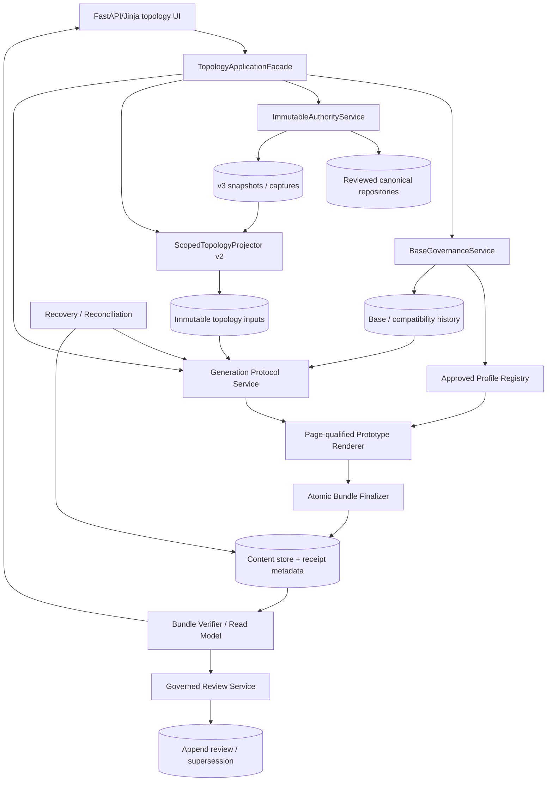
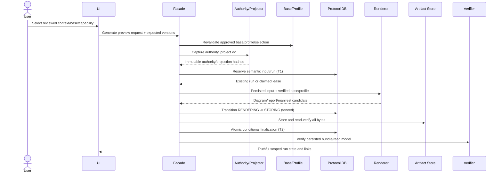
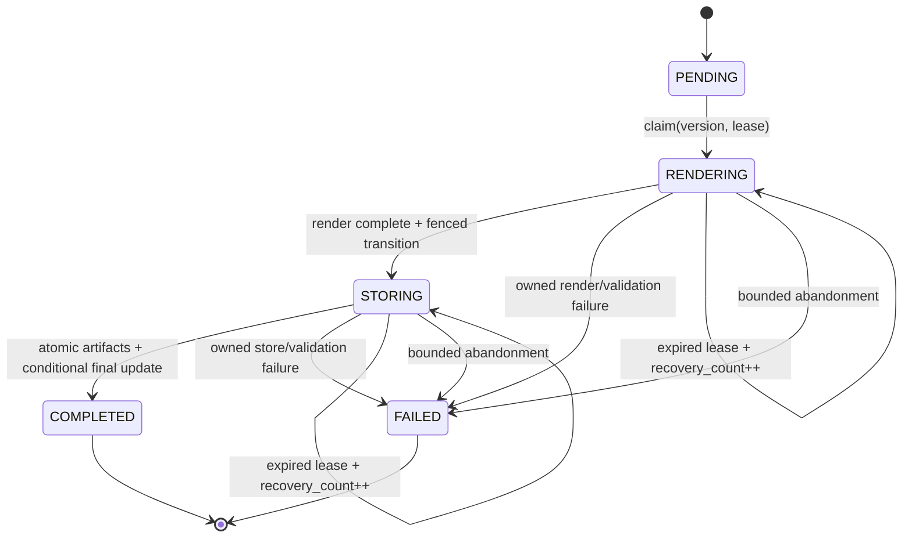
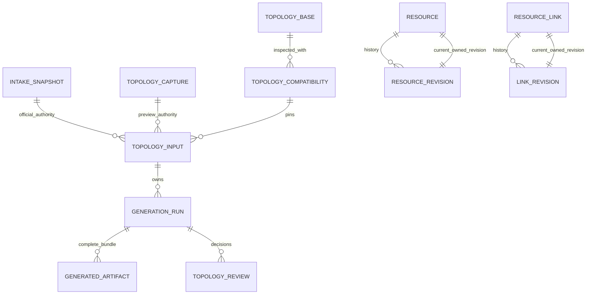

# Proposed Target Architecture

EV-ARCH-001; S15-C02. Status: PROPOSED, not approved or implemented. Grounded in the current FastAPI/Jinja/SQLAlchemy/Alembic/Draw.io modular monolith and the application-specific expected target.

## Architectural Principles

1. Reviewed canonical facts are the only application truth source; imports/AI remain candidate-only.
2. Selection filters explicit facts. It never supplies missing scope or category.
3. Immutable authority and typed projection are versioned independently and content-hashed.
4. Profile compatibility is semantic plus structural, not just marker/cell existence.
5. Renderer mutates only page-qualified approved regions by cloning approved prototypes.
6. Run transitions, finalization, recovery and review are atomically fenced.
7. HTTP/UI consumes one verified read model and never computes workflow truth from row presence.
8. Legacy artifacts remain readable and permanently mutation/review-ineligible.

## Component Model

## Component Contracts

| Component | Responsibility and contract | Failure behavior | Signals / verification seam | Required now? |
| --- | --- | --- | --- | --- |
| TopologyApplicationFacade | Only mutation/read entry for upload, compatibility, base review, preview/official request, inspection, run review | Typed domain error; no legacy mutation fallback | operation/run/correlation ID, outcome code | Yes |
| ImmutableAuthorityService | Atomically capture approved answers/resources/links/interfaces with epochs and provenance, or load verified official snapshot | Hash/schema/identity/epoch mismatch blocks | authority hash, excluded counts, epochs | Existing boundary repaired |
| ScopedTopologyProjector v2 | Produce typed scoped nodes/flows/categories/exclusions; exact deterministic identity | Missing/conflicting mandatory semantics block; UNKNOWN preserved | projection version/hash, counts/issues | Yes, first architecture dependency |
| BaseGovernanceService | Upload DRAFT, inspect compatibility, explicit approve/reject/supersede with actor/rationale/CAS | No automatic approval; stale base/profile blocks | base/profile/selection/parser pins | Existing service exposed via facade |
| Approved Profile Registry | Load only reviewed hash-pinned production/synthetic profiles; distinguish capability and target/template | Unknown/unapproved/profile-version mismatch blocks | profile/component hashes and approval metadata | Yes |
| Generation Protocol Service | Semantic reservation, lease claim, render handoff, fenced phase/failure transitions | One winner; stale worker cannot mutate | phase duration, row/recovery versions, lease outcome | Existing runner/repository repaired |
| Page-qualified Prototype Renderer | Clone exact prototypes; mutate governed fields/geometry/endpoints only; deterministic pages/IDs | No partial success; capacity policy explicit | per-page mutations, protected digest, semantic diff | Yes |
| Atomic Bundle Finalizer | Store/read-verify three artifacts then atomically publish metadata/terminal result under lease | Owned error -> fenced FAILED; stale lease -> no mutation | receipt hashes, bundle/result status | Existing path repaired |
| Bundle Verifier / Read Model | Revalidate authority/input/projection/policies/artifact bytes and derive inspection/review/retry states | Fail closed with typed reason | one state document used by UI/API | Yes |
| Governed Review Service | Authorized rationale/issue decisions, full verification, CAS decision, append audit/supersession | One decision winner; preview/legacy blocked | actor, self-review, decision/reason | Existing service repaired/wired |
| Recovery / Reconciliation | Exact run diagnostic, bounded recovery count, replay only immutable input | No current-answer rebuild/deletion; stale/terminal blocked | recovery count, prior/new lease, failure phase | Existing service repaired |

## Typed Projection v2

Required immutable fields:

- application/intake/authority IDs and hashes;
- selected contexts and explicit page-view intent;
- node identity: namespace, stable source ID, kind, lifecycle, environment/site/account/region state/value, provenance;
- flow identity: scoped source/target IDs, direction, relationship type, protocol, port, approved guide category/region, provenance;
- standard-content bindings distinct from application-derived nodes;
- exclusions/issues with stable IDs, code, subject, provenance, blocking status and authorized decisions;
- projection policy/version/hash.

Interface scope must originate from reviewed canonical fields or an append-only authorized scope decision associated with the canonical interface record. If no such source exists, scope is UNKNOWN. The implementation slice must decide the exact persistence design after source/data preflight; hardcoded route context is not acceptable.

Projection v1 remains readable for history but cannot be relabeled v2 or approved after the v2 release gate.

## Generation Sequence

Rendering occurs outside the DB transaction, but every durable transition is fenced and replayable from immutable input.

## Run State Machine

Approval is an orthogonal state: PENDING -> APPROVED or REJECTED once; APPROVED -> SUPERSEDED once. Preview/legacy can never enter this state machine. Reservation attempt number and recovery attempt count are separate columns.

## Suggested Data Model Changes

Additive changes after preflight:

- FK `gen_runs.input_id -> topo_inputs.id`, nullable only for historical legacy rows.
- CHECK/typed constraint: exactly one snapshot/capture authority matching input mode.
- Composite owned-current-revision constraints for resource/link heads.
- Explicit FKs/checks for typed review actor/run/base references.
- Dedicated `recovery_attempt_count`; atomic cap/increment in claim predicate.
- Interface reviewed scope fields/decision history sufficient for explicit context identity, design to be approved before migration.
- Enum/positive-state checks where portable and valuable.

Do not delete or rewrite legacy rows. Backfill/disposition violations before enabling constraints.

## Page/Profile/Renderer Design

- Production profile pins the exact supplied base/template family and target version.
- Every generated region includes page identity, container hierarchy, node/edge prototypes, semantic selectors, category/context, capacities and an explicit BLOCK or implemented continuation policy.
- Cell references are `(page ID/name, cell ID)`; generated semantic ID includes profile/region/scoped entity identity.
- Prototype clone preserves style, attributes and metadata; only governed label/endpoints/geometry/ID/parent fields change.
- Protected cells/edges receive before/after semantic digests and zero unauthorized mutations.
- The two application pages and 104 repeated page-local IDs are first-class acceptance conditions.

## Verified Read Model

One immutable response derives:

- authority label/hash/age/context;
- run phase/result/approval/recovery eligibility;
- projection/node/flow/exclusion counts and blockers/warnings;
- bundle metadata completeness plus verified byte availability;
- safe typed delivery URLs and error codes;
- base/profile/policy pins and supersession.

Routes and templates consume this model. Artifact links are present only when server delivery policy permits them. No template calculates readiness.

## Security Boundaries

- Capabilities separated for upload, compatibility inspect, base review, preview request, artifact inspect, official request/review/supersession.
- Scope every command/read by application+intake and expected row versions; preserve CSRF.
- Strict XML parser and bounded storage reads; no remote active assets or external viewer upload.
- Projection/profile allowlists prohibit contacts/notes/secrets as labels; reports/logs use bounded IDs/codes only.
- Content-Disposition filenames remain sanitized; typed errors never expose storage keys/paths or connection details.
- Self-review policy remains explicit and audited; do not invent two-person requirements.

## Observability

Stable events for capture/project/reserve/claim/render/store/finalize/verify/review/recover, each with correlation/run/input IDs, phase, outcome, bounded counts/duration, attempt/recovery number and exception class. No raw evidence, labels, tokens or credentials. Exact run diagnostic is separate from capped inventory.

## Current-To-Target Mapping

| Current | Target migration |
| --- | --- |
| Hidden PROD/SITE_A form | Explicit reviewed context decision/read model |
| StrictProjection 1.0 with lost semantics | Versioned projection v2 preserving scope/category/provenance |
| Synthetic profiles only | Synthetic retained plus approved application/template structural profile |
| New unstyled cells | Page-qualified prototype clones and protected-region verifier |
| Mixed legacy/governed route services | Single governed facade; legacy read-only |
| SELECT then final ORM mutation | Atomic conditional finalization transaction |
| attempt_number reused for recovery | Separate reservation/recovery counters |
| Metadata-row UI readiness | Verified read model shared by route/template/delivery/review |
| Historical COMPLETE claims | Corrective slices + commit/artifact-bound certification |

## ADR Proposals

### ADR-T01: Scoped Projection v2

- Context: projection loses scope/category/provenance.
- Decision: one immutable typed v2 identity contract; no selection fallback.
- Alternatives: profile inference/hardcoding rejected.
- Cost/risk: migration and historical dual-reader; high reversal difficulty once official artifacts use v2.

### ADR-T02: Reviewed Production Profile

- Context: only synthetic profiles exist.
- Decision: application/template-specific hash-pinned profile with approval metadata.
- Alternatives: hardcoded cells or universal target rejected.
- Migration: add profile package/version; historical profiles remain loadable/read-only.

### ADR-T03: Prototype Clone Renderer

- Context: prototype checks currently do not govern output.
- Decision: clone exact page-scoped prototypes and audit mutations.
- Alternatives: hand-built unstyled cells rejected.
- Risk: XML wrapper metadata/ID references require careful clone policy and visual evidence.

### ADR-T04: Uniform Fenced Protocol

- Context: inconsistent CAS/finalization/recovery semantics.
- Decision: all transitions are conditional DML with rowcount checks; separate recovery count.
- Alternative: process locks/queues rejected at current scale.
- Later assurance: bounded TLA+ after executable integration checks.

### ADR-T05: Governed Facade

- Context: legacy/governed routes bypass one another.
- Decision: one application facade; legacy mutation APIs inaccessible.
- Rollback: disable facade feature, retain history; never fall back to legacy mutation.

### ADR-T06: Verified Read/Delivery/Review Model

- Context: UI/server truth diverges.
- Decision: one verifier-derived model and mode-aware delivery.
- Cost: storage reads/cache policy; use bounded verification and explicit freshness.

### ADR-T07: Additive Relational Integrity

- Context: representable orphan/authority/current-revision states.
- Decision: preflight/backfill then additive FKs/CHECKs with restrictive retention.
- Alternative: service-only checks rejected for audit chain; destructive rewrite rejected.

## Migration and Rollout

1. Keep all mutation/approval flags default-off.
2. Add characterization/invariant probes in an approved sandbox.
3. Introduce projection v2 and dual historical reader; do not reinterpret v1.
4. Preflight/backfill additive schema constraints/counters.
5. Add reviewed production profile and renderer behind preview-only capability.
6. Wire governed facade/read model; retire legacy mutation endpoints internally.
7. Complete standalone real workflow, concurrency, cross-database, performance and visual target evidence.
8. Update canonical plans/HTML/operations; request separate official activation approval.

Deferred: automatic scheduler, artifact deletion, interactive graph viewer, graph database, event bus and microservice split.