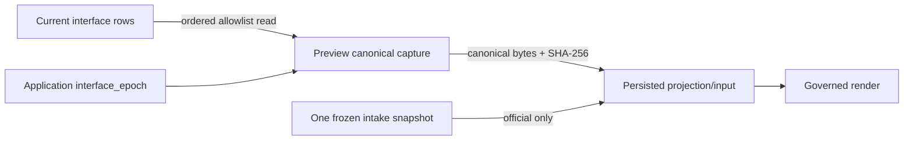

# Snapshot and Interface-Register Lineage

EV-DATA-002; S08-C02. Static inspection of five production files. No intake correctness review, database query, runtime execution or excluded-folder inspection.

## Official Snapshot Authority

`int_snaps` stores one immutable-intent snapshot per intake:

- PK `id`; unique `intake_id`; FKs intake, catalog release and creator actor; hash index.
- Persisted schema/catalog hash, exact canonical JSON, SHA-256, actor and timestamp.
- `SnapshotRepository` exposes create and reads by ID/intake/hash, with no update/delete methods. Unique intake prevents multiple normal snapshots for one intake.
- Governed official runner source previously inspected loads by ID, validates v3 canonical bytes/hash and row metadata, and requires frozen state before projection.

This provides strong normal-path immutability and one-snapshot cardinality. It does not make the row physically append-only at the database layer.

## Interface Register To Preview Capture

`interfaces` is deliberately current-state only:

- One row per application/counterpart record; application FK cascades on application deletion; created/updated actor FKs; index `(application_id, state, id)` supports deterministic active reads.
- Natural `interface_correlation_id` is intentionally not unique because distinct directions/connections can share it. Import duplicate detection is whole-row equality, not identity collapse.
- Row fields include category/location/endpoint/direction/protocol/ports and operational metadata, plus state, origin, actor/timestamps and row version.
- Application carries `interface_epoch`; intake carries `content_epoch`, both non-null counters defaulting to one.

Repository writes:

1. Create inserts ACTIVE row, then increments application interface epoch.
2. Update changes all business fields in place and increments row version; on one affected row, it increments the owning application epoch.
3. Retire sets RETIRED and increments row version/epoch.

Projection capture:

1. Select and lock the owning Application row with `FOR UPDATE`.
2. Read selected state (ACTIVE by default), ordered by row ID.
3. Emit only `PROJECTION_FIELDS`, converting timestamps to ISO strings.
4. Return the observed application epoch with the rows.
5. Governed preview code previously inspected embeds the result in canonical v3 authority and commits it before projection.

The exact allowlist and cross-dialect lock behavior are deferred to projection/persistence portability chunks. The source establishes the intended fence, not its concurrency behavior on every database.

## Provenance and Audit Boundary

- Interface current state retains origin, created/updated actor/time and row version. No interface revision table exists in these files; prior values are not reconstructible from this register alone.
- The immutable preview capture preserves the selected current view and epoch at capture time. It prevents later edits from changing already captured bytes, but it does not recover pre-capture history.
- Official snapshot rows preserve source bytes/hash but rely on application services and canonical validation for semantic/hash agreement.
- Intake/XLSX import behavior is outside scope by D-010. The relevant question is whether topology consumes existing reviewed data with adequate lineage, not whether import works.

## F-AUTH-002: Snapshot Immutability Is Not Database-Enforced

- FACT / VERIFIED static; severity Medium, elevated for official authority.
- Model comments say database constraints prevent update/delete, but inspected constraints are uniqueness/FKs/index only. The repository omits mutation methods, yet no trigger, privilege boundary or ORM event in these five files makes rows append-only.
- Impact: code with direct session/table access or administrative SQL can alter/delete an authority row without an append-only successor, while downstream trust is tied to that row and hash.
- Proposed change: first document the actual operational privilege boundary. Prefer append-only repository/service enforcement plus database permissions/audit controls; consider triggers only if supported operationally across Oracle/SQLite and worth their complexity. At minimum, add detection/receipt checks around authority consumption and never cascade-delete official authority silently.
- Acceptance proposal: authorized application paths have no mutation/delete command, unauthorized direct mutation is prevented or detected in the production database profile, and artifact/review validation fails closed after tampering. No database enforcement was tested here.

## F-DATA-004: Interface Row Version Does Not Provide Compare-And-Swap

- FACT / VERIFIED static; severity High for concurrent canonical edits.
- Model documentation describes row version as optimistic concurrency control. `update_record` and `retire_record` accept no expected version and their UPDATE predicates match only row ID. They increment the version but cannot reject a stale editor.
- Impact: two concurrent accepted updates can overwrite fields without a stale-write conflict. Both may advance the epoch, so capture fencing can detect/change epochs without preserving the losing reviewed value or preventing lost update.
- Proposed change: require expected row version for manual/import acceptance updates and retire operations, include it in the conditional UPDATE, require exactly one row, and surface a typed stale-write conflict. Keep epoch increment in the same transaction after a successful CAS.
- Alternatives: serialized application-wide locking reduces concurrency but is broader and still needs clear failure semantics; last-write-wins contradicts the audit/review expectations.
- Acceptance proposal: two independent stale writers yield one winner and one conflict; rollback leaves row and interface epoch unchanged; successful create/update/retire advances epoch exactly once. These are proposed future standalone/database checks, not executed results.

## Static Strengths and Remaining Risks

- Unique snapshot-per-intake aligns with repository scalar reads.
- Interface application/state/ID ordering supports deterministic input ordering.
- Whole-row duplicate handling avoids collapsing materially different rows solely by counterpart ID.
- Interface state/origin/direction vocabularies and row-version positivity have no CHECK constraints in the inspected model.
- `_application_id_for_record` runs after the row update, and missing updates return silently rather than a typed not-found/conflict. Call-site behavior is not inspected here.
- `FOR UPDATE` semantics and isolation differ by dialect; static code cannot certify a two-session capture fence on SQLite/Oracle.
- External identifier values are checked during preview capture but earlier source trace observed an empty identifier list in the v3 document. Full identity/provenance analysis remains for S09.

Next: inspect resource/link revision tables and repository selection in S08-C04, then assess portable type/migration behavior in S08-C03.