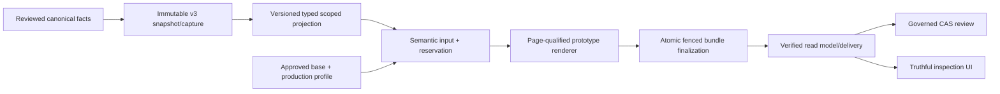

# Remediation Options

EV-OPTION-001; S15-C01. Options evaluated against EV-ROOT-001, the application-specific target, project invariants and current Python/FastAPI/SQLAlchemy/Draw.io stack. This is a recommendation, not implementation approval.

## Decision Criteria

- Preserves reviewed immutable authority, UNKNOWN, scope, provenance and conflicts.
- Can reproduce the two-page application target without hardcoding it universally.
- Removes legacy/governed bypasses and strengthens concurrency/audit integrity.
- Works on supported SQLite/Oracle design without unnecessary infrastructure.
- Supports small TDD slices, rollback and continued default-off containment.
- Produces objective semantic, artifact and visual evidence.

## Option A: Containment Only

Keep official generation/approval disabled, retain current preview as experimental, document all limitations and make no functional correction.

- Benefits: smallest immediate risk; no migration or renderer change.
- Costs: fresh upload-to-preview remains incomplete; output cannot reproduce the target; governance/integrity debt persists.
- Appropriate use: interim state while review/implementation approval is pending.
- Reversal: trivial.
- Decision: REQUIRED INTERIM CONTAINMENT, not an acceptable completion target.

## Option B: Evolutionary Governed Vertical Repair

Repair the existing pipeline in ownership order:

1. Typed canonical scope/category/endpoint/provenance projection.
2. Additive audit/current-revision constraints and uniform CAS transitions.
3. Application-specific versioned production profile.
4. Prototype-cloning, page-qualified structural renderer.
5. One governed application facade for base governance, preview, inspection and review.
6. Verified read model/UI and standalone end-to-end certification.

- Benefits: reuses working containment, canonical capture, repositories, safe parser, content-addressed storage and Draw.io output; defects can be isolated in small slices.
- Costs: requires coordinated contract migrations and a carefully reviewed production profile; some historical completion statuses reopen.
- Data impact: additive constraints/counters after preflight; immutable rows/history retained.
- API/UI impact: explicit base governance and context selection; stable verified artifact/error contracts; no new frontend framework.
- Operations: default-off throughout; later feature activation remains a separate decision.
- Reversal: high for migrated semantic identities if poorly designed, so projection/profile versions must coexist and historical artifacts remain readable.
- Decision: RECOMMENDED.

## Option C: Hardcode This Application's Target

Add special-case page names, fixed PROD/SITE_A, category lists, cell IDs and labels until this one output resembles the target.

- Benefits: superficially fast visual progress.
- Costs: invents scope, couples production logic to one artifact, bypasses canonical facts/provenance, fails future applications and makes upgrades unsafe.
- Security/integrity: high risk of exposing example/client labels and silently misclassifying relationships.
- Reversal: difficult once persisted runs/artifacts are treated as authoritative.
- Decision: REJECTED. The target is an acceptance example, not a universal rule source.

## Option D: New Parallel Topology Service / Graph Database / Queue

Build a new discovery/graph subsystem and migrate UI/rendering to it.

- Benefits: could provide strong graph queries and asynchronous orchestration at future scale.
- Costs: duplicates canonical authority, creates synchronization/migration/operations burden, and does not solve missing scope/category/profile decisions. No measured scale or live cloud-discovery requirement justifies it.
- Reversal: very difficult.
- Decision: REJECTED for current scope. Revisit only with measured query/throughput requirements the relational/Draw.io design cannot satisfy.

## Option E: Replace Draw.io With An Interactive Web Graph

Introduce React Flow/Cytoscape/D3 and make browser graph state the primary deliverable.

- Benefits: richer exploration/filtering potential.
- Costs: the approved deliverable is application-specific Draw.io; a viewer does not repair authority/projection/approval. It adds a frontend stack and two render contracts.
- Decision: REJECTED as remediation. A self-hosted read-only viewer may be a later optional consumer of the same verified graph.

## Recommended Architecture Shape

The architecture remains a modular monolith with relational persistence and filesystem/object storage. No route writes SQL, renderer reads mutable answers, or UI computes workflow truth.

## Required Decision Records

- ADR-T01: one typed projection identity with explicit scope/category/provenance; selection never supplies missing scope.
- ADR-T02: application-specific production profile layered over reusable standard profile rules; synthetic profiles remain test-only.
- ADR-T03: page-qualified prototype cloning and explicit overflow policy.
- ADR-T04: one atomic lease-fenced transition protocol and separate reservation/recovery attempt counters.
- ADR-T05: governed topology facade; legacy mutation paths permanently unavailable.
- ADR-T06: verified artifact/read/review model shared by HTTP and UI.
- ADR-T07: database constraints added only after preflight with historical legacy compatibility.

## Sequencing Trade-off

Do not build the production profile/renderer first. That would encode current projection defects and force later profile churn. Do not begin with broad UI polish; the read model is not truthful yet. Begin with executable characterization of the real workflow plus semantic/concurrency contracts, then profile/rendering, then web integration.

## Formal Methods

After executable state-transition checks exist, model reservation, leases, recovery, artifact finalization and review in a bounded TLA+ specification. Convert each counterexample into an integration check. Lean is not proportionate for the current risks.

## Stop/Go Gates

- Go to implementation only after user approves the first corrective slice.
- No profile/renderer slice until scope/category/identity contract is approved.
- No UI activation until governed base-to-preview journey and verified error contracts work.
- No official generation/review activation until all authority/concurrency/bundle gates and application-target visual signoff pass.