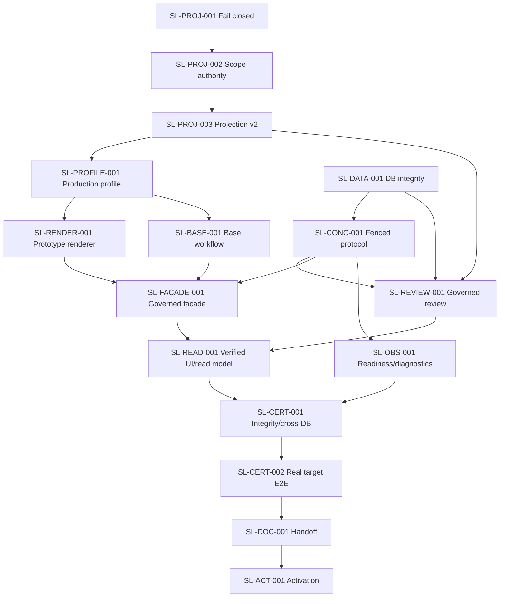

# Remediation Slice Dependency Plan

EV-PLAN-002; S16-C02. All slices are PROPOSED/NOT_STARTED. No implementation, test execution, commit, feature activation or canonical-plan publication is authorized.

## Slice Portfolio

| Slice | Priority / risk | Objective | Depends on | Release boundary |
| --- | --- | --- | --- | --- |
| SL-PROJ-001 | P0 / High | Fail closed instead of inventing interface scope | Containment | R0 Safety |
| SL-PROJ-002 | P0 / High | Add reviewed interface scope authority/decision contract | SL-PROJ-001; source decision | R1 Semantic authority |
| SL-PROJ-003 | P0 / Critical | Projection v2 with scoped endpoints, guide category and provenance | SL-PROJ-002 | R1 Semantic authority |
| SL-DATA-001 | P0 / High | Add authority/current-revision/review relational integrity | Data preflight; target contract | R1 Integrity |
| SL-CONC-001 | P0 / Critical | Uniform fenced finalization/failure/recovery and counters | Runtime approval for RED evidence; SL-DATA-001 where schema needed | R1 Integrity |
| SL-PROFILE-001 | P0 / Critical | Create approved production profile for supplied base/two-page target | SL-PROJ-003; guide decisions | R2 Target preview |
| SL-RENDER-001 | P0 / Critical | Page-qualified prototype renderer and explicit overflow | SL-PROFILE-001; SL-PROJ-003 | R2 Target preview |
| SL-BASE-001 | P1 / High | Expose governed base compatibility/review workflow | SL-PROFILE-001; SL-DATA-001 | R2 Target preview |
| SL-FACADE-001 | P1 / Critical | One governed application facade; retire legacy mutations | SL-CONC-001; SL-BASE-001; SL-RENDER-001 | R2 Target preview |
| SL-REVIEW-001 | P1 / Critical | Full authority/projection/bundle review and route CAS wiring | SL-PROJ-003; SL-DATA-001; SL-CONC-001 | R3 Governed review |
| SL-READ-001 | P1 / High | Verified read/delivery model and truthful UI states | SL-FACADE-001; SL-REVIEW-001 | R3 Governed review |
| SL-OBS-001 | P1 / Medium | Repair readiness, exact diagnostics and bounded telemetry | SL-CONC-001 for final states; can begin independently | R3 Operations |
| SL-CERT-001 | P0 gate / High | Standalone integrity/concurrency/cross-database certification | Runtime approval; R1/R3 slices | R4 Certification |
| SL-CERT-002 | P0 gate / Critical | Real application upload-to-target E2E, performance and visual signoff | R2/R3; SL-CERT-001 | R4 Certification |
| SL-DOC-001 | P1 / Medium | Publish corrected canonical plans/HTML/operations evidence | R4 evidence and user review | R4 Handoff |
| SL-ACT-001 | P0 human gate / Critical | Explicit reversible official capability activation | All prior slices; release approval | R5 Activation |

## Dependency Graph

## Critical Path

SL-PROJ-001 -> SL-PROJ-002 -> SL-PROJ-003 -> SL-PROFILE-001 -> SL-RENDER-001 -> SL-FACADE-001 -> SL-READ-001 -> SL-CERT-001 -> SL-CERT-002 -> SL-DOC-001 -> SL-ACT-001.

SL-DATA-001, SL-CONC-001 and SL-REVIEW-001 join before governed review/certification and are also release-critical.

## Parallel Work

- After contract approval, SL-DATA-001 and SL-PROJ-002 can proceed in parallel if they do not edit the same migration/contract files.
- Initial SL-OBS-001 readiness correction can proceed independently, but final diagnostics wait for SL-CONC-001 states.
- SL-BASE-001 workflow design may proceed alongside SL-RENDER-001 after the production profile exists.
- Detailed documentation drafting can progress from persisted evidence, but canonical publication waits for certification.

Do not parallelize projector/profile/renderer changes without frozen shared contracts. Do not merge concurrent migration slices without one migration owner.

## Quick Wins Versus Critical Repairs

- Quick wins: readiness undefined import, explicit HTTP error translation, truthful preview capture text, HTML generation metadata. These improve operations but do not enable generation.
- Critical repairs: scope/category identity, production profile, prototype renderer, finalization/recovery, governed route/review wiring.
- Never count quick wins as feature completion.

## High-Risk Spikes

- Portable interface scope-decision persistence and backfill/preflight.
- Composite current-revision constraints across SQLite/Oracle.
- Two-session stale-finalizer/recovery interleaving and emitted SQL.
- Prototype cloning with Draw.io wrappers/page-local IDs and protected metadata.
- Visual semantic matching to the application target without copying example values.

Spikes produce decisions/evidence, not permanent untested branches.

## Release Boundaries

- R0 Safety: current official/default-off plus SL-PROJ-001; useful preview may remain blocked.
- R1 Semantic/Integrity: projection v2, schema constraints and fenced protocol; no UI activation.
- R2 Target Preview: production profile, renderer, base workflow and facade; preview only.
- R3 Governed Review/Operations: verified read model, review, delivery, diagnostics; official still off.
- R4 Certification/Handoff: standalone cross-DB/concurrency/real target evidence and corrected docs.
- R5 Activation: separate user-approved feature/capability release and rollback drill.

## Deferred

Scheduler/background worker, artifact deletion, graph database, event bus, microservice split, external viewer and formal proof beyond bounded TLA+ remain deferred. Lean is not justified.

## Stop/Go Rules

- Each slice must be separately approved when required by its completion gate.
- A failed invariant reopens the owning slice; do not disposition it as broad quality debt.
- Runtime/database/browser work follows EV-RUNTIME-001 and separate go decisions.
- No slice automatically commits/pushes or starts the next slice.
- SL-ACT-001 cannot be approved from documentation or historical test counts alone.

Detailed specifications are generated one slice per S16 planning chunk and must contain the master prompt's complete slice fields.