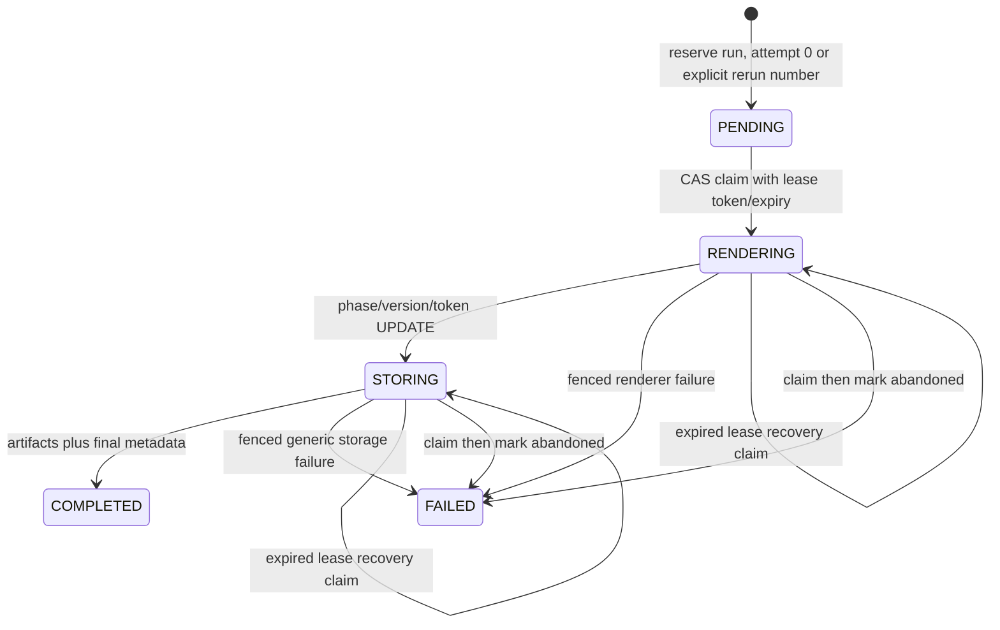

# Generation Run State and Recovery

EV-STATUS-001; S11-C01. Static inspection of RecoveryService, GenerationRun and repository reservation/lease/finalization/recovery methods. Prior finalization evidence is reused. No worker, database, clock or concurrent session executed.

## Observed State Path

- Duplicate semantic reservation without rerun reason returns the reserved run.
- Explicit rerun creates a new run attempt number using max+1, while the original semantic reservation remains.
- Lease claims and phase/failure transitions use conditional row-version/phase/token updates.
- Recovery replacement uses conditional row-version/old-token/expired-time update and assigns a new UUID token/expiry.
- Mark-abandoned is fenced by the replacement version/token and writes an audit/review record.
- Deletion/rebuilding from current answers is intentionally absent; reconciliation points to persisted input.

The final COMPLETED mutation remains a select-then-ORM-write path (H-PIPE-001), unlike neighboring conditional transitions.

## F-REC-001: Recovery Attempt Limit Uses A Counter Recovery Never Advances

- FACT / VERIFIED static; severity High.
- RecoveryService checks `GenerationRun.attempt_number >= 3` before claiming an expired lease.
- `attempt_number` is assigned during reservation: initial run is 0; explicit semantic reruns use max+1.
- `claim_expired_generation_run` changes lease token/expiry, row version and readiness only. It never increments a recovery counter or attempt_number.
- Consequences:
  - Initial attempt 0 can be recovered indefinitely; the stated three-attempt cap is ineffective.
  - A semantic rerun whose run attempt is already 3 is denied its first recovery, even though it has made zero recovery attempts.
- Proposed change: add a dedicated nonnegative `recovery_attempt_count` (or precisely rename/redefine the existing field), increment it atomically in the expired-lease conditional UPDATE, and include `< max` in that same predicate. Reservation attempt and worker-recovery attempt are separate concepts.
- Acceptance proposal: repeated expired claims succeed exactly to the configured bound under concurrency; healthy/terminal/stale claims fail; explicit rerun number does not consume recovery budget; rollback does not consume a count.

## F-REC-002: Inventory/Reconciliation Excludes Lease-Free Runs

- FACT / VERIFIED static; severity Medium.
- Repository `list_runs_with_leases` filters `lease_token IS NOT NULL` and orders oldest first.
- Recovery inventory and reconcile_run use only that method. COMPLETED/FAILED runs normally clear leases; PENDING runs can also be lease-free. Those runs are invisible to diagnostics/reconciliation.
- `reconcile_run` then scans only the first 100 inventory rows; a requested active run beyond that oldest-first slice is also reported not found.
- Impact: operators cannot use this service to inspect terminal bundle corruption, partial metadata, pending orphan runs or newer runs beyond the cap, despite the broad diagnostic method names.
- Proposed change: separate bounded inventory filters from exact scoped run reconciliation. Exact reconciliation should query the requested run directly, then inspect its bounded artifacts. Inventory should apply SQL LIMIT/order/filter parameters and report scope explicitly.
- Acceptance proposal: exact run lookup works for terminal, pending and leased phases; cross-intake/application authorization is enforced at caller boundary; inventory truncation never changes exact lookup truth.

## F-PIPE-002 Interaction

Explicit ArtifactFinalizationError bypasses immediate FAILED recording after STORING. Recovery can later claim that lease, but the ineffective counter makes repeated claims unbounded. Repair finalization failure semantics and recovery accounting together; neither should mask the other.

## Concurrency/Fencing Risk Still Requiring Execution

- `finalize_generation_run` selects version/phase/token, inserts artifacts, then mutates the loaded ORM row. GenerationRun has no inspected SQLAlchemy version mapper. The final write is not an explicit conditional UPDATE.
- A replacement recovery lease interleaving between SELECT and flush is therefore a high-risk stale-worker scenario. This remains H-PIPE-001 until emitted SQL/two-session behavior is independently observed in an authorized disposable environment.
- All other inspected lease transitions use rowcount-checked conditional UPDATE, which is the target pattern.

## Additional Status Observations

- Database CHECK constraints do not constrain phase/status/lease/completed-time combinations.
- Recovery attempt precheck occurs in a separate read session before the claim transaction; even a corrected counter must be enforced atomically in the claim predicate.
- Inventory caps returned rows but loads all leased rows before slicing, then performs per-run artifact queries/storage reads. It is bounded for returned work, not database query volume.
- Artifact read size is capped; hash/size classifications are useful and storage deletion is disabled.
- Error text for worker failure is sanitized to exception class/phase in the runner/finalizer paths previously inspected.

No scheduler, retry loop, service endpoint or operational alert was located in this chunk; absence is not a defect unless deployment requirements demand automatic recovery.