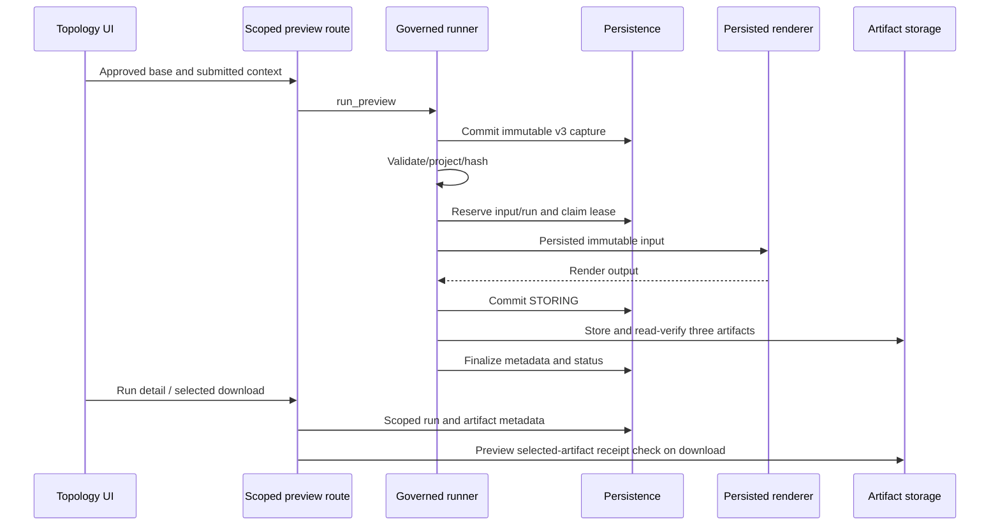

# Finalization, Review and Artifact Delivery

EV-FLOW-003; S02-C03. Static inspection of five files; no source edits, database connections, browser requests, concurrent execution, or excluded-suite evidence.

## Finalization Path and Positive Checks

- topology_finalization.py `finalize_render_output` loads run/input, stores DIAGRAM/GAP_REPORT/MANIFEST, retrieves each stored object, compares exact bytes and receipt SHA-256, validates result status/success agreement, then calls repository finalization within a committed UoW.
- `_verify_receipt` bounds retrieval to 50 MiB + 1 and rejects mismatched bytes/hash. `_bytes_value` checks diagram byte type/limit. Report/manifest serialization and validation behavior are distinct and must not be described as a single uniform typed contract.
- Repository `transition_leased_generation_phase` and `_fail_leased_run` use conditional UPDATE predicates for ID/version/phase/lease and require exactly one affected row. Failure clears lease fields and records FAILED.
- `finalize_generation_run` instead selects a row by ID/version/STORING/lease, inserts artifact metadata in a nested transaction, assigns completion/status/pins/lease fields on the ORM instance, increments row_version, and flushes. Outer UoW handles commit.

## F-PIPE-002: Validation Failures Bypass Terminal Failure Recording

- FACT / VERIFIED static, High.
- Explicit finalization errors include read-back mismatch, unsupported/status disagreement, invalid output type, and selected manifest-pin mismatches.
- `except ArtifactFinalizationError: raise` bypasses `_record_finalization_failure`, which is called only from the generic exception handler. The runner previously committed STORING and catches this error only to raise GovernedRunnerError (EV-FLOW-002).
- Expected consequence: a current worker's invalid/corrupt output can be rejected while its run remains nonterminal until recovery or another actor handles it. No persisted runtime row was inspected in this review.
- Proposed correction: distinguish stale-lease conflicts from current-worker validation failure, and perform the same fenced failure transition for owned validation failures. Never let an old worker overwrite a replacement lease.
- Acceptance proposal: each owned validation failure yields a sanitized FAILED run with no committed partial bundle; stale-worker validation cannot mutate the replacement worker's state. Verify with independently designed failure-injection probes after authorization.

## H-PIPE-001: Finalization Race Needs Independent Proof

- HYPOTHESIS / PARTIALLY_VERIFIED, High risk.
- Source fact: lease/version checks appear in a SELECT, not in the explicit conditional UPDATE pattern used by neighboring mutation methods. The SELECT has no explicit for-update lock in this method.
- Inference: an interleaved recovery/lease replacement could occur between check and final ORM write unless mapper/database behavior supplies an equivalent fence.
- Not yet inspected: full GenerationRun mapper version configuration, emitted SQL, supported-database isolation, and independent-session interleaving.
- Next discriminating check: inspect mapper/base configuration, then, only with authorization, capture the final UPDATE predicate and perform a synthetic two-session lease-replacement schedule. Prior excluded-suite probes/results are not evidence.
- Proposed design, subject to confirmation: one conditional completion UPDATE coupled transactionally with all artifact rows. No repair is performed here.

## Manifest Validation Observation

`_manifest_bytes` supports mapping/dataclass conversion, but status and pin checks later inspect the original object only when it is a dict. Pin comparisons also run only when each field is present. Missing fields or non-dict supported representations therefore do not receive equivalent validation in this function. Verify actual renderer representation and mandatory manifest schema in S10/S11 before classifying concrete affected outputs; do not assume hashes alone establish semantic authority.

## F-UI-003: Inspection Flag Does Not Gate Downloads

- FACT / VERIFIED static, Medium.
- view_generation_run computes inspection_ready from COMPLETED, acceptable result status, and all three artifact rows. It does not retrieve/hash-check bytes while producing the page.
- run_detail.html lines 320-394 uses inspection_ready only to select explanatory text; each active link is controlled by the corresponding individual artifact variable.
- A partial metadata bundle can therefore display an incomplete warning and active links simultaneously. A metadata-complete bundle is labeled receipt-verified before bytes have actually been verified for this page.
- Proposed correction: separate metadata completeness, verified availability, and failed/incomplete inspection states; use the agreed inspection policy consistently for controls and server authorization. Do not advertise byte verification based solely on row presence.
- Acceptance proposal: partial/missing/corrupt and failed-run fixtures show truthful states and governed download behavior; complete valid output is inspectable. These are proposed standalone checks, not existing-suite assertions.

## Delivery Boundary

- Routes require TOPOLOGY_ARTIFACT_DOWNLOAD and scoped run lookup. Preview diagram/report use TopologyReviewService.verified_preview_artifact; non-preview paths use the existing generation service. Manifest route calls the preview-only verifier unconditionally.
- verified_preview_artifact checks mode DRAFT_PREVIEW and phase COMPLETED, loads the selected artifact row, then verifies selected byte count/hash. It does not validate the entire bundle or require a particular result status.
- Missing/corrupt artifact conditions raise TopologyReviewError. The inspected route functions do not translate that exception to explicit 404/409 responses. No actual response status is claimed without runtime/global-handler verification.
- Non-preview verified_artifact requires APPROVED before selected receipt verification, but the inspected diagram/report routes do not call that method for non-preview runs.
- Official review POST is feature-gated and calls the older TopologyGenerationService.approve_generation_run, not TopologyReviewService.review_run. Activation must not be reduced to flipping the feature flag; route/service wiring needs an explicit release slice.

## F-AUTH-001: Service Review Does Not Revalidate Projection and Source Authority

- FACT / VERIFIED static, High for future official activation. No successful invalid approval was executed.
- `_validate_reviewable_run` checks official mode/authority strings, completed reviewable state, pending approval, input presence, base/compatibility pins, selected run/input field agreement, all three artifact receipts, manifest hash/status, readiness status/blockers and warning rationales.
- The complete inspected method does not hash/parse input projection_json against projection_sha256, fetch/revalidate a persisted source snapshot, or recompute the semantic input identity. Presence and selected pin equality are not full immutable-authority verification.
- `review_run` calls this method before the repository review CAS. String authority labels do not prove valid frozen snapshot provenance.
- Proposed correction: revalidate canonical projection and source snapshot/capture mode, full immutable identity/policy pins, and bundle association before review mutation. Use shared verified contracts rather than unchecked metadata labels.
- Acceptance proposal: malformed/mismatched projection, absent/wrong-scope/nonfrozen snapshot, and altered identity/policy pins reject without a review mutation; valid pinned official bundles remain reviewable. Keep preview/legacy unapprovable and official UI disabled until verified.

## Current Component/Sequence Summary

This diagram summarizes observed source calls, not a completed browser journey. Transaction race/failure properties require further proof. Stage 02 is complete as an active-path source trace, not implementation certification.