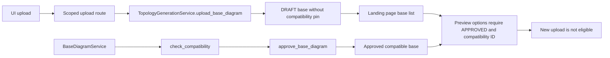

# Upload to Governed Base: Static Trace

Evidence EV-FLOW-001. Chunk S02-C01. Five production files inspected; no application/browser/database execution and no excluded-suite evidence.

## Verified Current Path

1. topology/index.html upload form POSTs multipart data to the scoped `/applications/{app_id}/intakes/{intake_id}/topology/upload-base` route, with CSRF, file, and variant.
2. web/routes/topology.py `upload_base_diagram` checks application/intake ownership, TOPOLOGY_BASE_UPLOAD capability, CSRF, a bounded-read helper, and empty content before calling the injected TopologyGenerationService. The helper's implementation is not inspected in this chunk.
3. `get_topology_service` constructs TopologyGenerationService using the configured session factory/evidence root, not BaseDiagramService.
4. topology_generation.py `upload_base_diagram` validates XML through its existing validator, hashes bytes, checks intake existence, stores bytes, creates a base row, commits, and returns. The validator/storage helpers were not inspected here; do not claim their security properties from the call names.
5. The create call supplies no review_state or compatibility_id. models_topology.py `TopologyBaseArtifact.review_state` at line 51 defaults DRAFT; compatibility_id at line 64 is nullable. Upload does not invoke compatibility or approval.
6. The route redirects back to the landing page (303). Uploaded records are listed by the same generation service.
7. The preview form is shown when any base record exists, but its options require `review_state == 'APPROVED' and compatibility_id`. A newly uploaded DRAFT row does not qualify. The form can therefore contain an empty required select while still showing its submit button.

The separate BaseDiagramService path is an available service abstraction, not an established UI journey.

## Existing Governance Abstraction

- base_diagram.py `upload_base_diagram` validates/stores bytes and compares the storage receipt hash; upload itself has no approval effect.
- `check_compatibility` reloads verified bytes, checks trusted profile and selection ownership, runs inspect_base, writes a compatibility record, and uses expected_row_version to mark the base compatible in a nested transaction.
- `approve_base_diagram` requires COMPATIBLE, replays inspection, verifies profile/selection/capability and persisted compatibility results, and invokes repository review with rationale/version.
- These bodies support reuse for a future governed web workflow; repository atomicity, authorization ownership at a future route, and outer commit management still require separate verification.
- Scoped web search for `BaseDiagramService|approve_base_diagram|check_compatibility|governed-base` returned no matches. This supports absence of direct named web integration in the current source. Dynamic indirect wiring has not been proven impossible.

## F-UI-001: Uploaded Base Cannot Reach Preview Eligibility Through the Exposed Workflow

- Kind: FACT / VERIFIED static; severity: High; likelihood: routine for a fresh UI upload.
- Evidence: topology.py upload dependency/call; topology_generation.py create payload; models_topology.py defaults; index.html approval filter; empty named-governance web search.
- Gap: Visible step 1 produces a record that visible step 2 will not accept, with no observed route for the required compatibility/approval transition.
- Impact: Users can upload but cannot complete the supported preview journey from a fresh base without an external/preexisting governance operation. No runtime/browser attempt was made here.
- Proposed change: Wire authorized, scoped compatibility inspection and explicit base review using the existing service boundary, display findings/pins/version, and expose preview only when at least one eligible base exists. Preserve candidate/approval separation; never auto-approve uploads or weaken the selector.
- Alternatives: Keep a documented administrator/CLI preparation path with a truthful UI limitation; or explicitly defer the upload-to-preview experience. Do not claim full UI completion in either case without the declared workflow.
- Schema impact: Existing service/model concepts appear reusable; no new schema is justified by this chunk alone. API/UI impact: scoped governance commands and useful eligibility/error states.
- Proposed acceptance: A synthetic fresh upload remains DRAFT; authorized compatibility and explicit review produce an eligible base; unauthorized/stale/incompatible transitions fail; the actual preview route consumes that record. No seeded terminal run can substitute for this journey.

## F-UI-002: Hidden Fixed Scope and Page

- Kind: FACT / VERIFIED static; severity: Medium pending route/profile trace.
- index.html sends hidden capability LABEL_ONLY, environment PROD, site_id SITE_A, and page_name Overview for every preview submission.
- Users cannot choose or verify a different approved scope/page through this form. Source/header labels saying generation is unavailable coexist with an active preview command; readiness text is not a clear distinction between preview and official authority.
- Proposed change: Derive allowed choices from reviewed base/profile compatibility and canonical scope, show the selected scope explicitly, and reject unsupported combinations. Do not infer PROD/SITE_A from missing evidence.
- Runtime impact depends on the route/runner validation inspected in S02-C02; wrong output or successful scope bypass is not claimed here.

## Boundaries and Follow-Up

- No XML source/reference artifact was changed. No private values were extracted.
- Source findings are independent of prior test reports and historical probes.
- Continue with preview request parsing, immutable capture, and reservation. Keep official generation/approval disabled and do not repair the gap during investigation.