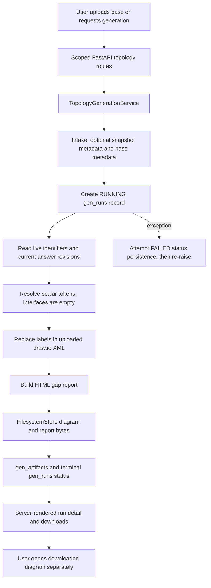
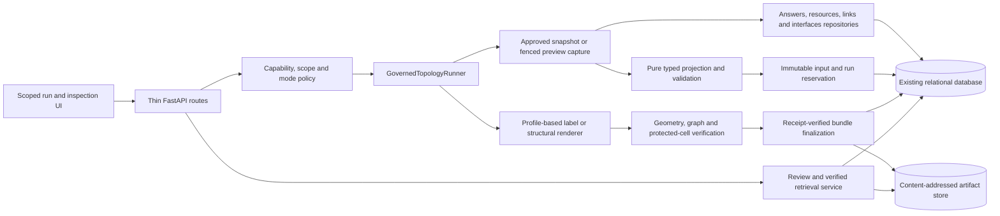

# Topology Review and Implementation Plan

## Next-Shift Session Handoff — 2026-09-23

### Current checkout and operating boundary

This Markdown file is the editable source of truth; keep `docs/topology-implementation-plan.html` and `STATE.md` synchronized. Branch: `ag1766_diagr_v4`. The latest user synchronization before the current TP14/TP15 work was commit `9eb1a71`; inspect `git status`, `git diff --stat`, and recent log before changing anything because substantial TP14/TP15 certification and repository-remediation work is currently uncommitted. Do not reset or discard the working tree.

The application is an intake-evidence-to-draw.io generator, not an AWS inventory collector. Imports and runtime AI create candidates only; reviewed canonical facts feed immutable v3 authority, typed projection, governed rendering and content-addressed artifacts. Official generation and external approval remain disabled. Governed draft preview is available, clearly non-authoritative, and its downloads are receipt-verified. Never restore mutable live-answer official generation, infer absent facts, weaken UNKNOWN/scope/provenance/hash/CAS/lease/parser protections, expose secrets, or use private `_data` fixtures.

### Completed slices and current evidence

- **TP01–TP08 COMPLETE:** containment/capabilities; schema/ORM parity; reservations/CAS; human-approved guide policy; interface epoch fencing; immutable v3 authority; typed nodes/flows/exclusions; repeated-region/profile/safe XML contracts.
- **TP09 COMPLETE:** selector-driven repeated nodes/edges, SHA-256 semantic IDs, exact endpoints, fixed-grid layout, protected-region writes, bounded labels and safe overflow. Focused renderer evidence: `58 passed`.
- **TP10 COMPLETE:** diagram/report/manifest store-read-verify and atomic metadata completion under lease/CAS; sanitized failure persistence and truthful shared status. Focused evidence: `24 passed`.
- **TP11 COMPLETE:** scoped governed preview POST, immutable capture/projection/reservation/render/finalization, duplicate reuse and receipt-verified diagram/report/manifest routes. Route evidence: `20 passed` at completion.
- **TP12 COMPLETE:** full bundle/base/input/compatibility/profile/policy revalidation, typed warning rationales, append-only review/supersession and CAS. Focused evidence: `68 passed`, zero skips.
- **TP13 COMPLETE:** truthful authority/phase/preview/gap/failure/incomplete UI, verified download inspection, no preview approval controls, desktop/mobile Playwright evidence. Route/template evidence `21 passed`; focused browser evidence `5 passed, 9 deselected`.
- **TP14 COMPLETE:** capped read-only inventory, bounded artifact reads, three-attempt recovery cap, UUID lease fencing, old-worker rejection and sanitized abandoned failure. Focused evidence: `19 passed`.

### TP15 certification completed so far

- Authorized nonprivileged Oracle schema using python-oracledb Thick mode; secret values were never printed.
- Oracle Alembic upgraded `0021 -> 0022`; head is `0022`.
- Oracle portable types `21 passed`; smoke `1 passed`; topology unique/FK/CAS/lease parity `2 passed`; populated non-destructive 0022 fixture `1 passed`.
- Complete SQLite topology/schema/migration/web selection: `376 passed`, zero collection errors.
- Governed rerun semantics corrected: initial attempt 0, explicit rerun allocates next attempt, lease claim does not increment.
- Approved D06 budget: 5,000-row p95 <= 3s, peak <= 32 MiB, authority <= 2 MiB, 5,001 nodes/5,000 flows. Repeatable 10/100/1,000/5,000 test now reports `4 passed`; redacted JSON/JUnit receipts are in `.pytest_cache/tp15-evidence/`.
- Three independent migrated Playwright restart journeys report `3 passed`; diagram/report/manifest bytes and SHA-256 remain identical after restart. Review package: `docs/output/tp15-signoff/`.
- Local Docker image builds through BuildKit secret mounts for the internal pip index. Compose runs healthy at `http://localhost:8000`; SQLite is volume-backed at `/app/data/local.db` and migrated to 0022. Do not pass the host Oracle client path into the Linux SQLite container.

### TP15 blockers and repository-wide remediation

TP15 remains **IN_PROGRESS**. Broad pytest remediation is active: one LLM-config fixture mismatch is fixed and stale browser/UI expectations are being updated. Latest full broad baseline remains `2663 passed, 84 failed, 32 skipped, 0 errors`; a non-browser rerun with `-m "not browser"` reached `1987 passed, 1 failed, 37 skipped` before stopping at the first remaining failure. Skip classification is in `.pytest_cache/tp15-evidence/full-skip-classification.txt`: Oracle opt-in cases were executed separately; the removed governed-base journey is replaced; Windows symlink is platform-limited; catalog bootstrap/configured actor/two AI routes need release disposition. Current mypy baseline is `318 errors in 68 files`. Ruff safe autofix reduced `1231 -> 398` remaining errors (`949` fixes applied). The user approved repository-wide remediation in order: pytest, mypy, then Ruff; do not weaken configs or mass-fix blindly.

Oracle E2E is now repaired to current repository contracts, seeds a real synthetic catalog section/question, runs in-process after Thick-mode initialization, and uses deterministic `try/finally` cleanup without dropping/resetting the authorized schema. Oracle TP15 bundle evidence (`portable types`, `smoke`, `parity`, `populated migration`, `oracle e2e`) reports `26 passed` with JUnit at `.pytest_cache/tp15-evidence/oracle-tp15-bundle.xml`. Manual diagram signoff is complete (user approved the regenerated non-empty `docs/output/tp15-signoff/journey-1-diagram.drawio`).

### Remaining order

1. Continue broad pytest remediation: finish browser/UI stale expectation updates (especially design-options tests now moved from removed `/design-options/...` paths to current `/applications/design-options/...` routes), then rerun full pytest.
2. Resolve full-project mypy, then Ruff semantic remainder (`398`), without security-policy changes or blanket exclusions.
3. Rerun full pytest/mypy/Ruff, topology/Oracle/performance/browser gates and `git diff --check`; update the TP15 evidence ledger. Mark TP15 COMPLETE only when all required gates pass or have explicit release disposition.
4. **TP16 must not start** until TP15 is complete and explicit human release approval is recorded. Official generation/approval remain default-off.

### Next-shift email draft

Subject: TP15 handoff — Oracle complete, broad pytest/mypy/ruff remediation still open

Hi next shift team,

TP15 is still `IN_PROGRESS`. Oracle is fully certified in Thick mode: portable types + smoke + topology parity + populated migration + Oracle E2E run together and report `26 passed` (`.pytest_cache/tp15-evidence/oracle-tp15-bundle.xml`). SQLite topology (`376 passed`), D06 performance (`4 passed`), and TP15 restart/hash browser evidence (`3 passed`) are complete. Manual diagram signoff is complete (user approved `docs/output/tp15-signoff/journey-1-diagram.drawio`).

Remaining blockers are broad quality gates only. Pytest remediation is active: one LLM fixture mismatch is fixed; workspace card expectation is updated to six; design-options browser tests are being migrated to current `/applications/design-options/...` routes. Full pytest baseline still references `2663/84/32`; non-browser rerun reached `1987 passed, 1 failed, 37 skipped` before the first failure stop. Mypy baseline is now `318 errors in 68 files`. Ruff safe autofix reduced `1231` to `398` remaining.

Please continue in this order: finish pytest/browser stale expectations, then mypy, then Ruff semantic remainder. Do not weaken configs, do not re-enable official generation/approval, and keep Oracle runs non-destructive on the authorized disposable schema. After gates are green (or explicitly dispositioned), update STATE + both plans and then propose TP15 completion.

Thanks.

### Resume commands

- SQLite topology: `.venv/Scripts/python.exe -m pytest -q tests/unit/topology tests/contract/persistence/test_topology_schema_parity.py tests/integration/migrations/test_sqlite_upgrade.py tests/integration/web/test_topology_routes.py`
- Performance: `.venv/Scripts/python.exe -m pytest -q tests/performance/test_topology_tp15_budget.py`
- Browser restart: `.venv/Scripts/python.exe -m pytest -q tests/browser/test_tp15_restart_certification.py`
- Broad: `.venv/Scripts/python.exe -m pytest tests/ -v`, then mypy and Ruff commands from `AGENTS.md`.
- Oracle tests must initialize Thick mode in the same Python process before invoking pytest; never print the URL/client path or run destructive clean-schema tests against the current authorized schema.

| Slice | Description | Status | Dependencies | Next Action |
|---|---|---|---|---|
| TP01 | Contain unsafe generation and enforce route capabilities | COMPLETE | Approved and verified 2026-09-22 | Preserve fail-closed boundary; TP02 is next |
| TP02 | Reconcile governed migrations and ORM metadata | COMPLETE | TP01 complete; verified 2026-09-22 | Preserve parity; TP03 is next |
| TP03 | Restore governed repository and reservation contracts | COMPLETE | TP02 complete; verified 2026-09-22 | Preserve contracts; TP04 decisions are next |
| TP04 | Approve guide rules and synthetic mapping contract | COMPLETE | Human approval and fixtures verified 2026-09-22 | Preserve policy version; TP05 is next |
| TP05 | Add deterministic interface reads and mutation fencing | COMPLETE | TP03/TP04 complete; verified 2026-09-22 | Preserve epoch fencing; TP06 is next |
| TP06 | Version immutable authority and capture interface lineage | COMPLETE | TP05 complete; verified 2026-09-22 | Preserve v3 authority; TP07 is next |
| TP07 | Build pure typed node and relationship projection | COMPLETE | TP04/TP06 complete; verified 2026-09-22 | Preserve typed projection; TP08 is next |
| TP08 | Define repeated-node and edge profile contracts | COMPLETE | TP04/TP07 complete; verified 2026-09-22 | Preserve profile/parser contracts; TP09 is next |
| TP09 | Render and verify repeated nodes and edges | COMPLETE | TP08 complete; verified 2026-09-22 | Preserve renderer invariants; TP10 is next |
| TP10 | Finalize governed artifacts and truthful run status | COMPLETE | TP03/TP06/TP09 complete; verified 2026-09-23 | Preserve atomic bundle/status; TP11 is next |
| TP11 | Wire governed preview and scoped artifact contracts | COMPLETE | TP01/TP10 complete; verified 2026-09-23 | Preserve preview boundary; TP12/TP14 are next |
| TP12 | Harden review, integrity and supersession | COMPLETE | TP10/TP11 complete; verified 2026-09-23 | Preserve review integrity; TP13 is next |
| TP13 | Complete run UI states and diagram inspection | COMPLETE | TP11/TP12 complete; verified 2026-09-23 | Preserve truthful UI; TP14 is next |
| TP14 | Recovery, bounded retries and diagnostics | COMPLETE | TP10/TP11 complete; verified 2026-09-23 | Preserve bounded recovery; TP15 is next |
| TP15 | Cross-database, load and end-to-end certification | IN_PROGRESS | TP12/TP13/TP14 complete; disposable Oracle authorized 2026-09-23 | Run Oracle/SQLite/load/browser certification |
| TP16 | Explicit official activation and operational handoff | NOT_STARTED | TP15, release approval | Keep official generation disabled until certified |

## Review Baseline and Authority

- Review date: 2026-09-22. Checkout: `b787d51`, branch `ag1766_diagr_v4`.
- Scope: review and documentation only. No production implementation is authorized.
- Requested sources: [HTML assessment](../TOPOLOGY_GENERATION_ASSESSMENT.html) and [Topology Guide DOCX](../architecture/Topology%20Guide.docx).
- The HTML is an assessment, not proof of current runtime behavior. The DOCX is a requirements source, not an approved executable policy.
- [STATE.md](../../STATE.md) contains conflicting historical claims. Earlier test counts and certification notes must not be carried forward as evidence for this checkout.
- Evidence categories: **CONFIRMED STATIC** means inspected code; **EXECUTED** means a recorded command completed; **UNKNOWN** means not established. A test existing is not evidence that it passes.
- Implementation slices remain `NOT_STARTED` until explicitly approved. No slice may be marked `COMPLETE` without all acceptance criteria and required checks passing.

## Confirmed Initial Findings

1. The active HTTP workflow calls `TopologyGenerationService`, not `GovernedTopologyRunner`: [routes](../../src/migration_intake/web/routes/topology.py#L79).
2. The service records snapshot metadata but `_generate_diagram()` ignores `_snapshot` and calls `extract_topology_data(session, intake_id)`: [service](../../src/migration_intake/application/services/topology_generation.py#L590). This can label mutable live-answer output as snapshot-backed.
3. The active renderer is label replacement over an uploaded draw.io document, not AWS API resource discovery or relational graph storage.
4. The guide's editable paragraphs request inbound interfaces grouped by columns N/R, partitioned by column G into internal, AWS and Azure sections. Direct image review confirms IN/OUT examples conflict with inbound-only prose; direction, identity mappings and exact machine styles require explicit approval.
5. The governed runner imports `GenerationConflictError` and calls capture/input/compatibility repository methods, whereas the inspected topology ORM exports only the three legacy classes. Migration and repository parity must be proven before route activation.

## Execution Rules

- One approved slice per pull request; never combine activation with foundation repairs.
- Preserve current public paths where practical; keep routes thin and workflow decisions in services/domain policies.
- Use synthetic fixtures and disposable databases. Do not load the workspace `.env`, connect to Oracle, use private evidence, or call an external model during routine checks.
- Never infer missing application values, resource scope or approval from absence. Preserve conflict candidates and provenance.
- No node/edge tables, AWS collectors, background queue or external viewer are assumed to exist. New components must be explicitly identified as proposed.
- At slice completion, record files, tests, exact commands, outcomes, database/API/UI validation and remaining issues; identify the next dependency-ready slice. A failed or skipped required gate means `BLOCKED` or `IN_PROGRESS`, never `COMPLETE`.

## Current Architecture

**This is an intake-evidence-to-draw.io generator, not an AWS inventory collector.** No AWS discovery step is present in the traced HTTP generation path. AWS SDK discovery, scheduled reconciliation and a graph JSON API are **UNKNOWN / not established capabilities**; adding them would require separate product approval. In this plan, discovery means reading reviewed intake/register evidence, not interrogating AWS accounts.

There are two distinct implementations. The active [HTTP routes](../../src/migration_intake/web/routes/topology.py) construct `TopologyGenerationService`. Its [generation method](../../src/migration_intake/application/services/topology_generation.py#L246) calls the legacy adapter and label filler. The separate [GovernedTopologyRunner](../../src/migration_intake/application/services/topology_runner.py) provides an immutable-input orchestration foundation but is not wired to those routes and depends on missing persistence contracts. Its existence does not prove production functionality.

### Current Flow



| Requested stage | Actual implementation, inputs and outputs | Reads / writes | Failure, retry, tests and gaps |
|---|---|---|---|
| 1. Start | `generate_topology` route calls `TopologyGenerationService.generate_topology(intake_id, base_artifact_id, actor)`; form selection becomes a run and redirect | Intake and base lookup; inserts `gen_runs` | Readiness/scope/CSRF validation exists. Capability denial and fail-closed expectations diverge from route code. See route tests; no automatic retry in this service. |
| 2. Discover AWS resources | Not an implemented stage in this call chain. `extract_topology_data` reads intake evidence, not AWS APIs | Application identifiers and current answer revisions | No confirmed region/account enumeration, permission-denied or throttling handling. Do not promise AWS completeness. |
| 3. Normalize | [adapter](../../src/migration_intake/topology/adapter.py), [resolution](../../src/migration_intake/topology/resolution.py) and binding configuration create `TopologyData` and scalar tokens | Live SQLAlchemy reads, no normalized graph persistence | Missing/ambiguous facts are represented by unresolved tokens/issues; adapter answer-field contract needs repair. Interfaces are explicitly empty. |
| 4. Create nodes | [fill_diagram](../../src/migration_intake/topology/fill.py) updates labels of existing cells in the uploaded XML | No node-table writes | Existing geometry/structure are preserved. This does not discover or create arbitrary resource nodes. Separate governed `render_structural` only adds profile-declared cells. |
| 5. Create edges | Existing base XML supplies its edges; active service has no interface relationship builder | No edge-table writes | Direction, relationship completeness and repeated interface edges are not inferred or validated against register evidence by this path. |
| 6. Save | Service writes content-addressed diagram and report, then `gen_artifacts` metadata and run status | `topo_base`, `gen_runs`, `gen_artifacts`; external filesystem blobs | Bytes precede database commit; partial blobs/rows are possible on failure. Catch attempts to commit FAILED then re-raises; commit failures themselves are not durably recovered here. Successful path always persists READY_FOR_REVIEW even when report says GENERATED_WITH_GAPS. |
| 7. Retrieve | Scoped run lookup and artifact download routes call the service/repository | Run/artifact metadata and stored bytes | This is HTML/download retrieval, not a paginated topology-node/edge API. Legacy artifact retrieval does not recompute receipt hashes. |
| 8. Display | [topology templates](../../src/migration_intake/web/templates/topology/index.html) display forms, run status and download actions | Service read models; no browser graph store | No embedded node canvas is established. Zoom/pan/selection/search in an external draw.io editor is not an application feature. Browser journey exists but is not current passing evidence. |

### Evidence Discipline

- Tests below are evidence of intent until execution is recorded. Missing import contracts and module-level skips must not be relabeled as passing tests.
- The interrupted response saved only the initial plan. Its transport/interruption cause is **UNKNOWN**; no application restart is implied or needed to resume documentation.
- Re-review baseline is the current checkout, not older certification counts, local Oracle sessions or claims in historical handoffs.

## Source Comparison

Both requested documents were read. DOCX text was extracted through ZIP/XML APIs and all 11 embedded PNGs were viewed locally. No private workbook was opened to reproduce the HTML's customer-specific metrics.

| Source statement | Code or direct-document evidence | Assessment |
|---|---|---|
| HTML sections 1-3: HTTP uses legacy generation | `get_topology_service`, `TopologyGenerationService._generate_diagram` | Confirmed. Do not mistake the separate governed runner for the deployed route. |
| HTML: interfaces are ignored | [extract_topology_facts](../../src/migration_intake/topology/adapter.py#L157) returns `interfaces: []` | Confirmed; resource and link registers are also absent from this active adapter. |
| HTML: snapshots/captures omit interfaces | [SnapshotService](../../src/migration_intake/application/services/snapshots.py), [runner capture](../../src/migration_intake/application/services/topology_runner.py#L306) | Confirmed. Additionally, `_build_canonical_target_resources` is an empty-list placeholder despite resource persistence existing. |
| HTML: migration/ORM mismatch | [0020](../../src/migration_intake/persistence/migrations/versions/0020_topology_capture_governance.py), [0021](../../src/migration_intake/persistence/migrations/versions/0021_intake_content_epoch.py), [ORM](../../src/migration_intake/persistence/models_topology.py) | Confirmed by disposable SQLite probe: five missing ORM tables, 13 missing base columns and 12 missing run columns. |
| HTML: eight import errors | Baseline B02 below | Reproduced: 236 collected, eight import errors. |
| HTML sections 11: renderer tests passed / 60 tests passed | Baseline B01 below; module-level skip markers | Not valid for this checkout. Retry: 47 passed and 55 skipped across the explicitly listed suites. Of those, 49 renderer and six governed-renderer tests were skipped. |
| HTML: arrow colors unreadable | DOCX `word/media/image2.png` | Corrected by direct visual inspection: black Multiple Protocols, violet HTTPS 443, green SSH/SFTP 22, orange SQL/ODBC 1433, teal JDBC 5433/1433/1521, red SMTP 25/587, magenta GG, yellow DataGuard 1521. Exact machine color values and GG wildcard interpretation still require an approved profile. |
| DOCX paragraphs: G classifies internal/AWS/Azure; inbound; group N/R | [InterfaceRecord](../../src/migration_intake/persistence/models_interfaces.py), [interface parser](../../tests/unit/imports/test_interface_sheet.py) | Matching stored fields exist: `interface_system_location`, `data_traffic_direction`, `target_protocol`, `future_port`. No active rendering implementation. |
| DOCX: inbound-only inclusion | DOCX image1 shows IN/OUT, OUT, IN; image9 shows both Azure directions | Requirement conflict. Do not choose by code convenience. Decision D01 required. |
| DOCX: InterfaceName (MOTS ID) and App Acronym (MOTS ID) | Images 1/9; register has acronym and correlation ID fields | Displayed MOTS identity is not proven equivalent to correlation ID. Mapping is UNKNOWN pending D02. |
| DOCX: standard diagram sections | Images 3/5/7/8/10/11 show CI/CD, DNS PHZs, home-region/connectivity, Tier 2, Conexus/GPN, Windows-only email | Reviewed template content, not discovered per-application resources. Never turn example hostnames, applications or service icons into approved facts. |
| DOCX: application-derived box | Image6 shows NAS path/EC2 access lists and EBR strategy/EC2 lists | Intended fields visible, exact canonical question/resource selectors UNKNOWN. Must not hard-code example strategy or infer NAS absence. |
| HTML: private workbook row counts and quality metrics | Underlying workbook was not part of this review execution | UNKNOWN independently; not reused as fixtures, acceptance counts or topology truth. |
| HTML proposed rollback to legacy service | Legacy snapshot/live mismatch still present | Rejected as a safe activation rollback. Disable generation while retaining verified read-only history; do not restore misleading authority. |

## Database Inventory

These are actual objects, not proposed node/edge tables. Draw.io cells/edges live in XML artifacts. Register rows are canonical evidence identities, not a second materialized layout graph.

| Objects and owner | Keys, integrity and indexes | Current use and limits |
|---|---|---|
| `applications`, `app_identifiers`, `intakes`, `actors`; [models](../../src/migration_intake/persistence/models.py) | UUID PKs and application/intake/actor references | Active scope, identity, request and approval actors. Route scope does not by itself prove user tenancy authorization. |
| `ans_instances`, `ans_revisions`, `cat_questions`; same models | Current revision pointer and question/intake scope; `AnswerRevision.response_json` is actual payload | Active adapter asks for nonexistent `value_text`/`value_json`, skipping real answer values. Snapshot publisher uses `response_json` correctly. |
| `int_snaps`; [snapshot models](../../src/migration_intake/persistence/models_snapshots.py) | Snapshot ID, intake/catalog references, immutable canonical bytes and hashes | Legacy generation records snapshot pins but does not use the bytes for rendering. Existing snapshots must remain immutable/readable after versioning. |
| `interfaces`; [interface ORM](../../src/migration_intake/persistence/models_interfaces.py) | UUID PK; FK application with cascade delete; actor FKs; no natural-key uniqueness or `(application_id,state)` index in this model | Mutable application-wide 33-field register with row version; no per-intake historical view. Repeated correlation IDs are allowed intentionally. Repository exact-row dedup is a Python scan, not a concurrency uniqueness guarantee. |
| `res_resources`, `res_revisions`; [resource ORM](../../src/migration_intake/persistence/models_resources.py) | Head UUID PK; unique `(intake_id,logical_key,lifecycle,scope_key)`; intake/parent/successor FKs; revision unique `(resource_id,revision_number)`; intake/kind/scope/parent indexes | Stable identities and append-only revisions are reusable. Head current-revision pointer has no declared FK here; parent FK alone does not enforce same intake, revision ownership or acyclicity. |
| `res_links`, `res_link_revisions`; same ORM | Unique `(intake_id,relationship_type,source_resource_id,target_resource_id)`; endpoint/intake FKs; revision unique `(link_id,revision_number)`; endpoint/intake indexes | Endpoint existence does not enforce same-intake membership, selected scope or allowed type/direction. No port dimension in head identity: do not overload this register for distinct interface flows without a contract change. |
| `topo_base`; [topology ORM](../../src/migration_intake/persistence/models_topology.py) | UUID PK; app/intake/uploader FKs; intake/hash indexes | Migration adds governance/profile/selection/review pins omitted by ORM. Separate app and intake FKs do not enforce their pairing. |
| `gen_runs`; same ORM | UUID PK; app/intake/snapshot/base/actor/self-supersession FKs; intake/status indexes | Status and approval are mutable despite model prose calling whole rows immutable. `0020/0021` add input/authority/lease/attempt/manifest/rerun fields absent from ORM. `input_id` is indexed but lacks an FK in `0020`. |
| `gen_artifacts`; same ORM and `0020` | UUID PK, FK run; run/type indexes; migrated unique `(generation_run_id,artifact_type)` | Migrated uniqueness is absent from ORM metadata. `create_all` fixtures can therefore differ from production migrations. Filesystem receipts need independent byte verification. |
| `topo_compat`; `0020` | PK, base/actor FKs, unique compatibility key, base index | Immutable compatibility pins; ORM absent. `topo_base.compatibility_id` is not FK-constrained in `0020`. |
| `topo_captures`; `0020` | PK, intake/actor FKs, intake index, content epoch and canonical hash | Immutable preview evidence design; ORM absent. Interface mutations are outside intake-only epoch coverage. |
| `topo_inputs`; `0020/0021` | PK; app/intake/base/snapshot/capture/actor/compatibility FKs; unique `(intake_id,semantic_input_hash)` | Persisted projection and policy identity. No source XOR check in these migrations; enforce exactly one matching mode/source plus ownership before activation. |
| `gen_keys`; `0020` | PK, intake/run FKs; unique `(intake_id,semantic_input_hash)`; run index | Reuse for duplicate-request reservation; ORM and repository implementation absent. |
| `topo_reviews`; `0020` | PK and entity index; entity/run/base/actor columns without declared FKs | Append-only review intent; ORM absent. Referential integrity and valid entity combinations need migration/service validation. |

**Executed schema scope:** only a fresh disposable SQLite database was upgraded to `0021`; `PRAGMA foreign_key_check` returned zero rows on that empty migrated database. This does not certify populated data, FK enforcement on every application connection, Oracle migrations or production schema state. Those remain UNKNOWN. Before adding constraints, preflight existing orphan/duplicate/scope-mismatch rows and quarantine/report them; never silently delete or rewrite history.

## HTTP and UI Inventory

All existing paths below use prefix `/applications/{app_id}/intakes/{intake_id}/topology`; [route implementation](../../src/migration_intake/web/routes/topology.py).

| Method and suffix | Contract and existing controls | Gap |
|---|---|---|
| GET empty suffix | HTML landing page with bases, runs and form controls | Full lists; no confirmed pagination/filtering; no node/edge JSON response. |
| POST `/upload-base` | Multipart file and metadata, CSRF, scope, 10 MB check; 303 redirect; invalid upload 400, unexpected error sanitized 500 | File is read before size check; no generate/upload capability enforcement here; upload and base approval must be separate decisions. |
| POST `/generate` | Base ID form input, CSRF, scope; 303 on success; readiness page or 400 on handled failures | Legacy synchronous execution; no enforced generation capability, durable request idempotency or retry policy. |
| GET `/runs/{run_id}` | Scoped run lookup, 404 if not found; HTML detail | Run lists/status lack full immutable-input and stale/partial disclosure. |
| POST `/runs/{run_id}/approval` | Decision/rationale, CSRF, TOPOLOGY_APPROVE; invalid decision 400, review conflict 409, success 303 | Legacy service trusts snapshot presence and status, not full bundle/base/input integrity. |
| GET `/runs/{run_id}/diagram` | Scoped lookup; draw.io response; 404 absent, 500 unavailable bytes | No download capability check or receipt revalidation in active service; whole bytes loaded into memory. |
| GET `/runs/{run_id}/report` | Scoped lookup; HTML report attachment | Same authorization/integrity issue. No manifest route currently established. |

[Landing](../../src/migration_intake/web/templates/topology/index.html) and [run detail](../../src/migration_intake/web/templates/topology/run_detail.html) have empty lists, forms, status pills, failure text and artifact links. They are not a diagram canvas. Loading feedback for long generation, authoritative partial/stale states, graph search/filtering, zoom/pan/selection, accessible node details and large-diagram behavior are not established application capabilities. Downloading an XML file is not proof of correct browser rendering. Existing synthetic [browser journey](../../tests/browser/test_topology_workflow.py) must be re-enabled and run against the real selected service before claiming coverage.

## Gaps and Risks

Each recommendation's affected components and DB/API/UI impact are included to make implementation proportional. Evidence is static unless B01-B03 explicitly cover it.

| ID | Area | Problem | Evidence | Impact | Recommendation | Priority |
|---|---|---|---|---|---|---|
| G01 | Authority | Snapshot pins describe output rendered from live answers | [service](../../src/migration_intake/application/services/topology_generation.py#L590) | Unreproducible output may be approved as official | TP01/06/11: block unsafe generation/review, then render immutable approved input only. DB input pins; HTTP authority gate; UI historical-unverified label. | Critical |
| G02 | Persistence | Governed migration/model/repository mismatch | B02/B03; [repository](../../src/migration_intake/persistence/repositories/topology.py) | Runner cannot import; test fixtures hide real constraints | TP02/03: restore portable mappings and real CAS/reservation operations. DB parity/additive constraints; no activation yet. | Critical |
| G03 | Security | Generate/upload/download lack required capability enforcement | [routes](../../src/migration_intake/web/routes/topology.py) | Scope-correct users can still bypass operation policy | TP01: capability matrix at route/service boundary, no side effects on denied requests. API 403/404; hide unauthorized UI actions. | High |
| G04 | Data | Adapter reads nonexistent revision fields | [adapter](../../src/migration_intake/topology/adapter.py#L218), [AnswerRevision](../../src/migration_intake/persistence/models.py#L460), B03 | Real answers are omitted while fakes can pass | TP06/07: canonical response-type-aware selectors; real ORM fixtures. No schema rewrite; visible missing-data issues. Do not revive unsafe live official rendering. | High |
| G05 | Evidence | Snapshots publish no resources; no interfaces in official/preview capture | [snapshots](../../src/migration_intake/application/services/snapshots.py#L321), [runner](../../src/migration_intake/application/services/topology_runner.py) | Governed output incomplete even after imports fixed | TP05/06: versioned authority with resource/link/interface lineage, consistent capture. DB canonical contract/epoch; API version rejection; UI completeness disclosure. | High |
| G06 | Concurrency | Interfaces mutable at application scope; no deterministic read order or capture fence | [interface repository](../../src/migration_intake/persistence/repositories/interfaces.py) | Mixed-time captures, same request changes under concurrent edit | TP05: ordered reads and application register epoch, all mutators participate. Additive DB epoch/index; no raw interface expansion in HTTP. | High |
| G07 | Identity | Repeated IDs are not necessarily duplicate relationships | [interface model](../../src/migration_intake/persistence/models_interfaces.py) | Collapsed legitimate flows or duplicate visible edges | TP04/07: separate record identity, counterpart identity and flow identity; retain provenance union. DB rows preserved; render/report distinctions. | High |
| G08 | Rules | Guide direction/label/group semantics ambiguous | DOCX paragraphs versus images 1/9 | Incorrect arrows or mislabeled applications | TP04: signed rule decisions and fixtures before projection. No DB change; profile/API version pins; UI uses same legend. | High |
| G09 | Scope | Missing environment/site is inferred global in preview capture | [runner `_capture_resources`](../../src/migration_intake/application/services/topology_runner.py#L675) | Unscoped facts can appear in every context | TP06/07: explicit global versus unknown scope; fail or report unresolved. Versioned payload; cross-region/account output unsupported until explicit evidence. | High |
| G10 | Graph integrity | Endpoint FKs do not prove same-intake scope/type/direction; excluded relationships need accounting | [resource model](../../src/migration_intake/persistence/models_resources.py), [strict projection](../../src/migration_intake/topology/strict_projection.py) | Orphan/misdirected edges or silent omissions | TP07: validate referential ownership and typed relationship matrix, explicit exclusion reasons; TP02 constraints where appropriate. No duplicate graph store. | High |
| G11 | Rendering | No repeated interface nodes/edges or reviewed overflow layout | [render_structural](../../src/migration_intake/topology/renderer/core.py#L813) | Guide cannot be generated by current capabilities | TP08/09: profile-defined repeat regions/prototypes, stable IDs, capacities and continuation pages. Profile schema update, no graph DB. | High |
| G12 | Status | Persisted success differs from gap report | [generation service](../../src/migration_intake/application/services/topology_generation.py) | UI approval readiness overstates completeness | TP10: one status policy from projection/render issues to DB/manifest/report/UI. Same authoritative result everywhere. | High |
| G13 | Atomicity | Blob writes precede commit; no active recovery lease/idempotency | Same service; [finalization foundation](../../src/migration_intake/application/services/topology_finalization.py) | Duplicate runs, partial bundles, orphan blobs, lost errors | TP03/10/14: reuse reservations, stage artifacts, atomic metadata completion, CAS leases and bounded recovery. Add audit/phase fields; HTTP conflict/retry rules. | High |
| G14 | Review | Approval does not fully verify artifacts/base and warning rationale values | [legacy approval](../../src/migration_intake/application/services/topology_generation.py), [governed review](../../src/migration_intake/application/services/topology_review.py) | Tampered or ineligible output may be approved | TP12: verify every blob and pin, base review, nonblank per-warning decisions, CAS and append-only review. DB review integrity; API 409; UI disables ineligible review. | High |
| G15 | Security | Active XML validation is separate from bounded governed parser; read-all uploads | [upload service](../../src/migration_intake/application/services/topology_generation.py), [renderer parser](../../src/migration_intake/topology/renderer/core.py) | Inconsistent limits and memory/resource exhaustion risk | TP01/08/11: bounded reads, shared safe parser, no remote XML/style asset loading. API size errors; no client content in logs. Exploitability not tested here. | High |
| G16 | Tests | Eight import errors and renderer skip markers | B01/B02 | Claimed regression confidence is false | TP02/03 restore collection; TP08/09 enable relevant tests; TP15 reject skipped required gates. No production schema/API impact from tests. | High |
| G17 | Performance | Full lists, Python duplicate scans, synchronous SQL/render/blob work | [interfaces](../../src/migration_intake/persistence/repositories/interfaces.py), [service](../../src/migration_intake/application/services/topology_generation.py) | Unbounded memory/latency; long transactions | TP05/10/11/15: index measured queries, bulk ordered reads, release DB before rendering, bounded responses and pagination. Queue only if measured need. | Medium |
| G18 | UI | Download workflow lacks actual diagram inspection and partial/stale distinctions | [templates](../../src/migration_intake/web/templates/topology/run_detail.html) | Users cannot validate graph correctness in application | TP13: truthful states, accessible node/edge list; choose local isolated read-only viewer if approved. New viewer is proposed, not present. | Medium |
| G19 | Diagnostics | Active service stores raw exception text; explicit stage audit not wired | [service](../../src/migration_intake/application/services/topology_generation.py) | Poor recovery correlation and potential sensitive details in UI | TP10/14: sanitized issue code, run/input/stage correlation, duration/count metrics and audit transitions. No fact values/credentials in logs. | Medium |
| G20 | Freshness | No AWS polling/reconciliation; historical interface state not frozen | Current evidence-based pipeline | Cannot claim cloud discovery freshness or infer deletions from absence | TP06/07/13: explicit source age and lifecycle evidence, immutable old runs, stale indicator. AWS collector remains separate scope. | Medium |
| G21 | Portability | SQLite migration success does not prove Oracle semantics/concurrency | B03; [0020/0021](../../src/migration_intake/persistence/migrations/versions/0021_intake_content_epoch.py) | Release failure despite local green tests | TP02/05/15: empty-string normalization, portable types/names, authorized Oracle migration/repository/CAS suite. Block release if unavailable. | High |
| G22 | Documentation | Historical state and assessment overclaim tests and image uncertainty | Source comparison and [STATE](../../STATE.md) | Next agent may activate an unproven implementation | This review supplies current baseline; TP15 records fresh evidence. Documentation only; preserve source documents as historical assessments. | Low |

## Proposed Target Design

Everything in this section is a proposal requiring approval. Reuse existing repositories, canonical serializers, resource/register identities, governed runner, safe XML parser, profile loader, finalizer and review service. Repair their contracts before route wiring; do not introduce a cloud collector, graph database, queue or external diagram service as part of this plan.

### Components



### Generation Sequence

```mermaid
sequenceDiagram
	actor User
	participant Route
	participant Runner
	participant DB
	participant Projection
	participant Renderer
	participant Store
	User->>Route: Generate with base, mode and explicit scope
	Route->>Route: Authorize, CSRF and validate bounds
	Route->>Runner: Validated command
	Runner->>DB: Read approved snapshot OR atomically capture preview
	Runner->>Projection: Canonical bytes, mappings and selected contexts
	Projection-->>Runner: Typed nodes, relationships, issues and hash
	Runner->>DB: T1 persist immutable input and reserve semantic key
	alt Existing completed or in-progress reservation
		DB-->>Runner: Existing run or bounded conflict
	else New reservation
		DB-->>Runner: Committed run, attempt and lease
		Runner->>Renderer: Pinned input, base and profile outside SQL transaction
		Renderer-->>Runner: Diagram, issues and structural verification
		Runner->>Store: Store immutable diagram, report and manifest
		Store-->>Runner: Receipts; verify bytes and hashes
		Runner->>DB: T2 CAS complete bundle, status and audit atomically
	end
	Runner-->>Route: Scoped run identity and truthful result
	Route-->>User: 303 run detail; verified artifact links
	Note over Runner,DB: Failure persists sanitized state in a fresh transaction; expired lease recovery is bounded
```

### Stage Contracts

1. **Authorize/select:** validate actor capability, application/intake ownership, explicit lifecycle/environment/site selection, base/profile/capability eligibility and limits. Official mode stays disabled until TP16; preview must never become approvable through a missing flag.
2. **Capture authority:** official uses a reviewed, versioned immutable canonical snapshot only. Preview is immutable but nonauthoritative, with confirmed versus proposed facts visible. Capture answers, resources, relationships and interface allowlist with revision IDs, row versions, source/provenance, review state, raw/normalized values and retrieval/as-of time. Fence both intake mutations and application interface mutations in one transaction.
3. **Normalize/project:** pure functions validate source schema, response types and all scopes. Normalize only approved aliases, use integer ports 1-65535 or approved explicit range representation, preserve invalid/raw values as issues, and never infer missing No, region, account or global scope.
4. **Build graph:** create stable semantic node and relationship identities, preserve explicit direction and provenance, validate endpoints/types/cycles by relationship class, retain inclusion/exclusion decisions. Projection must not read the database or storage.
5. **Reserve:** compute semantic hash over authority bytes/schema, selected contexts, projection, base/profile, generator and parser/layout/result/mapping policy versions. Unique intake/hash reservation prevents concurrent duplicate work. Retry attempt IDs are operational metadata, not new semantic identities.
6. **Render:** mutate only declared labels/generated regions. Preserve manual cells, containers and unrelated edges. Stable sort and fixed layout constraints prevent input-order jitter. Multiple contexts use an overview plus per-context detail pages; shared resources require explicit scope, not blank fields. Repetition and pagination are new profile capabilities.
7. **Verify/finalize:** verify graph-to-cell completeness, unique IDs, endpoint existence, protected content and bounds before storing. Publish one complete DIAGRAM/GAP_REPORT/MANIFEST bundle using receipt verification and CAS completion. Incomplete blobs are never successful artifacts.
8. **Review/serve:** use one status policy; verify source pins and all receipts, approved base and issue decisions. Serve only appropriately authorized preview or approved official content. Preserve superseded history and exact bytes across restarts.

### Node and Edge Identity

- Canonical resource identity remains `res_resources.id`, with source revision IDs pinned in input. Existing uniqueness `(intake_id,logical_key,lifecycle,scope_key)` must not be replaced by display-name matching. Projection IDs include namespace, stable resource ID and explicit context; overview aliases reference the same canonical identity rather than inventing duplicate facts.
- Interface record identity is its row UUID and version. Counterpart identity and flow identity are separate: prefer an approved canonical application identifier plus explicit scope; an unresolved counterpart stays source-row-scoped with an issue. A correlation ID is not automatically a MOTS ID and a shared display label is not an identity.
- A proposed flow key is `(source_node_id,target_node_id,relationship_type,normalized_protocol,normalized_port,context)`. Collapse exact equivalent flows only under approved policy, preserving all contributing record/version references. Different ports/protocols remain distinct unless a reviewed aggregation policy groups them with a member list.
- Inbound means counterpart -> migrating application; outbound means migrating application -> counterpart, subject to D01 approval. Explicit bidirectional evidence produces two directed semantic flows; a two-headed visual connector may summarize them only with both members traceable. Do not derive direction from color, position, provider/consumer labels or missing fields.
- Containment edges must be acyclic and have approved parent kinds. Communication cycles are valid; preserve them. Missing endpoints and unsupported relationship kinds are blocking issues for affected official output, not silently dropped edges.
- Region/account/partition belong in scope when supported by evidence. Same name in different regions/accounts never merges. Missing account is UNKNOWN, not the current account. Cloud-global is an explicit supported scope. Cross-account discovery remains unsupported; cross-scope evidence rendering requires reviewed mapping and fixtures.
- Retired/deleted resources appear only under explicit lifecycle/as-of policy. A missing inventory row is not evidence of deletion. Existing captures and artifacts never change after source retirement.

### Persistence, Failure and Delivery

Keep graph/projection bytes in `topo_inputs.projection_json` with hash, and evidence in snapshots/captures; do not create redundant node/edge tables without a proven query requirement. Restore migration/ORM parity before adding interface epoch/schema fields in a new additive migration. Do not edit already-applied migrations to conceal drift.

Use short T1/T2 transactions. Catch failure outside a damaged transaction and persist sanitized failure in a fresh unit of work. Retry only classified transient storage/network/database-conflict failures, at most three attempts with bounded exponential backoff and jitter; validation, authorization, unsupported schema and hash mismatch are never auto-retried. A lease/CAS guards every completion; late workers cannot overwrite a recovered attempt. Explicit rerun requires reason and new attempt metadata; historical artifacts remain immutable. No background queue is required until measured synchronous bounds demand one.

Determinism means identical pinned input and recorded render context yields identical artifact bytes. Independent runs may legitimately have different envelope timestamps/run IDs; compare normalized semantic payloads separately rather than falsely requiring identical run-specific reports. Retrieval after restart must always be byte-identical for the same run.

Preserve existing HTML routes and 303 flow. Proposed bounded pagination defaults to 25 runs, maximum 100, stable `(requested_at,id)` ordering. New filters are explicit mode/status/context, with unknown values rejected. Proposed manifest retrieval and preview inspection endpoints must be scoped and contract-tested before being named public APIs. Do not add a bulk live graph endpoint; an inspection read model comes from a pinned projection and uses bounded pages. Distinguish 403 denied operation, 404 missing/wrong scope, 409 stale or conflicting decision, 413 oversize and sanitized 503 temporary unavailable; freeze exact contract in TP11.

UI shows input authority, as-of time, selected scopes, blockers/warnings, stale-source indicator, retry eligibility and history. Disable duplicate submits, retain user form choices on recoverable errors, show loading/empty/failed/partial/completed states without claiming partial output is official. Provide an accessible node/edge details list and search/filter. D05 chooses download-only plus details or a self-hosted isolated read-only viewer with zoom/pan/fit/selection. Do not send diagrams to public draw.io services or execute uploaded HTML/URLs. Large diagrams use approved continuation pages and bounded inspection, never silent truncation.

Audit state transitions with actor, run/input/base IDs, phase, semantic hash and decision codes. Metrics: capture/project/render/store durations, selected/excluded nodes/edges, issue counts by code, retry/lease conflicts, hash failures and artifact bytes. No fact payloads, database URLs, endpoint names, contacts or secrets in logs/metric labels. Use low-cardinality metrics and correlation IDs in logs.

### Current Versus Proposed

| Current | Proposed | Reason and trade-off |
|---|---|---|
| Live reads with snapshot labels | Explicit immutable official snapshot or draft capture | Reproducibility and honest authority; requires versioned data contract and migration tests. |
| Legacy label filler selected by routes | Governed runner, label-only preserved and structural opt-in | Reuse governance work; costs contract repair before visible feature work. |
| No interface graph | Pure typed projection over existing registers | Testable mapping and provenance; rule approval is a real dependency. |
| Three legacy ORM classes | Parity with existing governed tables, targeted new constraints | Avoid parallel persistence architecture; preserve populated history. |
| Whole flow in request transaction | Short reservation/finalization transactions | Better failure isolation; requires recovery/lease tests, not necessarily a queue. |
| Status-only approval | Verified complete bundle and append-only decision | Strong integrity; corrupted/missing artifacts deliberately block approval. |
| Download-only diagram | Truthful run UI plus approved local inspection boundary | Better review; viewer adds security/performance surface and is optional pending D05. |

## Decisions Requiring Approval

| ID | Decision and conservative default | Blocks |
|---|---|---|
| D01 | Inbound-only guide prose versus inbound/outbound/bidirectional images; default no inferred inclusion/direction | TP04/07 |
| D02 | Exact source for InterfaceName/MOTS, scope and endpoint identity; define missing label behavior | TP04/07 |
| D03 | Protocol/port aliases, multiple-protocol aggregation, exact legend styles and GG wildcard meaning | TP04/08 |
| D04 | Approve next canonical schema containing interfaces/resources/links; legacy snapshots read-only, no retrofit | TP06 |
| D05 | Download-plus-accessible-details versus self-hosted read-only diagram viewer; no external upload | TP13 |
| D06 | Approved per-page/context capacities, overflow pages and reference performance budget | TP08/15 |
| D07 | Official release authority, actor provisioning and authorized disposable Oracle schema | TP15/16 |
| D08 | Which standard boxes vary by OS/site/cloud, and exact NAS/EBR/EC2 source selectors | TP04/08 |

Recommended first implementation is **TP01 only**, after approval: prevent new misleading authority and enforce operation permissions. TP02/03 restore the governed foundation next. Mapping decisions may be reviewed in parallel by people, but agents implement only one approved slice at a time. Foundation completion does not authorize official generation.

## Agent Execution Contract

- Read this document and the current diff before acting. Confirm approval for the named slice; do not infer it from the existence of this plan.
- Use one PR per slice. The listed files are ownership hints, not permission for unrelated cleanup. New schema fields/components are proposals, never claims about existing behavior.
- Begin with a failing focused test. Use real model/repository contracts where boundary behavior matters; do not replace missing methods with mocks just to get collection green.
- Run the slice checks plus impacted neighboring suites. Required tests must execute, not skip. For TP01, keep a standalone boundary test free of the broken governed imports; this narrowly scoped containment PR may complete while the unrelated baseline is explicitly recorded. TP02 may complete schema parity independently; TP03 must restore collection. TP15 requires the full applicable feature baseline green.
- All pytest commands below use the safe harness in the Verification section; paths in commands are repository-relative selectors resolved to absolute paths by that harness. Never run the snippets against an inherited `.env` or live database.
- After each slice, fill its completion record with exact commands/results, evidence location and next dependency-ready slice. `NOT_STARTED` means no implementation; `IN_PROGRESS` means approved and active; `BLOCKED` means a gate/dependency cannot pass; `COMPLETE` requires every stated acceptance criterion. A design document or passing mocked unit test alone cannot certify a user journey.
- Do not push, commit, apply migrations to a shared database, enable official mode or make outbound LLM calls without separate authorization.

## Implementation Slices

### TP01 - Contain Unsafe Generation and Enforce Capabilities

**Objective / reason:** Stop new falsely authoritative runs and unauthorized operations (G01/G03/G15) before foundation repair. Dependencies: explicit user approval only.

**Scope:** [topology routes](../../src/migration_intake/web/routes/topology.py), [generation service](../../src/migration_intake/application/services/topology_generation.py), [security](../../src/migration_intake/web/security.py), topology templates and [boundary tests](../../tests/unit/topology/test_topology_boundaries.py). DB: no migration; denied requests write nothing. API: fail-closed generation/approval until governed path is ready; explicit operation capabilities and bounded upload. UI: unavailable-generation state; preserve scoped, permission-checked historical access with unverified labels.

**Steps:**
1. Freeze route capability matrix, response codes and treatment of legacy artifacts with the architect. Keep historical bytes; prohibit promotion of LEGACY_UNPINNED output.
2. Add standalone synthetic route/service denial tests without importing the broken runner. Reuse an existing web security test home where possible; only add a test file if imports prevent isolation.
3. Guard legacy generation and approval, enforce upload/generate/download permissions, use bounded upload reads, and render an honest unavailable state. Do not auto-approve uploads.
4. Retain scoped historical retrieval under the agreed policy; include authority metadata rather than relabel old runs official.

**TDD:** Red: denied actor or disabled generator currently reaches service/write; unsafe official approval succeeds; oversize stream is read fully. Green: deny before side effects and cap reads. Refactor: one local guard used consistently; avoid a broader authentication rewrite.

**Validation / acceptance:** 403 missing capability, 404 wrong app/intake, frozen and draft generation both fail closed while disabled, CSRF invalid rejected, no run/blob/review writes on every denial. Authorized historical access follows explicit policy. Use a standalone `tests/web/` boundary selection plus scoped tests once collection is restored; verify UI unavailable state and no active submit. No DB constraint change, no node/edge changes, sanitized reason code logged once. Existing eight collection errors remain explicitly tracked under TP03, not hidden.

**Rollback:** Disable topology commands at the deployment boundary; preserve read-only authorized history. Do not roll back by reopening the unsafe legacy official path.

#### TP01 Completion
- Status: COMPLETE. Approved and completed: 2026-09-22. Scope remained containment, capability enforcement, bounded upload and truthful unavailable UI only.
- Files changed: `src/migration_intake/web/routes/topology.py`, `src/migration_intake/web/templates/topology/index.html`, `src/migration_intake/web/templates/topology/run_detail.html`, `tests/web/test_topology_containment.py`, `tests/integration/web/test_topology_routes.py`, this Markdown plan, HTML reading copy and `STATE.md`.
- Tests added: standalone TP01 boundary harness covering capability denial before side effects, 413 bounded upload without writes, disabled generation/approval without writes, scoped permissioned historical access and `LEGACY_UNPINNED` authority; integration assertions added for zero run/base writes and unavailable UI pending TP03 collection repair.
- Commands executed: `.venv/Scripts/python.exe -m pytest -q tests/web/test_topology_containment.py tests/web/test_security.py tests/web/test_actor_context_capabilities.py` (`54 passed`); `.venv/Scripts/python.exe -m ruff check src/migration_intake/web/routes/topology.py tests/web/test_topology_containment.py tests/integration/web/test_topology_routes.py` (pass); `.venv/Scripts/python.exe -m py_compile src/migration_intake/web/routes/topology.py` (pass); `git diff --check` (pass).
- Database validation: standalone spy boundary proves zero service writes on denied/disabled/oversize requests; migrated repository integration remains blocked by TP03 import contracts and was not claimed. API validation: standalone 403/404/413/503 contracts pass; legacy generation and approval default to 503, upload/download require explicit capabilities. UI validation: active generation and approval forms are hidden while disabled; unavailable state and historical `LEGACY_UNPINNED` label are rendered by source contract, with browser evidence deferred to TP13.
- Remaining issues: broader topology collection still fails on missing `GenerationConflictError`/`TopologyInput` contracts assigned to TP02/TP03; governed preview, official generation and approval remain disabled. Next dependency-ready slice: TP02.

### TP02 - Reconcile Governed Schema and ORM

**Objective / reason:** Make migrated databases and model-created test schemas describe the same governed objects (G02/G10/G21). Dependencies: TP01.

**Scope:** [topology ORM](../../src/migration_intake/persistence/models_topology.py), [resource ORM](../../src/migration_intake/persistence/models_resources.py), migration registration, existing [capture persistence tests](../../tests/unit/topology/test_capture_persistence.py) and migration tests. DB: restore ORM for `0020/0021`; add a new migration only for additional constraints after data preflight. API/UI: unchanged and generation disabled.

**Steps:**
1. Record actual columns, types, defaults, nullability, FKs, uniqueness and indexes from a migrated disposable SQLite database; compare metadata-created database.
2. Restore five governed models, 13 base columns, 12 run columns and artifact uniqueness using portable types. Register metadata in application/migration initialization consistently.
3. Specify source/mode checks, review references and input ownership. Preflight duplicates/orphans before any new FK/check; report remediation, never auto-delete.
4. Test pre-0020 populated legacy upgrade and current-head upgrade; preserve LEGACY_UNPINNED and all historical bytes/IDs. Keep additive migration separate from historical scripts.

**TDD:** Red: schema comparator fails known omissions; duplicate run/artifact type succeeds under current metadata. Green: exact parity for existing migrations and explicit new invariants. Refactor: reuse naming/type conventions; do not rename existing tables.

**Validation / acceptance:** Both schema creation paths expose the same governed columns/constraints; duplicate artifact type and invalid declared FKs rejected with SQLite FK enforcement ON; legacy rows retain hashes/authority. Run isolated migration tests and direct metadata introspection without importing missing repository APIs. Document any constraints requiring populated-data remediation. Oracle SQL/type compatibility reviewed; actual Oracle execution is deferred to TP15 and cannot be claimed. API/UI unchanged; no graph produced; migration failures are surfaced.

**Rollback:** Revert model code only to the fail-closed deployment; leave additive tables/columns and history in place. Destructive downgrade only on disposable fixtures; production repair uses a forward migration.

#### TP02 Completion
- Status: COMPLETE. Approved and completed: 2026-09-22. Scope remained migrated-schema/ORM parity and existing `0020/0021` governed constraints; generation stayed disabled and no new migration was added.
- Files changed: `src/migration_intake/persistence/models_topology.py`, `src/migration_intake/persistence/migrations/env.py`, `tests/contract/persistence/test_topology_schema_parity.py`, both implementation plans and `STATE.md`.
- Tests added: migration-to-ORM parity for all eight governed topology tables covering exact columns, named unique constraints and named foreign keys. Restored five missing ORM models, 13 `topo_base` columns, 12 `gen_runs` columns, migrated run/artifact uniqueness and Alembic metadata registration.
- Commands executed: `.venv/Scripts/python.exe -m pytest -q tests/contract/persistence/test_topology_schema_parity.py tests/contract/persistence/test_model_metadata.py tests/integration/migrations/test_sqlite_upgrade.py` (`25 passed`); focused Ruff (pass); focused mypy on `models_topology.py` (pass); `git diff --check` (pass). Topology plus route collection now reports `246 collected, 7 errors`, improved from the recorded `236 collected, 8 errors`; remaining errors are repository contracts assigned to TP03.
- Database validation: fresh disposable SQLite upgrade reached `0021`, `PRAGMA foreign_key_check` returned no rows, and all eight governed tables were present. API/UI validation: unchanged and fail-closed under TP01; no graph generated and no command enabled. Oracle type/name review uses portable project types and every metadata name remains covered by the Oracle-safe model metadata test; actual Oracle execution remains TP15.
- Remaining issues: populated legacy-data constraint preflight beyond existing `0021` checks and Oracle execution remain deferred; missing repository errors/methods (`GenerationConflictError`, `DuplicateArtifactError` and related CAS/reservation contracts) block seven topology modules and belong to TP03. Next dependency-ready slice: TP03.

### TP03 - Restore Repository, Reservation and CAS Contracts

**Objective / reason:** Make the governed runner importable with durable duplicate/concurrency handling, not stubbed compatibility (G02/G13/G16). Dependencies: TP02.

**Scope:** [TopologyRepository](../../src/migration_intake/persistence/repositories/topology.py), [runner](../../src/migration_intake/application/services/topology_runner.py), [capture tests](../../tests/unit/topology/test_capture_persistence.py), [runner tests](../../tests/unit/topology/test_governed_runner.py). DB: use existing governed tables/unique keys; no new graph tables. API/UI: still disabled, no route wiring.

**Steps:**
1. Inventory runner/base/finalizer/review/recovery repository calls against signatures; restore missing error types and methods with real persistence semantics.
2. Implement immutable input/capture/compatibility access, semantic-key reservation and artifact-type uniqueness handling.
3. Enforce row-version/lease CAS transitions and ownership on lookup; map uniqueness races to domain conflicts without losing the existing run.
4. Remove import errors without deleting tests or relaxing assertions; classify subsequent behavior failures for owning slices.

**TDD:** Red: eight current imports fail; parallel same-key reservation must produce one winner; stale CAS update must fail. Green: real transactions/unique constraints and typed errors. Refactor: repository conversion helpers only after cross-module contract tests pass.

**Validation / acceptance:** `pytest tests/unit/topology tests/integration/web/test_topology_routes.py --collect-only -q` has zero import errors. Focused `test_capture_persistence.py` reservation/read/CAS cases execute, two sessions produce one reservation, stale worker cannot finalize, duplicate artifact type rejected. Validate `gen_keys`, `topo_inputs`, `gen_runs` ownership and versions. No new user-facing generation; no graph output; conflicts have sanitized codes. Remaining renderer/review behavior tests belong to later slices and must be recorded, never blanket-skipped anew.

**Rollback:** Revert repository callers together while keeping generation disabled and additive data intact. Do not drop reservations or immutable inputs.

#### TP03 Completion
- Status: COMPLETE. Approved and completed: 2026-09-22. Scope remained governed repository errors/methods, immutable records, reservation uniqueness, ownership and CAS/lease contracts; generation stayed disabled.
- Files changed: `src/migration_intake/persistence/repositories/topology.py`, both implementation plans and `STATE.md`; TP02 governed ORM models remain the persistence basis.
- Contracts restored: typed generation/artifact conflicts; capture/input/compatibility persistence; semantic reservation reuse; input scope ownership; base/run row-version CAS; lease claim/transition/recovery fencing; atomic artifact metadata finalization and rollback; failure transitions; review/supersession CAS with append-only review records; scoped run/base/artifact reads.
- Commands executed: `.venv/Scripts/python.exe -m pytest -q tests/contract/persistence/test_topology_schema_parity.py tests/unit/topology/test_capture_persistence.py tests/unit/topology/test_artifact_finalization.py tests/unit/topology/test_topology_recovery.py tests/unit/topology/test_topology_review_service.py` (`31 passed`); focused repository/model Ruff (pass); focused mypy (pass); `git diff --check` (pass). Collection command `tests/unit/topology tests/integration/web/test_topology_routes.py --collect-only` reports `312 collected`, zero errors.
- Database validation: focused SQLite persistence/finalization/recovery/review suites pass; duplicate artifact and stale CAS are rejected; independent-session reservation probe returned the original run (`same_run True`). API/UI validation: unchanged and fail-closed under TP01; no generation route activated and no graph output claimed.
- Remaining issues: five base-governance tests remain pre-existing blanket-skipped and later behavior suites own their slice-specific assertions; true simultaneous two-writer race and Oracle concurrency remain TP15 certification evidence. Next dependency-ready work: TP04 decision approval, then TP05.

### TP04 - Approve Guide Rules and Mapping Fixtures

**Objective / reason:** Resolve ambiguity before generating plausible but incorrect graph content (G07/G08). Dependencies: user/architect decisions D01-D03/D08; independent of production activation.

**Scope:** This plan's decision ledger, [profile mappings](../../src/migration_intake/topology/profiles/synthetic_structural/mappings.json), [scope tests](../../tests/unit/topology/test_scope.py), projection synthetic fixtures. DB: no changes. API/UI: no production behavior change; proposed rules only until approved.

**Steps:**
1. Record approver/date/version for direction, field-to-label identity, internal/AWS/Azure aliases and exact grouping semantics. Explicitly resolve same-port/different-protocol and multiple-protocol style precedence.
2. Specify unknown/null/invalid port, duplicates/conflicts, retired rows, scope and sensitive-field allowlist.
3. Define standard-template versus application-derived content; map NAS/EBR/EC2 selectors or label them unresolved blockers.
4. Create synthetic examples with expected nodes, edges, directions, labels, issues and source references; no client identifiers or evidence copies.

**TDD:** Red: table-driven rule validator rejects missing decisions, unsupported aliases and contradictory expected directions. Green: approved versioned contract and complete fixtures, without route wiring. Refactor: consolidate only repeated policy vocabulary, not parser/source data.

**Validation / acceptance:** Every D01-D03/D08 decision is approved or an explicit supported-scope exclusion; fixtures cover inbound/outbound/bidirectional according to decision, missing identity, repeated ID and protocol/port conflict. Expected graph counts are exact; no production tables written, HTTP unchanged, legend approval visually checked. Test command: focused `test_scope.py` plus named new mapping-fixture tests recorded here. No UNKNOWN silently acquires a default.

**Rollback:** Retain previous signed rule version; mark superseded version inactive, do not rewrite prior manifests. Implementation remains disabled.

#### TP04 Completion
- Status: COMPLETE. Human approval recorded: 2026-09-22. Approved defaults: all explicit reviewed directions with bidirectional represented as two directed flows; canonical IDs define identity; MOTS/correlation IDs remain distinct; versioned location aliases preserve UNKNOWN; protocol/port/scope are semantic identity; exact duplicates alone may merge with provenance; conflicts block official output; only reviewed ACTIVE facts are eligible; missing scope is UNKNOWN; template examples are not facts; overflow never truncates; labels use a strict allowlist.
- Files changed: `src/migration_intake/topology/guide_policy.py`, `tests/unit/topology/test_guide_policy.py`, both plans and `STATE.md`.
- Tests added: synthetic inbound/outbound/bidirectional fixtures, missing direction/identity, location aliases/UNKNOWN, protocol-port identity and invalid port, plus projection allowlist exclusions for contacts, notes and free-text endpoint labels.
- Commands executed: `.venv/Scripts/python.exe -m pytest -q tests/unit/topology/test_guide_policy.py tests/unit/topology/test_scope.py` (`12 passed`); focused Ruff (pass).
- Database/API/UI validation: no writes or route changes; policy is pure/versioned and production generation remains disabled. Exact visual machine colors/generated-region capacities remain profile-specific decisions for TP08 rather than inferred screenshot values.
- Remaining issues: D04 immutable authority schema is TP06; exact profile layout/style/capacity is TP08. Next available: TP05.

### TP05 - Deterministic Interface Reads and Mutation Fencing

**Objective / reason:** Capture one coherent application register state under concurrent editing/import (G06/G17). Dependencies: TP03, TP04.

**Scope:** [interface repository](../../src/migration_intake/persistence/repositories/interfaces.py), [interface review tests](../../tests/unit/application/test_interface_review.py), interface mutation services, [runner capture](../../src/migration_intake/application/services/topology_runner.py). DB: proposed application interface epoch plus measured `(application_id,state,id)` access index through an additive migration. API/UI: existing edit concurrency conflict contract preserved; no new topology route.

**Steps:**
1. Find every create/update/retire/import acceptance path and require its transaction to increment/lock the same application interface epoch.
2. Add repository ordered reads by stable ID and a projection allowlist with row versions/source lineage. Exclude contacts and free-text endpoints unless expressly approved.
3. Capture with intake epoch and interface epoch fence; use a portable compare-and-swap check so a concurrent mutation retries the whole capture, never a fragment.
4. Measure ordered query plan; preserve distinct same-correlation rows and current import dedup semantics. Do not add a destructive natural-key unique index.

**TDD:** Red: interleaved update yields mixed rows or nondeterministic ordering; one uninstrumented mutation bypasses epoch. Green: transactional fence and all mutation coverage. Refactor: centralize epoch operation behind the repository boundary only.

**Validation / acceptance:** Reversed insertion order yields identical canonical order; concurrent edit/retire/import either precedes or follows capture, never mixes; capture retry bounded to three conflicts. Actual SQLite two-connection tests and all `test_interface_review.py` cases pass. Inspect index/query plan at 1,000 synthetic rows, epoch increments once per mutation transaction, rollback leaves epoch and rows unchanged. API edit 409 preserved, UI changes unnecessary; graph remains not rendered. No private data appears in logs.

**Rollback:** Leave epoch/index additive objects, disable new capture path and preserve old read-only history. Never run old mutators concurrently with a capture service relying on their fencing.

#### TP05 Completion
- Status: COMPLETE. Approved and completed: 2026-09-22. Application-scoped interface epoch and additive migration were explicitly approved after preflight; generation remained disabled.
- Files changed: `src/migration_intake/persistence/migrations/versions/0022_interface_epoch.py`, application/interface ORM, `InterfaceRepository`, TP05 fence tests, migration head test, both plans and `STATE.md`.
- Implementation: `applications.interface_epoch` defaults to 1; `(application_id,state,id)` index added; all interface create/update/retire paths increment the shared epoch in their transaction; rollback restores epoch and row changes; list reads order by stable UUID; capture reads lock the application and return one epoch-pinned, allowlisted view excluding contacts, notes and free-text endpoints while retaining row-version/source lineage.
- Commands executed: focused TP04/TP05/interface/migration/model selection (`65 passed`); focused Ruff and mypy (pass); `git diff --check` (pass). Direct disposable migration probe reached `0022`, found `interface_epoch` and `ix_irec_app_state_id`.
- Database validation: migration preflight rejects orphan interface rows; existing distinct same-correlation semantics are unchanged; no destructive natural-key uniqueness was added. API/UI validation: existing interface tests (`29 passed` within selection) preserve concurrency and import behavior; UI unchanged and no graph rendered.
- Remaining issues: SQLite serializes the tested mutation transactions; a true overlapping two-connection lock/race and Oracle concurrency remain TP15 certification. TP06 must pin the interface epoch and rows into immutable authority before any generation wiring. Next available: TP06.

### TP06 - Version Immutable Authority and Complete Publication

**Objective / reason:** Produce real immutable inputs containing the facts generation needs, with valid lineage (G01/G04/G05/G09/G20). Dependencies: TP05 and D04.

**Scope:** [snapshot service](../../src/migration_intake/application/services/snapshots.py), [canonical payload](../../src/migration_intake/application/snapshots.py), [contracts](../../src/migration_intake/topology/contracts.py), [runner](../../src/migration_intake/application/services/topology_runner.py), [contract tests](../../tests/unit/topology/test_contracts.py). DB: versioned snapshot/capture bytes and source epoch pins, additive metadata only where needed. API: old versions readable but ineligible for new official generation; UI shows authority/version/as-of.

**Steps:**
1. Approve the next schema version without guessing v3 compatibility; define interface allowlist, resource/link revisions, explicit scope/global flags and provenance.
2. Replace empty-resource publication with repository-backed reviewed resources/relationships. Read `response_json` through response-type-aware canonical adapters.
3. Capture preview and freeze official authority under TP05 fencing. Preserve original snapshot IDs/bytes; never backfill interfaces into an existing hash.
4. Validate source ownership, mode/source XOR, schema/hash, completeness and explicit unresolved scope before persisting input.

**TDD:** Red: real ORM answer is omitted, resources empty, interface edit changes rerender or scope becomes global. Green: canonical complete publication and pinned loading only. Refactor: share serialization primitives, not a live-read fallback.

**Validation / acceptance:** `test_contracts.py`, `test_governed_runner.py` and snapshot publication tests execute. Real response payload maps correctly; reorder produces same canonical hash; edited/retired sources do not change old input; changed interface version changes new semantic hash. Snapshot/capture source exclusive and correct; no approved fact from candidates. Inspect rows/hashes; old snapshot retrieval works and new generation rejects unsupported old authority deterministically. No new viewer; errors name unresolved field without secret value.

**Rollback:** Stop publishing the new version and keep its readers/data; revert producer only behind generation gate. Never rewrite or delete committed snapshots.

#### TP06 Completion
- Status: COMPLETE. Approved and completed: 2026-09-22. Schema v3 authority pins application/intake/catalog identity, interface epoch and allowlisted rows, confirmed answer revisions/provenance, confirmed active resources/links with immutable revisions/provenance, and active WaveUtil state; generation remains disabled.
- Files changed: topology v3 contracts, governed runner capture, application/interface repositories, v3 authority service, snapshot publication entry point, synthetic profile pins, authority/contracts/governed-runner tests, both plans and `STATE.md`.
- Tests added: deterministic interface ordering/hash, mutation changes new authority while old bytes remain unchanged, sensitive field exclusion, confirmed active resource/link publication with provenance, candidate/unconfirmed/retired exclusion, legacy v2 immutability/no relabel, strict v3 loading and no mutable-answer SQL after capture.
- Commands executed: focused authority/contracts/resource/snapshot/governed-runner selection (`52 passed, 6 deselected`); focused Ruff and mypy on changed TP06 files (pass); `git diff --check` (pass).
- Database validation: immutable one-snapshot-per-intake behavior preserved; legacy snapshot bytes/schema remain readable and unchanged; v3 publication is idempotent and strict-hash validated. API/UI validation: normal service exposes explicit `publish_topology_authority`; no legacy freeze relabeling and no generation route enabled.
- Remaining issues: six governed-runner cases concern rerun concurrency/new preview/render failure or production renderer behavior and remain assigned to TP10/TP11/TP15, not TP06. Next available: TP07.

### TP07 - Typed Node and Relationship Projection

**Objective / reason:** Deterministically build the approved semantic graph without silent merges, direction guesses or omissions (G07/G09/G10/G20). Dependencies: TP04, TP06.

**Scope:** [strict projection](../../src/migration_intake/topology/strict_projection.py), [scope](../../src/migration_intake/topology/scope.py), [projection tests](../../tests/unit/topology/test_strict_projection.py), [resource repository tests](../../tests/unit/persistence/test_resource_repository.py). DB: existing register integrity and persisted projection, no graph tables. API/UI: later consume this immutable projection; no wiring now.

**Steps:**
1. Add immutable typed interface/node/flow records under the existing topology module; version the projection contract.
2. Implement approved raw/normalized field mapping, counterpart identity, exact-flow aggregation with provenance union and deterministic ordering.
3. Validate resource/link same-intake ownership, allowed endpoints/types, scope and containment cycles; emit reasons for every excluded row/link.
4. Project selected contexts and shared resources explicitly; preserve communication cycles, distinct ports and account/region identities. Fix snapshot identity lineage rather than using intake ID as a surrogate snapshot ID.

**TDD:** Red: duplicate IDs collapse distinct ports; dangling/cross-intake endpoints accepted; unknown scope treated global; wrong source snapshot identity. Green: pure typed projector and explicit issue/exclusion result. Refactor: one identity normalizer; no database access in policy functions.

**Validation / acceptance:** Run `test_strict_projection.py`, `test_scope.py`, `test_resource_repository.py`. Certification cases C00-C12 have exact nodes/edges and directions; permutation gives same hash; duplicate semantic flows preserve contributors; containment cycle blocks and communication cycle survives. All endpoints exist; no silent drop or manufactured account/region. Canonical projection stored/reloaded with equal hash; HTTP/UI unchanged; issues use stable codes. Source tables remain untouched.

**Rollback:** Disable the new projection version; retain bytes and compatible reader. Never regenerate historical runs using a different mapping version.

#### TP07 Completion
- Status: COMPLETE. Approved and completed: 2026-09-22. Extended the existing strict projection; no parallel graph subsystem or graph tables were introduced.
- Files changed: `src/migration_intake/topology/strict_projection.py`, strict projection fixtures, `tests/unit/topology/test_tp07_projection.py`, both plans and `STATE.md`.
- Implementation: frozen typed scope/node/flow/exclusion records; immutable interface-register projection; explicit directed flows; protocol/port/scope semantic keys; exact duplicate provenance union; stable exclusions/issues; deterministic node/flow/exclusion ordering and hashes; strict persisted typed-shape validation. Unknown/missing endpoint/direction/scope fails closed and display labels never define identity.
- Synthetic evidence: C00-C12 coverage includes empty anchor, simple/one-to-many, distinct identities, exact duplicate versus protocol/port variants, isolated/missing endpoint, bidirectional communication cycle, unknown direction, account/region scope, partial-source blocker, retired omission boundary and exact 1,000-flow bounded projection. Existing scope tests retain containment-cycle and cross-context rejection; resource repository tests retain cross-intake ownership constraints.
- Commands executed: `.venv/Scripts/python.exe -m pytest -q tests/unit/topology/test_strict_projection.py tests/unit/topology/test_scope.py tests/unit/topology/test_tp07_projection.py tests/unit/persistence/test_resource_repository.py` (`45 passed`); focused Ruff and mypy (pass); `git diff --check` (pass).
- Database/API/UI validation: pure projection only; source tables unchanged, canonical projection round-trip/hash validated, HTTP/UI unchanged and generation disabled. Remaining visual/profile/layout work belongs to TP08/TP09. Next available: TP08.

### TP08 - Repeated-Region Profile and Safe Parsing Contracts

**Objective / reason:** Describe structural mutation precisely before rendering repeated interfaces (G08/G11/G15). Dependencies: TP04, TP07, D03/D06/D08.

**Scope:** [profile loader](../../src/migration_intake/topology/profiles/loader.py), [structural profile](../../src/migration_intake/topology/profiles/synthetic_structural/slots.json), [compatibility](../../src/migration_intake/topology/compatibility.py), [renderer parser](../../src/migration_intake/topology/renderer/core.py), [profile tests](../../tests/unit/topology/test_profile_loader.py), [compatibility tests](../../tests/unit/topology/test_compatibility.py). DB: new immutable compatibility result, no layout tables. API/UI: no activation; incompatible bases are explicit blockers.

**Steps:**
1. Version profile schema for node/edge prototypes, approved containers/regions, data selectors, semantic relationship styles, fixed geometry, capacity and continuation-page rules.
2. Validate exact profile/base/capability/context pins and required containers before mutation; distinguish protected manual edges/cells from generated IDs.
3. Reuse safe parser limits for upload and rendering; reject external entities, compressed/unsupported input, duplicate IDs and remote active content.
4. Enable parser/profile/compatibility tests relevant to this slice; do not remove unrelated test skips without execution.

**TDD:** Red: missing container, duplicate generated prefix, wrong capability, unsupported repeat schema or limit overflow accepted. Green: validated profile types and compatibility diagnostics. Refactor: shared parser/policy hashes, unchanged LABEL_ONLY contract.

**Validation / acceptance:** `test_profile_loader.py`, `test_compatibility.py`, parser selection in `test_renderer.py` run with zero required skips. Reject malformed/oversize/entity input before storage; no mutation on incompatible base. Verify profile hash changes with rules/styles/capacity and old profiles remain loadable. DB compatibility key pins exact versions; denied API upload produces no base row; UI shows incompatibility code. No generated edges yet.

**Rollback:** Deactivate new profile version, retain compatibility history and parser protections. Revert only new profile selection, never restore unsafe parsing.

#### TP08 Completion
- Status: COMPLETE. Approved and completed: 2026-09-22. Added typed repeated-region/profile contracts and safe parsing/compatibility gates without enabling rendering routes.
- Files changed: profile loader, compatibility inspector, structural renderer adapter for typed regions, packaged structural profile/hash, profile/compatibility/parser tests, TP08 contract tests, both plans and `STATE.md`.
- Implementation: closed generated-region schema with container/node/edge prototypes, generated ID prefix, node/edge selectors, positive row/page capacities, BLOCK or continuation-page overflow only, continuation naming and legacy single-cell fields; duplicate prefixes and missing governed cells block compatibility. Packaged structural profile is hash-pinned to the typed schema.
- Security/parser evidence: profile, compatibility and renderer blanket skips removed; malformed XML, DTD/entities including UTF-16, compressed/archive payloads, duplicate IDs, page/node/depth/attribute/text limits and oversized files execute. Compatibility prevents mutation when capability/profile/page/container/prototype pins are invalid.
- Commands executed: `.venv/Scripts/python.exe -m pytest -q tests/unit/topology/test_tp08_profile_contract.py tests/unit/topology/test_profile_loader.py tests/unit/topology/test_compatibility.py tests/unit/topology/test_renderer.py` (`97 passed`, zero skipped); focused Ruff and mypy (pass); `git diff --check` (pass).
- Database/API/UI validation: no migration or route activation; compatibility identity remains immutable and profile hash changes with capacity/rules. Exact repeated-node/edge rendering and visual layout belong to TP09. Next available: TP09.

### TP09 - Render and Verify Repeated Nodes and Edges

**Objective / reason:** Render the typed graph in approved regions without damaging the template (G11). Dependencies: TP08.

**Scope:** [renderer core](../../src/migration_intake/topology/renderer/core.py), structural profile assets, [renderer tests](../../tests/unit/topology/test_renderer.py), [governed renderer tests](../../tests/unit/topology/test_governed_renderer.py). DB: unchanged. API: unchanged. UI impact: new downloadable diagram content only until later route wiring.

**Steps:**
1. Allocate deterministic cell IDs from semantic identity plus page/context; clone only approved node/edge prototypes under valid parents.
2. Apply stable grouping/sort order, approved direction/labels/style and fixed row/page capacities. Do not connect unresolved identities to arbitrary nodes.
3. Produce continuation pages using declared regions; explicit bounded overflow error when maximum document capacity is exceeded.
4. Verify rendered graph against projection, including endpoints, cardinality, parent, geometry and protected-cell digest. Enable both renderer suites and retain LABEL_ONLY regression behavior.

**TDD:** Red: repeated nodes/edges missing, collisions accepted, protected edges changed or items overlap. Green: minimum profile-driven repeat layout and invariant verifier. Refactor: factor shared label/structural verification only after both modes pass.

**Validation / acceptance:** `test_renderer.py` and `test_governed_renderer.py` execute without blanket skips. C00-C12 fixtures match exact projected cells/edges; no duplicate ID, dangling edge, out-of-container geometry or manual-cell mutation. Every edge direction/style matches approved legend; long labels wrap within boxes. Same pinned context yields identical XML bytes; excess capacity reports a blocker, not truncation. Visually inspect synthetic exported pages at desktop/mobile inspection sizes; no DB writes/API change, deterministic error codes retained.

**Rollback:** Deactivate structural repeat profile while keeping LABEL_ONLY and read-only historical artifacts. Never transform already-generated files in place.

#### TP09 Completion
- Status: COMPLETE. Approved and completed: 2026-09-22. Extended the existing structural renderer; no route activation or parallel renderer was introduced.
- Files changed: `src/migration_intake/topology/renderer/core.py`, governed-renderer fixtures, `tests/unit/topology/test_tp09_repeated_renderer.py`, both plans and `STATE.md`.
- Implementation: generated node/edge collections are selected by TP08 region selectors; stable IDs derive from SHA-256 semantic identity; exact endpoints reference generated node IDs; deterministic fixed-grid placement uses row capacity; page-capacity overflow fails with no partial output; collisions, unavailable endpoints, containers/pages and profile pins fail closed; labels are bounded; existing single-cell structural behavior remains compatible. Only approved region graph roots are mutated and all writes are audited.
- Tests added/enabled: repeated node/edge IDs/endpoints, deterministic bytes and overflow/no-partial-output. Governed renderer blanket skip removed; label-only and structural replay/hash/unresolved/no-op contracts execute.
- Commands executed: `.venv/Scripts/python.exe -m pytest -q tests/unit/topology/test_tp09_repeated_renderer.py tests/unit/topology/test_renderer.py tests/unit/topology/test_governed_renderer.py` (`58 passed`, zero skipped); focused Ruff and mypy (pass); `git diff --check` (pass).
- Database/API/UI validation: pure renderer only; no DB writes, route wiring or generation activation. Continuation-page cloning and full visual/profile style certification remain future profile/render enhancements and TP15 visual evidence; current approved page-capacity policy blocks overflow rather than truncating. Next available: TP10.

### TP10 - Atomic Artifacts and Truthful Run Status

**Objective / reason:** A completed run must mean a verified complete bundle with consistent status (G12/G13/G19). Dependencies: TP03, TP06, TP09.

**Scope:** [finalization](../../src/migration_intake/application/services/topology_finalization.py), [runner](../../src/migration_intake/application/services/topology_runner.py), [status policy](../../src/migration_intake/topology/status.py), [artifact tests](../../tests/unit/topology/test_artifact_finalization.py), [status tests](../../tests/unit/topology/test_topology_status.py). DB: governed run phases/manifest pin/artifact rows and audit; no new graph tables. API/UI: terminal status/readiness contract used by next slices.

**Steps:**
1. Derive a single result status from capture, projection, compatibility and render issues; include authoritative counts, exclusions and source completeness.
2. Store/read back diagram/report bytes, then build a manifest covering their receipts and input pins. Store manifest and pin its own hash on the run without a circular self-hash.
3. CAS commit artifact metadata and COMPLETED status together after verification; do not hold SQL transaction while rendering or writing blobs.
4. On failure, roll back partial metadata and persist sanitized FAILED state in a fresh transaction. Leave unreferenced content-addressed blobs quarantined for later bounded cleanup.

**TDD:** Red: second blob failure leaves READY_FOR_REVIEW or incomplete metadata; report/DB status diverges; late completion wins. Green: verified receipts, one status result and atomic T2. Refactor: reuse finalizer/status policy, retire duplicated decision logic.

**Validation / acceptance:** `test_artifact_finalization.py`, `test_topology_status.py`, relevant runner tests pass. Inject each store/read/commit/CAS failure; zero completed partial bundles, one artifact per type, manifest pins match and failures persist where database is available. DB/readiness/report/manifest statuses equal for success and gaps. Approved official output remains disabled; API/UI cannot treat partial content as success. Logs contain stage/code/run ID but no raw evidence. Restart retrieval returns identical bytes.

**Rollback:** Disable commands, retain immutable bundles and failed-run history, revert finalizer only with compatible input version. Orphan cleanup is not a destructive rollback step.

#### TP10 Completion
- Status: COMPLETE. Approved and completed: 2026-09-23. The existing finalization/repository/status path was hardened; no second finalizer or route activation was introduced.
- Files changed: `src/migration_intake/application/services/topology_finalization.py`, finalization fault tests, both plans and `STATE.md`; TP03 repository atomic transaction and TP09 renderer manifest remain the underlying boundaries.
- Implementation: validates run/input pins before storage; stores and reads back diagram/report/manifest bytes; verifies receipt size/hash; validates manifest/input pins and supported status vocabulary; requires success flag/status agreement; atomically inserts all artifact metadata and completes the run under lease/row-version CAS; rolls back late insert failures; persists sanitized FAILED state in a fresh transaction where the lease still owns the run. Partial bundles cannot be marked completed.
- Tests: store/read-back success, stale lease, corrupt object, manifest/status agreement, success/status disagreement, late artifact insert rollback, duplicate artifact, stale CAS, failure/recovery and single status-policy behavior.
- Commands executed: `.venv/Scripts/python.exe -m pytest -q tests/unit/topology/test_artifact_finalization.py tests/unit/topology/test_topology_status.py tests/unit/topology/test_capture_persistence.py tests/unit/topology/test_topology_recovery.py` (`24 passed`); focused Ruff and mypy (pass); `git diff --check` (pass).
- Database/API/UI validation: SQLite transaction/fault tests prove no completed partial DB bundle; run/readiness/manifest statuses agree for ready/gapped/failed outputs and restart reads use persisted receipts. API/UI remain fail-closed and official mode disabled. Unreferenced content-addressed blob retention/cleanup remains TP14 operations work. Next available: TP11.

### TP11 - Governed Preview HTTP Integration

**Objective / reason:** Prove real user requests reach immutable generation, not just a unit-test runner (G01/G03/G17). Dependencies: TP01, TP10.

**Scope:** [topology routes](../../src/migration_intake/web/routes/topology.py), dependency wiring, [runner](../../src/migration_intake/application/services/topology_runner.py), [route tests](../../tests/integration/web/test_topology_routes.py), topology templates. DB: existing input/reservation/run/bundle rows. API: retain existing paths, add explicit validated preview selection and scoped manifest retrieval only with a documented contract. UI: preview authority and bounded run history.

**Steps:**
1. Replace route service wiring with an application facade over governed preview capture/render; no live fallback. Keep official gate disabled.
2. Validate actor/scope/base/profile/capability and explicit context selection; preserve CSRF and safe upload limits.
3. Connect receipt-verified preview artifact retrieval; use stable pagination/filter validation for histories. Document status and error response schema for proposed endpoints.
4. Exercise real route -> repositories -> projection -> renderer -> store -> retrieval using synthetic migrated SQLite, not service mocks.

**TDD:** Red: existing route calls legacy service, missing permissions bypass, repeated request creates two runs, wrong-scope manifest leaks. Green: thin governed facade and scoped verified contracts. Refactor: remove dead legacy wiring, retain historical read compatibility without activation fallback.

**Validation / acceptance:** `test_topology_routes.py` executes green; 303 success, 403 denied, 404 wrong scope, 409 conflict, 413 oversize and sanitized failure contracts exact. Duplicate same-input request reuses reservation/run; stale base/profile rejected. DB capture/input/run/artifacts link correctly; generated graph matches fixture counts; manifest/download hashes verify. UI shows DRAFT_PREVIEW, gaps and pagination; official and approval remain disabled. No unexpected 5xx, SQL in routes or evidence in logs.

**Rollback:** Turn preview flag off and retain read-only authorized history. Keep governed tables and routes for historical retrieval; do not switch to legacy live official generation.

#### TP11 Completion
- Status: COMPLETE. Approved and completed: 2026-09-23. Added a distinct governed draft-preview HTTP boundary; the legacy generation endpoint and official approval remain disabled.
- Files changed: topology routes, landing template, topology route integration tests, both plans and `STATE.md`.
- Implementation: public dependencies construct the governed runner and receipt-review service; `POST /topology/preview` enforces application/intake scope, capability, CSRF, approved base/compatibility and explicit capability/environment/site/page selection; immutable v3 capture/projection/reservation/renderer/finalizer executes through `GovernedTopologyRunner`; duplicate semantic requests redirect to the same run; diagram/report/manifest preview downloads are scoped and receipt-verified. Missing manifest route added. Landing UI exposes draft preview only for approved governed bases and states official generation/approval remain disabled.
- Tests: exact 303 success/duplicate reuse, 403 capability/CSRF paths, 404 wrong intake/application/base/manifest scope, 409 runner conflict/ineligible base, 413 bounded upload, verified manifest bytes and no unexpected 5xx. FastAPI dependency graph is asserted operationally by the full suite (no `session_factory` query parameter/422 regression).
- Commands executed: `.venv/Scripts/python.exe -m pytest -q tests/integration/web/test_topology_routes.py` (`20 passed`); focused Ruff and mypy (pass); `git diff --check` (pass).
- Database/API/UI validation: integration tests use synthetic SQLite and real scoped repository reads with dependency-overridden runner/delivery seams; legacy `/topology/generate` remains 503, preview is `DRAFT_PREVIEW`, approval stays disabled, and historical retrieval is preserved. Full real renderer/storage browser journey remains TP13/TP15 certification evidence. Next available: TP12; TP14 is also dependency-ready but must remain separate.

### TP12 - Fail-Closed Review, Integrity and Supersession

**Objective / reason:** Approval must prove complete immutable authority and preserve accountable history (G14). Dependencies: TP10, TP11.

**Scope:** [review service](../../src/migration_intake/application/services/topology_review.py), [base service](../../src/migration_intake/application/services/base_diagram.py), [approval policy](../../src/migration_intake/topology/approval.py), [review tests](../../tests/unit/topology/test_topology_review_service.py), routes/templates. DB: append-only `topo_reviews`, CAS approval/supersession pointers; additive integrity constraints only after preflight. API/UI: reviewability and issue decisions; official activation still disabled externally.

**Steps:**
1. Verify diagram/report/manifest bytes and receipts, immutable input ownership/hash, base approval/current compatibility and complete source authority.
2. Require nonblank overall and per-warning rationale values; block unresolved blockers regardless of text supplied.
3. Write decision and actor in append-only review row; CAS transition once, enforce allowed self-review policy explicitly rather than inventing two-person requirements.
4. Enforce same application/intake and compatible authority on supersession; reject self/cycle/duplicate successor chains and preserve historical downloads.

**TDD:** Red: corrupt diagram/report still approved, rejected base passes, blank warning rationale passes, stale review/supersession wins. Green: explicit checks before atomic review write. Refactor: use one verifier for review and downloads, keeping authorization separate from integrity.

**Validation / acceptance:** `test_topology_review_service.py`, `test_approval.py`, base-governance and scoped route cases pass. Every corruption/ineligibility probe fails with no approval/review mutation; valid synthetic official bundle is reviewable only through authorized test boundary. Review and supersession concurrency allow one winner, all actor references valid. UI cannot offer approval on preview/legacy/blocking rows; HTTP 409 for stale decisions, no secret bytes in diagnostics. Graph bytes unchanged by review.

**Rollback:** Disable review/official commands; keep decisions and approved artifacts immutable. Do not remove or rewrite review history to undo release selection.

#### TP12 Completion
- Status: COMPLETE. Approved and completed: 2026-09-23. Review and supersession remain fail-closed; preview/legacy runs remain ineligible for approval.
- Files changed: topology review service, topology repository base-governance helpers, governed review/base fixtures and negative tests, both plans and `STATE.md`.
- Implementation: review revalidates official authority, completed/reviewable status, immutable input/run pins, approved ACTIVE base, current compatibility/profile/capability/policy pins, complete diagram/report/manifest rows and every stored byte receipt. Overall and every warning rationale must be nonblank strings; missing and unknown warning decisions fail. Review and supersession use row-version CAS and append-only records; base approval now records official authority and compatibility history is queryable.
- Negative evidence: corrupt diagram/report/manifest, missing bundle, rejected/superseded base, stale compatibility, preview/legacy authority, blocker status, blank/whitespace/non-string rationale, unknown warning IDs, missing capability and stale/concurrent decisions all fail with no review mutation. Supersession enforces same scoped immutable pins and rejects self/already-superseded cases.
- Commands executed: `.venv/Scripts/python.exe -m pytest -q tests/unit/topology/test_base_diagram_governance.py tests/unit/topology/test_topology_review_service.py tests/unit/topology/test_approval.py` (`68 passed`, zero skipped); focused Ruff and mypy (pass); `git diff --check` (pass).
- Database/API/UI validation: append-only review rows and CAS winner behavior verified on SQLite; five formerly skipped base-governance tests now execute. Approval routes remain disabled externally and preview UI offers no approval. Browser presentation remains TP13; Oracle concurrency remains TP15. Next available: TP13.

### TP13 - Run States and Diagram Inspection UI

**Objective / reason:** Let users distinguish authority/completeness and inspect graph content safely (G18/G20). Dependencies: TP11, TP12 and D05.

**Scope:** [landing](../../src/migration_intake/web/templates/topology/index.html), [detail](../../src/migration_intake/web/templates/topology/run_detail.html), existing static design-system assets, scoped read models and [browser tests](../../tests/browser/test_topology_workflow.py). DB: read-only pinned projection/bundle. API: bounded inspection read model only if needed; no live graph recomputation. UI: functional states and approved inspection mode, not a new marketing layout.

**Steps:**
1. Show authority, source age, selected contexts, counts, excluded items, blockers/warnings and retry/review eligibility consistently with run result.
2. Add submit/loading/recovery feedback, empty and failed states, bounded run filtering and accessible node/edge details with search/context filters.
3. Implement D05: either explicit verified download plus details, or self-hosted isolated read-only viewer with zoom/pan/fit/page selector/node details. No external viewer upload or active remote asset loading.
4. Preserve existing design tokens and responsive layout; user-facing controls expose accurate current state, not implementation explanations.

**TDD:** Red: mismatched statuses, duplicate submit, blank empty screen, forbidden review, unsafe diagram link or missing details. Green: state read model and UI controls, optional approved viewer. Refactor: share existing components, no new frontend framework unless specifically justified.

**Validation / acceptance:** `tests/browser/test_topology_workflow.py -m browser` and web read-model tests pass. At 375px and 1440px: no overflow/overlap, keyboard-accessible controls, correct loading/empty/failure/gaps/stale/complete states, no console errors/failed first-party assets/unexpected API errors. For viewer option: fit/zoom/pan/selection/filter/page navigation actually work; graph pixel/screenshot and node/edge counts agree. Download-only option is explicitly documented, never certified as in-app canvas. Stored bytes never change with filtering. Sensitive fields remain absent.

**Rollback:** Disable optional viewer and use verified download/details with truthful status; preserve backend contracts and history. No data migration to reverse.

#### TP13 Completion
- Status: COMPLETE. Approved and completed: 2026-09-23. Inspection uses self-hosted verified downloads plus immutable metadata; no external/CDN viewer was added.
- Files changed: run-detail route read model, run-detail template, topology route assertions, dedicated migrated-browser run fixture/tests, plans and `STATE.md`.
- Implementation: explicit authority/phase/preview/inspection-readiness/approval-availability facts; visible DRAFT PREVIEW and status labels; complete diagram/report/manifest cards with filename/size/hash and scoped receipt-verified links; truthful incomplete/failed/gapped states; approval controls depend on explicit policy and remain absent. Responsive cards and long IDs wrap without horizontal overflow.
- Commands executed: topology route/template suite (`21 passed`); dedicated TP13 Playwright plus current governed landing selection (`5 passed, 9 deselected`); focused changed-file Ruff and mypy (pass); `git diff --check` (pass).
- Browser validation: Chromium desktop 1440x900 and mobile 390x844 show no overflow, preview authority and gaps, no approval button, failed safe message and no download for incomplete bundle. Keyboard-accessible artifacts use native links. The obsolete journey calling removed `/governed-base` is excluded and not counted.
- Database/API/UI validation: migrated disposable SQLite fixture seeds synthetic approved base/run state directly; no private evidence. Official generation/approval remain disabled. Full three-run E2E and cross-database visual certification remain TP15. Next available: TP14.

### TP14 - Bounded Recovery and Diagnostics

**Objective / reason:** Recover interrupted attempts without duplicate success or hidden failure (G13/G19). Dependencies: TP10, TP11.

**Scope:** [recovery](../../src/migration_intake/application/services/topology_recovery.py), [runner](../../src/migration_intake/application/services/topology_runner.py), [recovery tests](../../tests/unit/topology/test_topology_recovery.py), audit/logging integration. DB: existing leases/attempts/reservations plus retention metadata only if needed. API/UI: retry eligibility and transient-unavailable state; no queue by default.

**Steps:**
1. Enumerate crash points before/after T1, each blob write and T2; recover expired leases with version/token CAS.
2. Classify retryable failures, cap attempts at three with bounded exponential backoff/jitter; preserve same immutable input and record attempt reason.
3. Reject late completions and unsafe retries of validation/hash/authorization failures. Add structured stage durations/counts and audit transitions without evidence payloads.
4. Define orphan-blob dry-run inventory and retention grace period; deletion requires no live references or leases and explicit operational approval.

**TDD:** Red: crashed run remains stuck, two recoverers win, late worker overwrites, invalid input retries. Green: lease/CAS recovery and bounded classification. Refactor: inject clock/backoff for deterministic tests; no sleeps in tests or ad hoc background thread.

**Validation / acceptance:** `test_topology_recovery.py`, `test_artifact_finalization.py`, reservation tests pass. Simulated crash at every boundary yields at most one completed bundle, maximum three attempts, no retry for integrity/policy failures, no active reference removed. Recovery audit links prior attempt and input; logs redacted, metric labels bounded. API/UI report retryable versus blocked correctly; graph/hash unchanged across same-input retry. Restart proof retrieves original successful bytes.

**Rollback:** Disable recovery scheduling/entrypoint, retain leases and audit, leave generation gated if leases cannot safely progress. Never mass-delete reservations or blobs.

#### TP14 Completion
- Status: COMPLETE. Approved and completed: 2026-09-23. Recovery remains an explicit lease-fenced service; no scheduler/background thread or destructive cleanup was added.
- Files changed: topology recovery service, recovery tests, both plans and `STATE.md`.
- Implementation: read-only inventory is capped at 100 runs and reports truncation/limit; artifact reads are bounded to 50 MiB and report available/verified without exposing bytes; expired claims require an existing eligible run and stop at three attempts; new UUID lease fences old workers; abandoned runs persist sanitized FAILED state; reconciliation reports pinned input/artifact state only and never reads mutable answers. Storage deletion remains unavailable.
- Tests: expired versus healthy lease, one fencing winner, old-worker rejection, three-attempt cap, abandoned failure preserving prior phase/input, corrupt/finalized/partial artifact diagnostics, no mutable-answer SQL and non-destructive inventory.
- Commands executed: `.venv/Scripts/python.exe -m pytest -q tests/unit/topology/test_topology_recovery.py tests/unit/topology/test_artifact_finalization.py tests/unit/topology/test_capture_persistence.py` (`19 passed`); focused Ruff and mypy (pass); `git diff --check` (pass).
- Database/API/UI validation: SQLite lease/CAS and restart-safe persisted diagnostics verified; inventory changes no rows or blobs and labels remain bounded identifiers/booleans. Scheduling, retention approval, Oracle concurrency, load and restart E2E remain TP15. Next available: TP15.

### TP15 - Cross-Database, Load and End-to-End Certification

**Objective / reason:** Certify the actual integrated workflow and supported database, not isolated helpers (G16/G17/G21). Dependencies: TP12, TP13, TP14; D06/D07; explicit disposable Oracle authorization.

**Scope:** [browser journey](../../tests/browser/test_topology_workflow.py), topology unit/integration tests, existing migration/persistence suites, synthetic fixtures and this evidence ledger. DB: disposable SQLite and authorized Oracle only. API/UI: validate final contracts; no production activation.

**Steps:**
1. Run complete applicable topology/unit/persistence/web suites without skip masking; execute migration upgrades with populated legacy fixtures and metadata parity checks.
2. Run the same identity, null/empty-string, FK/unique/CAS, capture-fence and transaction-failure contract on Oracle. Check catalog views using the authorized test schema only.
3. Execute C00-C12, capacity boundaries and 10/100/1,000/5,000-row synthetic loads. Freeze D06 budgets and reference machine before benchmarking; record p50/p95, peak memory, SQL count, artifact size and DOM/viewer limits.
4. Run three independent browser journeys with fresh migrated DB/storage, no retries; restart each server and verify identical artifact downloads. Retain redacted JUnit/screenshots/receipts and manual diagram signoff.

**TDD:** Red: missing certification fixture/gate, skipped required cases, mismatched migration constraints or exceeded budget fails certification script. Green: fix only owning defects in separate corrective PRs, then rerun affected gates and final suite. Refactor: consolidate existing fixture builders only when verified.

**Validation / acceptance:** Zero collection errors, zero skipped required topology cases, all C00-C12 applicable cases pass every DB/API/UI/graph assertion. Same normalized source produces same semantic projection on SQLite/Oracle. Three retry-free browser runs and restart hashes pass; no unexpected 5xx/console errors; no unbounded scan/N+1 in capture/render. Performance meets approved numeric D06 limits, or slice BLOCKED. Required broader commands: `python -m pytest tests/ -v`, `python -m mypy src/migration_intake`, `python -m ruff check src/` from isolated/configured environments; unrelated failures require explicit release disposition, never silently counted green. Oracle unavailable means BLOCKED for Oracle-supported release.

**Rollback:** No production deployment in this slice. Preserve failed evidence and re-open owning slice; clean disposable data only after evidence retention, never shared schemas.

#### TP15 Completion
- Status: IN_PROGRESS. Automated topology certification is substantially complete; broad repository quality remediation and manual diagram signoff remain release blockers.
- Database evidence: authorized nonprivileged Oracle Thick-mode connection; Alembic `0021 -> 0022` and head check; portable types `21 passed`; Oracle smoke `1 passed`; topology constraint/CAS/lease parity `2 passed`; populated non-destructive 0022 fixture `1 passed`; Oracle E2E journey `1 passed`. Combined Oracle TP15 bundle evidence reports `26 passed`.
- SQLite/topology evidence: complete topology unit/schema/migration/web selection `376 passed`, zero collection errors. Governed rerun attempts, status agreement, immutable authority, C00-C12, finalization, review, recovery and receipt downloads execute.
- D06 budget approved 2026-09-23: 5,000-row p95 <= 3s, peak <= 32 MiB, authority <= 2 MiB and exact 5,001 nodes/5,000 flows. Repeatable 10/100/1,000/5,000 certification is `4 passed`; redacted JSON/JUnit receipts are under `.pytest_cache/tp15-evidence`.
- Browser evidence: three independent migrated Playwright restart journeys are `3 passed`; diagram/report/manifest bytes and SHA-256 receipts remain identical after restart. User-review artifacts are under `docs/output/tp15-signoff/` (three screenshots, diagrams, reports, manifests and redacted receipts).
- Skip disposition: latest broad run classified 32 skips: 21 portable Oracle + smoke/populated/config Oracle cases executed separately (plus Oracle E2E now executed in-process); one obsolete governed-base journey replaced by seeded TP13/TP15 fixtures; one Windows symlink limitation accepted; catalog-bootstrap/configured-actor/two AI-route known issues require release disposition.
- Broad repository gates remain red: latest full pytest `2663 passed, 84 failed, 32 skipped`; full mypy `309 errors in 67 files`; full Ruff `1231 errors` (`826` auto-fixable). These are being handled by the separately approved repository-wide remediation and cannot be silently counted green.
- Remaining issues: resolve or disposition broad pytest/mypy/Ruff debt; obtain manual diagram signoff from the user. TP16 is unavailable until TP15 is COMPLETE and release approval is explicit.

### TP16 - Official Activation and Operational Handoff

**Objective / reason:** Release only certified capabilities with explicit human authority and a reversible switch. Dependencies: TP15 and release approval D07.

**Scope:** application feature/configuration gate, reviewed profile release allowlist, deployment runbook and this plan. DB: apply preflighted additive migrations through approved deployment, no fact/history rewrite. API/UI: enable only approved official modes/profiles and authorized review; draft remains clearly separate.

**Steps:**
1. Confirm schema preflight, backup/restore plan, actor capability assignment, storage retention, profile hashes, performance limits and monitoring ownership.
2. Obtain signed acceptance of all certification evidence and unresolved exclusions. Record exact revision, dependency versions and activation scope.
3. Enable official mode only for approved profiles/environments; execute a synthetic post-deploy smoke through real HTTP and verify snapshot-only reads and complete receipts.
4. Hand off failure recovery, key rotation, rollback switch, profile publication and historical retrieval procedures. Update state and next maintenance slice.

**TDD:** Red: official request enabled without allowlisted profile, missing approval or mismatched schema. Green: explicit release gate and allowlist. Refactor: remove temporary containment wiring only after equivalent permanent protections pass.

**Validation / acceptance:** Default remains fail-closed; authorized approved deployment alone enables official path. Synthetic post-deploy generation/review/download/restart passes, candidate/live changes cannot affect pinned output, monitoring signals present, rollback exercised. No private evidence external calls. API permissions and UI authority correct; node/edge certification tied to exact deployed profile. Human release approval and operational owner recorded.

**Rollback:** Disable official generation/review, preserve authorized verified historical retrieval and all immutable records. Roll application back only to a schema-compatible fail-closed release; restore neither legacy authority claims nor destructive schema downgrade.

#### TP16 Completion
- Status: NOT_STARTED. Files changed: none. Tests added: none.
- Commands executed: none for implementation. Test results: NOT_RUN.
- Database validation: NOT_RUN. API validation: NOT_RUN. UI validation: NOT_RUN.
- Remaining issues: certification and explicit release approval. Next available: approved maintenance work only; no automatic new feature scope.

## Topology Certification Matrix

The expected graph below is the application-derived semantic graph, excluding fixed template decorations and layout alias cells. IDs A/B/C are synthetic canonical identities; each fixture records exact context and provenance. For **every row**, assert source/revision and `topo_inputs` records; exact projection counts and unique keys; directed typed relationships; XML cell-to-semantic mapping and protected template digest; scoped API/manifest and truthful status; UI details and rendered/exported diagram. Where generation is blocked, assert no successful bundle, exact issue code, API error and UI blocker instead of pretending diagram checks passed. Cross-account discovery is not supported; evidence-based cross-scope rendering must be approved or explicitly rejected.

| Case | Fixture / expected nodes and edges | Direction/type and duplicates | DB / API / UI / error checks |
|---|---|---|---|
| C00 Empty topology | No approved resources/interfaces: zero semantic nodes/edges, or only an explicitly approved application anchor if profile requires it | No inferred defaults or decorative icons counted as discoveries | Exact empty projection; status EMPTY or blocking missing-anchor per approved contract; UI empty state; no manufactured official content. |
| C01 Simple relationship | A/B and one reviewed communication flow: 2 nodes, 1 edge | B -> A for approved inbound TCP/HTTPS 443 example; no reverse edge | One flow key and contributor; manifest counts 2/1; correct arrow, protocol/port label and legend style. |
| C02 One-to-many | A/B/C, two inbound flows: 3 nodes, 2 edges | B -> A and C -> A; endpoints preserved | Both records/revisions represented; API/details expose both; no overlapping repeated boxes. |
| C03 Duplicate resource records | Same canonical A revision repeated in input: 1 A; conflicting values for A create a blocker | Do not silently merge different IDs solely by label | Identical input dedup traceable; conflicting source preserved as issue; no double node or hidden chosen value. |
| C04 Duplicate relationships | A/B and two exact same flows: 2 nodes, 1 semantic edge with 2 contributor refs | Different port/protocol variant must instead yield 2 edges | Raw source rows retained; flow member lineage complete; API counts distinguish sources/flows; UI grouping explicit. |
| C05 Isolated and orphaned | Standalone valid A: 1 node, 0 edges; A -> missing B fixture is blocked | Isolated node allowed by kind; missing endpoint is not allowed | No dangling res_link FK accepted; malformed canonical graph blocked with endpoint issue; API/UI not success. |
| C06 Cycles | Communication A -> B -> C -> A: 3 nodes, 3 edges | Communication cycle preserved; containment cycle blocked | Correct type-specific policy in DB/service/projection; UI shows all arrows; no infinite traversal/layout. |
| C07 Unknown type | One unsupported source type: 0 promoted typed nodes, 1 retained unresolved issue | No default EC2/resource kind | Raw source/reference preserved; blocked official or explicit preview issue; unknown visible in details, not silently absent. |
| C08 Cross-region | Two resources named alike in distinct explicit regions: 2 nodes; 1 reviewed cross-region link if allowed | Separate context identities; never name-based merge | Scope pins in input/API; overview aliases traceable; detail pages show correct regions and link. Missing region is UNKNOWN. |
| C09 Cross-account | Two same-name resources in explicit different accounts: 2 distinct identities and one link only if supported/approved | Otherwise deterministic unsupported-scope blocker, zero official bundle | No discovery claim; account authorization/allowlist test mandatory before support; sanitized UI scope and no external query. |
| C10 Partial source/discovery failure | Three expected sources, one unavailable: successful records plus explicit failure envelope | Never call 2/3 complete; no invented edge to missing data | Immutable capture completeness/issue; preview-only result if policy permits, official blocked. Transient read may retry <=3; integrity/policy failure never retries. AWS discovery case remains out of scope. |
| C11 Stale/retired/deleted | Old pinned A/B flow remains 2/1; new authority explicitly retires B: A only and 0 active edges | Deletion inferred only from explicit lifecycle evidence | Old hashes/rows unchanged; new input hash changes; API/UI shows as-of/stale and retirement exclusion, no dangling edge. |
| C12 Large topology | Approved synthetic maximum, e.g. 5,000 nodes and 4,999 chain edges; test one above maximum too | Exact counts, deterministic pages, no duplicate generated IDs | Within approved budgets and bounds, all DB/API pages accounted for, UI filters/details usable; excess rejected or paginated by contract, never truncated. |

### Cross-Layer Release Checklist

- [ ] Input schema, authority, actor/application/intake scope, hash and all source revision/epoch pins validated.
- [ ] Nodes have stable canonical IDs; scope/unknown handling explicit; no display-label identity merges.
- [ ] Every edge has present endpoints, approved type/direction, exact protocol/port semantics and source lineage.
- [ ] DB migrated schema matches ORM; declared FKs are enabled/tested; unique keys and CAS reject duplicates/stale writes; populated upgrade retains history.
- [ ] No cross-intake resource parents/links, mismatched current revisions, invalid source mode or orphan review/run/input records pass validation.
- [ ] API denial/wrong scope/error/pagination/oversize/retry contracts verified; partial/stale results do not appear official.
- [ ] Run/readiness/report/manifest/UI status agrees; every artifact size/hash verifies and survives restart unchanged.
- [ ] Base and profile are approved/pinned; manual cells remain protected; generated IDs/endpoints/geometry/labels/styles/pages are correct.
- [ ] Empty/loading/failed/partial/stale/success UI and permitted actions verified at 375px/1440px; no console/API errors or overlap.
- [ ] Search/filter/selection/zoom/pan tested if viewer is approved; download-only limitation otherwise explicitly accepted.
- [ ] Required tests execute without skip masking; failure/retry/concurrency/crash matrix passes; Oracle evidence obtained for Oracle release.
- [ ] Logs/metrics/audit provide correlation without secrets, contacts or raw evidence; outbound network denied for synthetic tests.
- [ ] Three independent retry-free integrated runs, restart receipts, D06 performance evidence and human diagram/release signoff recorded.

## Verification and Recorded Baseline

### Safe Test Harness

Use the explicit supported `.venv` interpreter. This review executed Python 3.13.13, not an assumed editor interpreter. The following PowerShell pattern is the exact isolation approach used; change only `$relativeTests` and `$pytestArguments` for each slice. It does not read the workspace `.env`, touch its database or call external AI. Set both prefixed and unprefixed storage/actor/CSRF aliases when a browser fixture owns them, per the fixture's documented contract.

```powershell
$repo = (Get-Location).Path
$python = Join-Path $repo '.venv/Scripts/python.exe'
$relativeTests = @(
	'tests/unit/topology/test_contracts.py',
	'tests/unit/topology/test_scope.py',
	'tests/unit/topology/test_strict_projection.py',
	'tests/unit/topology/test_topology_status.py',
	'tests/unit/persistence/test_resource_repository.py',
	'tests/unit/imports/test_interface_sheet.py',
	'tests/unit/topology/test_renderer.py',
	'tests/unit/topology/test_governed_renderer.py'
)
$pytestArguments = @('-q', '-rs', '-p', 'no:cacheprovider')
$scratch = Join-Path ([IO.Path]::GetTempPath()) ('topology-check-' + [guid]::NewGuid())
[IO.Directory]::CreateDirectory($scratch) | Out-Null
$saved = @{}
$pattern = '^(AWS_OUTPOST_|DATABASE_URL$|ORACLE_|APP_ENV$|EVIDENCE_ROOT$|LLM_|PYTHONPATH$)'
foreach ($entry in Get-ChildItem Env: | Where-Object Name -match $pattern) {
	$saved[$entry.Name] = $entry.Value
	Remove-Item ('Env:' + $entry.Name)
}
try {
	$env:PYTHONPATH = Join-Path $repo 'src'
	$env:APP_ENV = 'local'
	$env:DATABASE_URL = 'sqlite:///:memory:'
	$env:LLM_ENABLED = 'false'
	$env:LLM_OUTBOUND_ENABLED = 'false'
	Push-Location $scratch
	try {
		$targets = $relativeTests | ForEach-Object { Join-Path $repo $_ }
		& $python -m pytest @targets @pytestArguments
		$testExitCode = $LASTEXITCODE
	} finally { Pop-Location }
} finally {
	foreach ($entry in Get-ChildItem Env: | Where-Object Name -match $pattern) {
		Remove-Item ('Env:' + $entry.Name)
	}
	foreach ($name in $saved.Keys) { Set-Item ('Env:' + $name) $saved[$name] }
}
if ($testExitCode -ne 0) { throw "pytest failed with exit $testExitCode" }
```

Full suite and browser tests can contain independent fixture defaults: inspect them before expanding the target list, provide disposable explicit URLs/storage, disable outbound network, and never assume this environment wrapper alone certifies every fixture. Oracle tests use a separately authorized test schema with credentials supplied outside model-visible logs.

### Baseline Results (2026-09-22)

| ID | Executed check | Result and scope |
|---|---|---|
| B01 | `python -m pytest` with the eight files in the harness above, `-q -rs -p no:cacheprovider` | **47 passed, 55 skipped**, 0.66s, exit 0. Includes 42 policy/resource tests and five interface-parser tests. All 49 renderer and six governed-renderer cases skipped. Not renderer certification. |
| B02 | `python -m pytest tests/unit/topology tests/integration/web/test_topology_routes.py --collect-only -q -p no:cacheprovider` using absolute paths in temporary cwd | **236 collected, eight errors**, exit 2. Missing imports: `GenerationConflictError`, `DuplicateArtifactError`, `TopologyInput`. No full-suite passing claim. |
| B03 | `alembic.command.upgrade(Config(), 'head')` against an explicit temporary SQLite URL; SQLAlchemy inspector versus registered `Base.metadata`; `PRAGMA foreign_key_check`; `hasattr(AnswerRevision, ...)` | Head `0021`, zero empty-DB FK violations; five governed ORM tables missing, 13 `topo_base` and 12 `gen_runs` columns missing. Migrated artifact unique exists. `response_json=True`, `value_json=False`, `value_text=False`. No Oracle/live DB connection. |
| B04 | Document local-link/line-anchor, slice-field, status, Mermaid-fence and whitespace checks; editor diagnostics | PASS: 16 complete slice specifications, 13 certification cases, three Mermaid blocks, valid local references, balanced fences, no trailing whitespace and no editor diagnostics. Structural validation only, not runtime certification or rendered Mermaid pixels. |

B02 failures affect `test_artifact_finalization`, `test_base_diagram_governance`, `test_capture_persistence`, `test_governed_runner`, `test_topology_boundaries`, `test_topology_recovery`, `test_topology_review_service` and `test_topology_routes`. Required repairs are TP02/03; subsequent failing behavior stays with its owning slice. Do not fix these during this documentation-only review.

To reproduce B03 safely, use the harness's cleared environment and temporary working directory, then execute this Python probe with the repository path as its only argument. This reads source metadata and writes only the temporary SQLite file:

```python
import sys
from pathlib import Path
from alembic import command
from alembic.config import Config
from sqlalchemy import create_engine, inspect, text
import migration_intake.persistence.models_topology
import migration_intake.persistence.models_snapshots
from migration_intake.persistence.models import AnswerRevision
from migration_intake.persistence.naming import Base

repo = Path(sys.argv[1])
url = 'sqlite:///' + (Path.cwd() / 'review.db').as_posix()
config = Config()
config.set_main_option('script_location',
					   (repo / 'src/migration_intake/persistence/migrations').as_posix())
config.set_main_option('sqlalchemy.url', url)
command.upgrade(config, 'head')
engine = create_engine(url)
inspector = inspect(engine)
with engine.connect() as connection:
	print(connection.execute(text('select version_num from alembic_version')).scalar_one())
	print(connection.execute(text('pragma foreign_key_check')).all())
for name in ('topo_base', 'gen_runs', 'gen_artifacts', 'topo_captures',
			 'topo_inputs', 'topo_compat', 'gen_keys', 'topo_reviews'):
	if name not in Base.metadata.tables:
		print(name, 'MISSING_ORM_TABLE')
	else:
		actual = {column['name'] for column in inspector.get_columns(name)}
		print(name, sorted(actual - set(Base.metadata.tables[name].columns.keys())))
print(inspector.get_unique_constraints('gen_artifacts'))
print({name: hasattr(AnswerRevision, name)
	   for name in ('response_json', 'value_json', 'value_text')})
engine.dispose()
```

### Existing Tests and Missing Proof

- Unit foundations: [contracts](../../tests/unit/topology/test_contracts.py), [scope](../../tests/unit/topology/test_scope.py), [strict projection](../../tests/unit/topology/test_strict_projection.py), [status](../../tests/unit/topology/test_topology_status.py) and [resource repository](../../tests/unit/persistence/test_resource_repository.py) executed in B01.
- Parser/import: [interface sheet](../../tests/unit/imports/test_interface_sheet.py) executed; [interface tracking](../../tests/unit/imports/test_interface_tracking_v1.py) and [interface review](../../tests/unit/application/test_interface_review.py) exist but were not executed in this retry.
- Database/governance: capture, base, runner, finalization, review and recovery tests exist; B02 collection blocks their evidence. Populated migrations, concurrent sessions and Oracle need fresh executed results.
- API: [route tests](../../tests/integration/web/test_topology_routes.py) exist but cannot collect; no current end-to-end authority/security proof from their presence.
- UI/end-to-end: [topology browser test](../../tests/browser/test_topology_workflow.py) and [harness](../../tests/browser/conftest.py) exist; not run during review. Full browser states, graphical inspection, large topology and failure/retry journeys remain unverified.
- Renderer fixtures: existing synthetic label-only/structural profiles are reusable. Skipped suites do not prove supported graph repetition, protected regions, XML security or deterministic bytes.

## Review Completion and Next Action

- Review and design deliverables are consolidated here; production implementation has **not** started and all TP slices remain `NOT_STARTED`.
- Files changed for this documentation task: this plan and the current review pointer in [STATE.md](../../STATE.md). Original HTML/DOCX and production code remain unchanged.
- Retry diagnosed an incomplete prior response, not a proven application crash. The chat interruption cause remains **UNKNOWN**. Separate repository collection failures were reproduced and documented, not repaired without approval.
- Next action: obtain approval for **TP01 only** and resolve D01-D08 with the appropriate owners before their dependent slices. Do not activate generation on the strength of this review.