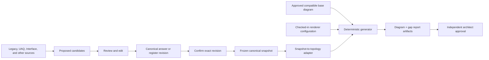

# Architecture Review: Canonical Intake to Topology Generation

**Date:** 2026-09-14  
**Scope:** Production topology generation using reviewed questionnaire, imported candidates, canonical answers, and frozen intake snapshots.  
**Primary handoff:** `HANDOFF_TOPOLOGY_GENERATION_2026-09-14.md`

## Executive Decision

The proposed direction is correct, but the first release should be smaller than a complete topology platform.

Keep the existing intake workflow:

```text
Legacy and other sources
  -> proposed candidates
  -> authorized review and edit
  -> canonical answer revision
  -> confirmation
  -> readiness and frozen snapshot
  -> topology adapter
  -> approved base draw.io diagram + pinned renderer configuration
  -> deterministic diagram and gap report
  -> independent topology approval
```

Topology must consume a verified frozen snapshot, never raw legacy files, mutable candidates, live answer rows, or request-scoped UI state.

The first milestone is not a topology button. It is proving that a confirmed value visible in the questionnaire reaches the frozen snapshot unchanged, with revision and provenance intact.

## Findings

### Critical

1. **The snapshot currently contains no questionnaire answers.**

   `SnapshotService._build_canonical_answers()` currently returns an empty list. A topology adapter cannot be implemented safely until confirmed canonical answers are serialized into the snapshot.

2. **The questionnaire confirmation route is incomplete.**

   The confirmation route validates CSRF and redirects, but does not call `AnswerService.confirm_answer()`. The not-applicable route is also a stub. Therefore, the current UI does not complete the promised review-to-confirmation workflow.

3. **Freeze readiness is not topology-grade readiness.**

   Existing readiness checks intake state, proposed candidates, deferred candidates, snapshot existence, and basic WaveUtil presence. It does not yet establish that required answers are confirmed, mappings are supported, required target data is present, conflicts are resolved, or the source snapshot is suitable for topology generation.

### High

4. **Candidate acceptance and confirmation need one explicit contract.**

   Candidate acceptance adopts a proposed value as an answer revision. Confirmation approves an exact answer revision. These are different decisions and must remain distinguishable. The topology boundary is a confirmed canonical revision, not merely a candidate in `ACCEPTED` state.

5. **Confirmation provenance must be preserved.**

   Confirmation creates a new answer revision. Evidence links and source lineage must either be copied to the confirmed revision or be resolved through an explicit revision lineage relationship. Otherwise, rendered values may be confirmed but not traceable to their evidence.

6. **Questionnaire status fields are not topology facts.**

   Values such as `REGISTER_STATUS=COMPLETE` indicate review progress; they do not provide a region, CIDR, VPC, subnet, security group, VM ID, or ENI. The adapter must require typed values with explicit scope.

7. **Interface data is not yet part of the canonical topology snapshot.**

   Interface imports create candidates, but the current canonical snapshot contains answers and WaveUtil rows, not a reviewed interface register. The first value-only renderer can defer interface-driven structural rendering, but it must not claim complete interface coverage without canonical interface data.

8. **Generation persistence is not implemented.**

   `generation_runs` and `generated_artifacts` exist in the design SQL, but not as the complete ORM, Alembic, repository, service, and route implementation required by production.

9. **Inherited base-diagram labels can contain stale facts.**

   The renderer preserves unbound labels and selected suffixes. XML validity alone is not enough; the base diagram must be reviewed for retained application-specific content, scope, environment, and variant.

### Corrections to Earlier Review

- Evidence deduplication is already scoped by application/intake in the newer workspace state.
- Normal candidate acceptance rejects unknown question targets in the newer workspace state.
- These older findings should not be copied into implementation work without checking the active branch.

## Recommended Data Flow



Inside this application, generation should load the canonical snapshot by `snapshot_id` and verify its SHA-256 hash. The export package remains useful for downstream transport, but the application does not need to export and re-import its own snapshot before generation.

## What the First Release Should Support

Limit the first production slice to:

- One application.
- One explicitly selected target environment and site.
- One approved base-diagram variant.
- Value-only label replacement.
- A checked-in, versioned mapping, naming, and slot configuration.
- Paired `.drawio` and gap-report artifacts.
- Synchronous generation initially, unless measurement proves it is too slow.
- Existing content-addressed filesystem storage for local deployment.
- Independent topology approval after generation.

Do not initially build:

- A generic topology rules engine.
- A topology configuration publishing UI.
- A worker queue or generation microservice.
- Dynamic node/edge creation.
- Automatic page or variant selection.
- A second document-ingestion pipeline.
- A separate template upload workflow when the renderer only uses the base diagram.
- A new storage backend before the filesystem boundary is proven.

## Initial Diagram Input

Yes, a base `.drawio` input is required for the current renderer. It should be treated as a governed topology artifact, not as ordinary evidence.

Minimum requirements:

- Link it to the application and intake.
- Record environment, site, and variant scope.
- Validate uncompressed `mxfile` XML before acceptance.
- Validate required semantic slot cardinality before generation.
- Store content SHA-256, original filename, uploader, upload time, and review state.
- Pin the exact base artifact ID and hash to each generation run.
- Keep prior versions immutable.
- Review retained labels and suffixes for stale or out-of-scope values.

The first implementation may reuse the existing evidence storage bytes and content-addressed filesystem, but it needs a topology-specific metadata record and authorization rules. A generic evidence row alone does not express base-diagram approval or generation ownership.

## Required Canonical Inputs

Only add structured registers where the renderer needs actual values that the current questionnaire cannot represent.

Minimum likely inputs for the current slots:

- Application acronym and correlation identity.
- Target environment and site.
- AWS region and Outpost logical ID.
- Target account identifier.
- VPC and subnet identifiers.
- Workload subnet CIDR.
- Security group, VM, and ENI identifiers.
- Explicit topology variant decision.

These values should be captured as typed, scoped canonical answers or a small append-only target-design register. They must be reviewed and confirmed before snapshot freeze. Do not introduce an unreviewed generation form that silently overrides snapshot values.

Interface rows, database registers, and infrastructure details should be added to the canonical snapshot when a renderer or gap policy actually consumes them. They are not prerequisites for the first value-only label renderer unless the chosen diagram requires them.

## Design Gaps to Close Before M9

### 1. Complete the canonical snapshot boundary

- Implement `_build_canonical_answers()`.
- Enumerate answer instances and current revisions deterministically.
- Include only confirmed answers and explicit `NOT_APPLICABLE` decisions.
- Preserve question code, section, response type, response schema version, value, revision number, actor, and provenance references.
- Define how permitted gaps are created and represented.
- Add snapshot tests with real synthetic accepted and confirmed answers.

### 2. Complete confirmation and provenance

- Wire the questionnaire confirmation route to `AnswerService.confirm_answer()`.
- Wire the not-applicable route to `AnswerService.mark_not_applicable()`.
- Require rationale where policy requires it.
- Preserve evidence links when creating the confirmed revision.
- Add stale revision protection to confirmation.
- Ensure candidate acceptance and answer revision creation are atomic.

### 3. Define topology readiness separately from intake freeze readiness

Topology readiness should distinguish:

- `NOT_READY`: missing or invalid required topology inputs.
- `READY_TO_GENERATE`: all required inputs are confirmed and the base/configuration are compatible.
- `GENERATED_WITH_GAPS`: deterministic output exists with explicitly permitted gaps.
- `READY_FOR_REVIEW`: output exists and awaits architect approval.
- `APPROVED`: an architect approved the exact run.
- `SUPERSEDED`: a later snapshot, base, or configuration replaces it.

Corrupt XML, invalid hashes, unsupported response schemas, ambiguous scope, and missing mandatory values must block generation. Explicitly permitted gaps may produce a visible draft, but never an automatic approval.

### 4. Define the adapter contract

The adapter should accept:

```text
snapshot_id
canonical_json
snapshot_sha256
base_diagram_artifact_id and sha256
renderer_configuration_release and sha256
```

It should output:

```text
typed scoped topology facts
render tokens
readiness result
issue references
provenance references
```

It must fail closed for unknown question codes, unsupported response schemas, ambiguous scope, invalid values, and configuration drift. It must not use the spike confidence-ranking resolver to choose between already-approved canonical values.

### 5. Implement immutable generation records

The minimum generation record needs:

- Run ID and state.
- Application, intake, and snapshot IDs.
- Snapshot SHA-256 and catalog SHA-256.
- Base diagram artifact ID and SHA-256.
- Renderer/configuration release and SHA-256.
- Generator version.
- Requested/completed actor and timestamps.
- Readiness result and issue summary.
- Paired artifact IDs, filenames, MIME types, sizes, and hashes.
- Approval state, rationale, and supersession reference.

Generated bytes must never be overwritten. A changed snapshot, base diagram, or configuration creates a new run.

## Approval and Dependency Cycle

Questions such as “has the architect approved the generated topology?” cannot be required before generating that topology. They describe a downstream deliverable decision.

Use this sequence instead:

```text
Confirmed intake snapshot
  -> topology generation
  -> topology gap review
  -> architect approve / request changes / reject
  -> later snapshot and new run if facts change
```

The approval must reference the exact generation run, snapshot hash, base hash, and configuration hash.

## Security and Operational Requirements

- Enforce application/intake ownership on every upload, generation, artifact, and approval command.
- Apply capability checks to generation and approval actions.
- Apply CSRF protection to all mutating browser routes.
- Bound upload size and reject unsupported media types.
- Parse draw.io defensively and reject compressed or malformed XML in the first release.
- Escape all evidence-derived text before putting it into XML labels or HTML reports.
- Do not follow external diagram links during generation.
- Store failure state and error code when either paired artifact fails.
- Persist both artifacts before marking a run successful.
- Make retry idempotent and prevent duplicate approvals.
- Do not expose absolute local paths or raw evidence bytes in reports.

## Verification Plan

### Snapshot boundary

- Accepted candidate becomes a canonical answer revision.
- Confirmed revision appears in the frozen snapshot.
- Candidate-only and draft/unconfirmed values do not appear.
- Evidence provenance survives confirmation.
- Editing after freeze cannot alter the stored snapshot.

### Adapter and readiness

- Every supported render token maps to one typed, scoped canonical value.
- Missing, unknown, not-applicable, and permitted-gap states remain distinct.
- Unsupported catalog questions and response schemas fail closed.
- Wrong application, intake, environment, or site scope is rejected.
- Blocking readiness issues prevent generation.

### Renderer and artifacts

- Same snapshot, base hash, configuration hash, and generator version produce byte-identical diagram and report artifacts.
- Changed snapshot, base, or configuration creates a new run.
- Invalid XML, compressed XML, missing anchors, and duplicate anchors fail before persistence.
- Unbound labels and structure remain unchanged except for approved value slots.
- Evidence-derived text is escaped.
- Paired artifact hashes and sizes match stored bytes.

### Browser journey

1. Upload or select a compatible base diagram.
2. Complete and confirm the supported target values.
3. Freeze the intake.
4. Display topology readiness.
5. Generate the topology.
6. View the gap report.
7. Download both artifacts.
8. Approve or request changes.
9. Change an input and verify a new snapshot/run is required.

Use synthetic XML, snapshot payloads, and fixture data. Never use private client evidence in tests or documentation.

## Implementation Order

### Slice 1: Repair the canonical boundary

1. Implement snapshot answer serialization.
2. Wire confirmation and not-applicable routes.
3. Preserve confirmation provenance.
4. Add stale-revision and snapshot regression tests.

**Exit criterion:** a reviewed questionnaire value survives import/UI review, confirmation, freeze, and snapshot export with the expected value, revision, and provenance.

### Slice 2: Prove one topology mapping

1. Select one supported base diagram and one target variant.
2. Define the smallest mapping table for its required slots.
3. Implement a pure snapshot adapter.
4. Implement topology-specific readiness.
5. Reuse the spike’s deterministic draw.io mutation and report logic behind application interfaces.

**Exit criterion:** one synthetic frozen snapshot produces a deterministic diagram and report without reading raw source files.

### Slice 3: Persist and review runs

1. Add ORM and Alembic models for generation runs and artifacts.
2. Add topology-specific base artifact metadata.
3. Store paired artifacts with hashes.
4. Add authorized download and approval/request-changes actions.
5. Add immutable supersession links.

**Exit criterion:** an architect can review and approve one exact generated run, and a changed input cannot mutate it.

### Slice 4: Expand coverage

Only after the first slice works:

- Add interface register facts.
- Add additional diagram variants.
- Add richer gap rules.
- Add asynchronous execution if runtime requires it.
- Add external artifact storage if deployment requires it.

## Final Recommendation

Proceed, but sequence the work around the real boundary:

```text
confirmed canonical value
  -> populated immutable snapshot
  -> one explicit adapter
  -> one compatible base diagram
  -> deterministic paired artifacts
  -> independent approval
```

This closes the existing architectural gaps without creating a second intake system or a generalized topology platform before the product has proven one complete, auditable generation path.
